过去一年多，我用 AI 给自己写了不少工具。从一开始只是想解决某个具体的小问题，到后来不知不觉搭出了一套还算完整的信息处理体系。

今天分享的内容在当下会有一些价值。不过这个价值**更多是在于思路上**，具体的代码其实没有那么重要。按当前 Coding Agent 的发展速度，恐怕过几个月，当前的这些代码就一文不值了。

下面我按层次来介绍。先讲我造的那些工具，再讲支撑它们运行的基础设施，最后聊几点这一年折腾下来的想法。

## 全景概览

### 图 1：信息流主线（采集 → 处理 → 存储 → 回顾）

[![](https://mermaid.ink/img/pako:eNqNVGtvGkcU_SujidJPxAVsnPUqirQGR0UKxS3ETlL6YYEhXnXZRfuoQm1LcRRDHrXBedSOHBkZYcVtDbGUNqRxjCV-SsTsLv8iszOpl43cKnzZOzPn3Dlz77kswpyaR5CHtzSxtADSsYwCyE83s2xjcLJrrbwaVqvD7Qo7cn_fp1LfXJv-IQPdwMxeympfX562_3ze7-LDGu5Uced5Bv7o4W-kryeuEvgN1UybWQTIinKGzY3hyhOn0xxurfoI89dJZkKYR9EF0QCG6l5JKXj1YPB-E9e6PvxsMhYVUmnCsB63cafpwdcb9tMGXqs5nc4pAyn5jMLChPDtNcGVZj14hB_uW7X64F2LMq21Lu7d63fTov4T0vrd70wpR4N5lKWZPqsUbt2z6xX79ZF91PCECfFZklyIg7hSUMGspuaQrqsae_2zE-u3KuMN3ratnabvTeQJ4XiCsDVdD0tFSrEbbUKxXhw4J1XrqOXDz6UFAp6T8kgFaU1U9JwmlQwgzMbBh3ad3dh47byskKo7xwf4-Jl1h4h9clZZvFe1t_Dd_cHbddzcwe_febclp93-JLO6lJdEhWa_quZEGVyRNN3wCUvMJJIEKxXDRVRUwYfKY5BgQR3QHdE01P9Xsb0z3O3h-xVrp-7lnYm5D575GWllEBPLQFBEuaxLOmvfq5q1uYdba_b2lt9aUVc47nWIte1e6wtq4PRW8cPfcXcPr3ZHChAVRgoAorJU8tXaPt4Y7v6NH_zhbNZ8ApJztHKKLCkIsHalykrulGi9ue_89Y_TOSQdwvVfrfbeWerOnwdsKmk9mYnYCRtO8BWbOvKlw0S-n4YEXLhw2fXlmWj3jBnv9JjE7vYSrm3Y64fMP0uu20YniCKkZKrfFZS8pkp5MieS0u8mxBydmE-EU-1MMNNOLcZOiCwqgbhrZGOM5LbW94d3Vqynb0g5l6ilGICk9TNIX7wN7z7qILYkvqFynZd37RePWKGX3Lb4jr2MxDGfZ9SNsozo3QVJlvlzE1HhSiQYyKmyqvHnCoXCKMxV9CWwudR_wWCA_D9LecgbmokCsIi0ougu4aKbIAONBVREGciTMI8KoimTAcwoy4RWEpWbqlr8l6mp5q0FyBdEWScrs5QXDRSTROJzD0JMhrSoaioG5EMhjuaA_CK8DfnI1Fg4NB7kgqGJcHgiFApHArAM-XCQG-MioTAXvBiJTE1wU8sB-Au9NTQWDAYvclxkcnKKG49EJseXPwIUR2ir?type=png)](https://mermaid.live/edit#pako:eNqNVGtvGkcU_SujidJPxAVsnPUqirQGR0UKxS3ETlL6YYEhXnXZRfuoQm1LcRRDHrXBedSOHBkZYcVtDbGUNqRxjCV-SsTsLv8iszOpl43cKnzZOzPn3Dlz77kswpyaR5CHtzSxtADSsYwCyE83s2xjcLJrrbwaVqvD7Qo7cn_fp1LfXJv-IQPdwMxeympfX562_3ze7-LDGu5Uced5Bv7o4W-kryeuEvgN1UybWQTIinKGzY3hyhOn0xxurfoI89dJZkKYR9EF0QCG6l5JKXj1YPB-E9e6PvxsMhYVUmnCsB63cafpwdcb9tMGXqs5nc4pAyn5jMLChPDtNcGVZj14hB_uW7X64F2LMq21Lu7d63fTov4T0vrd70wpR4N5lKWZPqsUbt2z6xX79ZF91PCECfFZklyIg7hSUMGspuaQrqsae_2zE-u3KuMN3ratnabvTeQJ4XiCsDVdD0tFSrEbbUKxXhw4J1XrqOXDz6UFAp6T8kgFaU1U9JwmlQwgzMbBh3ad3dh47byskKo7xwf4-Jl1h4h9clZZvFe1t_Dd_cHbddzcwe_febclp93-JLO6lJdEhWa_quZEGVyRNN3wCUvMJJIEKxXDRVRUwYfKY5BgQR3QHdE01P9Xsb0z3O3h-xVrp-7lnYm5D575GWllEBPLQFBEuaxLOmvfq5q1uYdba_b2lt9aUVc47nWIte1e6wtq4PRW8cPfcXcPr3ZHChAVRgoAorJU8tXaPt4Y7v6NH_zhbNZ8ApJztHKKLCkIsHalykrulGi9ue_89Y_TOSQdwvVfrfbeWerOnwdsKmk9mYnYCRtO8BWbOvKlw0S-n4YEXLhw2fXlmWj3jBnv9JjE7vYSrm3Y64fMP0uu20YniCKkZKrfFZS8pkp5MieS0u8mxBydmE-EU-1MMNNOLcZOiCwqgbhrZGOM5LbW94d3Vqynb0g5l6ilGICk9TNIX7wN7z7qILYkvqFynZd37RePWKGX3Lb4jr2MxDGfZ9SNsozo3QVJlvlzE1HhSiQYyKmyqvHnCoXCKMxV9CWwudR_wWCA_D9LecgbmokCsIi0ougu4aKbIAONBVREGciTMI8KoimTAcwoy4RWEpWbqlr8l6mp5q0FyBdEWScrs5QXDRSTROJzD0JMhrSoaioG5EMhjuaA_CK8DfnI1Fg4NB7kgqGJcHgiFApHArAM-XCQG-MioTAXvBiJTE1wU8sB-Au9NTQWDAYvclxkcnKKG49EJseXPwIUR2ir)

### 图 2：基础组件与硬件（谁跑在哪，谁调用谁）

[![](https://mermaid.ink/img/pako:eNqNVVtPG0cU_iujiZKXGro2djGrKtJqjSNLOFi1E5TWfdh4x2Gl9Y61lzQuQkJtcG40BTWXhzi4bqmCVAqNEtUpDljip0Tei5_yF3pml5pdSi32YTRz5vvO-ebMmbNLuEJlgnl8S5fqi6iUKWsIPsO6GRgG7x7ar79z3_TcXjvYYp-QK3xVxkIO5bQqRQWdVohhUL2Mvz7BXC8JgLmuyISiki5pRkVX6iYSCjn04Y_1CDQ_m58HbI3UKJIsk0Y2ZzPMz-xtojdQRmogQZPUhqEYEdCCWASQfbg76Hfcwy1nBfT-NEIQTS5rpw42bL_xXjWHv2zYW3fd9SawT1nQh5UnKC9VUNG0ZCWqKXvtqlD8AjhZS4MJO9DnN_VPL9tr-_b9prf31tt7OdjfP-rmC8UIURQKxQXgiVLdWNAVk-gn3P7vw5W2d7BjHzw96oqFa2Pl2y8O3Qf3RtrDy3HC50WmGjbnK_pZN5HLXxl5A1feq199bd7rpr22-klWpTrRKmS8suaqvfu397hr__iM-QotxykTM6ykYETiok5rxI87fLnpPP_Z3np71HW2O86jtttqQ14jxBulzBwwb5RQhn6jqVSS_1NjZ8l0nt1zWjujBIaXH9_fn5vLf3z_IJq6q7PgF6DzGoGJrw8exeDdCgI08v783n2yPTake7Dh9lonHkusZkuSohoVSSXoqMty54PuwhjNTpYlR6WWXFUlnaCSpWlE9SmrO2HwmXE7O4PeX6HnJohBERzfA8rH4VbuBDe923F3n9t7zeGLpr35aNDr2Q87ESlQ-cCeSlxhs-CWnvadVtvrr3udNaf1Q5gQknPx4nEzCTIFhxyJgnaCLrGGgSYmLh8_LjD4jyWMYH3Ch0AZwxKK9Sw-Kwh_AsUU7EN3iHoG_mnmJdZoYGTYcCT_1kNnCHR73Q27tR0kFk4V7EaFB2ECmcwGlc0cQvIDdODZtwEtHMEvE6-_6Tz-LTACBzwACtATUDbMXXZ0zWYDiocdoaqoKn8hKQrZFBerUHis_IVqtRqG-bk5B44pPwfs-MTnQAYp-R8gjsHvR5Exb-oWicF_QK9JbImXmIsyNhdJDZoOD1OZVCVLNcu4rC0DrS5pX1Ja-5epU-vWIuarkmrAyqrLkkkyigTPoDayQgeTiS5SSzMxH5_yfWB-Cd_BfGpmMhGf4tJcPJlIJOPxRCqGG5hPcOnJdCqeSHPTqdRMMj2zHMPf-lHjkxzHTafTqc9mkiluajqdXP4HJ0WqWw?type=png)](https://mermaid.live/edit#pako:eNqNVVtPG0cU_iujiZKXGro2djGrKtJqjSNLOFi1E5TWfdh4x2Gl9Y61lzQuQkJtcG40BTWXhzi4bqmCVAqNEtUpDljip0Tei5_yF3pml5pdSi32YTRz5vvO-ebMmbNLuEJlgnl8S5fqi6iUKWsIPsO6GRgG7x7ar79z3_TcXjvYYp-QK3xVxkIO5bQqRQWdVohhUL2Mvz7BXC8JgLmuyISiki5pRkVX6iYSCjn04Y_1CDQ_m58HbI3UKJIsk0Y2ZzPMz-xtojdQRmogQZPUhqEYEdCCWASQfbg76Hfcwy1nBfT-NEIQTS5rpw42bL_xXjWHv2zYW3fd9SawT1nQh5UnKC9VUNG0ZCWqKXvtqlD8AjhZS4MJO9DnN_VPL9tr-_b9prf31tt7OdjfP-rmC8UIURQKxQXgiVLdWNAVk-gn3P7vw5W2d7BjHzw96oqFa2Pl2y8O3Qf3RtrDy3HC50WmGjbnK_pZN5HLXxl5A1feq199bd7rpr22-klWpTrRKmS8suaqvfu397hr__iM-QotxykTM6ykYETiok5rxI87fLnpPP_Z3np71HW2O86jtttqQ14jxBulzBwwb5RQhn6jqVSS_1NjZ8l0nt1zWjujBIaXH9_fn5vLf3z_IJq6q7PgF6DzGoGJrw8exeDdCgI08v783n2yPTake7Dh9lonHkusZkuSohoVSSXoqMty54PuwhjNTpYlR6WWXFUlnaCSpWlE9SmrO2HwmXE7O4PeX6HnJohBERzfA8rH4VbuBDe923F3n9t7zeGLpr35aNDr2Q87ESlQ-cCeSlxhs-CWnvadVtvrr3udNaf1Q5gQknPx4nEzCTIFhxyJgnaCLrGGgSYmLh8_LjD4jyWMYH3Ch0AZwxKK9Sw-Kwh_AsUU7EN3iHoG_mnmJdZoYGTYcCT_1kNnCHR73Q27tR0kFk4V7EaFB2ECmcwGlc0cQvIDdODZtwEtHMEvE6-_6Tz-LTACBzwACtATUDbMXXZ0zWYDiocdoaqoKn8hKQrZFBerUHis_IVqtRqG-bk5B44pPwfs-MTnQAYp-R8gjsHvR5Exb-oWicF_QK9JbImXmIsyNhdJDZoOD1OZVCVLNcu4rC0DrS5pX1Ja-5epU-vWIuarkmrAyqrLkkkyigTPoDayQgeTiS5SSzMxH5_yfWB-Cd_BfGpmMhGf4tJcPJlIJOPxRCqGG5hPcOnJdCqeSHPTqdRMMj2zHMPf-lHjkxzHTafTqc9mkiluajqdXP4HJ0WqWw)


这套体系不是一次性设计出来的，是过去一年多时间里根据实际需求一点点迭代出来的。简单来说，信息的流向大概是这样的：

**采集 → 过滤筛选 → 转录/理解 → 存储管理 → 回顾分析**

每一层都有对应的工具在支撑。下面逐个介绍。

---

## 处理系统

### AI Information Processor —— 统一的信息处理中枢

每天要面对大量的文章、图片、音频、视频，信息过载严重，人工筛选完全不现实。最初是从范冰老师那里学到的思路——把所有文本内容走一条统一的 Pipeline，用 AI 打分过滤。

我在这个基础上做了两点迭代：一是把处理范围从纯文本扩展到所有内容形式——图片、音频、视频都先转换成文字（虽然现在很多模型都有多模态的能力，但不论从成本还是效果上看，文字都是最优选择），然后走同一条管线；二是增加了事件聚类去重。具体来说，管线做两件事：

第一是**打分过滤**。按一定的规则给内容打分，分数不够的直接剔除。系统会用 AI 对内容做结构化分析——分类、评分、简单摘要、提取水下信息——然后根据评分阈值过滤。此部分 AI 工作流会以 API 的形式暴露给其他工具使用（比如长文本的主动剪藏）。

第二是**事件聚类去重**。对所有内容做 Embedding 向量嵌入（用的 text-embedding-3-small，非常便宜），计算相关性，剔除针对同一个主题、不同信息源的重复内容。这里有一套三级通知降噪机制：相似度低于 0.85 的视为全新事件，完整推送；0.85 到 0.97 之间的视为增量更新，只推送新增信息；超过 0.97 且实体高度重合的，直接静默。一个事件簇如果连续 7 天没有更新，会自动归档。

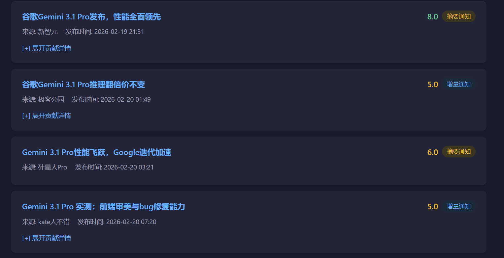

信息采集方面，系统对接了多种 RSS 源：

- 用 RSSHub 订阅哔哩哔哩、小宇宙、小众平台的更新
- YouTube 官方支持基于 Channel ID 的 XML 订阅（格式是 `https://www.youtube.com/feeds/videos.xml?channel_id=xxx`），不需要第三方服务，稳定可靠。对于 YouTube 视频，系统会优先尝试提取平台字幕，没有字幕的走下载-本地转录流程。
- WeChat to RSS 可以把微信公众号转成 RSS 来阅读
- 泛用型播客本身就原生支持 RSS 协议，可以直接下载音频
- Newsletter 使用 Kill the Newsletter 服务转换成 RSS

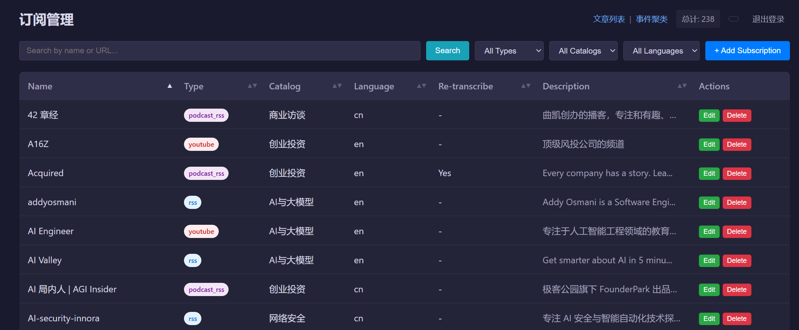

所有筛选过后的内容都会以 Markdown 的形式存到 Obsidian 本地，并通过机器人推送到不同的企业微信或者飞书群聊里面，方便阅读和后续分享。系统还有一个配套的网页版，可以查看内容、总结和摘要，也方便快速地将有价值的信息推送到 Memo 里面统一存储。

另外一点感受：处理完这么多文章之后，会更加感觉到内容源的重要性。有的信息源，有价值的信息十之七八；有的信息源可能只有十之一二。优先选择付费的信息源，如果是免费的信息源，尽量选择一手信息。特别是一些对谈访谈，潜藏的面包屑会更多。

#### 关于内容消费渠道的选择

这里可以简单聊一下各种内容消费方式的优劣：

- Obsidian：比较适合在电脑上进行阅读和处理，但在手机客户端上体验一般。
- 企微和飞书：原生解决了断网时数据存储和多设备同步的问题。但客观地说，飞书的阅读体验还是要吊打企业微信一个层级的。
  - 企业微信功能比较简单，而且不能在多设备之间同步进度。安卓端的机器人还有样式上的 bug，提了几个月也不修复。平板端的阅读体验也做得很一般。可以说除了能便捷地分享内容到微信，其他的一无是处。
  - 飞书单从阅读体验做得还是比较好的，但后续想要和我目前的系统联动就比较尴尬。因为我使用的是飞书卡片 2.0 的格式来发送内容，当我把这些内容转发给飞书的机器人想做一些后处理的时候，机器人竟然读取不到。不过我还是优先推荐把内容发送到飞书。
- 网页端：我对推送过来的内容可能还需要进行一些后处理，比如收藏到 Memo 里面。但受限于 IM 平台的 API 限制，很多东西只能基于自家的网页来实现。网页端主要方便我复制文本到第三方 LLM 工具里进行进一步的提问，也可以合并查看一些聚类之后的主题文章。

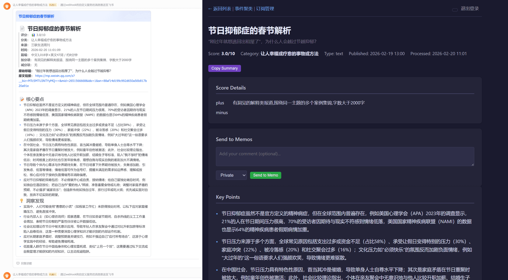


### rss2im —— 社交媒体短文本过滤

上面的信息处理流程是针对比较长的文章设计的，对于社交媒体上的短文本并不适用。但思想是共通的——可以复用这套打分过滤的逻辑，对社交媒体上的短文本做筛选处理，目前主要是 Twitter。通过 RSSHub 订阅更新，过滤之后推送到 IM。同时也可以跟 Video Transcript API 做联动——订阅部分博主更新，自动提交转录请求。

### Video Transcript API —— 音视频转录总结

> ⭐ 已开源：https://github.com/zj1123581321/VideoTranscriptAPI

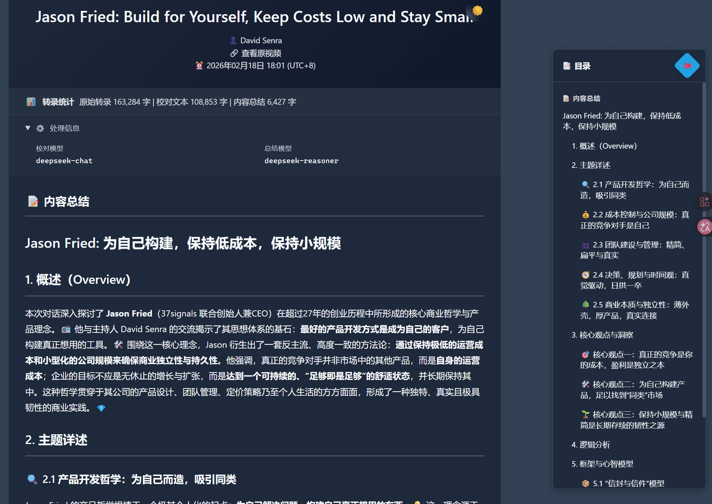

这是一个我从 2025 年 4 月开始编写、不断迭代的高频使用工具。

其实最开始的想法很简单。我观察了一下自己的内容消费习惯，发现我比较喜欢那些访谈、直播切片、案例分享——这类内容一两个人输出的信息比较重要，但画面没有那么重要。

最开始的方案是所有音视频默认两倍速乃至三倍速，但后来发现还是不能满足我的需求，太慢了。另外我很多内容消费的场景是在手机上，浏览器的那些插件用起来并没有那么方便。

我也一直比较关注 ASR 的相关工具，但成熟商用的工具受限于版权和合规上的考虑，通常都需要你下载音频然后上传到他们的服务器进行后处理，整个过程还是太麻烦了，手机上更是没办法直接操作。

后来我使用了 CapsWriter 这个开源语音输入法，发现它的架构设计可以转录任意的音视频文件，不限时长，而且 CPU 就能处理，速度很快，准确率也 OK。自然而然产生了一个想法：把整个流程自动化，我只需要提供一个 URL，系统自动帮我完成下载、转录、推送到 IM 平台的流程。

是的，最开始甚至都没有接入 LLM，只推送原始转录结果。后来的功能都是在使用过程中逐渐迭代出来的：

- 音视频转录的本地工具精度有限，可读性比较差 → 引入 LLM，结合 title、description 这些辅助信息做校对
- 企业微信机器人的通知限制文本长度，超长的访谈内容推送原文阅读体验很差 → 不推送原文，而是调用 LLM 对原文进行总结，只推送总结后的结果，原文通过 Web 端查看，还可以配置内容目录提升阅读体验
- CapsWriter 转录引擎不能区分说话人，有些访谈内容如果标注了不同说话人，阅读体验会更好 → 市场上无成熟方案，开发了 funasr_spk_server 做本地分角色音频转录
- 想基于原始的转录内容做后续提问，但不想自己维护整套系统，尽量利用现有的 LLM 会员体系 → 在 URL 里添加参数，可以直接导出原始转录文本，以 URL 的形式粘贴到其他工具里进行快速提问
- ……除此之外还有很多，具体可以看 Git history

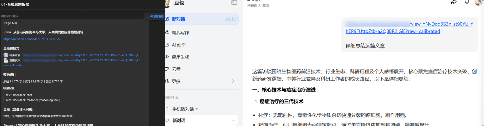

---

目前实现的功能：

**支持的平台**：YouTube、哔哩哔哩、小宇宙、抖音、小红书。每个平台的下载方式都不一样：

- YouTube 走我自己的 YouTube Download API（后面会介绍）
- B 站使用 BBDown
- 抖音、小红书走 TikHub 这类第三方 API
- 小宇宙走网页爬虫

**双引擎转录**：CapsWriter 和 FunASR。

- CapsWriter 不区分说话人但速度快，消费级 CPU 就能跑（paraformer-zh 模型）
- FunASR 能区分说话人，但如果不开 GPU 加速会慢很多

**LLM 处理**采用了协调器-处理器-核心组件三层架构。校对环节会修正同音字、规范标点，长文本超过 5000 字符会自动并发分段处理（每段约 2000 字符）。总结基于校对后的文本生成，支持单人和多说话人两种模式。如果检测到多个说话人，还会自动推断说话人身份，把 `spk_0` 映射成真实姓名。

缓存系统用的 SQLite 加文件系统双层架构，避免重复处理，降低费用消耗。

LLM 的总结支持任意 OpenAI 兼容格式的 API，校对和总结可以使用不同的模型来降低成本。可以自定义 Webhook 地址，方便发送到任意指定的群聊。有 Web 界面方便分享链接，也方便丢到其他 LLM 的 Web 端进行后续提问。

因为是基于 API 的，所以可以和各类自动化软件结合：Windows 上可以用 Quicker，iOS 和 Mac 上可以用捷径，Android 上可以用 Tasker 或 FV 悬浮球。同时也可以和自己开发的其他项目结合。

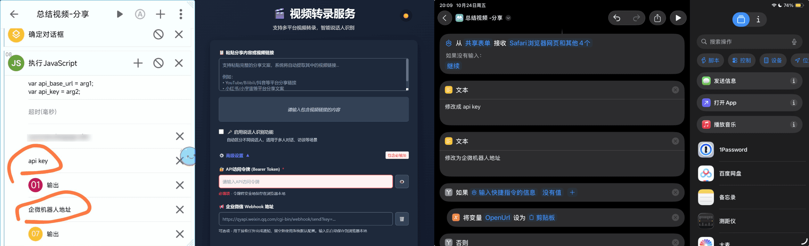

PS：随着各个大厂在推自己家的 AI 工具，获取短视频的文字稿已经变得更简单了。视频号转给元宝，小红书转给点点，youtube 转给 gemini，抖音精选直接右上角调 AI。

---

## Memo 生态 —— 从备忘录到全局收藏夹

原本 [Memo](https://github.com/usememos/memos) 是为了记一些碎片化的信息，后来慢慢就演变成了一个全局的收藏夹。我做了两个额外的工具来拓展它的功能。

### im2memo —— 让信息输入更方便

可以看到，在上面 AI Information Processor 和 Video Transcript API 这两个项目里，我都会把它们集成到 IM 平台用来做信息推送。这已经成为了我新建项目的一个默认习惯，很多工具都会接到 IM 里面。但我也不想让收藏散落在不同的 IM 平台，切换 App 又太麻烦。所以我打通了 IM 平台和 Memo 的关系。

目前支持三个平台：飞书、企微、telegram。三个平台都可以直接发消息给机器人创建 Memo，支持文本、图片、富文本、语音。

有一个我觉得很实用的小设计：转发内容之后紧接着发 `// 你的评论`，评论会自动合并到同一条笔记里，不用再去 Memo 里面单独编辑。飞书上直接回复消息（有 `parent_id`）也会自动视为评论，连 `//` 都不用打。系统有一个 10 秒的聚合器超时，在这个窗口内发的评论都会合并到一起。

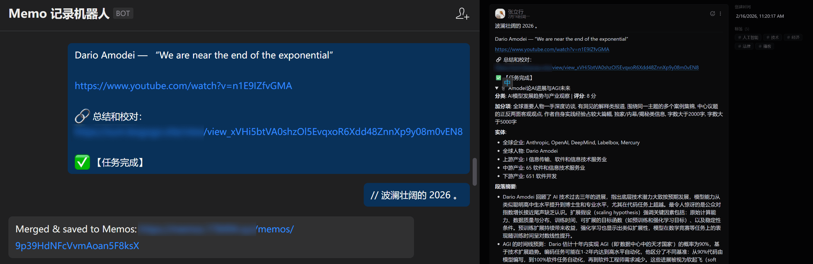

### memo auto —— AI 后处理平台

笔记存进来只是第一步，后续的整理、关联、回顾才是价值所在。这个工具分两块。

**第一块是对新增笔记的自动增强。** 通过 Memos 的 Webhook 触发，新笔记进来后会自动执行一系列工作流：

- 提取笔记里的 URL，抓取正文内容，调用 AI Information Processor 的总结 API 生成摘要，回填到笔记里
- 如果是小红书的笔记，会调用 API 把相关的文字和图片拉回到 Memo 里面
- 对笔记里的图片进行 OCR 和豆包图片理解
- 调用 LLM 对上述所有信息进行自动打标签，系统维护了一个标签注册表来保持标签体系的一致性
- 然后切换多个"视角"，让 AI 针对笔记内容进行评论——有的做事实核查，有的做发散联想，有的做反方视角的追问。多个视角并行调用，让 AI 比较深入地介入到所有笔记的维护里面

这一块完全是根据我自己的内容消费习惯来的，后续如果习惯有迁移，就会引入新的工作流，添加到当前的后处理流程里面。

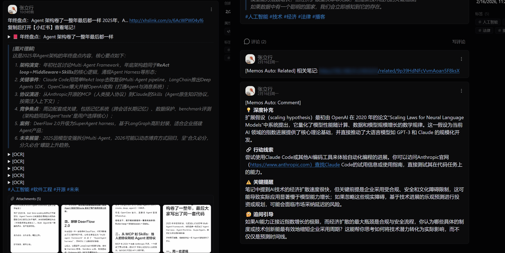

**第二块是相关笔记发现。** 对所有的笔记做 Embedding 嵌入（text-embedding-3-small），计算余弦相似度。有一个 Web 端可以展示某一条笔记的所有相关笔记，然后针对这些相关笔记做深度洞察——从 Flomo 学习的思路。

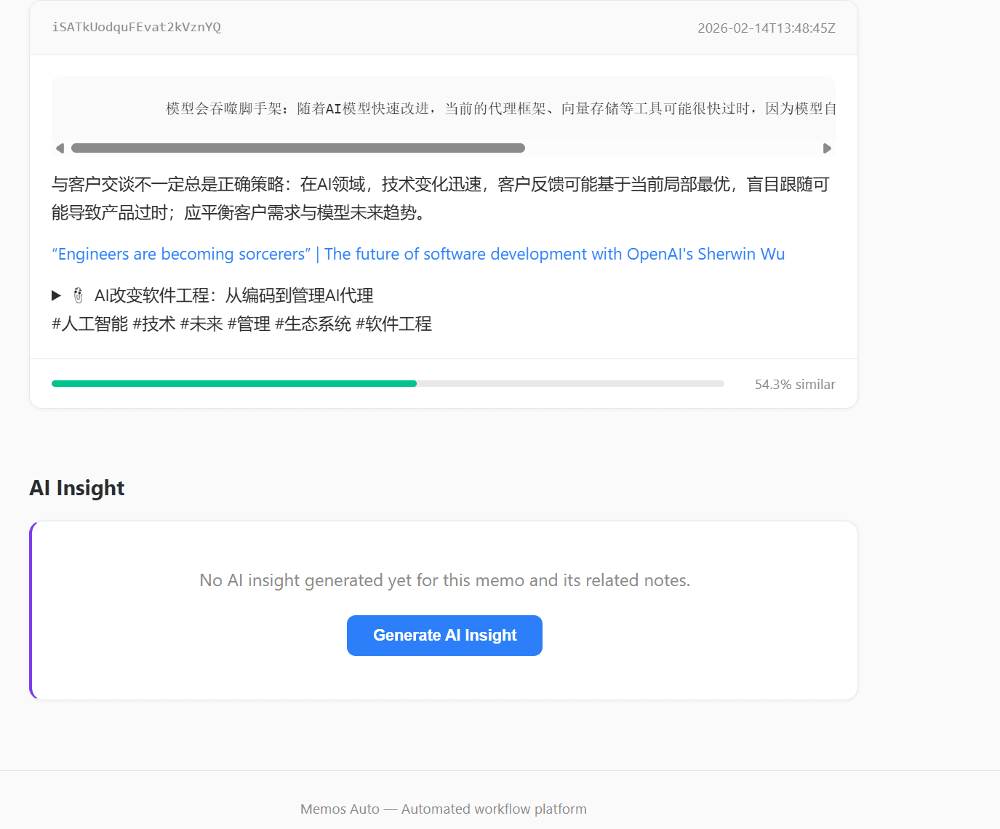

另外还有每日回顾功能，会按策略选取历史笔记通过企业微信定时推送，帮我重新审视过去的想法。

---

## 回顾分析

### Every Day Analysis —— 每日复盘

想知道自己每天在电脑前到底做了什么，看了什么。

这个工具结合 ManicTime Server 的 Timeline 数据来做分析。具体的流程是这样的：

第一步，从 ManicTime Server 获取各个设备的应用活动和文档活动数据。系统支持多设备并行获取，PC 设备会拿到完整的应用、文档、截图数据，手机设备只拿应用使用情况，用规则分类而不调 LLM。

第二步，处理截图。下载下来之后先做去重——用 pHash 算法比较相邻截图的相似度，超过 90% 的跳过，只保留应用切换时的截图。去重后的截图做 OCR 识别。

第三步，时间窗口合并。把活动数据按 15-30 分钟的窗口合并，按应用分组。多设备的时间窗口会做智能合并，按 5 分钟间隔处理，保留时间重叠的部分。

第四步，LLM 一次总结。为每个时间窗口生成活动描述。

第五步，LLM 二次总结，也就是日总结。把所有窗口的描述合并成 3-7 个主要事项。

再结合 Online Video Sync 同步的内容消费记录——YouTube、哔哩哔哩、小宇宙的观看历史——了解"我今天看了什么"。对视频消费也会做 LLM 分析：内容分类、观看习惯、和工作的关联。

最后在 Obsidian 里运行 Skill，通过语音输入法讲述今天自己的所作所为和所思所想，每周进行周复盘。手机上也可以通过 HAPI 远程连接到开发机上的 Claude Code 来完成这个流程。日复盘的结果会通过 Obsidian REST API 同步到笔记里，同时通过企业微信推送 Markdown 表格格式的摘要。

整个流程的缓存策略也做了精细化处理：历史日期的 API 数据和 OCR 结果永久缓存，LLM 总结可以用 `--force-refresh` 单独刷新。当天的数据不走缓存。整套服务用 Docker 跑，cron 定时每天 00:05 自动执行。

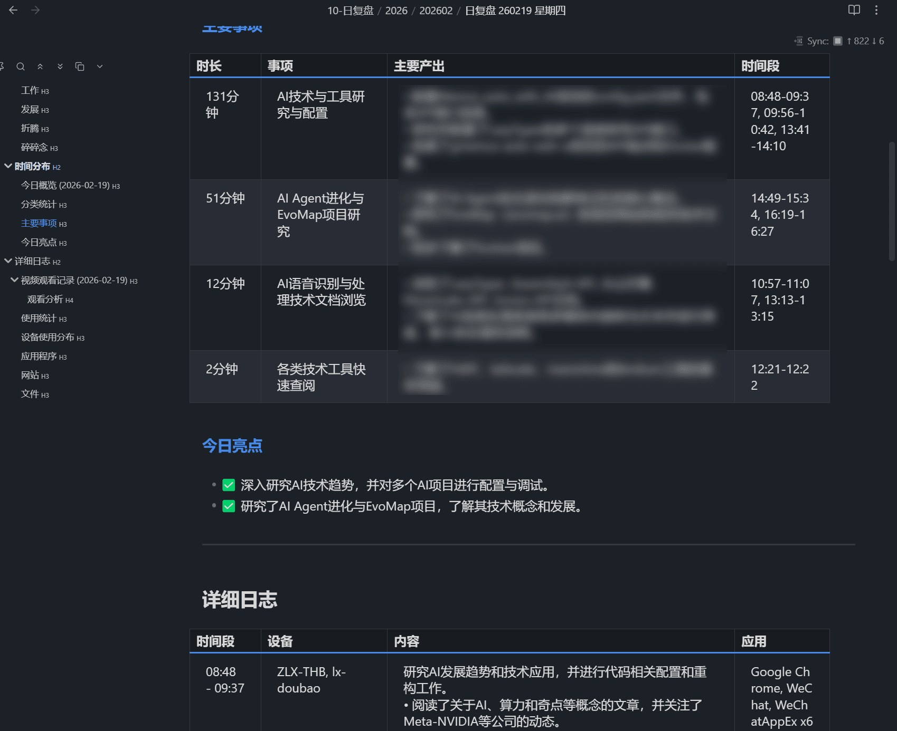

### 微信群总结

基于 Chatlog Server，通过 API 获取特定群聊的内容。图片进行转文字，文章链接进行摘要提取，语音转文字。所有处理完之后，调用 LLM 进行总结，生成本地 Markdown 文件和飞书多维表格记录，方便浏览。

不过 Chatlog Server 已经被腾讯起诉删库，不再更新维护了，所以新版本的微信就无法支持了。不过随着 AI coding agent 能力的提升，本地逆向也会更加轻松一些。后续或许可以自己维护一套方案。

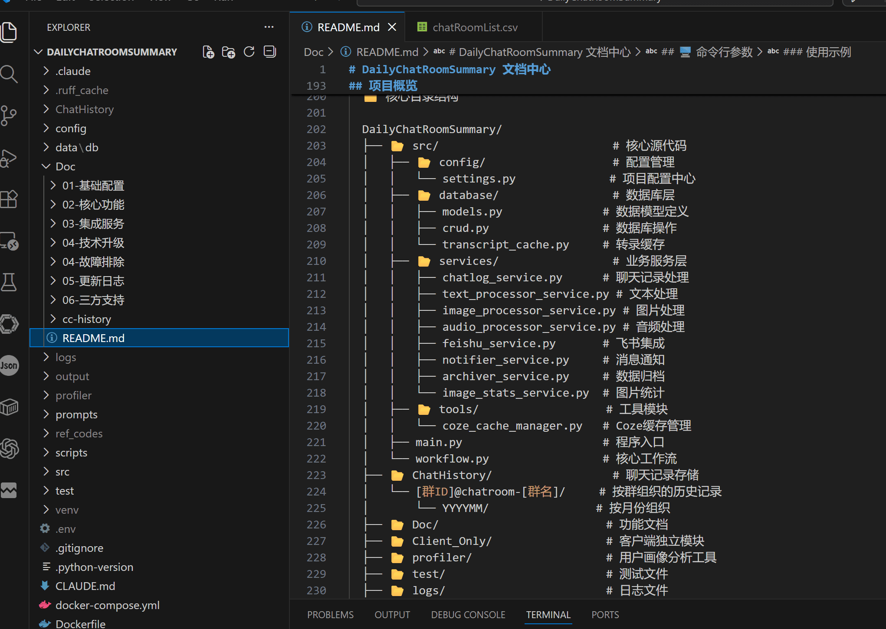

---

## 辅助工具

下面两个工具相对独立，它们不直接处理信息，而是为上面的系统提供数据支撑。

### Online Video Sync —— 音视频消费记录同步

> ⭐ 已开源：https://github.com/zj1123581321/online-video-history-server（Fork 增强版）

每天自动同步我的 YouTube、哔哩哔哩、小宇宙的音视频消费记录到服务器。它不做任何处理，就是老老实实地把数据拉下来存好，方便 Every Day Analysis 在每日复盘的时候调用。

这是我在一个开源的哔哩哔哩 History 同步项目上改的。

YouTube 的 History 同步没办法直接基于 Cookies 做，必须要有外部的 Chrome CDP。而且也没办法获取到每个视频的精确播放时间，只能用定时查询的时间作为视频播放时间。对于我自己的用途来讲足够了。

小宇宙 History 同步的门槛比较高，需要手机抓包，Android 需要 Root，iOS 没试过。而且小宇宙更离谱——响应的 API 里面没有任何播放日期相关的字段，只能拿脚本运行的时间当作播客的收听时间。

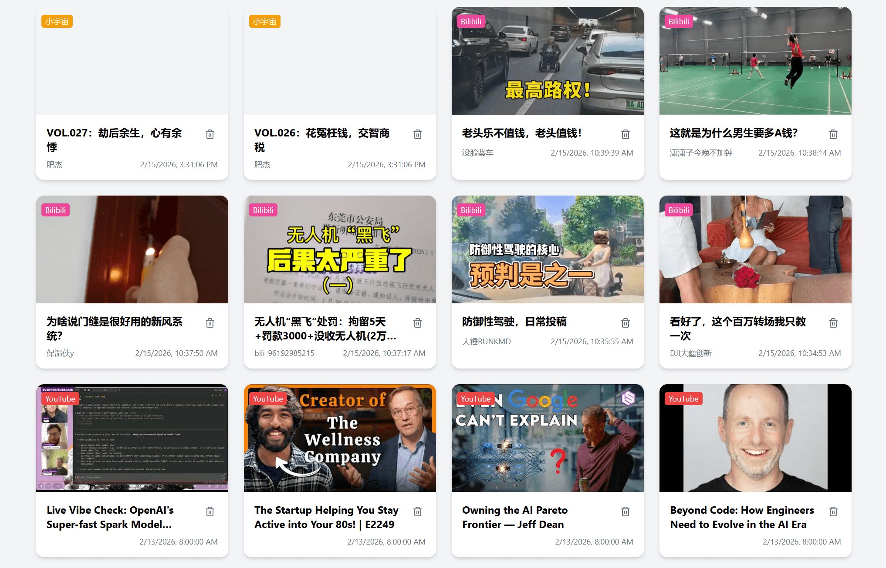

### Obsidian Clip API —— 网页剪藏

> ⭐ 已开源：https://github.com/zj1123581321/obsidian-clip-api-couchdb

可以给定一个 URL，系统自动获取正文内容，下载里面的图片上传到自己的图床，然后调用 AI Information Processor 的总结 API 进行总结，最后统一存储到 Obsidian 里面。相当于一个自动化的网页剪藏工具。

需要有一台机器 24 小时运行 Obsidian，同时安装 Local REST API 这个插件对外暴露 API。

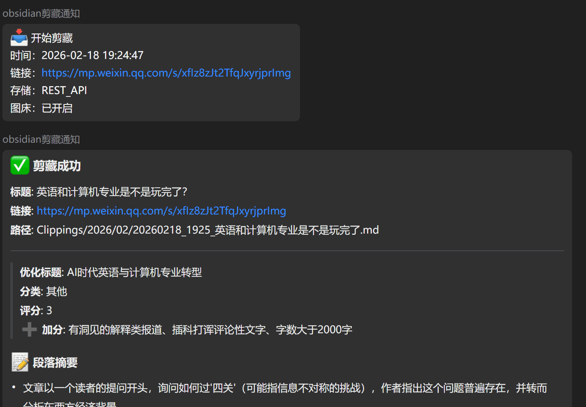

---

## 基础组件层

这一层是一些相对独立的服务，被上面的系统反复调用。它们的价值在于可以自由组合——比如把 ASR、OCR、图片理解拼在一起，就能做一个本地视频的多模态理解工具（我自己就做了一个，用来分析本地视频并生成结构化的文字记录）。按功能分成四类。

### 图片处理

**MacOcrAPI**（[已开源](https://github.com/zj1123581321/MacOcrAPI)）：基于 Mac 系统原生 OCR 能力封装的 API 服务。调用量大，放在本地跑没有额外成本。接入了 LLM，可以选择是否调用 LLM 进行格式化 Markdown 排版。从我自己的体感来看，如果是给人读的，格式很重要；但如果是给 LLM 读的，有坐标信息和原始文本，它就能推测出来大差不差。

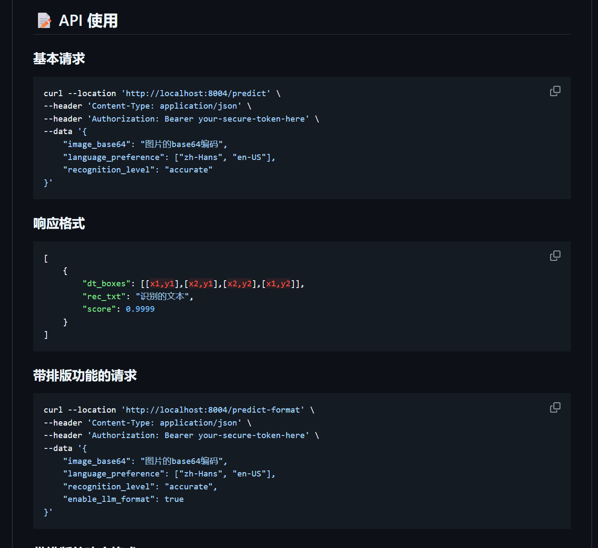

**图片理解**：豆包 lite 模型（云端，便宜够用）加上本地 Florence-2 模型的 API。Florence 主要用于图片描述（caption），支持多种描述模式（简要描述、详细描述、更详细描述），有 SQLite 缓存（默认 180 天过期），调用量大的时候比云端多模态模型省很多成本。

这里多说一点：虽然现在有很多端侧的 VL 模型可以在本地 Mac 上跑起来，但它们的处理时长和并发能力实在没办法在我现有的工作流里做集成。所以我选择了一个上古的图片理解模型（Florence-2），能力是差了点，只能输出英文，但速度和并发勉强是可用的状态。

### 音视频处理

两套本地 ASR 引擎互补，都跑在 Mac Studio 上：

**FunASR_spk_server**（[已开源](https://github.com/zj1123581321/funasr_spk_server)）：能区分说话人，适合访谈、对话类内容。不开 GPU 加速很慢，RTF（转录时长/原始音频时长）大概 1/3，看 CPU 主频；开 MPS（Mac 的优势）加速，RTF 约 1/10。

根据我自己实测，正常转录的时候大概会消耗 10G 左右的 Mac 统一内存。所以如果只有 16G 内存，可能只开一个线程比较合适。我自己 64G 的 Mac 日常开了三个线程，加了一个队列机制，基本可以满足日常的工作流所需。

区分说话人的准确率没有那么高，因为现实的音频里可能会有多个人同时说话的情况。准确率比较高的通常是那种你来我往、间隔清晰的对谈。

这里多说一点：这么长时间用下来，区分说话人的转录结果对于 LLM 的总结和校对肯定是有帮助的，但帮助比较有限，因为 LLM 本身就可以结合上下文来推断这句话是谁说的，可能小有错误但不影响全局。区分说话人更多还是提升我们自己的阅读体验，看起来会更舒服一些。

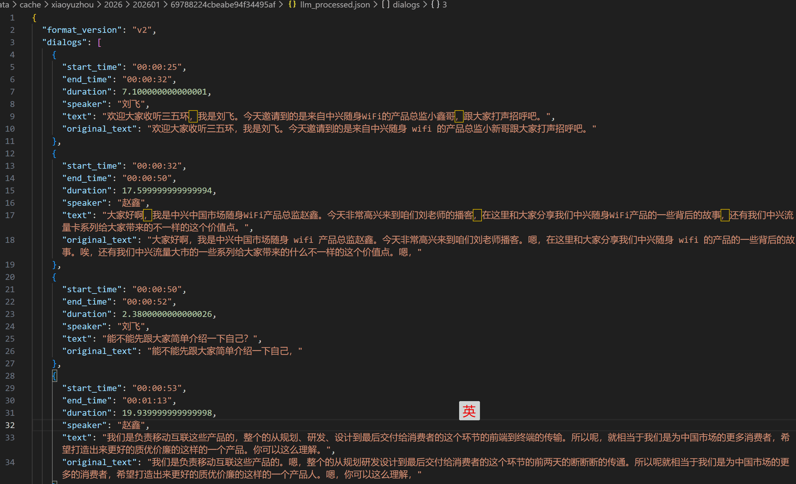

**CapsWriter**（[开源项目](https://github.com/HaujetZhao/CapsWriter-Offline)）：不区分说话人，CPU 即可运行，RTF 约 1/20，速度更快。适合单人讲述类内容。

尽管作者最近的更新里引入了 FunASR-Nano 模型，但我还是建议在长音频转录的场景下用回旧的 paraformer-zh 模型，因为新模型虽然准确率更高，但在 CPU 上速度可能很慢，而且可能还会有未知的 bug 造成流程异常中断。

更重要的是，本地音视频转录是有一个准确率上限的。而我们现在有了 LLM 的 API，完全可以借助更多的上下文信息，通过 LLM 低成本地提升转录准确率。对于本地音视频转录，我觉得就是有一个基础模型提供一个大差不差的结果，然后调用 AI 进行校对，这样可读性是非常高的。

如果你有粤语、韩语、日语的需求，可以切换到 SenseVoice 模型，但代价是中英文的转录准确率会下降。

如果你对本地转录的准确率有极致的要求，那么我还是推荐[使用 Whisper large 模型](https://sspai.com/post/83644)。

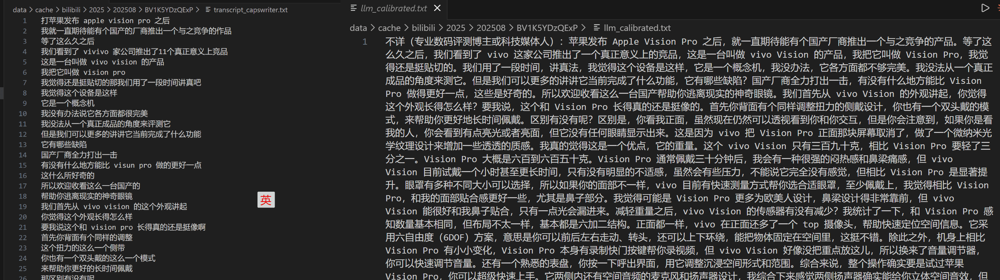

### 内容获取

**[CDP Chrome](https://chromedevtools.github.io/devtools-protocol/)**：一个开启了 Remote Control 的 Chrome 实例，部署在 Mac Studio 上。不使用无头模式，尽量模拟真人操作。里面存储了账号的登录信息，方便进行网页浏览和数据抓取。对于风控比较严格的网站来说，这种方式最稳妥。目前主要用于 YouTube 视频的批量下载和 Twitter 帖子的爬取，同时也给 OpenClaw 用来操作网页。

**YouTube Download API**（[已开源](https://github.com/zj1123581321/youtube_download_api)）：基于 CDP Chrome 之上的专用下载服务。

因为我每天会下载数十个 YouTube 的视频，且持续了比较长的时间，之前基于第三方解析 API 或者 yt-dlp 的方案会被谷歌风控掉，所有的下载地址都会报 403 错误。所以我做了一个模仿真实用户的下载服务。

实现方案是三重降级：优先用 CDP（真实浏览器已登录账号的 cookie、指纹、人类随机浏览行为，降低 403 风险），然后降级到 yt-dlp（免费，功能强大），最后降级到 TikHub API（稳定，不受限流影响，每次约 0.002 美元）。加上 TLS 指纹模拟和 PO Token 机制来绕过风控。还有智能熔断器保护——下载器级别和 IP 级别各有独立的熔断机制，被动探测分级熔断，避免被彻底封掉。

音频下载支持 M4A/WebM 格式，128kbps。字幕提取输出 JSON 格式，按 zh-Hans > zh-Hant > zh > en 的优先级选择。文件级缓存让同一个视频的资源可以跨任务共享。60 天自动清理过期文件。还支持人工上传——有些视频实在下不了的时候，可以 idm 手动下载后上传音频或视频，系统会自动封装处理。

它同时支撑了 AI Information Processor 和 Video Transcript API 两个上层系统的视频下载需求。

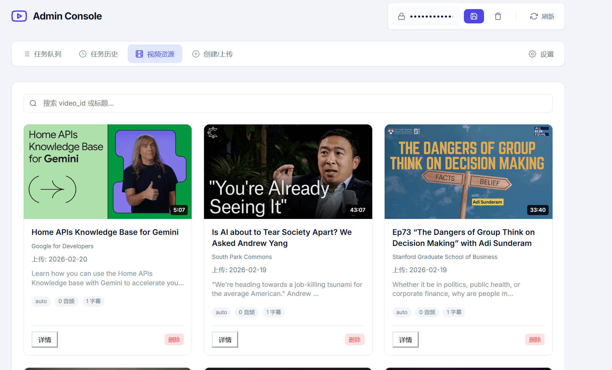

### 文本处理（LLM）

**[OneAPI](https://github.com/songquanpeng/one-api)**：统一所有 LLM 的 API 调用，都基于 OpenAI 的请求格式，方便在各个应用里面直接切换模型。上面提到的所有需要调用 LLM 的地方——打分、总结、校对、评论、洞察——都通过 OneAPI 统一路由。

---

## 基础软件层

### Obsidian

一切 Local First。所有内容最终都沉淀为本地 Markdown，方便 LLM 处理，同时可以在里面运行各类 Skill 进行后处理。在我的体系里，Obsidian 既是信息的最终沉淀地，也是每日复盘和周复盘的工作台。

### 语音输入法

电脑上：[LazyTyper](https://lazytyper.com/)（火山引擎，豆包同款语音输入 API）+ CapsWriter（我自己魔改过，加了一些 AI 后处理，但现在已经慢慢切换到 LazyTyper 了），配合大疆 Mic Mini 收音（建议连接接收器以降低延迟）。

手机上：豆包输入法。当下豆包输入法除了语音输入的准确率比较高，其他能力确实比较简单。不过还是比微信输入法的语音准确率高很多，特别是一些超长音频的识别——微信输入法感觉是调了 LLM 类似的东西，经常会出现一些重复的无意义内容。

这篇文章的草稿本身就是语音输入完成的。

### 网络方案：Tailscale + Cloudflare Tunnel

网络分两块，感谢两个赛博大善人——我都没有额外付费，都是免费的产品。

#### Tailscale

建议开启 Tailscale 的 [Subnet](https://tailscale.com/docs/features/subnet-routers) 功能。这样内网的一些服务地址，哪怕异地组网也可以直接访问原始的 IP，不用单独记录 Tailscale 的设备 IP。

最近新加了[对等中继](https://tailscale.com/blog/peer-relays-ga)功能，可以弄一台服务器来提升异地组网的速度了。

#### Cloudflare Tunnel

内网穿透的神。自动解决 HTTPS 和部分安全问题，免费不限量，API 和文本用途带宽足够了。

不过涉及到网络问题，还是**能不暴露到公网上就不要暴露到公网上**。特别是一些 AI 写的工具软件，漏洞实在是太多了。想要暴露到公网上的服务，建议都让 AI 做一次深度的安全检查。

### [HAPI](https://github.com/tiann/hapi)

随时随地连上开发机的 Coding Agent，比如 Claude Code、Codex。方便在手机上随时随地进行开发，碎片时间也能推进项目。

比 Happy 这些工具方便太多，网页版天然就是多平台的。这个春节假期很不一样的一点就是走亲访友的间隙，我可以直接远程连到开发环境改 bug、添加功能，非常爽。

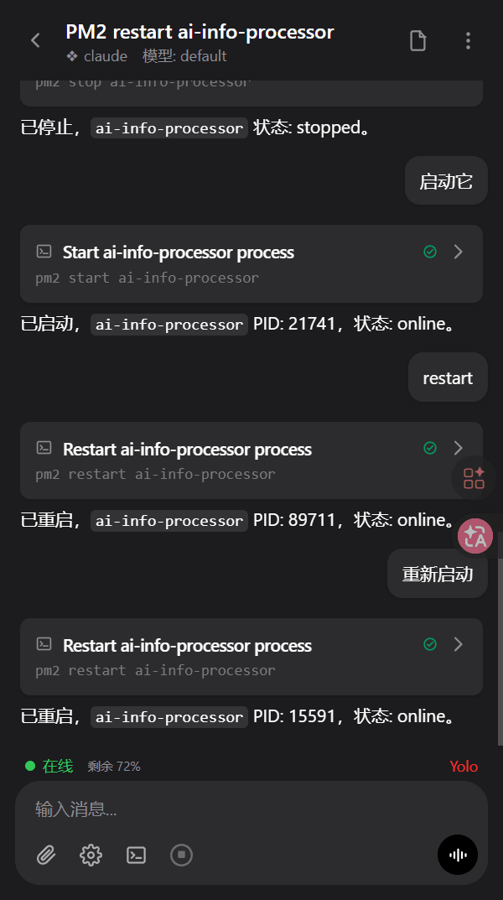

### [ManicTime](https://www.manictime.com/)

Windows 和 Mac 上可以记录电脑做了什么，以 Timeline 加间隔的截图形式上传到 Server。手机上直接可以上传 Android 的手机使用情况。是 Every Day Analysis 的核心数据来源。

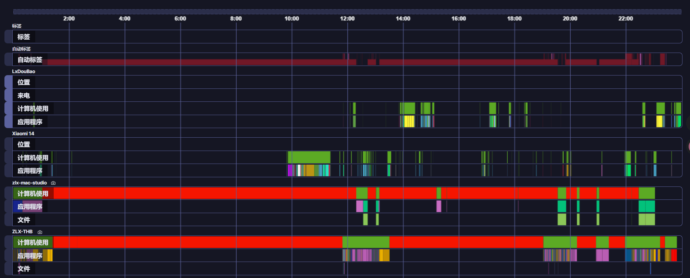

### [Ferdium](https://ferdium.org/)

可以把很多网页固定成应用常开。可以理解成一个只能打开特定网页的 Chrome 浏览器，非常适合有多个 AI 账号会员的人随时切换来问问题。我常用的有豆包、ChatGPT、Gemini、Claude、Todoist、Memo、NotebookLM。

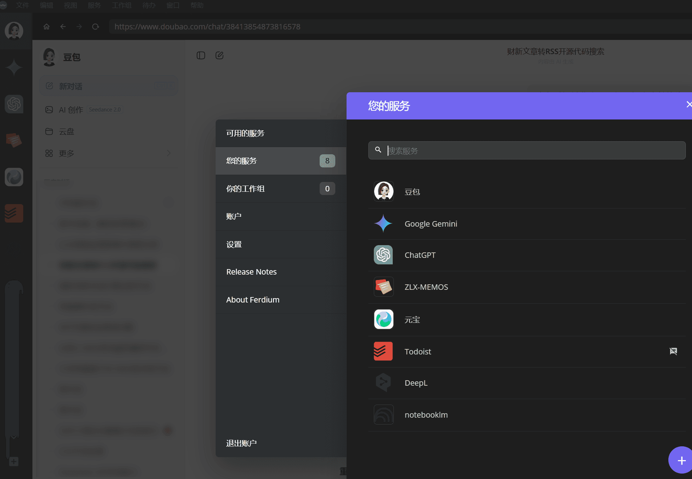

### NotebookLM

主题学习神器。前面产生的所有本地 Markdown 文件都可以上传到里面统一处理，做深度的主题学习和知识整理。

我自己最常用的方式是把某个人的所有历史文章、发言统一收集出来，整理成 Markdown 或 PDF 上传到 NotebookLM 里。这样你就拥有了他的数字分身，可以随时向你认可的人进行提问。内容来源方面，公众号、微博、X 都有相关的工具或 API 可以批量导出，最不济还可以让 AI 操控浏览器爬取历史内容。

另外推荐 [notebooklm-py](https://github.com/teng-lin/notebooklm-py) 这个非官方的 NotebookLM API，可以把上述流程自动化，和自己的工具做结合。

---

## 基础硬件层

### Mac Studio M1 Max 64G+1T

美版的价格不到 8 千，基本上是官方价格的一半。大的统一内存可以运行很多服务，有 MPS 加速。基本上所有计算密集的基础组件都跑在上面：MacOCR、Florence 图片理解、FunASR 和 CapsWriter 两套转录引擎，以及 CDP Chrome 实例。24 小时运行，功耗也很低。

### 32G NAS

负责长期运行、计算要求不高但比较占用内存的服务。和 Mac Studio 形成互补——Mac Studio 管算力，NAS 管常驻。（如果自己维护硬件的话，记得买 ups 防止断电 boom）

### 大疆 Mic Mini

配合语音输入法在电脑上使用。语音输入法的体验很大程度上取决于收音质量，一个好的麦克风能明显减少识别错误。同时，这样可以在办公室耳语不至于太尴尬。

---

## 几点想法

### 言出法随的时代，说出想法就等于开源出代码

对于中小型工具而言，其实说出想法就等于开源出代码。所以有一些基础的组件，大家可以共用的，我就直接开源了，免得大家重新浪费时间。但是一些很私人化的工作流软件，我只分享思路，大家可以把文章丢给 AI，结合自己的需求，探讨出适合自己的架构设计。

这也是这篇文章的初衷。你不需要用和我一样的工具，但你可以用类似的思路，让 AI 帮你长出属于你自己的那一套。

### AI First

有问题先问 AI，有需求也先提给 AI。**我只愿意回答一些 AI 回答不了的问题，本文如此，其他情况亦然**。

### 需求洞察和审美至关重要

这是一个需求洞察和审美至关重要的时代。而自己的需求只有自己最清楚。所以原则上你可以生长出专属于你自己的软件。

技术门槛在 AI 时代已经大幅降低了。以前你得会写代码才能把想法变成工具，现在你只要能把需求描述清楚，AI 就能帮你实现。真正的门槛变成了：你是否清楚自己（目标客户）到底需要什么，以及你对"好用"这件事的品味。

### Skill 快速验证，工程化追求稳定

短期的尝试，或者中间过程中有很多语义化的东西需要判断，可以优先使用 Skill 快速地把相关的流程跑通。但是如果追求稳定性和高并发，那么还是建议将整个流程工程化掉。这样既能让结果输出比较稳定，也可以大幅度降低 Token 的消耗，不占用宝贵的 Coding Plan 额度。

我自己的很多工具就是这么演进的——先用 Skill 验证想法，跑通了再用 AI 写成正式的服务。

### Context not Control

这句话在 AI 时代更加重要。充分明确的 Context，和模型的能力一样，都对输出的质量有非常显著的影响。

如果想要 AI 高度介入自己的生活，那么就要尽量把一切可以数据化的东西都充分数据化。日常的工作活动、身体健康数据、环境相关数据，都可以传给它。这也是我为什么要做每日复盘、ManicTime 行为记录、视频消费同步这些工具的原因——本质上都是在给 AI 提供更充分的 Context。

### 顶级模型省下的时间，远比 Token 省的钱更重要

如果不是特别的需求，比如金融和安全行业，那么折腾本地 LLM 对于多数人意义不大。

具体从两方面讲。一方面，顶级模型的能力是其他模型无法比拟的。和顶级模型协作起来，省下的时间远远比 Token 省的几个钱更加重要。能力差的一些模型可能会造成方向性的错误，来回折腾起来反倒更费时间。

另一方面，客观地说，大部分普通人个体和 LLM 的交互数据没有太多商业价值。当然，不要上传密钥这些敏感信息。

### 尽量多使用 API

两块。第一块是构建项目的时候，优先调用外部的 API 来处理一些比较复杂的问题，比如说各种平台的风控，会比自己处理起来省事很多，而且随时可以替换备用的方案。

另一方面，自己架设的服务也要尽可能多对内部暴露 API，方便集成到其他的项目里面。我自己的工具之间能互相调用——AI Information Processor 调用 YouTube Download API 下载视频，memo auto 调用 AI Information Processor 的总结 API 富化 URL——很大程度上就是因为每个服务都暴露了 API。

这样做还有一个额外的好处：当每个服务都暴露了 API，你可以把它们封装成 Skill，丢给龙虾（OpenClaw）这样的 AI Agent。它就拥有了处理各种内容格式的能力，可以代替你去上网冲浪。这也是我建议尽量以 API 形式提供服务的一个重要原因。

### AI 漏斗用多了，也需要反哺推荐算法

引入 AI 工具帮我处理内容之后，有一个副作用：很多有价值的内容我是通过转录和总结来消费的，在平台服务端看来，这些内容的完播率和互动数据表现都不会好。久而久之，推荐算法会认为你对这类内容不感兴趣，推荐质量反而会下降。所以平时也需要刻意做一些行为——点赞、完整播放、评论——告诉系统你对这些内容是认可的，顺便也帮助作者多一些传播。

如果内容源有网页版，相对简单，可以让 Chrome CDP 模拟人类操作完成整个内容的消费。但如果只有手机客户端，那就只能靠自己的自觉性了。

### LLM 吞噬一切

很明显的一个趋势就是 LLM 吞噬一切。我取消订阅了很多软件服务。

具体来说，我退订了 Flomo，因为现在有了自己的 Memo 加 im2memo 加 memo auto 这一套生态，功能会比 Flomo 更适合我的需求和定位。

退订了 Inoreader 和 Readwise，因为 AI Information Processor 已经覆盖了 RSS 阅读和内容筛选的需求，而且多了打分过滤和事件聚类去重这些通用 rss 阅读器做不到的事情。

退订了一些音视频总结的付费工具，因为 Video Transcript API 完全可以替代，即便我偶尔需要更好的 UI 体验，也可以直接用通义听悟的免费额度。

但省下这些订阅费的同时，非 Coding 的 API 调用每天 Token 消耗均值已经到了七八百万。所以成本上是不降反增，只是从 ROI 角度还是更划算的。

另外，关于 Token 消耗可以多提几点：

- 一些 LLM 踩坑和降低花费的工程化经验，我整理在了[这份文档](https://github.com/zj1123581321/VideoTranscriptAPI/blob/main/docs/development/llm/engineering_guide.md)里。
- 大部分 LLM 的计费都是以百万 Token 为单位的，所以这个数字看起来很震撼，但如果拿百万作为基底换算成金额，一天消耗 100 万 Token，如果是 DeepSeek 的话其实也就两三块钱。
- Coding Agent 的 Token 消耗和工程项目里 API 的 Token 消耗基本上会有数量级的差异。开发一个新项目或者运行一个复杂的 Skill，Coding Agent 可以轻松花费几千万上亿的 Token，这还是上下文管理做得比较好的情况。所以建议还是把公用的方法抽象成工具 API 调用以降低成本。
- 客观来说，未来每个人的 Token 消耗量确实可以一定程度上反映他的杠杆能力。对话是消耗不了多少 Token 的，只有更多的工具和 Agent 在 24 小时运行，才能把个人的 Token 消耗量拉上去。Token 消耗量本质上是一个中间指标——一个人自己的问题是有限的，只有当你开始帮更多的人解决问题，Token 消耗量才会真正拉开差距。

---

## 写在最后：

站在 2026 这个 AI + 机器人的时间节点，某种程度上，未来已来，只是分布不均。

很多人类社会的基层运转逻辑、价值定义都在被彻底重构——以远超上次工业革命的烈度。

匆匆写下此文，也是趁这些内容当下还有一些价值。

想说的远不止这些，但千头万绪，不知从何说起。那便以王菲在今年春晚的歌曲作结吧。

```
百年长河，不过是你和我在经历着的一刻。
我们从很远的时间就开始存在。
```

---

> 本文草稿由我通过语音输入完成，框架设计与校对由 Claude Code 协作完成。题图：Nano Banana Pro 生成。
