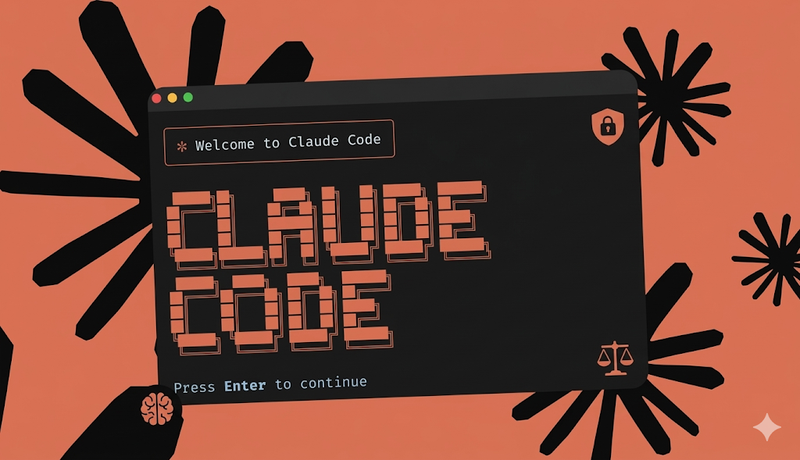
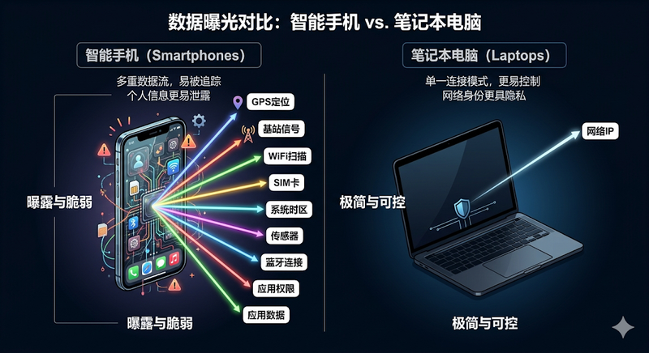
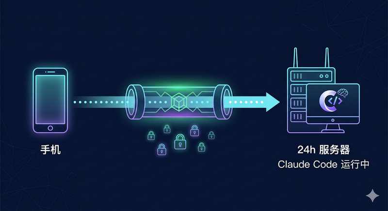
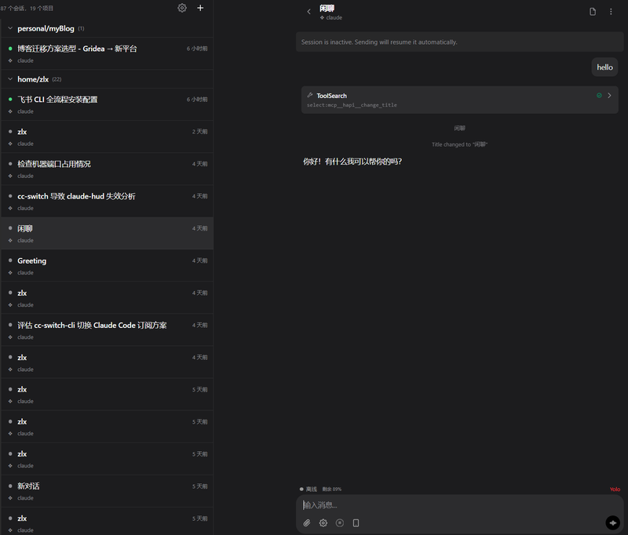
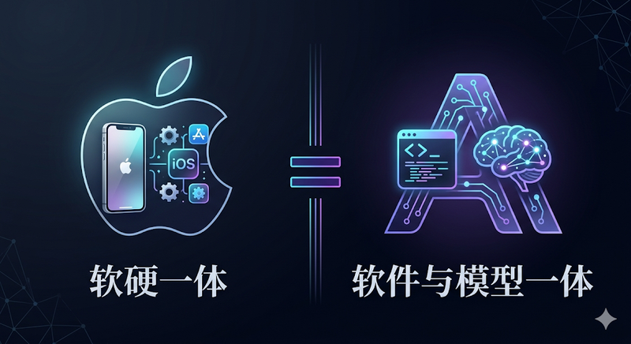
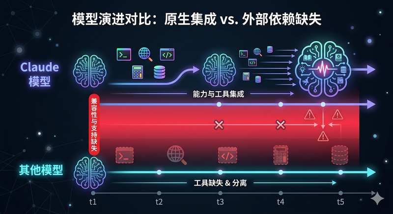
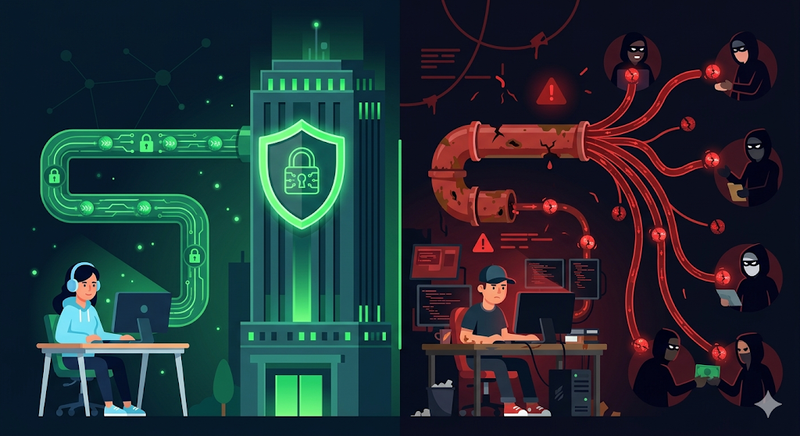
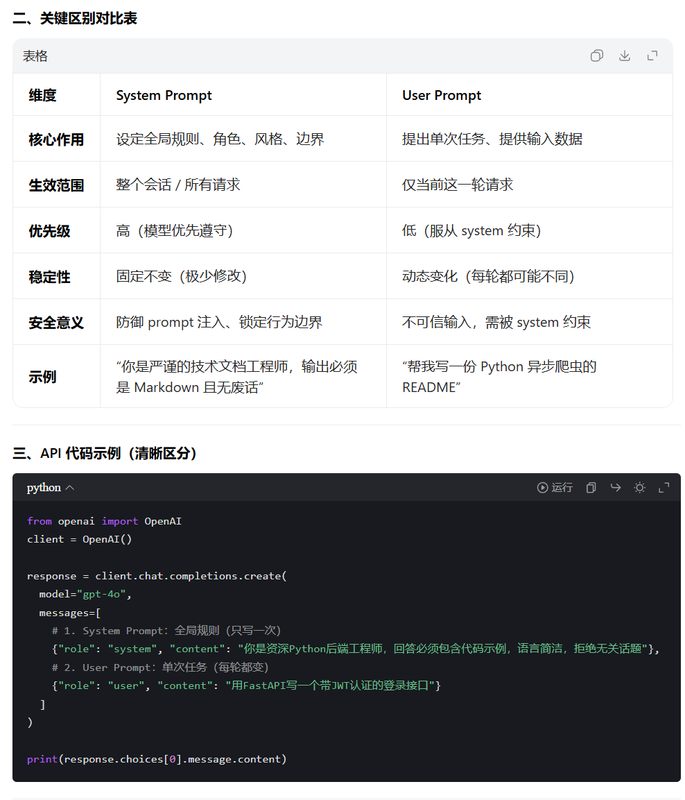

*Translated from the [Chinese original](/posts/claude-code-risk-model-philosophy/). Last synced 2026-09-25.*

Claude Code paired with Opus 4.6, and Codex paired with GPT 5.4 — these are the two products running far ahead of the pack in the coding agent space. My own setup is the Claude Code Max plan plus Codex's $20 basic plan; I do most of my project work in Claude Code and turn to Codex for the really hard debugging.

As more people get into AI-assisted programming, they inevitably get funneled toward these two first-party coding agents. Claude Code has the more mature ecosystem of the two, but also a higher barrier to entry — not just technical, but a barrier of access as well.

This post is a collection of scattered thoughts from my time using it, covering three topics: surviving risk control, choosing models, and design philosophy. These are not authoritative answers — for reference only.

**If you remember only one thing from this post: do not install the Claude mobile app.** This may be a risk-control blind spot that nobody in the Chinese-speaking internet has written about yet; I'll expand on it below.

---

## 1. Risk Control and Survival

### 1.1 IP, Phone Numbers, and Payment

These three are the most-discussed basic hurdles online, so I'll only list them briefly.

| Detection dimension | Key point | Risk |
|---------|------|------|
| IP type (ASN) | Datacenter IPs are treated as extremely high-risk next to residential broadband | 🔴 |
| DNS consistency | DNS leaks expose your real network topology | 🔴 |
| WebRTC | Exposes your real IP directly unless blocked | 🔴 |
| Impossible Travel | Cross-country IP jumps within a short window trigger alerts | 🟡 |
| Timezone / locale checks | A US IP with a UTC+8 system timezone is a trait contradiction | 🟡 |
| Phone number | Virtual number ranges used for SMS verification are widely blacklisted; initial trust score is very low | 🔴 |
| Payment | Issuer BIN + billing address + IP geolocation must be consistent | 🔴 |

One-line summary: **changing your IP alone is nowhere near enough — your entire network environment has to be internally consistent.**

Realistically speaking, a foreign SIM card, a foreign bank card, and a clean network environment have become baseline infrastructure for the AI era — for a mainland Chinese user, whose domestic cards and numbers generally don't work with these services, these are things you'll have to solve sooner or later. A few keywords for your own research: for a low-cost US phone plan, look at **Redpocket** and **Ultra Mobile**; for banking, the main path is obtaining an **ITIN** (Individual Taxpayer Identification Number) → applying for a US credit card → paying the bill through **[Wise](https://wise.com)**. Plenty of communities around homelabbing and offshore bank cards discuss the specifics; search them yourself.

### 1.2 The Core Idea: Pass Yourself Off as an Overseas Chinese

Before getting into specifics, one premise must be clear: **risk control is a black box.** Short of Anthropic's own risk-control engineers, nobody can give you a definitive answer. What I can share is judgment built on basic knowledge of the risk-control field plus my own gut feeling.

A useful analogy is WeChat's risk control — the same action is fine for some people and gets others in trouble. It's tied to your account reputation, behavioral history, and environmental factors; it's a probabilistic game. So if you find you've violated some of the items below without getting banned, that's perfectly normal — it doesn't mean those factors don't exist.

Anthropic CEO Dario Amodei's ideological stance has given the company a fairly explicit risk-control policy toward users from mainland China — a market Anthropic doesn't officially serve in the first place. Watch his interviews and podcasts on YouTube and this becomes very clear; I won't belabor it. The upshot: if you're judged to be a mainland-China user, you'll most likely be handed a ban. But the company's engineering is genuinely strong, so plenty of people around me are stuck in a loop of getting banned, then finding new ways to hand over their money — rather surreal.

**The core idea is just one thing: make yourself look like an overseas Chinese who isn't in mainland China.** A Singaporean Chinese, a Chinese-American — you can keep talking to Claude in Chinese, but your "body" isn't in mainland China. Every measure below serves that goal of making your environment fit this identity:

- Solid IP quality (everyone basically knows this one)
- System timezone set to the target region
- Region settings set to the corresponding country
- Browser language defaulting to English
- System language can stay Chinese (overseas Chinese use Chinese anyway)

These are mostly icing on the cake, though. Many of my own devices run a fully Chinese environment with the region set to China, and everything works fine. I've had my Claude account for roughly two or three years, and Claude Code for over a year. So the core stays the same — figure out which class of legitimate user the server should see you as, then match that class's behavior as closely as you can.

### 1.3 The Risk-Control Blind Spot Nobody Talks About: Don't Install Claude on Your Phone

This is the single most important point in this post, in my view — and almost no one in the Chinese-speaking internet has mentioned it.

**The core reason: phones simply have too many sensors.**

Compared to a PC, the dimensions of information a phone app can reach go far beyond what you can disguise at the network layer. iOS and Android are equally affected.

iOS as an example — the geo-detection capabilities an app can reach include:

- **The CoreLocation framework**: gets latitude and longitude via GPS, then reverse geocoding turns that straight into the country of your physical location. **This process has nothing to do with your IP address** — no amount of network trickery helps.
- **The CoreTelephony framework**: reads the mobile country code (MCC) of your SIM, and even the MCC of the cell tower you're currently connected to. Even with a US SIM inserted, the moment your phone attaches to a Chinese carrier's tower (MCC=460), it can conclude you're actually in China.
- **The countryd service** (built into iOS since 16.2): an Apple-internal service that determines the user's actual country from GPS location, tower MCC, country information of nearby Wi-Fi networks, system timezone, and more. It was built for Apple's own compliance enforcement (EU app sideloading, age-verification rules in various countries, etc.), but developers can also read each of these signals through public APIs.
- **NSLocale**: auxiliary signals from system settings — region, timezone, language, and so on.

Android is analogous, with equivalent location services, cell-info reading, Wi-Fi scanning, and more.

**A verified case: Meta smart glasses.** The Meta AI feature of the Meta Ray-Ban glasses is restricted to the US. Early on, changing your IP was enough to get around it, but an app update killed that route completely — it now uses exactly the multi-dimensional detection above to determine region without relying on IP. On a non-jailbroken, non-rooted device, fully evading that set of checks means tampering with location, cell info, timezone, system settings, and every other dimension at once — extremely difficult.

My reasoning is simple, and I'll state it openly: **there is no need to prove which specific APIs the Claude app calls.** Two facts suffice. First, the phone OS grants apps these capabilities. Second, Claude has an explicit risk-control policy toward Chinese users, and every incentive to use those capabilities. Put the two together, and not installing the app is the lowest-cost risk avoidance there is.

How to put it — the Claude Code + Opus 4.6 experience is addictive; it's hard to go back down to other models. So your account matters far more than your money. And keeping the Claude client off your phone may be the cheapest, most effective protective measure you can take.

### 1.4 Hardware Fingerprints and Handling a Ban

If you've already been through a ban, there's one thing to know before registering a new account: **Claude Code keeps deep local state tracking.**

The global config file `~/.claude.json` stores not only session history, OAuth tokens, and MCP server configuration — it also retains environment telemetry and hardware identification tied to your past accounts. The file routinely bloats past 17MB.

More crucially, Claude Code collects OS-level hardware fingerprints. On Windows it reads the registry's `MachineGuid`; on macOS it extracts the `IOPlatformUUID` fixed into the motherboard. These hardware-level digital signatures sync to the cloud with every interaction. Once the cloud detects several different accounts bound to the same hardware fingerprint, linked bans follow.

So if you're starting over after a ban, you must thoroughly clean your local environment. I won't go into the cleanup specifics here — research them yourself. Just a heads-up: for many people, this may be exactly why the bans keep repeating.

### 1.5 So How Do You Chat with Claude on Your Phone?

If the native app is off the table, what do you do when you want to talk to Claude from your phone day to day?

The core idea: **you have a machine that's online 24/7 running Claude Code, and your phone remote-interfaces into it.** That way every interaction happens on your server; the phone is nothing but a display terminal and exposes none of its sensor information to Claude.

Two concrete options:

**Option 1: [CC Connect](https://github.com/chenhg5/cc-connect)**. It bridges Claude Code onto a dozen-plus messaging platforms — Feishu, WeCom, DingTalk (Chinese workplace IMs), Telegram, and more — so you can talk to Claude Code anytime right inside your IM. The drawback is that it's a bot at heart; switching between multiple sessions is inconvenient and not very intuitive.

**Option 2: [HAPI](https://hapi.run)** ([GitHub](https://github.com/tiann/hapi)). This is the one I recommend more. HAPI natively supports multiple sessions and multiple working directories, project-level skill installation, and a built-in memory feature. You can genuinely treat it as a chatbot — create a folder, spin up a Claude Code instance, connect, and different conversations stay isolated by construction. It also supports multiple agents: Claude Code, Codex, Gemini, OpenCode, and more.

On secure deployment, a few choices:

- **LAN option**: form a network with [Tailscale](https://tailscale.com) so phone and server sit in the same virtual LAN. But when your phone is out and about, it can conflict with other network software — a trade-off to weigh.
- **Public-internet option**: expose the internal service to the internet with [Cloudflare Tunnel](https://developers.cloudflare.com/cloudflare-one/connections/connect-networks/), then put [Cloudflare Access](https://developers.cloudflare.com/cloudflare-one/policies/access/) in front for authentication — for example, allowing only your own Google or GitHub account. Cloudflare is a fundamental network-layer provider, extremely secure, and the whole flow is free; the only cost is a domain, roughly a few dollars a year.
- Either way, you can install the web page to your phone's home screen as a PWA for an experience close to a native app.

The prerequisite, of course, is owning a machine that's online 24 hours a day. But with so many people already keeping always-on boxes running agents these days, that shouldn't be much of a barrier for anyone serious about using AI well.

---

## 2. Design Philosophy: Understanding Why Claude Code Is Built the Way It Is

Before talking model selection, understand Claude Code's design philosophy first — because the root of many problems people run into, such as Chinese models underperforming inside Claude Code, actually lies here.

The quotes below come straight from Boris Cherny, creator of Claude Code, in two podcast appearances:
- [Inside Claude Code With Its Creator](https://www.youtube.com/watch?v=PQU9o_5rHC4) (Y Combinator Lightcone)
- [Head of Claude Code: What happens after coding is solved](https://www.youtube.com/watch?v=We7BZVKbCVw) (Lenny's Podcast)

### 2.1 The Core Philosophy

> "We build for the model six months from now, not for the model of today."
> — Boris Cherny, Head of Claude Code

**Design the product for the model six months from now, not for today's model.** This sentence explains why Claude Code keeps subtracting — many tools and features you once used get invoked less and less as model capability iterates, until they are cut from the toolchain entirely. The model has internalized those capabilities.

> "We have a framed copy of the bitter lesson on the wall... the more general model will always beat the more specific model."

They have Rich Sutton's [The Bitter Lesson](http://www.incompleteideas.net/IncIdeas/BitterLesson.html) framed on the office wall. Its central claim: **the more general model will always beat the more specialized one.** This is the bedrock principle behind every design decision in Claude Code.

> "Scaffolding can improve performance maybe 10-20%, but often these gains get wiped out with the next model."

Engineering scaffolding built around a model improves results by at most 10-20%. But when the next model version ships, those gains are often wiped out entirely. So you either keep rebuilding the scaffolding, or you wait for the next model — the latter is usually the better choice.

> "All of Claude Code has just been rewritten over and over. There is no part of Claude Code that was around six months ago."

Claude Code's code is being rewritten continuously. No part of it survives longer than six months. Not because the code is poor, but because model capability keeps changing and the product has to adjust along with it.

### 2.2 Software and Model as One

With the above in mind, you can see the essence of Claude Code: **it is not a general-purpose AI coding framework, but a product deeply bound to Anthropic's models.** It's a bit like Apple's hardware-software integration — Claude Code does software-and-model integration.

This integration shows up in two directions:

**Models swallow product features.** Boris predicts plan mode may stop being a necessity a month from now — the model will judge for itself when to plan and when to execute, no manual mode-switching needed. Problems that used to be solved at the product layer are now handled by the model itself. Once model capability grows past a threshold, the corresponding product feature loses its reason to exist.

**The product is continuously rewritten around the model.** That earlier quote — "no part of the code survives six months" — is not an exaggeration. Claude Code's toolchain gets trimmed and refactored with every new model release: the model internalizes a capability, and the corresponding external tool is removed. This is an ongoing process, not a one-time refactor.

Which means Claude Code's functional boundary keeps shifting with model capability. A tool or mode you find indispensable today may be removed six months from now.

### 2.3 What This Means for Users

**Understanding Claude Code's capability boundaries and design intent matters far more than memorizing specific usage tricks.**

At the same time, there's no need to canonize the official way of using it. Boris himself said:

> "There's no one right way to use Claude Code."

His personal usage is based on his situation — inside Anthropic, on the latest internal models, developing Claude Code itself. Your situation almost certainly differs from his. So the greater value of his interviews and posts is helping you understand why the tool is designed the way it is, not telling you how to use it. How to actually use it should be decided by your own needs.

---

## 3. Model Selection: Top Models Set the Direction, Chinese Models Cut Costs with Engineering

With the philosophy from the previous section in hand, model selection becomes much clearer.

### 3.1 Why Chinese Models Underperform Inside Claude Code

Chinese frontier models are genuinely cheap these days — some annual subscriptions cost about one month of Claude Code — and many of them benchmark beautifully. But once you put them inside Claude Code, you may find the results fall short of expectations.

The reason is that Claude Code's toolchain follows the capabilities of Anthropic's own models. Once Anthropic's models internalize certain tool capabilities, Claude Code throws away the corresponding external tools. But if the Chinese model you swapped in hasn't internalized those capabilities yet, you get an awkward situation: the tool has been removed by Claude Code, and the model can't do it natively either — it fails to call tools when it should, and drifts off course.

**This is not a protocol-adaptation problem.** Everyone can be syntactically compatible with Anthropic's protocol; this is a capability-adaptation problem. Claude Code is tailor-made for its own models, so third-party models inherently start with an adaptation gap.

### 3.2 A Tiered Strategy

If you don't want to use the most expensive model end to end, one practical strategy is tiering:

**Top models think at full blast to set the direction; Chinese models, backed by solid engineering, drive the cost down.**

Three concrete scenarios from my practice:

**First, [OpenCode](https://github.com/opencode-ai/opencode) plus the [Oh My OpenAgent](https://github.com/code-yeongyu/oh-my-openagent) plugin.** This combo is essentially the idea above turned into a product — the top model handles complex reasoning and architecture decisions, while the cheap model handles fine-grained analysis tasks. It does a lot of engineering work to control task complexity and handle errors, so its demands on model capability are correspondingly lower. If you find that Chinese models plugged directly into Claude Code disappoint, try this direction.

**Second, role assignment in multi-agent collaboration.** When I run OpenClaw multi-agent setups, the orchestration layer's "CEO agent" uses a top model to assign tasks — a commander-in-chief role — because when the dispatch decision is wrong, everything downstream is wrong. The execution agents underneath get Chinese models chosen by task type. The key is that the execution layer's workflow must be designed clear and explicit enough to shrink the space for ambiguity, and cheap models must not be allowed to make complex decisions. I developed this idea more systematically in an earlier post, [Context is All You Need: Why Does Your AI Work Only Sometimes?](https://mp.weixin.qq.com/s/az3gUGA24mXs1ptYdayFjQ) (published on my WeChat official account, the Chinese blogging-plus-newsletter platform) — the core is to have the main agent make judgments and decisions on the strongest model, let sub-agents do the grunt work on cheap models, and keep the main agent's decision space clean through context isolation.

**Third, skill development and migration.** Use the top model to first verify that a skill can run through — top models solve the problems they encounter along the way and call tools fairly eagerly, which validates the idea quickly. Once it's confirmed to work, switch to an ordinary model and watch the trigger success rate. You'll find the cheap model errs in places — not calling tools when it should — and at that point you add explicit instructions to the skill. The final skill ends up more "bloated" than the top-model version — more content, finer-grained steps — but that price buys a full order of magnitude off the cost.

The underlying idea: **when model capability falls short, make up the gap with engineering.** And this optimization loop itself can be handed to AI — no need to do it all manually.

### 3.3 A Word of Caution on Unofficial Channels

If you skip the official subscription and obtain Opus 4.6 through other channels, there are a few risks you should understand:

**The wrapped-shell risk.** You don't know whether the relay provider is actually using the genuine official API, or wrapping a Chinese model in a shell for you. The arbitrage margin here is staggering; there has been news coverage of it.

**The data risk.** Two cases to distinguish here. If you're on an official subscription from a major Chinese vendor (Alibaba, ByteDance, MiniMax, Zhipu, and the like), big vendors keep some bottom lines in how they operate, and their data handling is relatively disciplined. But if you're using third-party relay APIs set up by individuals, the nature of the thing is completely different — many are run by solo operators with no bottom line to speak of. Your data may not be sold to just one buyer, but to many; at that point you're basically running around naked. So weigh for yourself whether any sensitive content should be kept away from these channels.

**System prompt pollution.** Some schemes extract API access through reverse-engineered IDE integrations, such as [Google Antigravity](https://www.datacamp.com/blog/claude-code-vs-antigravity) (the IDE from the former Windsurf team after Google's acquisition) and [Amazon Kiro](https://kiro.dev). Reverse-engineered APIs have an inherent problem: you can only modify the user prompt, while the underlying system prompt is immutable. Antigravity's system prompt is built in by Google; Kiro's is Amazon's, designed for Kiro — these preset system prompts influence downstream output behavior and quality. If you run into subtle quality differences, this may be one reason.

### 3.4 Model Choice, in Order of Preference

To sum up, from best to worst:

1. **Official subscription plans** — the first choice if you have the money and the means; a $200 Max plan used to the limit is equivalent to several thousand dollars of API credit
2. **Burning the official API directly** — flexible but expensive, for bosses who genuinely can afford the burn
3. **Chinese models plus engineering** — OpenCode, multi-agent tiering, and similar setups; requires investing engineering optimization effort
4. **Reverse proxies / relays** — the risk is yours; if nothing goes wrong, great; if it does, come back and think through the points above

---

## Closing Thoughts

On a $200 Max plan, if you use it to the limit, the API credit alone can amount to several thousand dollars' worth. But they also got your data, and their actual cost certainly isn't anywhere near that high.

Judging by the current trend, as more and more people pour in, the speed at which the physical world plus machines can be added cannot keep up with demand exploding. Anthropic is already cutting quotas, and there may be further reductions to come. Tokens from cheap models keep getting cheaper, but tokens from these top-tier models may well not. How far this monthly-plan free ride can go is genuinely hard to say.

Enjoy it while it lasts.

---

> Drafted from voice recordings in Feishu transcribed to text with Doubao; the article's structure and content were organized through conversations with Claude Code + Opus 4.6; the illustrations were generated by the Nano Banana AI.
