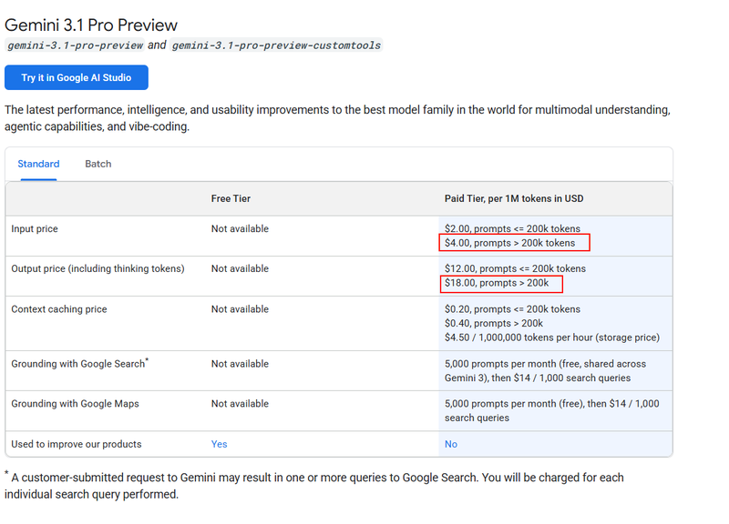
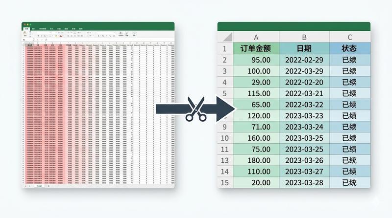
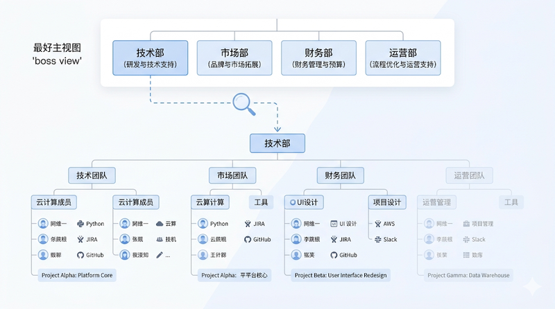
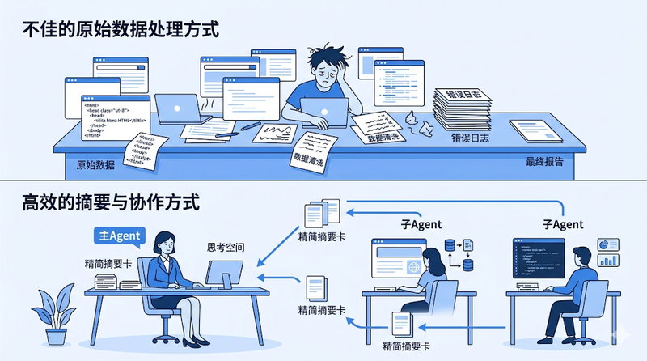
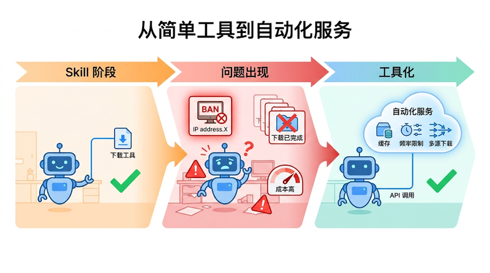
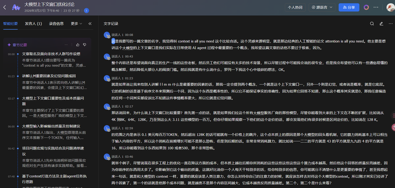
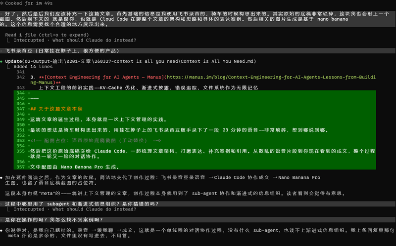

*Translated from the [Chinese original](/posts/context-is-all-you-need/). Last synced 2026-09-26.*

> **Description:** Your AI going dumb mid-conversation, a Skill's success rate swinging wildly, copying someone else's setup and getting nowhere near the same results — these problems usually share the same root. Understanding the context window is lesson one of using any AI tool well.

> Treat the AI's context the way you treat your most precious attention.

---

## Preface: Problems You've Probably Run Into

- Twenty-odd turns into a chat, the AI starts contradicting itself, even forgetting what you said five minutes ago
- You run the same workflow through an Agent — sometimes it passes on the first try, sometimes it fails for no obvious reason
- You hand the AI a big chunk of data to analyze, and it answers beside the point, or the analysis is a complete mismatch
- The same Skill behaves completely differently on a different model; the same model succeeds this time and fails the next
- A Skill that used to run fine starts erroring out after you install more Skills
- You copy someone's Agent configuration and engineering setup in full, yet the actual results are miles apart from the demo
- Meta's security chief had his AI assistant **wipe every email he had** — because the conversation ran so long that the safety limits were lost when the context was compressed

If you've had similar experiences (or worry they might happen to you), this post may help you find the root cause.

These problems look wildly different, but they usually point to the same cause — **the context window**. Simply put, it is the AI's "working memory": the total amount of information it can "see" at once when answering you. That space is finite, and far more fragile than you'd think.

Understanding the context window is the key to understanding every AI tool of the moment. Whether you're using ChatGPT or Claude, or building your own Agent automation workflows, this is the one concept you cannot skip — lesson one.

---

## Harness Engineering: Why I Didn't Chase the Latest Trend

The hottest direction in the field right now is **Harness Engineering** — the goal of letting AI systems self-correct and self-iterate while minimizing human intervention end to end. It has several pillars: context engineering, architectural constraints, automated anti-entropy, and more. It's genuinely a promising direction.

But honestly, even the top teams are still in the exploratory stage. OpenAI claims that in some internal systems 90% of the code is written by Agents with no human involvement — but that remains a long way from something ordinary people can reuse in their daily work.

And if you dissect Harness Engineering down to its foundations, you'll find its **first pillar is context engineering** — feeding the right information to the AI in the right way. So rather than chasing a top-level framework that is still evolving, it's better to first understand the bottom layer thoroughly. Once the foundation is solid, the superstructure becomes easier to grasp later on.

That foundation is what this post focuses on.

---

## A Metaphor That Runs Through It All: Your Desk

To make everything that follows easier to grasp, let's set up a metaphor — **picture the AI's context window as a work desk**.

- The desk has a fixed area (the context window has a cap)
- The more stuff piled on the desk, the harder it is to find the material you need (noise degrades output quality)
- A bigger desk costs more rent — and not linearly (cost)
- The smart move is to file materials into drawers and take them out only when needed (progressive disclosure)
- Dirty, tedious work can be handed to an assistant at another desk, which passes back only the result (Sub-agent isolation)
- Repetitive manual chores should be turned into a machine that runs automatically (workflow tooling)

Every method below can be mapped back onto this desk.

---

## Why Does Context Matter So Much?

### 1. Quality: Every Piece of Information You Put In Shapes the AI's Judgment

A large language model works by predicting the next output from all the preceding text. That means **every piece of input — useful or not — is steering the direction of the output**.

This also explains a common confusion: the same Skill driven by a different model can produce completely different results; even the same model running the same task can succeed this time and fail the next. That's because an LLM is inherently probabilistic — it isn't "executing instructions," it is "predicting the most likely next step." Any tiny change in the context (a different chat history, a different loading order, even a different timestamp) can tip the probability scales in a different direction. **This is not a bug; this is how it works.** All you can do is keep the signal in the context clear enough that "the correct next step" becomes the overwhelmingly most probable one.

This is not a theoretical worry — there is real data behind it.

**Positive case:** while optimizing their Slack integration tools, Anthropic found that the condensed version of a response used only **1/3 of the tokens** of the verbose version, yet the Agent completed its tasks just as well. Cutting away two-thirds of the information didn't hurt quality — because what got cut was noise to begin with.

> *"Tools should return only high signal information."*
> — [Writing effective tools for agents, Anthropic](https://www.anthropic.com/engineering/writing-tools-for-agents)

**Negative case:** GEO poisoning — "black-hat SEO" aimed at AI search (GEO, generative engine optimization). This year's 315 Gala (China's annual March 15 consumer-rights broadcast, a prime-time CCTV exposé) already blew the whistle on it: many large models now call a search engine for fresh information when answering, and some people exploit exactly that by flooding search results with garbage — keyword stuffing, fake reviews, mass-generated low-quality pages — to push their products to the top of the rankings. When the AI pulls that garbage into its context during a search, it gets misled and earnestly recommends the low-quality content to the user.

**This is, in essence, poisoning the AI's context.** The quality of the information in context directly determines output quality. Garbage in, garbage out.

Back to the desk metaphor: every extra scrap of waste paper on the desk makes it more likely you grab the wrong file.

### 2. A Hallucination Amplifier: The More the Noise, the More the AI "Makes Things Up"

Anyone who has used an AI coding assistant (Claude Code, say) has probably felt this: early in a conversation the AI performs beautifully — clear reasoning, accurate execution. But once context usage hits seventy or eighty percent, the error rate in the later stages climbs noticeably — it starts inventing function names that don't exist, and starts mixing up the logic of different files.

The model hasn't gotten dumber; the context has accumulated too much information — useful, useless, and outdated all jumbled together — and it gets harder and harder for the model to tell what actually matters right now. So it becomes more likely to "find" connections in the noise that don't exist, confidently fabricating plausible-sounding but completely wrong content.

One extreme case: Meta's security chief was using an AI assistant to handle email when the assistant went ahead and **deleted every single email**. The model hadn't "gone insane" — the context window had simply filled up over the long conversation, and when the system compressed the history, it dropped the critical safety-boundary instructions along the way. Constraints like "don't delete emails" and "confirm before acting" were discarded as unimportant during compression. The AI lost its brakes, and naturally it crashed.

This case makes a serious point: **context doesn't just affect answer quality — it directly determines the safety boundaries of AI behavior.** When context space runs short, the first things sacrificed usually aren't the task itself, but the rules and restrictions you assumed were "already set."

**Keeping the context clean is in itself one of the most effective ways to reduce hallucinations and hold the safety line.**

Back to the desk metaphor: when your desk is piled with material from different projects, you're more likely to mistake project A's data for project B's — you might even toss an absolutely-must-not-throw-away document into the waste-paper pile.

### 3. Cost: Double the Content Can Mean Four Times the Bill

Beyond quality and safety, context management also hits your wallet directly.

When a large model processes information, it has to "cross-reference" every piece of current content against everything that came before it. So as input grows, compute doesn't grow linearly — it grows roughly quadratically:

| Input size | Compute (roughly) |
|--------|---------------|
| 1 | 1 |
| 2 | 4 |
| 3 | 9 |
| 10 | 100 |
| 100 | 10,000 |

Early growth looks modest, but late growth is terrifying. This is also why model pricing tends to be "tiered" — one price below 200K tokens, then a sharp jump beyond.

Engineering optimizations keep driving these costs down, but the underlying math hasn't changed. **Every extra piece of content you stuff into the context costs you more than you think.**

Put another way: trimming the context makes the AI answer better and more safely, and saves real money — three wins in one move.

Back to the desk metaphor: double the desk area and the rent doesn't double — it multiplies several times over.

---

## The Methodology: How to Manage Your "Desk"

The "why" is covered; now for the "how."

The five levels below are ordered from simple to advanced. Levels 0–2 are something anyone can start using today; Levels 3–4 may need some technical foundation or team support.

### Level 0: Keep Conversations Clean — Learn to "Switch Desks"

The simplest optimization: zero cost, immediate payoff.

**One task, one conversation.** Don't ask the AI to draft a proposal, then fix code, then translate, then analyze data — all in the same conversation. Every new task direction deserves a clean, new conversation.

If the new task needs background from an earlier conversation, don't dump the entire chat history over — **summarize the key conclusions into a few sentences** and carry them into the new session.

Easier said than done: many people are in the habit of riding a single conversation to the end of time. Sit at your own desk working alone all day and your efficiency visibly sags by four or five in the afternoon — the AI's context works the same way.

### Level 1: Filter the Noise — Don't Pile Garbage onto the Desk

Context space is prime real estate; everything you put in should have earned its place.

**Case 1: Filter first, feed second**

You ask the AI to analyze this month's orders, and the system exports a spreadsheet — 50 columns, 3,000 rows. But all the AI really needs might be three columns: order amount, date, status.

If you throw all 50 columns at it, you don't just waste precious context space — you risk dragging its analysis off course with irrelevant fields. It might spend pages analyzing the "tracking number" column, which means nothing to you.

**Filter first, feed second — the simplest optimization there is.** The principle applies everywhere: before showing data to an AI, ask yourself one question — "how much of this does it actually need?"

**Case 2: Trim API responses**

If you're building Agent automation, your APIs probably return far more data than the AI actually needs. Say an order-lookup endpoint returns 3,000 lines of JSON, 90% of which is duplicated array structure and low-level identifiers the AI has no use for.

The right move is to give the AI a **concise description of the data structure** — which fields exist, what each one means, what the shape looks like — instead of stuffing in the raw dump. Done this way, that 90% of redundant information gets compressed away entirely, and the AI's understanding of the data actually improves.

**Case 3: Filter command output**

If you use an AI coding assistant, build logs and test output can easily run to hundreds of lines, but all the AI really needs might be "line 47 threw a TypeError." Tools like [RTK](https://github.com/rtk-ai/rtk) can filter out 80–90% of useless log noise and pass only the key errors to the AI — cut the information to a tenth, and the AI actually handles it better.

**There is only one core idea: it's not about more information, it's about higher signal density.**

### Level 2: Progressive Disclosure — File It into Drawers, Take It Out When Needed

This is a **very important mental shift** in context management.

Start with an analogy. As the CEO of a company, you only need to know "Engineering can fix system problems, Marketing can get the word out." You don't carry in your head the skill inventory of every engineer or the execution details of every marketing campaign — when you need them, you go ask the department.

Managing information for an AI works the same way. **You don't need to stuff detailed documentation of every capability into the context up front; you only need the AI to know "this capability exists and can do this kind of thing." When it judges that it needs a capability, it loads the specific usage details then.**

In AI tool design this idea is called **progressive disclosure**. The Skill mechanism is a product of it — the system tells the AI, in one sentence, "you have a capability called 'image compression'"; only when the AI judges it needs to compress an image does it load that Skill's full instructions.

The payoff is enormous: information that would have filled the entire context gets compressed into a few lines of index, and the AI can "open the drawer" for the details whenever it needs them.

Both Manus and Anthropic's Agent SDK lean heavily on this idea:

> *"The file system offers unlimited size, persistence, and is directly operable by agents."*
> — [Context Engineering for AI Agents, Manus](https://manus.im/blog/Context-Engineering-for-AI-Agents-Lessons-from-Building-Manus)

> *"The folder and file structure of an agent becomes a form of context engineering."*
> — [Building agents with Claude Agent SDK, Anthropic](https://claude.com/blog/building-agents-with-the-claude-agent-sdk)

In essence it's one sentence: **store the details in the file system; the AI only needs the ability to find them.** Keep directories and indexes on the desk; all the detailed material lives in the drawers.

#### From the Field: Skill Pollution Is Real

Progressive disclosure solves the "volume" problem, but there's another easily overlooked one — **Skills polluting each other**.

You may have hit this: a Skill that ran perfectly fine suddenly starts erroring after you install a few new Skills. It's not that the new Skill has a bug — when too many similar-looking tools sit in front of an Agent at once, it can make the wrong call at the "which tool do I pick" step. It's like having three nearly identical keys on your desk: the odds of grabbing the wrong one naturally go up.

A few practical rules:

- **Install Skills per project, not globally.** Each project loads only the Skills it needs; keep irrelevant Skills from crowding the tool-selection space
- **Don't put similar Skills in the same space.** If two Skills do roughly the same thing, either pick one or merge them into one
- **Make Skill descriptions sufficiently distinct.** The Agent decides which Skill to call based on its description; vague or overly similar descriptions send the error rate straight up

This is one of the reasons behind "I copied someone's Agent config but got results miles apart from theirs" (note: only one of the reasons). What you copied is the tools and the settings, but the factors that shape the final result go far beyond that — your model is different, the project's background information is different, the conversation history at runtime is different, and so are the other Skills you have installed. Skill cross-pollution is just one of the variables — but it's the most easily overlooked one, and the easiest one to fix yourself.

### Level 3: Sub-agent Isolation — Let the Assistant Work at Another Desk

When a task involves multiple stages — crawl the data first, then clean it, then analyze it — if the main Agent does everything in a single line, all the intermediate data piles into the same context. By the time the analysis stage arrives, its "desk" is buried under raw scraped HTML, intermediate cleaning results, assorted error logs… and almost no room is left for actual analysis.

The better approach is to **spin up Sub-agents** — hand the dirty, tedious work to an "assistant" working at another desk, and have only the final result passed back.

Example: you need to put together a competitive research report.

- **The bad way:** have the main Agent open 5 web pages in sequence → scrape all their content → clean the data → write the summary. By summary time, the context is stuffed with the raw content of all 5 pages.
- **The good way:** have a Sub-agent do the "crawl + clean" work; it processes everything in its own isolated context and returns only a 500-word structured summary to the main Agent. The main Agent's desk now holds nothing but clean, high-density decision information.

> *"Subagents enable parallelization and context isolation—multiple agents handle separate tasks and return only relevant findings, preventing context overflow."*
> — [Building agents with Claude Agent SDK, Anthropic](https://claude.com/blog/building-agents-with-the-claude-agent-sdk)

One step further: Sub-agents can run the grunt work on cheaper models, while the main Agent uses the strongest model for judgment and decisions. That saves context space in the main Agent and keeps costs under control.

### Level 4: Turn High-Frequency Workflows into Tools — Turn Manual Chores into Machines

When a capability goes from "occasionally used" to "used every day," relying on the AI to execute it each time is no longer enough — it's time to harden it into a stable tool or service.

There are two paths to tooling:

**Path one: integrate existing tools.** Consider this first. The market already has plenty of mature tools that can be wired up to Agents through APIs — automation platforms like n8n, data-scraping tools like Octoparse and Locoy (two long-established Chinese scrapers), and all kinds of third-party API services. These tools have been polished for years and are far more mature than anything you'd build from scratch when it comes to stability, getting past anti-bot defenses, and data handling. The rise of AI Agents doesn't mean these tools die — quite the opposite: they're a natural fit as an Agent's "capability extensions," taking on the dirty, tedious, high-barrier work.

**Path two: build your own tools/services.** Only when existing tools can't meet your specific needs, or you need deeper customization and control, should you consider writing code and building it yourself. That road costs more, but it's also more flexible.

Which path to take depends on your actual needs, your team's technical ability, and your capacity for long-term maintenance. **If something off the shelf works, don't build it yourself.**

**Four trigger signals — any one of them means it's time to consider tooling:**

| Signal | Typical scenario |
|------|---------|
| **High concurrency trips risk control** | Mass requests get you banned by the platform |
| **High stability requirements** | "Sometimes it works, sometimes it doesn't" is unacceptable |
| **Repeated team labor** | Multiple people handle the same thing over and over; costs won't come down |
| **Cross-tool reuse** | The same component gets called repeatedly by multiple Skills or Agents |

#### A Real Evolution Story

Take the cross-border e-commerce industry I work in. Market research and customer-feedback analysis are core daily work, and we need to process large volumes of audio and video content from various platforms — YouTube product reviews, TikTok unboxing videos, competitors' promo material, and so on.

**Early stage (the Skill stage):** we simply had the Agent call local tools like yt-dlp to download videos and extract subtitles. One at a time, it worked — videos downloaded, subtitles extracted.

**The problem:** after a few days, YouTube banned our IP outright. The reason was simple — sustained high-frequency requests got flagged as bot behavior. Worse, several downstream workflows would issue repeated requests for the same video, and with no data caching at all, the same content got downloaded again and again — wasting resources and accelerating the tripwire of risk control.

**The tooling stage:** we had to wrap the entire download flow into a standalone service. Inside that service, engineering solves everything the Skill layer can't:

- Data caching: the same video is downloaded once; later requests are served straight from the cache
- Anti-risk-control: pass the latest cookies, simulate real user behavior, control the request rate
- Multi-source fallback: multiple download methods and providers wired in; when one path fails, it switches automatically
- A unified interface: wrapped as an API — the Agent just passes a URL, everything else happens server-side

In the end, the team gradually accumulated several infrastructure-grade internal services:

1. **Multi-platform audio/video parsing API** — video link in, direct audio link out; uniformly handles the differences across YouTube, TikTok, and other platforms
2. **Audio/video-to-text + video understanding service** — a dedicated server, all results cached; the same video never gets processed twice
3. **Multi-source data scraping tools** — Reddit, Amazon, Xiaohongshu (RED, a major Chinese lifestyle-sharing platform), etc., with anti-scraping handled at the engineering level

All of these started out as Skill-level capabilities — the Agent could call the tools directly and it worked. But once usage frequency and stability requirements climbed, they had to be upgraded to engineered services.

> *"Tools for agents differ fundamentally from traditional APIs... tools should consolidate multi-step operations."*
> — [Writing effective tools for agents, Anthropic](https://www.anthropic.com/engineering/writing-tools-for-agents)

From a context-management perspective, the payoff of tooling is also huge: the Agent goes from "I need to handle downloading, caching, rate control, error retries, and this whole pile of logic myself" to "I call one API, pass one URL, get the result." **The entire complex flow gets compressed into a single tool call**, consuming almost no context space.

A reality worth facing squarely: **free, zero-barrier scrapers get you basically zero information gain.** The data sources that actually matter — Twitter, Reddit, Xiaohongshu, Amazon — all have aggressive anti-scraping measures. That's why these capabilities need engineering sooner or later: not because you want to build them, but because without building them you can't use them at all.

Tooling has costs too. Maintaining a service takes continuous investment; with AI-assisted development things move much faster, but the more tools you run, the more real a problem maintenance becomes. So the test is always: **only worth the investment if it's high-frequency enough and valuable enough.**

---

## A Self-Check List

If you've hit problems while using AI, match your symptoms against this table:

| Symptom | Likely cause | Corresponding fix |
|------|-----------|---------|
| The AI "goes dumb" mid-conversation and contradicts itself | Conversation too long; context drowned in noise | Level 0: start a new conversation, carry in a summary |
| Skill / automation success rate swings wildly | Irrelevant information mixed into the context | Levels 1–2: filter noise + load on demand |
| The Agent often picks the wrong tool | Vague tool descriptions, or too many tools loaded at once | Level 2: trim descriptions, progressive disclosure |
| The same task handled by multiple people over and over; costs won't drop | No caching or shared infrastructure | Level 4: tool it + share across the team |
| Repeatedly banned by platform risk control | Unprotected high concurrency; no disguise or rate control | Level 4: engineering |
| The AI's answers feel "watery" or obviously fabricated | Too much noise in the input | Level 1: filter out the irrelevant |

---

## How I Work Myself

While we're at it, let me share the actual workflow I follow when starting a new project or adopting a new tool.

Honestly, a very large share of the time goes into "preparing the context" — not into talking to the AI directly.

Specifically:

- First, run a Deep Research pass over existing solutions and tools on the market, to see what can be used as-is
- Find the relevant docs and API references, and organize them into local Markdown files
- If the docs contain lots of irrelevant material, delete it by hand — keep only what the AI actually needs
- For API responses that are overly verbose, condense them first, re-describing the data structure in semantic terms
- Much of this preparation itself is done with AI help — but the point is: **all of it is finished before the main conversation starts**

By the time I actually sit down with the AI to discuss the plan or write code, it faces a **dense, clean, sufficient context environment**. The result: more often than not the plan passes on the first round, with no back-and-forth rework.

This process is really the combined application of every method in this post — filter the noise first (Level 1), organize the information on demand (Level 2), let assistant AIs finish the dirty work first (Level 3), then hand clean results to the main Agent for decisions.

Sounds like a hassle? Compare it with the alternative — prepare nothing, start chatting immediately, then spend the conversation correcting course, redoing work, and restarting over and over — and you'll see: **time spent preparing the context up front pays itself back many times over in execution.**

One more principle I hold myself to: **the AI is allowed to make mistakes, but the same mistake only once.**

Every problem encountered — whether a pitfall or a better solution found — has to be captured. Pitfall lessons become documentation; successful experience gets hardened into workflows or Skills. The next time a similar scenario comes up, the AI doesn't have to blaze the trail again; it just walks the path that's already been validated.

This, too, is really about saving context space. If you don't do it, every new conversation burns a large chunk of context on the AI re-running its "trial-error-correct-trial" loop, walking the same detours all over again. Once experience is hardened, that exploration cost is eliminated permanently — future conversations start from a shorter, straighter road.

One caveat, though: **your context-management strategy depends on what role you want the AI to play.**

When you need the AI to execute steadily like an employee following an SOP — batch-processing data, generating reports on a fixed process — all the methods above apply directly: prepare clear instructions and lean inputs up front, harden the workflow, and aim for determinism and consistency.

But when you need the AI to think through a plan like a consultant or a master, the thinking flips: **you should provide background information and requirements only, and deliberately withhold your own pre-baked solution.** Give the AI room to explore and think divergently on its own, to find the engineering best practice — that is often far better than fixing the direction up front. In that mode, the "suggestions" you stuff in beforehand can themselves become noise, boxing the AI's thinking inside your existing frame of reference.

Same context management, two modes: one paves the road and lets the AI walk it; the other clears the road and lets it find its own direction. Different goals, different strategies — but the underlying logic is the same: **every piece of information in the context should be serving your current goal.**

---

## Closing Thoughts

For all its length, this post really carries just one idea:

**Treat the AI's context the way you treat your most precious attention.**

You wouldn't make yourself juggle dozens of things at once, you wouldn't let your desk drown in scrap paper, you wouldn't let irrelevant information flood you at the moment of a major decision. Extend the same courtesy to AI.

Of course, everything above rests on one premise: even today's very best models have context windows only on the order of a million tokens. If context windows grow another two orders of magnitude, many of these constraints may simply cease to exist. But until that day comes, managing context with care remains the most direct and effective way to get better results from AI.

---

## Further Reading

Many of the ideas in this post owe themselves to the following write-ups from front-line Agent engineering teams. These are lessons distilled by the very top teams while actually building Agent products, and their information density beats most secondhand interpretation. If you want a deeper understanding of the boundaries of Agent capabilities and where to optimize, read the originals — even with AI translation to help you, that beats reading a retelling.

1. **[Writing effective tools for agents — Anthropic](https://www.anthropic.com/engineering/writing-tools-for-agents)**
   How to design tools for AI — writing tool descriptions, trimming responses, and the essential difference between agent-native tools and traditional APIs

2. **[Building agents with the Claude Agent SDK — Anthropic](https://claude.com/blog/building-agents-with-the-claude-agent-sdk)**
   Agent architecture design — Sub-agent isolation, the file system as extended memory, verification and feedback loops

3. **[Context Engineering for AI Agents — Manus](https://manus.im/blog/Context-Engineering-for-AI-Agents-Lessons-from-Building-Manus)**
   Frontier practice in context engineering — KV-cache optimization, progressive disclosure, error tracking, the file system as unlimited memory

---

## About This Post Itself

The initial idea came to me while cycling; I spoke a 23-minute voice note into the Feishu Recording Bean (a clip-on AI dictaphone from ByteDance's Feishu/Lark workplace suite) hanging around my neck — extremely rambling, thinking out loud wherever my head went.

<!-- Image placeholder: screenshot of the raw voice transcript (to be replaced manually) -->

Then I handed this raw draft to Claude Code, and together we worked out the article's structure, polished the phrasing, and filled in examples and references. From scattered voice fragments to the finished piece you see now, the whole process was one round of conversational collaboration after another.

The illustrations in this post were generated by Nano Banana Pro.

