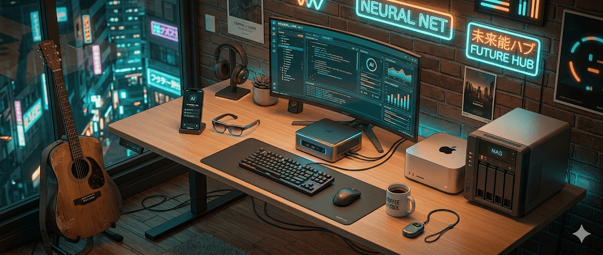
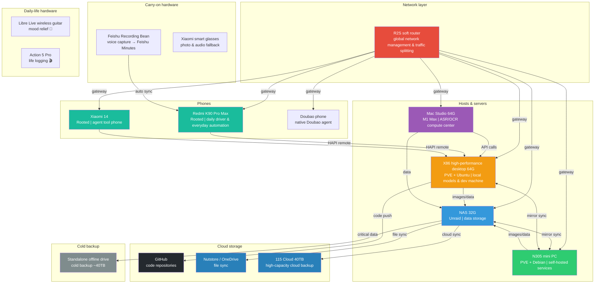
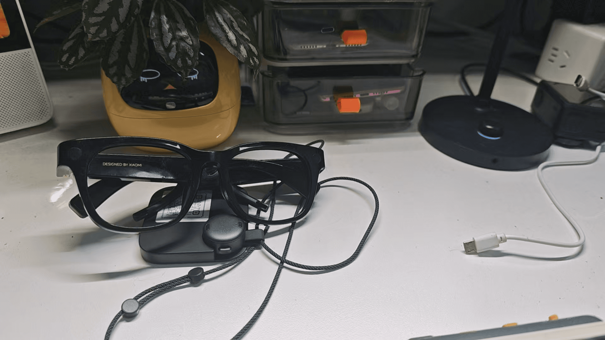
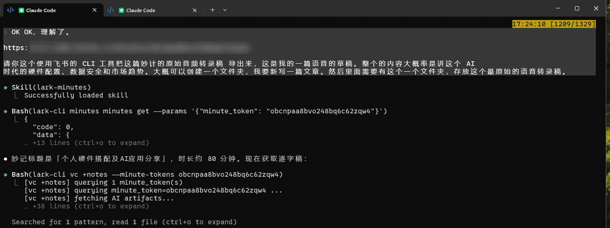
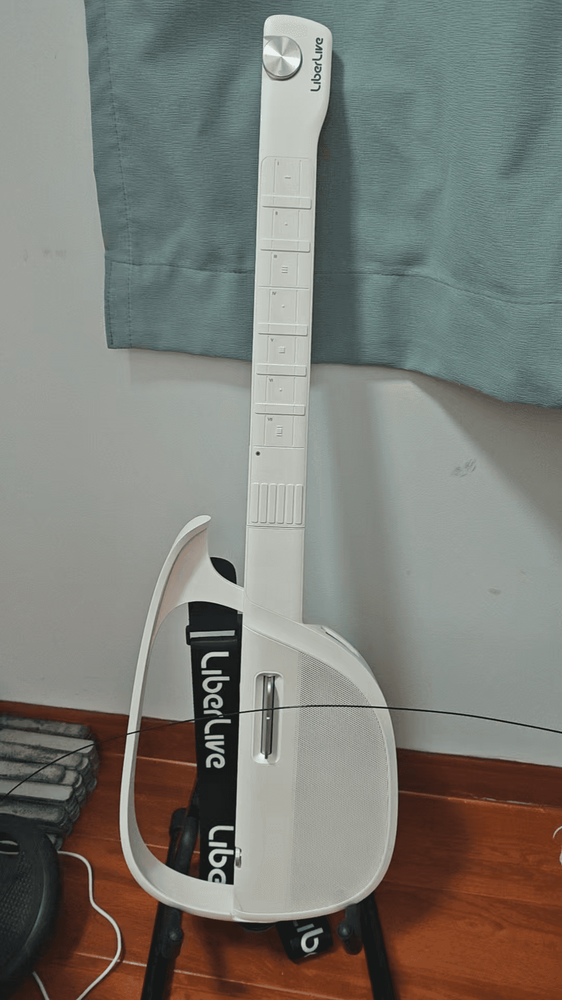
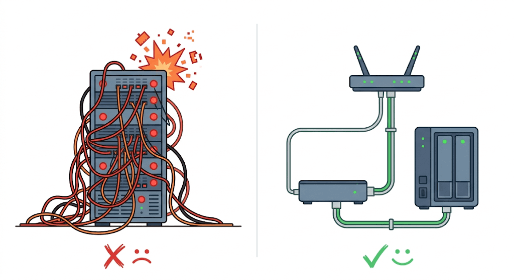
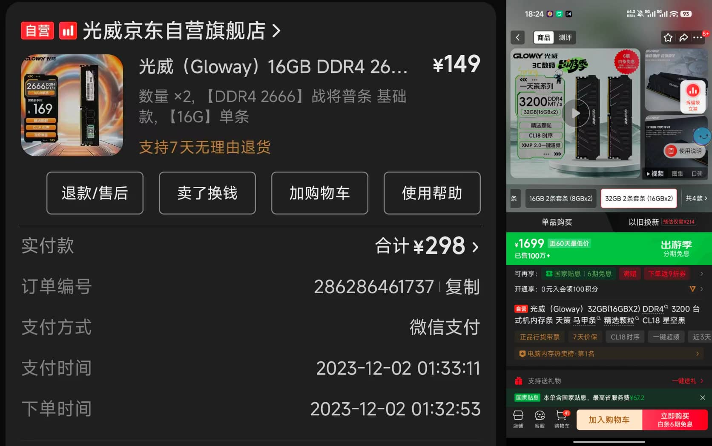
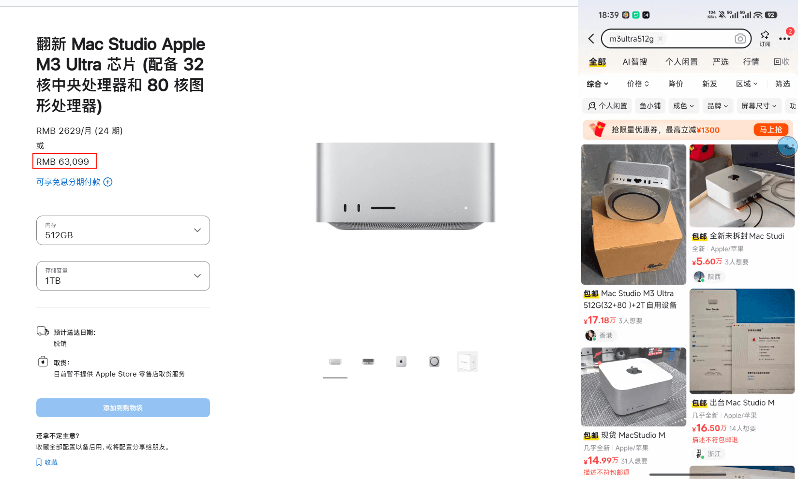

*Translated from the [Chinese original](/posts/260329-ai-hardware-data-security/). Last synced 2026-09-26.*

> This post is the hardware installment of my "LLMs Devour Everything" series. The previous installment, [the tools I grew out of AI](https://mp.weixin.qq.com/s/w8VnWJcUp5VkD5J-fYCUrg) (published on my WeChat Official Account, the main blogging-plus-newsletter platform in China), covered how I set up the software layer; this one is about the hardware foundation underneath it — how I built it, why it's built this way, and my read on where the hardware market is heading.
>
> Fair warning: this post runs a bit geeky. I'd been meaning to write it for almost a month, and over that month hardware prices climbed quite a bit more.

## 1. My Hardware Panorama

Let's start with a global architecture diagram showing how the devices work together:

Now let's go through them one by one.

### 1.1 Hosts and Servers

#### NAS (32G, Unraid)

In earlier posts my NAS was still carrying a fair number of core services. But an abnormal Unraid shutdown after Chinese New Year took every service down at once, and that gave me a real sense of urgency — service isolation and disaster-ready data backups are a must.

The NAS's role is now very pure: **pure data storage**, plus a few Docker services that don't touch core business data (Home Assistant, for instance — if it goes down, it goes down; most of my automation runs on Mi Home, Xiaomi's smart-home ecosystem).

> The lessons from my All-in-One pitfalls will get a dedicated section later.

#### N305 Mini PC (PVE + Debian container)

I bought it during last year's national consumption-subsidy program (a Chinese government subsidy on electronics): N305 CPU + 16G RAM + 512G storage. It was meant as a casual toy and turned out mostly useless — until the hardware re-architecture, when I folded it into the latest setup.

At the bottom sits Proxmox VE (PVE), running a Debian 12 Linux container dedicated to Docker. Every automation tool that used to live on Unraid has now moved here.

A side note: I used to be a bit wary of Linux because of its pure command line. But once the AI era arrived, I came to find the command line *more* convenient — even more convenient than Windows. And since my use case is services that are online 24 hours a day, Linux is the natural fit.

**Debian vs Ubuntu — how to choose?** I had AI do the research for me, and the conclusion:

- **Long-term stability, running containers only**: Debian (lighter, more stable)
- **Development work, especially involving LLMs**: Ubuntu (a more complete CUDA ecosystem)

My core goal is keeping services running stably over the long haul, so I chose Debian.

The reason I didn't install a distro straight onto bare metal, but went PVE first and VMs on top, is **data safety** — it makes backups easy. PVE VM images can be packaged and backed up whole, so recovery is quick when something breaks.

#### Mac Studio (64G + 1T, M1 Max)

Its role hasn't changed: still the LAN's **compute center**, running both the ASR (speech-to-text) and OCR services.

The Mac's unique advantages in the AI era get a proper treatment in the hardware-market-trends section later.

#### X86 High-Performance Desktop

This machine has an interesting backstory: while scrolling Xiaohongshu (RED, a Chinese social app), I came across a video studio that had gone under and was selling off a high-performance video-editing rig. The price was right, so I grabbed it without hesitation.

**Specs and price:**

| Part | Spec |
|------|------|
| CPU | I5-13600KF |
| RAM | 64G DDR4 |
| GPU | RTX 3060 12G |
| Storage | 512G SSD + 4T HDD |
| **Second-hand price** | **5,500 yuan** |
| Same config, new | 8,000–9,000+ yuan |

> I'll come back to that price gap later. The core of it: AI hit the video-editing industry, studios laid people off, and the equipment flowed into the second-hand market. A dark joke of sorts.

It also runs PVE underneath, with the work split three ways:

**① Local models (Ubuntu + GPU passthrough)**

It runs a quantized Qwen3.5 4B model for local image understanding. This job used to go through the Doubao API, but in testing the 4B model fully satisfies everyday needs, and I can push concurrency to 3–4. For local workloads with no time sensitivity, queued processing is entirely adequate.

In testing, 12G of VRAM also handles a quantized Qwen3.5 9B, and the quality is fine — natively multimodal models are a great fit for handling simple tasks locally.

**② Dev machine (16G of RAM)**

Except for app-side code, which I write locally, all of my web-side scripts live on the dev machine. It's online 24 hours a day, isolated with tmux, running multiple Claude Code sessions in conversation at once. When I'm out, I connect remotely through HAPI and can write code anytime, anywhere — the experience is excellent.

With automation built on Skills, **voice input alone can carry the whole flow from idea to code, push, deploy, and debug.**

It also runs OpenClaw, which I sometimes direct to call on Claude Code and Codex to write code for me.

**③ A shared OpenClaw instance**

A separate VM hosts a shared OpenClaw with no private data on it — relatively safe.

As everywhere else, everything is backed up on the GFS (Grandfather-Father-Son) model. The PVE images on both machines mirror each other, so data can never be truly lost.

#### R2S Soft Router

Every device's gateway points at it, giving me one place to manage traffic splitting across sites in a unified way. Access to sites like Claude Code and OpenAI is completely seamless, with no extra software installed on any device.

> **This is the least conspicuous but most important link in the whole architecture.** The network is the most fundamental dependency of every other device — more on this when I get to the All-in-One pitfalls.

### 1.2 Phones

#### The Doubao Phone

I bought it mainly for its **commemorative value** — it demonstrated what agents can do on a phone. Even though the parties involved have since fallen out over money, I still admire the product.

Honestly, though, if you use it with Chinese domestic apps it's basically a brick. Taobao and Xiaohongshu force you offline at every turn, because their risk control is too crude — devices get handled uniformly by phone type. Aside from ByteDance's own apps, which run smoothly, everything else is a real hassle, and there's no way to have the Doubao assistant operate non-ByteDance apps.

Controlling overseas apps is much smoother, though — YouTube and the like, because the Doubao phone's reach doesn't extend to that tier. It's not problem-free either: the phone never went through Google certification, so some apps — the native Reddit client, for example — may not install.

#### Redmi K90 Pro Max (Rooted)

My daily driver. My personal rule: if an Android phone can't be rooted, I might as well buy an iPhone.

My previous rooted phone was a Xiaomi 14, which I thought would be my last rooted Xiaomi — Xiaomi had explicitly banned bootloader unlocking. Then on March 8 a Xiaomi vulnerability went public that unlocks the phone and yields root directly. I hurried to buy a new phone and migrate everything over.

The retired Xiaomi 14 now handles these sensitive operations exclusively — no personal data lives on it; it's a pure tool phone.

**Why is a rooted phone worth buying in the AI era? Four reasons:**

**① The barrier drops to zero**

Rooting used to mean hunting down online tutorials and following along step by step. My path to rooting the Redmi K90 was now: download a script online → have Claude Code do a safety review first → execute with one click. Hiding the root environment, installing modules — I just state the requirement, and Claude Code researches the approach and verifies the execution. The whole process is safe and effortless.

Many modules used to depend on open-source authors for maintenance, and as rooting became an ever more niche pursuit, a lot of them stopped being updated. Now, with Claude Code, any module can be custom-built — you don't need to understand much of the low-level machinery yourself.

**② Reverse-engineering app databases**

I bought that Libre Live wireless guitar, and its song library is far too small; creating tabs on the phone means tapping back and forth endlessly. So I had Claude Code use root access to reverse-engineer the app's underlying database — after some back-and-forth, it genuinely worked.

A single tab used to take ten-plus minutes of fiddling; now I skip the UI entirely and write finished scores straight into the underlying database, with an AI tab-generator bolted on. The whole pipeline just flows. **This kind of experience was flatly impossible in the era of manual labor.**

**③ The cost-performance of phone-side data acquisition**

I've said in earlier posts: crawler tools with no barrier to entry almost certainly deliver zero informational gain. In the AI era data is the core moat, and companies that hold data guard their sources fiercely.

Reverse-engineering on the web is an order of magnitude easier than on phones, so huge numbers of people build web-side tools, and web-side risk control keeps escalating. Xiaohongshu's web login, for instance, is valid for only 12–24 hours and demands constant QR-code re-scanning — fundamentally because web-side automation is too easy.

Flip the approach — use a rooted phone to pull data from the app side — and the cost-performance is actually excellent. What's called code obfuscation is mostly obfuscation *for humans*: **in the eyes of AI, obfuscated and unobfuscated code are essentially no different**, and AI can even read binaries directly. Many countermeasures designed against humans are meaningless against AI.

Time for a cold shower, though: **all of the above mainly targets apps from smaller companies.** Big companies detect rooted environments quite comprehensively and fight back much harder; pulling it off is no small task for an ordinary person. Treat this mainly as a way of thinking — I don't recommend people without relevant experience jumping straight in.

> One article on fully automated reverse-engineering tooling is worth sharing: it dug a pile of vulnerabilities out of the app of a certain famous Chinese payment giant — unthinkable in the manual era.
>
> https://innora.ai/zfb/

**④ Giving agents the lowest level of phone control**

The painful lesson of the Doubao phone shows how sensitive big companies are about AI operating their apps. With root access, you've effectively given your OpenClaw (the lobster) the lowest-level phone control there is. Having the lobster order food delivery is more gimmick than practical value, but it does demonstrate a possibility.

#### iPad mini

Frankly, I use it less and less. When I'm out, HAPI connects me back home to chat with Claude Code, all doable from the phone. The phone's only problem is the small screen. And Android doesn't need the ugly redirect to the Doubao keyboard that iOS demands on every use, so the experience is passable.

Fundamentally, the iPad mini's niche will likely be taken over by foldable phones — foldable plus HAPI remote coding, with the bigger screen, basically solves the last pain point.

### 1.3 Carry-on Smart Hardware

#### The Feishu Recording Bean (899 yuan) — never leave home without it

I now wear a Feishu Recording Bean around my neck; my last few posts were all written through it. I really like this product form.

Choosing it took several rounds of weighing options. The Plaud form factor — a slab stuck to the back of your phone — doesn't suit me: for one, I'm not an iPhone user, so I have no use for magnetic attachment; for another, I dislike bulky things. What I ultimately cared about most: **the ability to sync files to Feishu Minutes automatically and imperceptibly.**

My workflow now goes like this:

1. Start the Recording Bean while walking or cycling to capture stray thoughts
2. When the recording ends, minutes and a transcript generate automatically
3. Skim the minutes to untangle my thinking
4. Export the transcript and drop it into Claude Code
5. Keep discussing the article's structure: what needs further elaboration, what needs cutting, what the target audience won't easily understand

The experience beats voice-input keyboards. For one thing, you don't have to stay at the computer — you can speak wherever the thought takes you. For another, a voice keyboard's context understanding is limited to a single pass, while Feishu Minutes proofreads the transcription against the global content, making it far more effective.

**Especially now that Feishu has gone full CLI**: I can pull Minutes straight from the command line and keep chatting with Claude Code, the whole process automated. No earlier product could substitute for this experience.

The hardware costs 899 yuan with six months of membership included (smart-minutes quota and voice-transcription hours). Renewal is 69 yuan a month — not expensive. But that's not what I truly value — locally I already have complete automation for audio/video-to-text and for calling LLMs to summarize. **What my era lacks is precisely hardware capability**: no way to build something this small that I carry on my body and that automatically syncs finished recordings to a server. That is the Recording Bean's core selling point as far as I'm concerned.

Small enough to wear as a necklace — a must-carry whenever I go out.

#### Xiaomi Smart Glasses (1,500+ yuan new, 800–900 second-hand)

I carry quite a few recording devices these days. The Xiaomi smart glasses can also record as a fallback, but everything has to go through the app — there's no API — so they end up used less. Most of the time it's casual snapshots and music; the toy factor is strong.

At 1,000-plus yuan new, they're on the pricey side, but a while ago I spotted on a tech-deals channel a batch of officially returned second-hand units — seven-day no-questions-asked returns — for only eight or nine hundred. At that price they're worth buying for a play.

**I've actually been waiting for Doubao's smart glasses.** I saw Fan Bing share that he now builds on the Doubao earbuds: leveraging the Doubao web app's cross-platform reach, he wrote a script on his computer that monitors the commands Doubao syncs over from the earbuds, achieving automation — speak a command to the earbuds, the desktop script detects it, then executes the downstream automation workflow.

That's basically a Jarvis-style experience: issue commands through earbuds or glasses, and the computer runs the post-processing automation.

My problem now is **running out of organs** — there's the Recording Bean, the glasses, AirPods; there's genuinely no room to carry yet another set of earbuds. So I rather look forward to a Doubao smart-glasses product. That would be perfect.

#### The Rambling-Thought Pain Point: Unsolved for Now

Since voice input is basically a mandatory option in the AI era, at my desk I capture sound with a DJI mic paired with the Doubao desktop keyboard, and the experience is excellent.

But I also have this need to record rambling thoughts at any moment, and none of the approaches I've tried is ideal:

- **Opening a phone IM to message a bot**: too many steps, not elegant
- **The Feishu Recording Bean**: a poor fit for these fragmented moments
- **Smartwatches**: the best form factor in my view, better than a phone. But after surveying the field —
  - iOS's framework is the most complete and the flow basically works, but **battery life is terrible** — I don't want to charge a watch every day
  - Xiaomi's own documentation says their watches can record, but the capability **is completely closed off even to their own Mi-family products**; I emailed them and was told it's "being planned," then heard nothing more
  - I don't use Huawei or OPPO products or their ecosystems, and their documentation isn't as clear as iOS's either
- **Smart glasses**: RayNeo seems relatively open, but I keep wanting to wait for Doubao...

So this one is shelved for now. If a good solution turns up, it can plug straight into my Memo system and flow naturally, fully automated.

### 1.4 Hardware for Recording Life

#### The Libre Live Wireless Guitar — my hardware pick of the year (maybe)

It's a smart guitar, foolproof by design — you just follow the tab on the phone screen and press whichever fret light lights up. No real learning curve.

In the AI era, a large chunk of every day goes to chatting with AI. AI is patient, knows a lot, and provides emotional value. Lacking only a physical body, it's honestly hard for humans to compete. But chat long enough and a certain loneliness sets in — a physical body, the real feel of an embrace and touch, is simply different.

**When emotions surge and no one is around, picking up the guitar and playing a passage is a genuinely good way to soothe them.** Zero threshold — I love it. I've also been buying them as gifts for friends.

Of course it's not without problems. Popular songs have tabs, but niche tracks are often missing from the official library and user uploads vary wildly in quality, so you have to transcribe tabs yourself. Transcription is hard enough on its own, and then you have to key each one into the app's UI one by one — a genuinely frustrating pipeline. This is exactly why I mentioned earlier reverse-engineering its app database and building an AI tab generator alongside.

Some competing products on the market tout a "import a NetEase Cloud Music / QQ Music song, generate the tab in one click" feature — the idea is genuinely good. From what I've read about the algorithms, AI-generated tabs still have limits in fret-position accuracy; judge the results for yourself.

I chose Libre Live mainly because it created the category and its **installed base is large enough**. These products are software-hardware symbioses; you can't look at the hardware alone — if the maker folds, the hardware may turn into junk. So installed base and the vendor's odds of survival belong in any purchase decision. Other brands: weigh them yourself.

#### Action 5 Pro — last year's hardware pick

The core in one line: **a state of mind, once gone, never returns.**

It has captured so many of my states of mind that can never be reproduced. Every time I go out to a concert or a gathering, the Action 5 Pro comes along to record it. I won't rewatch any of this in the short term, and I won't edit it either — but captured is captured. At minimum it leaves a door open to the future.

Honestly, I even regret not buying it sooner.

Last year my life went through a fairly major upheaval; my whole attitude toward life took a sharp turn, and my subsequent experiences and outward image changed enormously. The me of a year ago and the me of a year later could pass for two different people. There were many agonizing moments in that process. Time smooths over a great deal, but objectively speaking it was a painful thing.

Viewed from a higher level, though, I don't reject the experience — in a way it makes my life as a whole more complete.

I'm grateful I recorded certain agonizing stretches. Looking back at those days now, often all that remains are scattered fragments; there's no returning to the state of mind I had then. These files just get tossed into cloud storage and never published, but recording the experience is thoroughly worthwhile.

> **Record more, share more.** Voice, text, or images — these are core assets of the AI era. Storage costs are high, but **relative to the value of these records, the cost of storage is zero.**

---

## 2. Data Safety: The Thing That Matters More Than Code

I wrote in [an earlier post](https://mp.weixin.qq.com/s/az3gUGA24mXs1ptYdayFjQ): **context is the most important thing in the AI era.** You want to accumulate as rich a context about yourself as possible.

So my criterion for choosing software now is whether it has an API, a CLI — anything that makes it easy for agents to talk to it, or for me to export data for downstream automation. Especially closed-off software no longer gets chosen at all.

I maintain this many automation tools locally: **I can accept a brief outage, but I cannot accept data loss** — because once lost, it's truly lost.

### The 3-2-1 Backup Principle

Hard drive prices are very high right now, but objectively speaking, **relative to the value of the data, the cost of a drive can be regarded as zero.**

In my practice, the overall data flow is: **created locally → aggregated on the NAS → synced to the cloud → critical data cold-backed-up.**

| Data type | Local (created) | NAS (aggregated) | Cloud (synced) | Cold backup (critical data) |
|---------|------------|------------|------------|----------------|
| PVE VMs | images packaged daily | images synced to NAS | 115 Cloud | standalone offline drive |
| Code repos | local Git | — | GitHub | — |
| Files | local | NAS storage | Nutstore / OneDrive | — |
| Video / large files | local | NAS storage | 115 Cloud | high-capacity drive cold backup |

A few key points:

- **The standalone offline drive**: guarantees data can't be contaminated. I once got hit by ransomware at a company and lost over a year of accumulated data — a lesson that stuck deep.
- **The two PVE machines mirror each other**: data can never be truly lost.
- **Every paid subscription stays renewed**: GitHub, Nutstore, OneDrive — take your data seriously.

### A Word for 115 Cloud

115 Cloud (a Chinese cloud-storage service) has a 40TB-for-8-years plan at 800 yuan — 100 yuan a year on average, exceptional value for money.

Every year someone online declares it about to run off with the money, but I did some research ([reference analysis](https://sum.lexgogo.site/view/view_EN_wsTpJON90cKbKD4yZsAUoNYLw8AiU6D9-TGN1OLw)) and find its business logic coherent:

- **Paid-first model**: the high 500-yuan-a-year entry fee filters out freebie users and keeps only real paying customers; cash flow is stable, with no dependence on advertising or data monetization
- **Deduplication keeps real costs down**: most users' actual usage is far below 40TB; popular files are stored once and shared across users, so actual storage outlay is far below nominal capacity
- **Sharing cut off deliberately**: less copyright risk and bandwidth cost — it sacrifices shareability but sharply lowers operating risk
- **Heavy-asset anchoring**: headquarters moved to Meizhou, with hundreds of millions of yuan invested in the "World Hakka Merchants Center" commercial real estate — these physical assets are ballast; the cost of absconding now far exceeds the cost of continuing to operate
- **Seventeen years of continuous operation**: it weathered the 2016 "war of a hundred cloud drives" industry shakeout, in which competitors like 360 Cloud Drive and Kuaipan shut down one after another — 115 survived to this day

So I'm relatively at ease about its commercial sustainability.

> **But that is not an endorsement.** I don't vouch for any cloud service like this; I'm only laying out one possibility. The final decision is entirely yours — don't pin it on me.

My current storage footprint is roughly: NAS ~20T + cold backup ~40T + cloud ~40T + GitHub + Nutstore + OneDrive.

---

## 3. Hard Lessons: From All-in-One to Service Separation

My Unraid used to run in All-in-One mode: network, compute, and storage all on one machine. Early on it genuinely saved effort — one machine solves everything, and All-in-One ran for quite a while.

But then that abnormal Unraid shutdown after Chinese New Year made every service unavailable. It made me realize: **service isolation is a must.**

The principles after splitting:

- **The network (soft router) must stand alone** — the network is the most fundamental dependency of every other device; when it goes down, everything goes down
- Compute and storage can be split or merged as needs dictate
- Each PVE node's VM images can back each other up

All-in-One isn't unworkable — different risks, different appetites. But **long-term, I don't recommend it**. At minimum, separate the network from everything else — that's the floor.

---

## 4. Hardware Market Trends: Buying Early Beats Buying Late

This is the section I most want to talk about, especially for readers at companies and small-to-mid-size teams.

### 4.1 The Logic of the Price Surges: AI Ate All the Capacity

At the time, 5,500 yuan for that X86 desktop felt like a bargain. But honestly, a year or two earlier that price would not have been cheap — it only looks especially cheap now because RAM, storage, and even CPU prices are all rising.

How extreme is it?

- **32G RAM sticks**: a pair used to total 300 yuan; now the same pair is 1,700 yuan — a fivefold rise
- **Hard drives**: doubled
- **Cheap-and-good Chinese model subscription plans**: raising prices and rationing sales one after another

This round of price increases is entirely AI-driven.

AI has seized all the semiconductor capacity — demand for memory (HBM), demand for storage, and demand for GPUs and CPUs as well. Many manufacturers have cut consumer-memory production lines to supply HBM at full tilt, because AI giants are willing to spend big and margins are high. The result: rising prices across every consumer product.

### 4.2 Largely Irreversible

One theory online holds that this is a two-or-three-year blip and prices are bound to fall back — say, if the AI bubble bursts.

**My judgment: it's largely irreversible.**

The chain of logic:

1. You've seen what AI agents can do, and seen enterprises' extreme demands on them
2. Token consumption will grow a hundredfold
3. The physical world's current hardware base simply cannot satisfy AI's booming growth demand
4. The speed at which the physical world adds memory, storage, and accelerator cards can't keep up with actual business demand

At bottom this is a supply-and-demand question: can semiconductor manufacturers add production lines fast enough to match agents' demand for silicon? If capacity runs surplus, consumer products can of course wait for the day prices fall again. But if demand in the bits world is growing a hundredfold, a thousandfold — I don't think physical-world capacity expansion can keep up.

Some will say: algorithms keep advancing — just days ago Google published a new algorithm that greatly reduces the KV Cache memory footprint of running large language models, and the news even knocked down some memory-related stocks. Looks like demand might fall?

But there's a classic **Jevons Paradox** here: **technological progress lowers unit costs, which in turn stimulates an explosion of demand, and total consumption ends up rising rather than falling.** More efficient steam engines didn't reduce coal consumption — coal use multiplied several times over. The same applies to AI: KV Cache compression means the same hardware can run bigger contexts and more concurrency, so enterprises will stuff the freed-up space with more agent tasks rather than buy less memory.

**So my judgment: don't expect consumer hardware prices to fall any time soon.**

Prices look high now, but next year they may look higher, because agents haven't achieved truly widespread adoption yet — and as they do, this terrifying growth in compute demand will be very hard to make up.

And the day hardware genuinely gets cheaper? That will most likely mean most people no longer need high-performance local hardware — or are simply out of a job. Another dark joke.

### 4.3 The Second-Hand Market's Dark Humor

New-market capacity has been siphoned off by AI, but here's the interesting part — **the second-hand market actually presents opportunities.**

The faster AI enters enterprises, the more unemployment it causes, and older studio machines sit idle. That 5,500-yuan X86 desktop of mine came about exactly this way: progress in AI video hit video-editing studios, layoffs followed, and the computers flowed out.

I discussed this topic with Gemini before, and it gave an insightful analysis:

> The burst of second-hand supply is a "**one-time asset release during an industry transition**" and is temporary. Once traditional small and medium enterprises finish clearing out, high-quality second-hand supply will dry up quickly.
>
> The second-hand market will show a "**dumbbell-shaped**" divergence: the high end extremely firm, the low end shedding value.
>
> — [The hardware market's new landscape under AI shock | Gemini conversation](https://gemini.google.com/share/48bdf8fcabb4)

I basically accept this divergence trend, with two additions:

**On the high end**, GPUs with 16G+ VRAM and desktops with 64G+ RAM holding firm — no problem there, because they convert directly into front-line productivity. And it's not just AI geeks and independent developers buying them up: **for small and mid-size teams, these second-hand high-performance desktops are equally worthwhile**. After all, the budget saved on the price gap buys a few more machines for agents to work on.

**On the low end**, "e-waste" would be an overstatement. The market is a staircase: with new prices rising overall, people who used to buy 12G cards drop down to 8G when the budget runs short, and 8G buyers drop down further — demand cascades level by level, so honestly even low-end second-hand has been rising in price lately. It's just that what you buy truly has little practical value; it won't run any decent local model.

So: **when you run into a bargain, don't pass it up — but don't be too optimistic either.**

### 4.4 The Mac's Cost-Performance in the AI Era

Mac memory used to seem expensive, but the situation has changed — **the Mac's cost-performance in the AI era is extremely high.**

The core reason is the Mac's **unified memory architecture (UMA)**.

An analogy: in a traditional computer, the CPU and GPU each keep their own "warehouse," and data has to be shuttled back and forth between the two. The Mac's unified memory is one big warehouse anyone can draw from directly — when running large models, nothing needs shuttling around, and efficiency is much higher.

This isn't just a theoretical advantage. One technical article recommended for a deeper look at the principle behind it:

> [From KV Cache to AI Memory Systems](https://blog.xieydd.top/from-kv-cache-to-ai-memory-system/) — this article explains why the bottleneck of AI inference is no longer compute power (FLOPS) but **memory bandwidth and capacity**. The Mac's UMA architecture physically erases the boundary between CPU memory and GPU VRAM, a huge advantage in memory-constrained scenarios.

**Unified memory was already a major advantage in the large-language-model era; in the agent era, the advantage only grows.**

The price trend makes the point even more clearly:

| Device | Price before | Price now |
|------|---------|---------|
| US-version Mac Studio 64G M1 Max | 8,000 yuan | 10,000 yuan |
| 512G M3 Ultra Mac Studio | just over 60,000 yuan (with the national subsidy) | delisted by Apple; second-hand hyped up to **150,000 yuan** |

For running large models, I recommend the **[OMLX framework](https://github.com/jundot/omlx)** — fairly new, with solid low-level support for Apple Silicon and more efficient performance scheduling. And as more people recognize the Mac's agent-era advantages, more people will build for its ecosystem, and the experience will only get better.

> Of course this isn't investment advice — just: if you have the need, consider the Mac first.

### 4.5 For Enterprises, Local Large Models Are a Must-Have

For individuals, unless you have security or finance requirements, fiddling with local models doesn't mean much. Even though I deploy Qwen3.5 locally, it's only for image understanding — coding and deep thinking I would never hand to a local model. **Once you've experienced the depth of thought a top model brings, there's no going back.**

For enterprises, though, **local large language models are a hard requirement.**

The logic is simple: if you don't use AI, you can't use AI's leverage to raise efficiency. But if you do use AI, you don't want the company's data and process knowledge taken as training material and turned into publicly known skill a year or two later — that amounts to burning yourself to make AI stronger, leaving your skills no longer scarce.

So core data can't leave the network, and a local large language model is the natural choice.

**My strategy is: [top models set the direction, local models cut the cost of execution](https://mp.weixin.qq.com/s/Set_2-M-QP2xSAhyl1MonQ).**

- Use a top model like Opus 4.6 to optimize processes and set direction
- But ensure all internally running Skill Agent calls run on local models
- Core data is never exposed to top models

But frankly, there's a **prisoner's dilemma** in here that I haven't fully thought through.

The structure of the contradiction: if you don't use top models, it's hard to produce your best results and you fall behind competitors on efficiency directly; if you do use top models, your data may be taken for training, and your hard-accumulated experience and processes stop being a moat. And your competitors face exactly the same dilemma.

At bottom this is the enterprise version of the **dark-knowledge paradox** I raised in ["A Few Stray Notes"](https://mp.weixin.qq.com/s/Rjxlr-O2kbH2vtHOWJ2G9A) — without AI you lose the leverage; with AI you distill yourself away.

And this gap is **structural and permanent**. However much local models improve, constrained by the physical limits of hardware parameter counts you max out at a few-hundred-B model, which may still not match a top model running on a cloud multi-GPU cluster. More crucially, while local models advance, cloud models advance too — with unequal resources, and faster. So don't count on "wait until local models are good enough" — that day isn't coming.

**There is no perfect solution to this contradiction.** The approach I can think of is tiering by **data sensitivity**:

- **Core secrets** (customer data, finances, know-how that is itself the competitive barrier) → local models only; if the output is a bit worse, so be it — safety is the floor
- **Process knowledge** (coding standards, general engineering practice) → top models are fine, because none of this is your moat; the industry will level it sooner or later
- **Public-information processing** (market research, document writing) → use anything, freely

**The core isn't "whether to use top models" but "which data must never leave the network."** Think that line through clearly, and the rest is engineering.

One more easily overlooked point: **Skills are themselves core assets.** When you encode the company's workflows as Skills, the Skill's prompt already contains a large amount of process knowledge — even if the data never leaves the network, poorly managed Skill definition files will leak it all the same. So access control over Skills is, in a way, even more important than the data itself.

At the end of the day, the real moat may no longer be in "knowledge" but in **execution speed and iteration density** — knowledge will get leveled sooner or later anyway, but whoever first runs the loop through with agents and first lands their processes as engineering eats the dividend within the window.

> At current prices for enterprise-grade hardware, my judgment is that a doubling within the next two years is quite possible. **If you have this need, buying early beats buying late.**

### 4.6 No More High-Performance Laptops

At the current pace of coding-agent development, I most likely won't buy a high-performance laptop again. The entire budget will migrate to **high-performance desktops** — Mac or X86 alike.

In the extreme case, you can even do without the IDE. Heading out, you might carry just a foldable phone + voice input + network, and the whole working environment is fully covered.

A laptop's only out-of-the-house advantage is a bigger screen that's more comfortable to look at — and that's from the programming angle. Design work is another matter; there's no way around image editing there.

**At least in the programming domain, the only laptops I'll buy going forward are portable, battery-life products like the MacBook Air** — that positioning better fits the needs of AI-era programming.

---

## 5. Outlook: Where Does AI Hardware Go Next?

Everything above was "how it's set up now." To close, a look at "where it goes next."

AI is unbeatable in the bits world, but in the physical world the bottlenecks become obvious — agents can write your code, make decisions, process information, but the input and output they depend on must ultimately pass through physical-world hardware. What everyone is pooling ideas to solve now is, in essence, a single question: **how do we make the agent's working environment better?**

A few directions I've observed:

### Lowering the Input Barrier

Voice is still the most natural way to interact with an agent. Voice-input keyboards, the Feishu Recording Bean, Doubao earbuds — these products are all essentially solving the same problem.

Take it to the extreme: there's that meme online — a keyboard with just three keys: one for voice input, one for delete, one for "think it over again." That's roughly the trend. The bottleneck of programming used to be detail-level debugging; now the bottleneck is whether you can state the requirements and tests clearly. Hardware-level innovation around this direction, I believe, will keep bursting forth.

### The Agent's "Eyes": Hardware-Level Global Understanding

Today's agents can operate a computer, but they lack global understanding of the physical screen — they know what commands they executed, but not what actually happened on screen.

I've seen people working on related projects: the idea is to build the agent a virtual screen so it can read the information stream on the display directly. It amounts to giving the agent its own "eyes" — it can see what's currently being done and what state the interface is in, then react through its own multimodal abilities. Once this direction matures, agent autonomy takes a big step up.

### Carry-On Agent Interface Devices

The Doubao earbuds → desktop script monitoring → automation workflow mentioned earlier is really the embryonic form of this direction. The core need: **converse with your own agent anytime, anywhere, and have it run post-processing tasks for you.** No pulling out the phone, no sitting at the computer — one sentence into the earbuds or glasses is enough.

I previously hoped the Doubao smart glasses could deliver this experience, but honestly, thinking it through carefully, they can't — they're fundamentally one-way, sending commands out from the glasses with no way to relay anything back. You can't have the agent push results back to the glasses to confirm with you or show you.

### Hardware Development's Barrier Is Dropping Too

Take Xiaozhi AI plus Huaqiangbei (Shenzhen's electronics market) dev boards: build an AI assistant directly on a model framework for a few dozen yuan — the barrier is already very low. I used to mainly play with software, but now with AI here, I want to play with everything and try everything. **Every remaining bottleneck is my own doing.**

But there's an awkward tension here: **big companies have the ability to build hardware well (battery life, performance, craftsmanship) but aren't open enough; individual developers and small teams have the ideas and the appetite, but the hardware products they build can't compete with the big companies on battery or performance.** No solution to this contradiction at present.

All one can do is hope for startup teams in this direction with both hardware capability and a willingness to build an open ecosystem. The trend is clear: **AI is seeping from the bits world into the physical world, and hardware is the next battleground.** Whoever closes that loop first eats a wave of dividends.

---

## Closing Thoughts

If you've finished this article wanting to know what hardware *you* should buy — **my advice is to throw this article at an AI, describe your needs well, and let the AI judge for you.** Just don't let the AI judge prices, because AI has no real-time market-price data; check prices yourself.

Or Qwen might do the trick too — it is, after all, wired into Taobao (China's biggest online shopping platform).

---

> **Disclaimer**
>
> Everything in this article represents only personal views and usage experience; it constitutes no investment advice or purchase recommendation. Hardware prices fluctuate under many influences — go by actual market conditions and judge for yourself.
>
> The products, brands, and services mentioned are genuine personal-use shares; there are no commercial partnerships or conflicts of interest.
>
> I have no intention of debating anyone. Everyone's needs, budgets, and technical backgrounds differ; what suits me won't necessarily suit you. You think however you think.

---

> Conceived as voice recordings on the Feishu Recording Bean transcribed to text; the article's structure and content were organized through conversations with Claude Code + Opus 4.6; the illustrations were generated by the Nano Banana AI.
