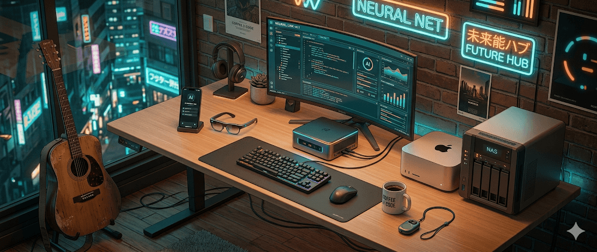
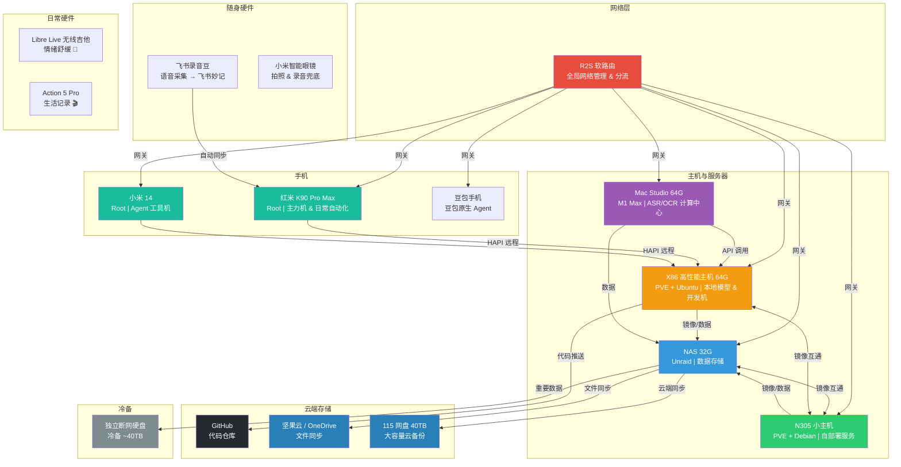
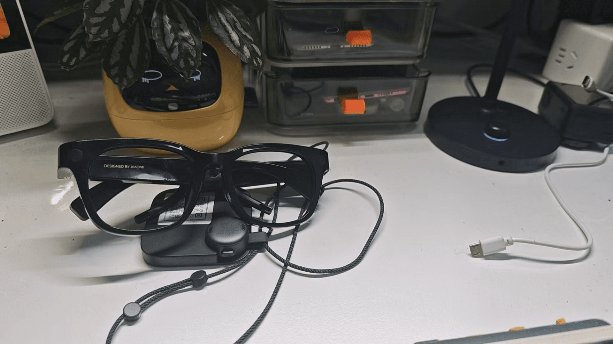
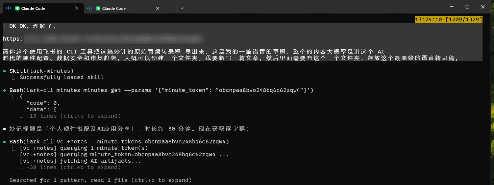
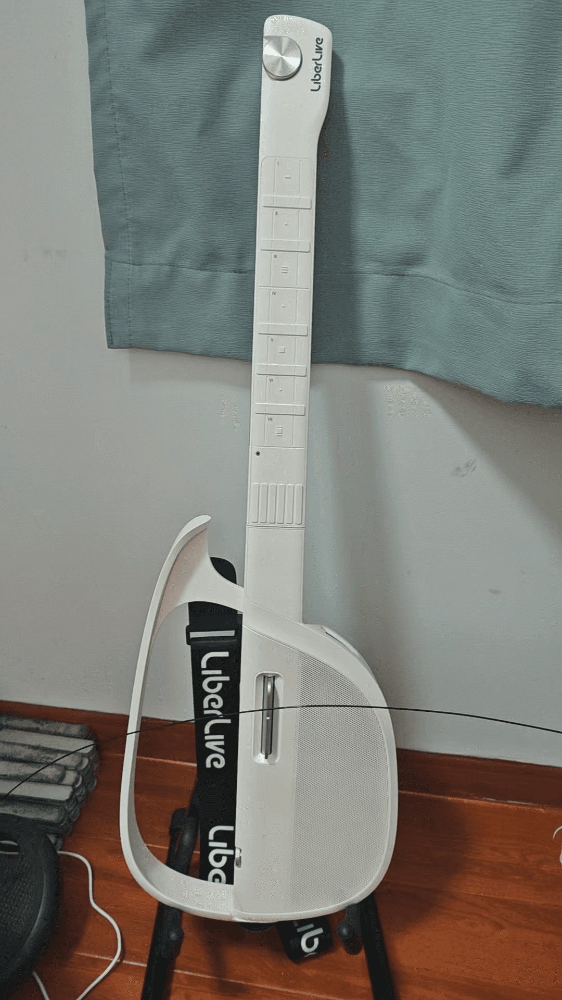
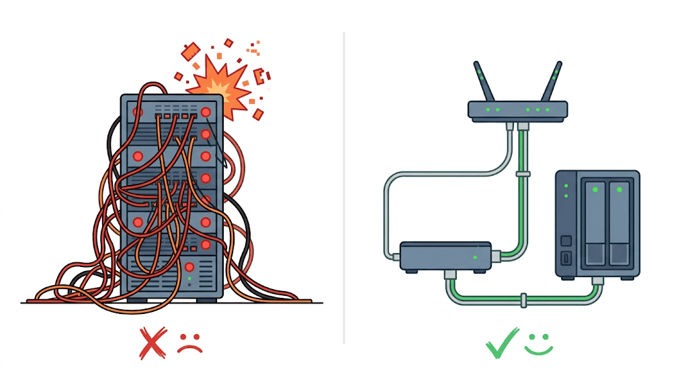
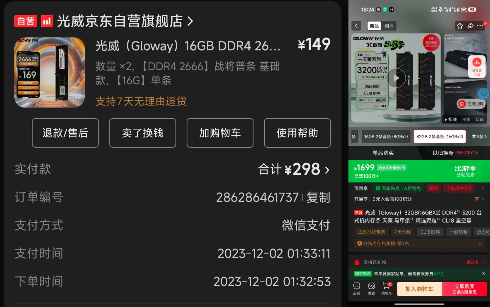
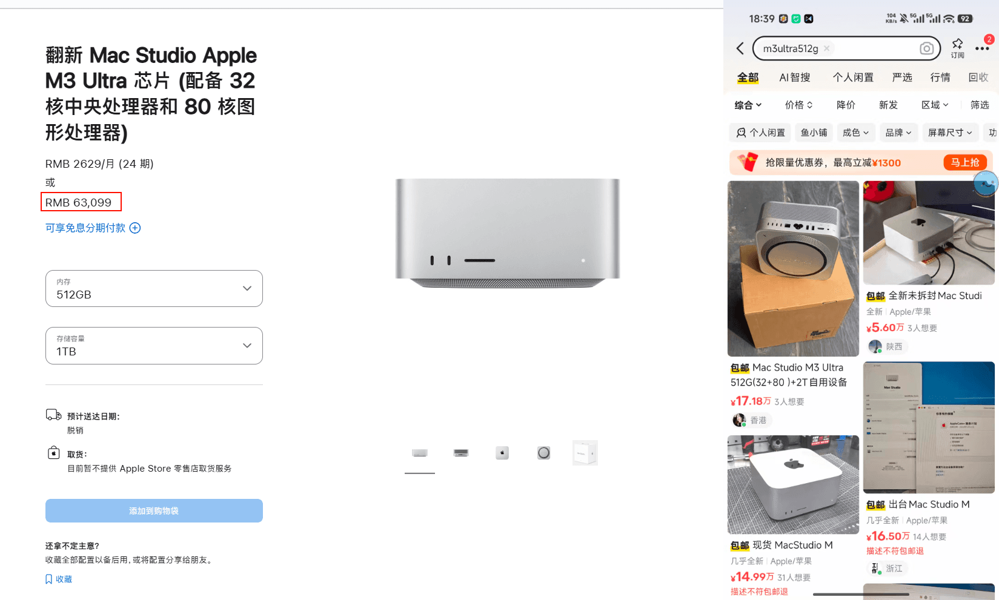

> 本文是「LLM 吞噬一切」系列的硬件篇。上一篇 [我用 AI 长出来的那些工具](https://mp.weixin.qq.com/s/w8VnWJcUp5VkD5J-fYCUrg) 聊的是软件层我怎么搭的，这一篇聊底下的硬件基座——怎么搭、为什么这样搭，以及硬件市场的趋势判断。
>
> 这篇文章会有点极客。其实我早就想写了，拖了快一个月，结果这一个月硬件的价格又涨了不少。

## 一、我的硬件全景

先上一张全局架构图，看看各设备之间的协作关系：

下面逐一展开。

### 1.1 主机与服务器

#### NAS（32G，Unraid）

在之前的文章里，我的 NAS 还承担了不少核心服务。但春节回来的一次 Unraid 异常关机，导致所有服务不可用，给了我很强的紧迫感——必须做好服务隔离和数据灾备。

现在 NAS 的定位已经很纯粹：**纯数据存储** + 一些不涉及核心业务数据的 Docker 服务（比如 Home Assistant 这种，挂了就挂了，大部分自动化都在米家上）。

> 关于 All-in-One 踩坑的教训，后面会专门展开讲。

#### N305 小主机（PVE + Debian 容器）

去年国补的时候买的，N305 CPU + 16G + 512G，本来买来随便玩玩，后来发现也没什么用处。刚好趁着硬件架构升级，把它集成到了最新的系统里。

底层装的是 PVE，里面虚拟了一个 Debian 12 的 Linux 容器，专门用来跑 Docker。所有之前在 Unraid 上的自动化工具，现在全部迁移到这里。

这里顺便说一下：我之前对 Linux 一直有点畏惧，因为纯命令行。但 AI 时代到来以后，反倒觉得命令行更方便了——比 Windows 上还方便。而且我的场景是跑 24 小时在线的服务，Linux 就很自然。

**Debian vs Ubuntu 怎么选？** 我让 AI 帮我做了调研，结论是：
- **长期稳定、专门跑容器**：用 Debian（更轻量、更稳定）
- **搞开发、涉及大语言模型**：用 Ubuntu（CUDA 生态更完善）

我的核心目的是保证服务长期稳定运行，所以选了 Debian。

之所以没在物理机上直接装发行版，而是先装 PVE 再装虚拟机，核心还是为了**数据安全**——方便备份。PVE 的虚拟机镜像可以整个打包备份，出了问题可以快速恢复。

#### Mac Studio（64G + 1T，M1 Max）

定位没变，还是局域网内的**计算中心**，ASR 服务和 OCR 服务都在上面跑。

关于 Mac 在 AI 时代的独特优势，后面「硬件市场趋势」章节会重点讲。

#### X86 高性能主机

这台机器的来历挺有意思——刷小红书的时候，发现一个视频工作室倒闭了，在出高性能剪辑主机。价格非常合适，果断入手。

**配置和价格：**

| 配件 | 规格 |
|------|------|
| CPU | I5-13600KF |
| 内存 | 64G DDR4 |
| 显卡 | RTX 3060 12G |
| 存储 | 512G SSD + 4T HDD |
| **二手价格** | **5,500 元** |
| 一手同配置 | 8,000-9,000+ 元 |

> 这个价差后面会提到，核心就是 AI 冲击了视频剪辑行业，工作室裁员，设备流向二手市场。某种意义上是个黑色幽默。

底层同样装的是 PVE，用途分成三块：

**① 本地模型（Ubuntu + 显卡直通）**

跑的是 Qwen3.5 4B 量化模型，用来做本地图片理解。之前这个活是调豆包的 API，但实测 4B 模型的效果完全可以满足日常需要，并发也能拉到 3~4。对于本地这种没有时效敏感性的场景，排队处理完全够用。

12G 显存实测也可以跑Qwen3.5 9B 的量化模型，质量也 OK，原生多模态非常适合在本地处理简单任务。

**② 开发机（16G 内存）**

除了 APP 端的代码需要在本地写以外，其他的网页端脚本全部放在开发机上。24 小时在线，基于 tmux 做隔离，同时开多个 Claude Code 进程对话。在外面通过 HAPI 远程连接，随时随地写代码，体验非常好。

配合 Skill 做好自动化，**基本上纯语音输入就可以完成从想法到编码、推送部署、debug 的全流程。**

里面还装了 OpenClaw，有时候会指挥它调用 Claude Code 和 Codex 帮我写代码。

**③ 公用 OpenClaw 实例**

单独划了一个虚拟机，养一个公用的 OpenClaw，不放任何隐私数据，相对安全。

同样，所有东西都按 GFS（Grandfather-Father-Son）模型进行数据备份。两边的 PVE 镜像可以互通，保证数据始终丢不了。

#### R2S 软路由

所有设备的网关都指向它，全局统一管理不同网站的分流。Claude Code、OpenAI 这些网站的访问完全无感，每台设备无需安装额外的软件。

> **这是整个架构里最不起眼但最重要的一环。** 网络是所有其他设备的最基础依赖，后面讲 All-in-One 踩坑的时候会再说。

### 1.2 手机端

#### 豆包手机

买来主要觉得它很有**纪念意义**——它展示了 Agent 在手机上的应用能力。尽管现在因为利益问题谈不拢，但我还是很欣赏这款产品。

不过说实话，如果你用它玩国内应用，基本上就是纯废物。淘宝、小红书动不动就被强制下线，因为风控太简单了——直接按手机类型统一处理。除了字节系应用比较通畅以外，其他应用用起来真的很麻烦，也没办法让豆包助手去操控非字节系的应用了。

但用它操纵海外应用还是比较顺畅的——YouTube 这些，因为豆包手机的影响力还到不了那个层级。但也不是没有问题，就是它本身没有过谷歌的这个认证，所以就会导致有些应用，比如说 Reddit 的原生客户端可能装不上。

#### 红米 K90 Pro Max（Root）

我的主力机。我自己的习惯就是：如果安卓手机不能 Root，我就不如买 iPhone 了。

上一台 Root 过的手机是小米 14，本来以为是最后一台 Root 过的小米手机了——小米已经明确禁止解锁 BL。结果 3 月 8 号小米漏洞大公开，可以直接通过漏洞解锁手机获取 Root 权限。我连忙买了一台新手机，把资料迁移过来。

我现在拿淘汰下来的小米 14 专门做这些敏感操作——上面不放任何个人敏感信息，纯粹当工具机用。

**AI 时代为什么值得买一台 Root 过的手机？四个理由：**

**① 门槛降为零**

以前玩机只能看网上教程，一步步跟着操作。现在我给红米 K90 获取 Root 权限的过程是：网上下载脚本 → 让 Claude Code 先做安全审查 → 一键执行。隐藏 Root 环境、安装插件，我只提需求，Claude Code 去查方案、执行验证。整个过程又安全又方便。

以前很多插件依靠开源作者维护，随着 Root 变成越来越小众的行为，很多东西已经停更了。但现在借助 Claude Code 可以定制任意插件，不需要自己懂太多底层的东西。

**② 逆向 APP 数据库**

我买了那个 Libre Live 无线吉他，它的乐谱太少了，在手机上创建乐谱又来回点来点去非常麻烦。我就让 Claude Code 利用 Root 权限去逆向底层 APP 的数据库——来回配合，确实跑通了。

之前写一个乐谱得十多分钟来回调试，现在直接跳过 UI 界面往底层数据库写创建好的曲谱，再搭一个 AI 生成乐谱，整个流程就通了。**这种体验在之前的人力时代完全不可能。**

**③ 手机端数据获取的性价比**

我之前文章提过：没有门槛的爬虫工具，带来的信息增量大概率是 0。AI 时代数据是核心壁垒，有数据的厂商会非常重视自己的数据源。

网页端逆向比手机端轻松一个数量级，所以大量人基于网页端开发逆向工具，导致网页端风控不断升级。比如小红书网页端登录有效期就 12~24 小时，经常要重新扫码，本质上就是网页端自动化太容易了。

换个思路，通过 Root 手机在 APP 端去逆向拿数据，性价比反而非常高。因为所谓的代码混淆，更多只是对人类进行混淆——**在 AI 看来，混淆过的代码和没混淆的代码没有本质区别**，AI 甚至可以直接读二进制。为人类设计的对抗手段，对 AI 来说很多是没有意义的。

不过这里需要泼一盆冷水：**上面说的主要针对非大厂的 APP。** 大厂对 Root 环境的检测其实相当全面，对抗也更激烈，普通人操作难度不小。这里更多是提供一种思路，不太推荐没有相关经验的人直接上手操作。

> 有一篇关于全自动逆向软件工具的文章值得分享，甚至连某著名国产支付巨头应用都可以挖出来很多漏洞，这在人力时代完全不可想象。
>
> https://innora.ai/zfb/

**④ 给 Agent 接入最底层的手机操控能力**

豆包手机的惨痛教训说明，大厂对 AI 操控自己 APP 这件事非常敏感。如果你有 Root 权限，相当于给你的 OpenClaw（小龙虾）接入了最底层的手机操控能力。虽然比如让小龙虾点外卖这种事情噱头大于实际意义，但它确实展示了一种可能性。

#### iPad mini

说实话现在用得越来越少了。出门基本上就是用 HAPI 连回去和 Claude Code 聊，手机上就能操作。手机唯一的问题就是屏幕太小。不过安卓手机不需要像 iOS 上面每次使用豆包输入法还得有一个恶心的跳转，所以体验还行。

本质上 iPad mini 的定位，未来可能会被折叠屏手机取代——折叠屏 + HAPI 远程写代码，屏幕大了，基本上就解决了最后的痛点。

### 1.3 随身智能硬件

#### 飞书录音豆（899 元）——出门必带

我现在脖子上会挂一个飞书录音豆，最近的几篇文章都是通过它来写的。我非常喜欢这个产品形态。

选它经过了几经权衡。Plaud 那种贴在手机背后的形态不适合我——一方面我不是 iPhone 用户没有磁吸需求，另一方面我不喜欢体积大的东西。最终核心看重的是：**文件自动无感同步到飞书妙记的能力。**

现在的工作流是这样的：

1. 散步或骑车的时候打开录音豆，记录琐碎想法
2. 录完后自动生成纪要和文字稿
3. 看一下纪要，帮我理清思路
4. 导出文字稿，丢到 Claude Code 里面
5. 继续聊文章架构：哪里需要进一步阐述、哪里需要删除、哪些对目标受众来讲不太理解

这个体验比语音输入法更好。一方面你不需要一直待在电脑面前，可以想到哪说到哪；另一方面，语音输入法单次的上下文理解有限，而飞书妙记会结合全局内容对音频转录做校对，有效性更高。

**特别是现在飞书全面 CLI 化**，可以直接通过命令行获取妙记、和 Claude Code 继续聊，整个过程都自动化掉。这种体验是之前的产品完全替代不了的。

硬件 899 元，送六个月会员（智能纪要额度和语音转写时长）。续费每月 69 元，不贵。但我真正看重的不是这些——因为我本地有完全的自动化能力处理音视频转文字、调用大模型总结。**我这个时代欠缺的能力恰恰是硬件能力**：做不到一个这么小的随身硬件，还能自动把录完的音同步到服务器上。这才是我最看重飞书录音豆的核心卖点。

小小的体积，戴在脖子上当项链，出门必带。

#### 小米智能眼镜（1,500+ 元，二手 800-900 元）

我现在身上的录音设备挺多的。小米智能眼镜也可以兜底录音，但它所有东西都必须走 APP 操作，没有相关 API，所以反倒没那么常用。更多时候就是临时拍拍照、听听歌，玩具属性大一点。

1,000 多的一手价格偏贵，但前不久看科技捡漏，有一批官方退货的二手产品，七天无理由只要八九百，这个价格倒是可以买来玩一玩。

**我其实一直在等豆包的智能眼镜。** 之前看范冰老师分享，他现在基于豆包耳机，借助豆包网页版的全平台能力，在电脑上写了个脚本去监测豆包从耳机同步过来的指令，实现自动化——对耳机发命令，电脑上的脚本就能监测到，然后执行后续的自动化工作流。

这基本上就是贾维斯式的体验：通过耳机或眼镜发指令，控制电脑执行后处理的自动化工作流。

但我现在的问题是**器官不够用**了——有录音豆、有眼镜，有 airpods、真没空间再单独带一个耳机。所以比较期待豆包的智能眼镜产品，那就完美了。

#### 碎碎念的痛点：目前无解

因为 AI 时代语音输入基本上是必须选项，工作时用大疆麦克风收音，配合豆包电脑版输入法，体验非常好。

但我有那种想随时记录碎碎念的需求。目前试过的方案都不够理想：

- **打开手机 IM 发给机器人**：步骤太多，不优雅
- **飞书录音豆**：不适合这种碎片化场景
- **智能手表**：我认为最好的形态，比手机还好。但调研了一圈——
  - iOS 框架最完善，流程基本跑通，但**续航太差**，不想天天充电
  - 小米手表明明有官方文档指出有录音能力，但**对自家的米系产品完全不开放**，发邮件说"在规划中"，然后了无音信。
  - 华为、OPPO 的产品和生态我本身不用，文档也没有 iOS 那么清晰
- **智能眼镜**：雷鸟似乎比较开放，但是我又想等豆包...

所以这个事暂时搁置了。如果有好方案，完全可以跟我的 Memo 系统打通，自动化地自然流转。

### 1.4 记录生活的硬件

#### Libre Live 无线吉他——今年最推荐硬件（也许是）

这是个智能吉他，傻瓜式的——你只需要跟着手机屏幕里乐谱的按键，哪个灯亮就按哪个，使用起来没什么门槛。

在 AI 时代，每天很大一部分时间都在跟 AI 聊天。AI 又耐心、懂得又多、还会提供情绪价值。除了缺一个物理的身体，其他东西真的是人类很难相比。但你聊久了又会觉得有点孤独——那种物理的身体、真实的拥抱触摸感还是不一样的。

**有情绪来的时候，如果身边没人，拿起吉他弹一段，是一个挺能舒缓情绪的方法。** 零门槛，我非常喜欢。我也会拿来买了送给朋友们。

当然它也不是没有问题。热门歌曲的乐谱没问题，但小众歌曲官方谱库里往往没有，其他用户上传的质量也参差不齐，你就得自己扒谱。扒谱本身就挺难的，还得一个个填到 APP 的 UI 里面，整个流程挺挫败的——这也是我前面提到要逆向它 APP 数据库、再搭 AI 生成乐谱的原因。

市面上也有一些竞品主打"导入网易云/QQ 音乐歌曲一键生成乐谱"的功能，思路确实不错。不过我了解了一下算法，AI 生成乐谱在弦位准确度上还是有局限的，具体效果自己斟酌。

我选 Libre Live 更多还是因为它是这个品类的开创者，**市场保有量足够大**。这类产品是软硬件协同的，你不能只看硬件本身——如果厂家倒闭了，这个硬件可能就变成废物了。所以市场保有量和厂商的存续能力也是选购时需要考虑的因素。其他品牌的话，自行斟酌。

#### Action 5 Pro——去年最推荐硬件

核心一句话：**心境不复来。**

它捕捉了我非常多难以再复现的心境。我每次出去看演唱会、聚会，都会带上 Action 5 Pro 拍下来。尽管这些东西短期内我不会第二次回看，也不会剪辑，但留下了就是留下了——至少给未来留了一个入口。

说实话，我甚至后悔买得太晚了。

去年我的生活出了比较大的变故，整个生活态度发生了很大的转折，后续的经历、外在形象都有非常大的改变。一年前的我和一年后的我可能判若两人。这个过程中有很多非常难熬的时刻，时间会抚平很多东西，但客观来说这是一件痛苦的事情。

可站在更高层次来讲，我并不排斥这种体验——某种程度上它会让我的整个人生体验更加完整。

我很感谢自己记录下来了某些难熬的时光。因为现在再去回想那段日子，很多时候只剩一些琐碎的片段了，再也回不到当初那种心境了。这些东西我只是丢到云盘里，不会往外面发，但这种体验记录下来是非常好的。

> **多去记录，多去分享。** 不论是语音、文字还是影像，这些都是 AI 时代非常核心的资产。虽然存储成本很高，但**相对于这些记录的价值，存储的成本就是零。**

---

## 二、数据安全：比代码更重要的事

我在[之前的文章](https://mp.weixin.qq.com/s/az3gUGA24mXs1ptYdayFjQ)里写过：**上下文是 AI 时代最重要的东西。** 要尽可能累积关于自己更丰富的上下文。

所以我现在选软件的思路就是看它有没有 API、有没有 CLI，方便跟 Agent 沟通或者导出数据做后续自动化处理。如果是一个特别封闭的软件，我已经不会再选择它了。

我本地维护了这么多自动化工具，**我能接受它短暂宕机不可用，但不能接受它数据丢失**——因为丢了就是真丢了。

### 3-2-1 备份原则

虽然说现在硬盘价格很高，但客观来看，**相对于数据的价值，硬盘的成本几乎可以看作是零。**

我的实践，整体数据流是这样的：**本地产生 → NAS 汇聚 → 云端同步 → 重要数据冷备**。

| 数据类型 | 本地（产生） | NAS（汇聚） | 云端（同步） | 冷备（重要数据） |
|---------|------------|------------|------------|----------------|
| PVE 虚拟机 | 每天自动打包镜像 | 镜像同步到 NAS | 115 网盘 | 独立断网硬盘 |
| 代码仓库 | 本地 Git | — | GitHub | — |
| 文件 | 本地 | NAS 存储 | 坚果云 / OneDrive | — |
| 视频 / 大文件 | 本地 | NAS 存储 | 115 网盘 | 大容量硬盘冷备 |

几个要点：

- **独立断网硬盘**：保证数据不会被污染。之前在公司中过一次勒索病毒，累积一年多的数据全没了，教训深刻。
- **两个 PVE 的镜像互通**：保证数据始终丢不了。
- **所有付费会员都续着**：GitHub、坚果云、OneDrive——务必重视数据。

### 推荐 115 网盘

115 网盘有个 8 年 40TB 的空间方案，800 元，折合年均 100 元，性价比非常高。

每年网上都有人说它要跑路，但我做了一些调研（[参考分析](https://sum.lexgogo.site/view/view_EN_wsTpJON90cKbKD4yZsAUoNYLw8AiU6D9-TGN1OLw)），觉得它的商业逻辑是说得通的：

- **付费优先模式**：年费 500 元的高门槛筛掉了白嫖用户，只留真实付费群体，现金流稳定，不依赖广告或数据变现
- **去重技术降低实际成本**：大多数用户实际使用量远低于 40TB，热门文件只存一份多用户共享，实际存储开销远低于标称容量
- **主动砍掉分享功能**：减少版权风险和带宽开销，虽然牺牲了传播性，但大幅降低了运营风险
- **重资产绑定**：总部迁到梅州，投了数亿建"世界客商中心"商业地产，这些实体资产相当于"压舱石"——跑路的代价比继续运营大得多
- **17 年持续运营**：经历了 2016 年"百盘大战"的行业洗牌，360 云盘、快盘等竞品纷纷关停，115 活到了今天

所以我对它的商业可持续性相对放心。

> **但不代表我为它做信用背书。** 所有这种云服务我都不做背书，只是提供一种可能性。最终决策权完全在你个人，不要往我身上赖。

我目前的存储规模大概是：NAS 约 20T + 冷备约 40T + 云端约 40T + GitHub + 坚果云 + OneDrive。

---

## 三、踩坑：从 All-in-One 到服务拆分

之前我的 Unraid 是 All-in-One 的模式：网络、计算、存储全放一台机器。前期确实省事——一台机器解决一切，All-in-One 跑了挺长一段时间。

但春节回来那次 Unraid 异常关机，所有服务都不可用了。这件事让我意识到：**必须做服务隔离。**

拆分之后的原则：

- **网络（软路由）必须独立出来** —— 网络是所有其他设备最最基础的依赖，它挂了一切都挂
- 计算和存储可以根据需求拆分或合并
- 每个 PVE 节点的虚拟机镜像可以互通备份

All-in-One 不是不行，风险各有、各取所需。但**长期来看不推荐**。至少把网络和其他设备拆开——这是底线。

---

## 四、硬件市场趋势：晚买不如早买

这一章是我想重点聊的，特别是对企业和中小团队的读者。

### 4.1 涨价的逻辑：AI 吃掉了所有产能

我当时看到那台 X86 主机 5,500 元觉得很实惠。但说实话放在一两年前，这个价格并不算便宜——只是因为现在内存、硬盘甚至 CPU 的价格都在涨，才显得格外实惠。

具体有多夸张？

- **32G 内存条**：之前两条加一起 300 块钱，现在直接 1,700 块，五倍涨
- **硬盘**：翻倍涨
- **物美价廉的国产模型套餐**：纷纷涨价限售

这轮价格上涨完全是由 AI 带来的。

AI 把所有半导体产能都抢走了——对内存有需求（HBM），对存储有需求，对 GPU、CPU 也有需求。很多厂商已经砍掉消费级内存生产线，全力供应 HBM，因为 AI 大厂舍得砸钱，利润又高。结果就是所有消费级产品价格上涨。

### 4.2 基本不可逆

网上有一种论调，觉得这可能就两三年的事，价格一定会回落——比如 AI 泡沫破裂。

**我的判断是：基本不可逆。**

逻辑链：
1. 你见到了 AI Agent 的能力，看到了企业对它的极致诉求
2. Token 的消耗量级会百倍增长
3. 当前物理世界的硬件基础完全满足不了 AI 这种蓬勃的增长需求
4. 物理世界增加内存、存储、算力卡的速度，完全赶不上实际的业务需求

本质上这是一个供需问题：半导体厂商加产线的速度，能不能赶上 Agent 对半导体的需求？如果产能有富余，消费级产品当然还是可以等到降价的那一天。但如果比特世界的需求是百倍、千倍地增长——我觉得物理世界的扩产速度是赶不上的。

有人可能会说：算法在进步啊，比如前几天 Google 发布了新的算法，可以大幅降低大语言模型运行过程中的 KV Cache 内存占用，消息一出甚至打崩了一些内存相关的股票。看起来好像需求会下降？

但这里面有一个经典的**杰文斯悖论（Jevons Paradox）**：**技术进步降低了单位成本，反而会刺激需求暴涨，最终总消耗量不降反升。** 蒸汽机效率提升没有减少煤炭消耗，反而让煤炭用量翻了几番。AI 领域同理——KV Cache 压缩意味着同样的硬件能跑更大的上下文、更多的并发，那企业一定会把省出来的空间塞满更多的 Agent 任务，而不是买更少的内存。

**所以我的判断是：短期内不要指望消费级硬件会降价。**

现在看起来价格可能很高，但明年可能更高。因为现在 Agent 还没有特别广泛的普及，随着 Agent 进一步普及，这种算力需求的恐怖增长是很难弥补的。

等到硬件真正降价的那一天？那大概率意味着大部分人已经没有本地高性能硬件的需求了——或者干脆失业了。又是一个黑色幽默。

### 4.3 二手市场的黑色幽默

一手市场产能被 AI 吸走了，但有意思的是——**二手市场反而有机会。**

AI 进入企业的速度越快，造成的失业越多，之前老的工作室机器就会出闲置。我那台 5,500 元的 X86 主机就是这么来的：AI 影像的进展冲击了视频剪辑工作室，导致裁员失业，电脑就流出来了。

我之前跟 Gemini 聊过这个话题，它给了一个很有洞察的分析：

> 二手供给爆发属于「**产业转型期的一次性资产释放**」，是阶段性的。一旦传统中小企业完成出清，二手市场的高质量供给就会迅速断档。
>
> 二手市场将呈现「**哑铃型**」分化：高端极其坚挺，低端价值缩水。
>
> —— [AI 冲击下硬件市场新格局｜Gemini 对话](https://gemini.google.com/share/48bdf8fcabb4)

我基本认可这个分化趋势，但有两点补充：

**高端方面**，16G+ 显存显卡、64G+ 内存主机价格坚挺，这个没问题——因为它能直接转换成一线生产力。而且不只是 AI 极客和独立开发者在扫货，**对中小团队来讲，这种二手高性能主机同样非常值得**。毕竟省下来的预算差价，又可以多买一些机器给 Agent 来工作了。

**低端方面**，"电子垃圾"倒也不至于。市场是阶梯式的：一手价格整体上涨，原来买 12G 显卡的人预算不够了就往下降到 8G，原来 8G 的再往下降——需求是逐级下沉的，所以低端二手说实话最近也在涨价。只是说你买来确实没有太多实际价值，跑不了什么像样的本地模型。

所以：**捡漏的机会遇到了就不要错过，但也别太乐观。**

### 4.4 Mac 在 AI 时代的性价比

之前会觉得 Mac 内存贵，但现在情况变了——**Mac 的性价比在 AI 时代非常高。**

核心原因是 Mac 的**统一内存架构（UMA）**。

打个比方：传统电脑的 CPU 和 GPU 各有自己的「仓库」，数据要在两个仓库之间来回搬运。而 Mac 的统一内存就是一个大仓库，谁都能直接拿——跑大模型时不用搬来搬去，效率高很多。

这不只是理论上的优势。推荐一篇技术文章深入了解背后的原理：

> [从 KV Cache 到 AI 记忆系统](https://blog.xieydd.top/from-kv-cache-to-ai-memory-system/) —— 这篇文章解释了为什么 AI 推理的瓶颈已经不是计算能力（FLOPS），而是**内存带宽和容量**。Mac 的 UMA 架构从物理层面消除了 CPU 内存和 GPU 显存的界限，在内存受限场景中优势巨大。

**统一内存在大语言模型时代就已经非常有优势了，但放到 Agent 时代来看，优势只会更大。**

价格趋势更是说明问题：

| 设备 | 之前价格 | 现在价格 |
|------|---------|---------|
| 美版 Mac Studio 64G M1 Max | 8,000 元 | 10,000 元 |
| 512G M3 Ultra Mac Studio | 6 万出头（含国补） | 苹果已下架，二手炒到 **15 万** |

跑大模型的话，推荐用 **[OMLX 框架](https://github.com/jundot/omlx)**——比较新，底层对 Apple Silicon 的支持做得比较到位，性能调度效率更高。而且随着更多人意识到 Mac 在 Agent 时代的优势，为它生态做适配的人会越来越多，体验只会越来越好。

> 当然不构成投资建议，只是说如果你有需求，可以优先考虑 Mac。

### 4.5 企业本地大模型是刚需

对个人来讲，除非你有安全或金融方面的诉求，折腾本地模型意义不大。哪怕我本地部署了 Qwen3.5，也只是用来做图片理解——Coding 和深度思考我肯定不会交给本地模型。**顶级模型带来的思考深度，体验过就回不去了。**

但对企业来讲，**本地大语言模型是刚需。**

逻辑很简单：你不用 AI，就没办法借助 AI 的杠杆提高效率。但你用 AI，又不希望企业的数据、流程化经验被拿来训练，变成一两年后所有人都公开知道的技能——相当于你燃烧了自己，帮 AI 变强，你的技能不再稀缺。

所以核心数据不能出网，本地大语言模型就是自然的选择。

**我的策略是：[顶级模型定思路，本地模型降成本执行](https://mp.weixin.qq.com/s/Set_2-M-QP2xSAhyl1MonQ)。**

- 用 Opus 4.6 这样的顶级模型跑来优化流程、定方向
- 但保证所有内部运行的 Skill Agent 调用都基于本地模型
- 核心数据不对顶级模型开放

但坦白说，这里面有一个**囚徒困境**，我也没完全想明白。

这个矛盾的结构是这样的：你不用顶级模型，就很难发挥最好的效果，效率上直接落后于竞争对手；但你用了顶级模型，数据就可能被拿去训练，你辛苦积累的经验和流程就不再是护城河了。而你的竞争对手也面临一模一样的困境。

本质上这就是我在[「闲言几则」](https://mp.weixin.qq.com/s/Rjxlr-O2kbH2vtHOWJ2G9A)里提过的**暗知识悖论**的企业版——不用 AI 就失去杠杆，用了 AI 就自我蒸馏掉了。

而且这个差距是**结构性的、永久的**。本地模型再怎么进步，受限于硬件参数量的物理约束，你撑死部署几百 B 的模型，也不一定比得上云端多卡集群跑的顶级模型。更关键的是，本地模型在进步的同时，云端模型也在进步，而且资源不对等，进步得更快。所以不要指望"等本地模型够好了再说"——那一天不会来。

**这个矛盾没有完美的解法。** 我能想到的思路是按**数据敏感度分层**：

- **核心机密**（客户数据、财务、核心竞争壁垒型 know-how）→ 只走本地模型，效果差一点就差一点，安全是底线
- **流程性知识**（代码规范、通用工程实践）→ 可以用顶级模型，因为这些东西本身不是你的护城河，迟早被行业拉平
- **公开信息加工**（市场调研、文档撰写）→ 随便用

**核心不是"用不用顶级模型"，而是"哪些数据绝对不能出网"。想清楚这条线，剩下的都是工程问题。**

另外还有一点容易被忽略：**Skill 本身就是核心资产。** 你把企业的工作流编排成 Skill，这个 Skill 的 prompt 里就已经包含了大量流程化经验——即使数据不出网，如果 Skill 的定义文件管理不善，一样会泄露。所以 Skill 的权限管控，某种程度上比数据本身还重要。

说到底，真正的护城河可能已经不在"知识"了，而在**执行速度和迭代密度**上——反正知识迟早被拉平，但谁先用 Agent 跑通、谁先把流程工程化落地，谁就在窗口期内吃到红利。

> 企业级硬件当前的价格，我判断翻个倍在未来两年内还是可能出现的。**如果有这块需求，晚买不如早买。**

### 4.6 不再买高性能笔记本

按当前 Coding Agent 的发展速度，我大概率不会再买高性能笔记本了。所有预算会迁移到**高性能主机**——无论是 Mac 还是 X86。

某种程度上极端的情况下，IDE 都是可以省掉的。出门的话，可能就带一个折叠屏手机 + 语音输入法 + 网络，整个工作环境就已经完全满足了。

笔记本出门唯一的需求就是更大的屏幕看得更舒服，但这是从编程角度来说。设计开发另说，那涉及图片编辑确实没办法。

**至少从编程领域看，后续我只会买 MacBook Air 这种便携续航型的产品**——这种定位才更符合 AI 时代编程的需求。

---

## 五、展望：AI 硬件的下一步在哪？

前面聊的都是"现在怎么搭"，最后聊聊"接下来会往哪走"。

AI 在比特世界无往不利，但到了物理世界，瓶颈就明显了——Agent 能帮你写代码、做决策、处理信息，但它依赖的输入输出终究要经过物理世界的硬件。现在大家集思广益在解决的，本质上就是一个问题：**怎么让 Agent 的工作环境更好？**

我观察到几个方向：

### 降低输入门槛

目前和 Agent 交互最自然的方式还是语音。语音输入法、飞书录音豆、豆包耳机，这些产品本质上都在解决同一个问题。

极端一点想，网上不是有个梗图嘛——键盘上就三个键：一个语音输入，一个删除，一个你再想想，其实差不多就是这个趋势。以前编程的瓶颈是细节调试，但现在瓶颈是你能不能把需求和测试说清楚。硬件层面围绕这个方向的创新，我觉得还会继续爆发。

### Agent 的"眼睛"：硬件级全局理解

现在的 Agent 虽然可以操控电脑，但它缺乏对物理屏幕的全局理解——它知道自己执行了什么命令，但不知道屏幕上实际发生了什么。

我看到有人在做相关项目，思路是给 Agent 搭一个虚拟屏幕，让它直接读屏幕上的信息流。相当于 Agent 有了自己的"眼睛"，可以看到当前做了什么、界面状态是什么，再结合它自身的多模态能力做出反应。这个方向一旦成熟，Agent 的自主性会上一个大台阶。

### 随身 Agent 交互设备

前面提到的豆包耳机 → 电脑脚本监测 → 自动化工作流，其实就是这个方向的雏形。核心诉求是：**随时随地跟自己的 Agent 对话，让它帮你执行后处理任务。** 不需要掏出手机，不需要坐在电脑前，耳机或眼镜说一句就行。

我之前期待豆包智能眼镜能实现这个体验，但说实话，仔细想想它也做不到——因为它本质上是单向的，只能从眼镜往外发指令，没办法做回传。你没办法让 Agent 把结果推回到眼镜上来跟你确认或展示。

### 硬件开发的门槛也在降低

比如小智 AI + 华强北开发板，直接搭模型框架做 AI 助手，几十块钱的成本，门槛已经很低了。以前我主要玩软件，但现在有了 AI，什么东西都想玩、什么都想试。**所有的瓶颈都是我自己的问题。**

但这里面也很尴尬：**大厂有能力做好硬件（续航、性能、工艺），但不够开放；个人开发者和小团队有想法、有需求，但做出来的硬件产品在续航和性能上又没办法跟大厂比。** 这个矛盾目前无解。

只能说期待有创业团队在这个方向上既有硬件能力、又愿意做开放生态。趋势很明确：**AI 正在从比特世界向物理世界渗透，硬件是下一个战场。** 谁先把这个闭环跑通，谁就能吃到一波红利。

---

## 写在最后

如果你看完这篇文章想知道自己该买什么硬件——**我的建议是把这篇文章丢给 AI，描述好你的需求，让 AI 帮你判断。** 但不要让 AI 给你判断价格，因为 AI 没有实时的市场价格数据，价格请自己查。

或者用千问似乎也行，毕竟打通了淘宝。

---

> **免责声明**
>
> 本文所有内容仅代表个人观点和使用体验，不构成任何投资建议或购买推荐。硬件价格波动受多种因素影响，请以实际市场行情为准，自行判断。
>
> 文中提到的产品、品牌和服务均为个人真实使用分享，没有任何商业合作或利益关系。
>
> 无意与任何人进行辩论。每个人的需求、预算、技术背景都不一样，适合我的不一定适合你。你觉得怎么样就怎么样。

---

> 本文由飞书录音豆语音转文字构思底稿，通过 Claude Code + Opus 4.6 对话完成文章架构设计与内容整理，配图由 Nano Banana AI 生成。
