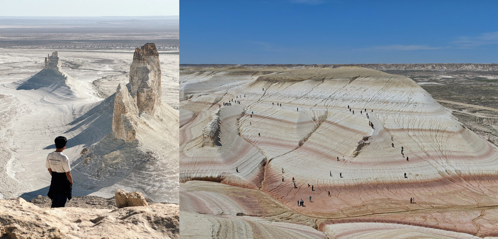

*Translated from the [Chinese original](/posts/260505-kazakhstan-trip/). Last synced 2026-09-26.*

---

## 1. How It Started

A couple who are friends of ours were planning a trip to Kazakhstan and asked about my plans for the May Day holiday (China's big early-May break). I had nothing on my calendar, so I happily agreed, and pulled in my old college roommate as well. The whole trip ran from April 25 to May 4; I took four days of annual leave for roughly eight or nine days away.

Honestly, when I travel these days I mostly care about natural scenery — the cultural stuff genuinely doesn't interest me that much, and I can't really read it anyway. The other priority is avoiding peak-season crowds. Kazakhstan's terrain isn't that different from Xinjiang's, but at least there are fewer people, and cost-wise it isn't expensive.

In any case, someone else was booking flights and hotels and drawing up the itinerary; all I had to do was pay and tag along. I joined the group within seconds of it forming.

But there were still plenty of everyday things to sort out — transport, exchange rates, cash — and those were handed to me.

---

## 2. Using AI to Plan a Trip Off the Beaten Path

Most of the pre-trip planning was done with heavy help from AI. Concretely it was pretty simple: I gathered Deep Research reports from several different platforms, had Claude Code talk through with me which findings were common across them and which conflicted, then wrote everything into a Feishu doc (Feishu is the China version of Lark, ByteDance's workplace collaboration suite) via the Feishu CLI and shared it with my travel companions.

I used four channels for Deep Research: **Doubao** (ByteDance's AI assistant), **Diandian** (from Xiaohongshu, China's Instagram-like platform), **Qwen** (Alibaba's), and **Gemini**.

Judging by the final result, my take is that two of these sources would actually have been enough:

- **Diandian** (backed by Xiaohongshu): highly current, and very China-aware. It had already stepped on some of the pitfalls ahead of us — the poor airport exchange rates, the advice to change money at banks instead, the fact that Google Maps is less useful than 2GIS on the ground. That's its unique advantage.
- **Gemini** (backed by Google): more international and better-organized sources. Things like regulations on carrying medications — you won't find those in the other channels at all. A global vision does help with packing and prep.

Of course, many of the cautions listed never actually came up during the trip; having them is more about being prepared and knowing roughly what to expect. Since the document was already generated anyway, I might as well share it with friends who need it.

> 📎 **The complete pre-departure prep document**: [Feishu Wiki link](https://zlx-1688.feishu.cn/wiki/XBEbw7z08iFWdwksozNcKFxJnMe) (includes checklist, connectivity plan, currency-exchange strategy, payment methods, transport, an Aktau special, and more)

---

## 3. The Pitfall List

We went to Almaty and Aktau. These two places can't represent all of Kazakhstan, so I can only offer my own impressions: it very much feels like somewhere that stopped in the Soviet era last century. The natural scenery is fairly untouched and commercial development isn't as built out — you get to see more pristine things, but the supporting experience is also less convenient. Toilets are an eternal topic here; they will come up again and again below.

Here are the pitfalls we actually hit on the ground.

### 3.1 SIM Cards: The IMEI Binding Trap

Despite a fair amount of research beforehand, we still ran into problems in practice.

Our plan was to buy two roaming cards in China plus two local cards on the ground, with backups for each other — and that redundancy really did prove necessary. Here's how it played out in the field:

| | Roaming card (from Taobao, China's Amazon-like marketplace) | Local SIM card |
|---|---|---|
| Price | 80 RMB for 20 GB / 10 days | 80 RMB / unlimited data, throttled past the cap |
| Signal in town | Passable | Good |
| Suburbs / countryside | Often no signal; even with signal, text only, images struggled to load | Noticeably stronger, images loaded smoothly |
| Wilderness (Aktau) | Slightly stronger | Much the same |

Overall I'd recommend the local card. On both Android and iOS, the local card's rural speeds loaded images without trouble.

But the local card has one trap: **it is tied to your passport + your phone's IMEI**. Switch devices or hand the SIM to someone else, and in theory you may need to re-register or unbind it — a huge hassle in practice. If you want to lend someone your data temporarily, the least painful way is still a personal hotspot.

### 3.2 Payments: Alipay > WeChat Pay > Credit Cards > Cash

We didn't spend that much overall, so exchange-rate advantages barely factored in; this ranking is mostly about convenience.

**Alipay (China's dominant mobile-payment app) has the widest coverage** — you scan the QR code and pay directly through Kaspi (Kazakhstan's dominant super-app), and the experience is seamless. Some places in the cities take WeChat Pay, but its acceptance doesn't match Alipay's.

Credit cards were a minefield. From personal experience: **my China Construction Bank VISA dual-currency card was completely useless in Kazakhstan.** Linking it to Yandex Go failed, and in-person payments failed too — even though I had switched on every overseas-transaction toggle before departure and pre-notified the bank's customer service. Still no. Reason unknown.

The Hong Kong credit card, by contrast, worked relatively smoothly.

The funny part: when leaving the country I filed a travel notice only with CCB, and not with the HK card — which had me on edge the whole time. Luckily I managed to link the HK card to Yandex Go at the Chinese airport right before departure, so it was a scare without a disaster.

Later, paying the FlyArystan (the Kazakh low-cost airline) excess-baggage fee, the same problem reappeared — the CCB card wouldn't go through, the HK card was short on balance, and I only resolved it by logging into another account on the spot and transferring money over. Across the whole trip, the CCB card never succeeded once. A lesson written in blood and tears.

**Cash**: carry large denominations, but also small bills down to 100 tenge (tenge is Kazakhstan's currency; 100 tenge ≈ US$0.2). Lots of toilet stops charge in units of 100 tenge and don't take online payment. And in wilderness, villages, or places with unstable signal, online payment may not work at all — cash is the last line of defense.

**Withdrawing cash**: prefer a UnionPay (China's domestic card network) debit card, and avoid cash advances on a VISA credit card (exchange-rate losses plus an extra layer of fees). ATMs bearing the UnionPay mark and connected to the UnionPay network can usually dispense tenge directly.

### 3.3 Transport: Seven or Eight Hours a Day Racing Across the Wilds

Local transport is underdeveloped, and many places are reached by dirt roads. Whether it's a small three-to-four-person group chartering a car or a big-group bus, chances are you'll be spending your days out in open country — sometimes seven or eight hours a day on the vehicle round trip. A few problems to solve for that:

1. **Anti-diarrheal medication** — to guard against stomach trouble (imagine needing a toilet out in the wilderness)
2. **A pillow and an eye mask** — for catching up on sleep on the bus
3. **Seat cushions** — to ease the torment on your rear and lower back; bring extra if you can

For taxis we used only **Yandex Go**; the experience was decent.

### 3.4 Climate: UV + Temperature Swings + Wind

Temperature swings are large and the UV is extreme. Prepare both sunscreen and physical sun protection, but pack more of the physical kind — hats, sun-protective clothing.

⚠️ **Do not bring sun hats that aren't secured** (the kind with no chin strap). They're fine in the city, but the wind at mountain passes and in canyons is ferocious, and off they go. Consider that a lesson learned.

**Sunglasses are a must.** The glare exceeds what you'd expect, and your eyes need time to adapt to the constant switching between glare and shade.

### 3.5 Phones: Overseas Verification Codes + Gemma 4 for Offline Translation

Before departure, confirm your mobile number has **international roaming enabled** (China's three major carriers don't always enable it by default; you have to apply through their app or customer service ahead of time). Once enabled, receiving SMS is free — but if it isn't enabled, you won't receive verification codes from China while abroad. Many apps force you offline when they detect a foreign IP plus a long time without login, and logging back in leaves the verification code as the only path.

Special recommendation: **Google's open-source Gemma 4 large model** (the E2B / E4B variants), which runs locally on your phone:

- Quantized, it runs quickly on both iPhones and flagship Android phones
- Multimodal: text, images, and audio all work
- With no network, it handles content Q&A, image translation, and voice translation without a problem. **Perfect for signal-dead no-man's-lands.**
- Basically an offline, slightly dimmer Doubao — great both for killing boredom and for emergencies

To get it: search **"Edge Gallery"** on Google Play or the App Store; note that you need to download both the app and the model inside it (E2B recommended — small and fast).

### 3.6 Food: A Survival Guide for a Chinese Stomach

The most awkward fact of the whole trip: the best food we ate was always at Chinese restaurants. Pure local cuisine is meat or rice-and-flour staples, period — a Chinese stomach can't take days of it in a row. We had two Northeastern Chinese meals in Almaty, and that warmth of spotting a "Harbin" sign in a foreign land — if you know, you know.

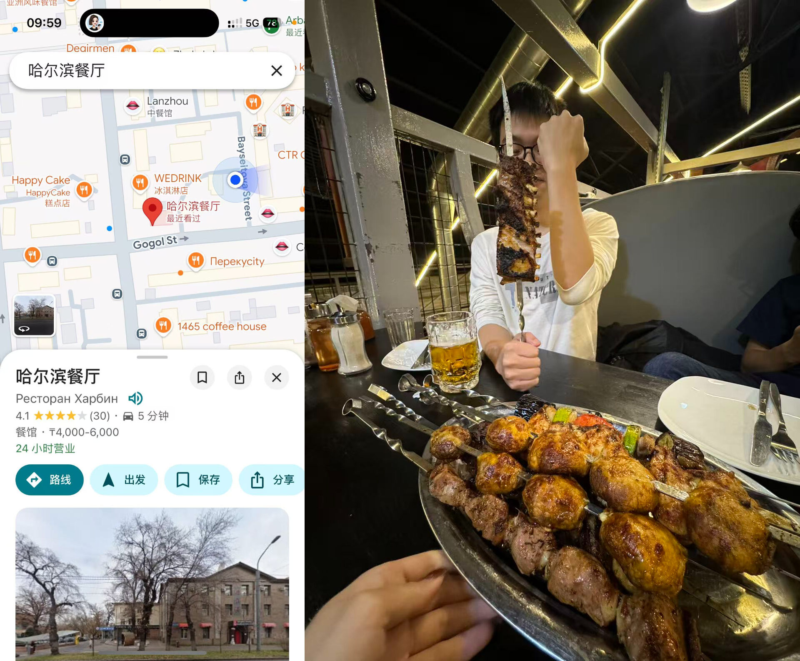

A fun discovery: at one Chinese restaurant in Aktau, the menu doesn't translate Chinese into Russian — it **transliterates the Chinese dish names into approximate Russian pronunciation**. Google Translate is completely lost — you need a model with actual intelligence, like Gemini, to work out what each dish is.

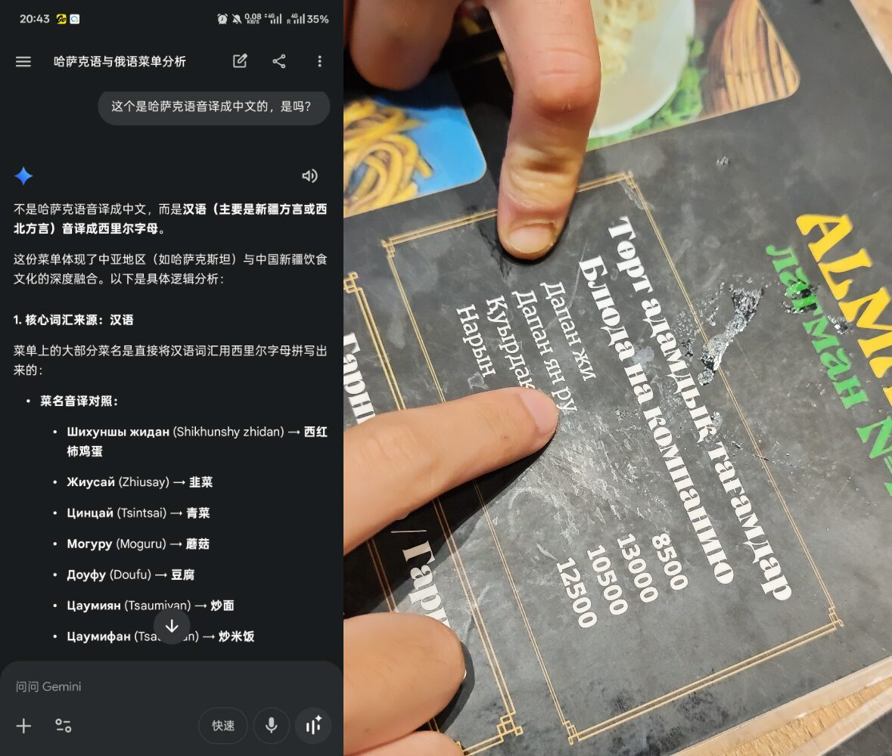

Buying water was another repeated pitfall. Sparkling water seems to be the mainstream there, in bottles that look exactly like still water. I bought wrong the first time, switched brands and bought wrong again — same brand, different packaging, different contents. It took two or three mistakes to figure out the pattern; in the end, taking a photo and asking AI was the reliable move.

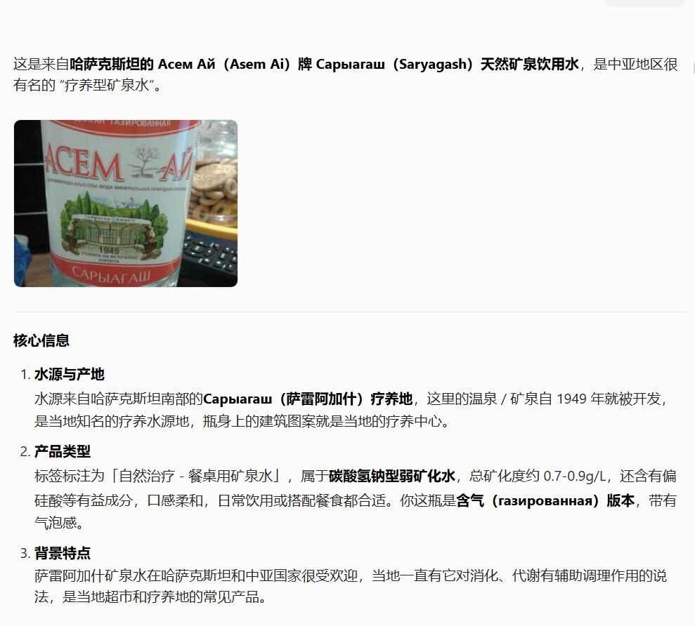

### 3.7 Packing: A Few Small Tips for Long Trips

- **Decathlon's swim/sports towel** beats disposable bath towels by a mile. Disposables eat up suitcase space; a sports towel absorbs well and dries fast — ideal for long trips with frequent accommodation changes.
  
- **Bring playing cards from China.** Plenty of local supermarkets don't stock ordinary playing cards; only specialty card shops sell them.

---

## 4. Almaty Day 1: A Soviet-Era Sunset Rollercoaster

We reached Almaty at noon. Check-in was done by the afternoon, and in the evening we went to the amusement park on the hilltop.

The park's whole style gave me a sense of time travel — loudspeakers strapped to utility poles, rust-streaked steel frames, simple and unpretentious joy. Most of the rides are shrunken versions of what you'd find at Chinese amusement parks — the kind of things you might have ridden a dozen years ago. To extend that thought, the entire city gave me the same feeling: paused in the Soviet era, history and modernity blended together.

But the sunset rollercoaster is worth a ride. We especially timed it right at sundown — sliding down along the mountainside, watching the sun drop behind the distant ridgeline, it does something different to your state of mind.

I've been really into Chen Jingfei (a Chinese singer-songwriter) lately, so naturally **"Sunset Elsewhere"** came to mind:

> People coming and going, a rose-colored scent of flowers; quietly, you became the past.

The melody looped unbidden in my head that whole evening. Time really does move fast — and each of us has ended up watching the sunset somewhere else.

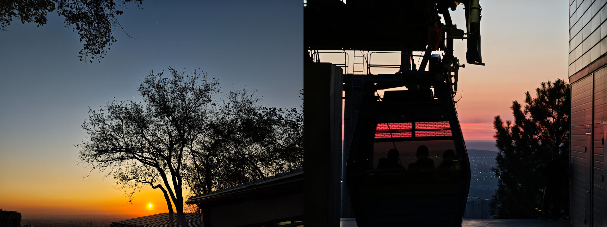

Dinner was local barbecue. Nothing else to say: lots of meat, huge portions — the skewers ran the length of a forearm; China has similar things. But calling it delicious would be a stretch: once it cooled it turned greasy, and the only thing that cut the grease was raw onion. Taste-wise it's no match for the Chinese barbecue joints whose marinated meat has real character; other than being economical, there's not much else to express. Order skewers one at a time rather than many at once — otherwise the last few are a pure battle against the grease.

That night we went to a supermarket to buy water — and stepped on the sparkling-water trap described above.

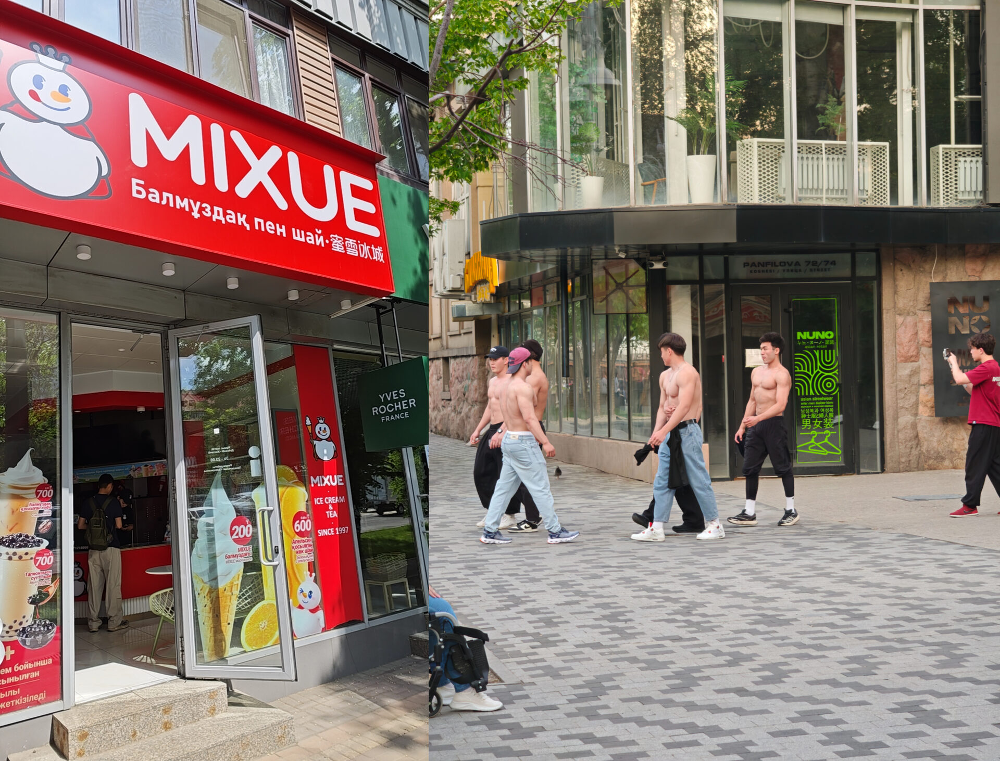

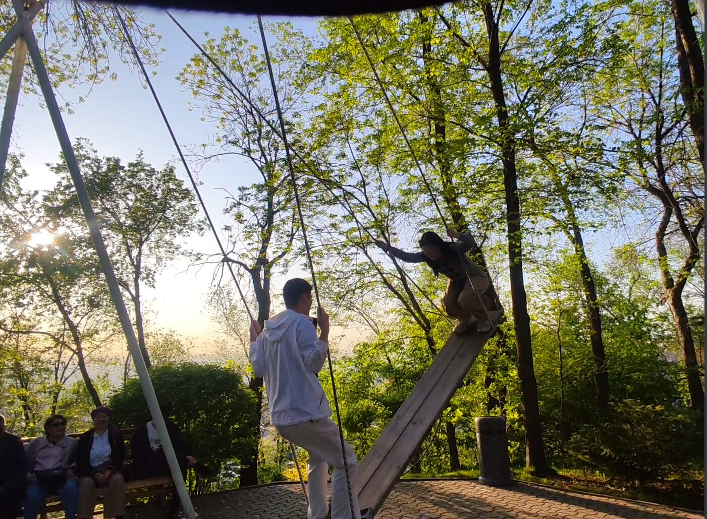

---

## 5. Almaty Day 2: Snow Mountains, a Drone, and a Bowl of Lanzhou Noodles

### Cable Car Down for Maintenance

The plan was to take the cable car up the snow mountain. Of course it happened to be under maintenance — it wouldn't reopen until May 1, and we'd arrived a few days early. The public bus runs only once, at 9 in the morning; by the time we got there it was gone, so we had to take a taxi to the mid-slope.

There's also an environmental rule: fuel vehicles can't go to the summit; it must be an EV, 5,000 tenge (≈ US$9) per car. You can't hail a car on Yandex Go here — I got up the mountain only by flagging down a car with a "green car" decal on its body. Once up there, though, we found the mountain was running on diesel generators — some kind of environmentalism that was.

### The Drone Blown into the Canyon by the Wind

Then came the funniest incident of the whole trip.

I'd brought a DJI Flip drone and wanted to take off from the mid-slope for a panorama, altitude maybe 100 meters. Everything was perfectly normal — until a sustained crosswind blew the aircraft straight into the canyon. It was never found. No footage to show for it, plus a 128GB memory card gone with it.

Only after studying up did I learn: although the Flip is rated for level-5 wind, it's a lightweight model, and with its full-coverage propeller guards, its flight margin simply isn't sufficient in the sustained crosswinds and turbulence of a mountain-pass canyon — it gets shoved aside easily. A fall into the pit, a gain in your wit.

**Follow-up decision: I passed on DJI Care's half-price replacement.**

After thinking it over, two reasons made me hold off on replacing it for now. First, the drone-flying environment in China has become truly hostile — UOM (China's official drone flight-approval platform) routinely says no, and checks on carrying drones aboard trains and planes keep tightening; the overall flying experience is awful, and nine out of ten places you'd want to fly are no-fly. I need to watch how the policy develops for a while. Second, the Flip's wind resistance genuinely isn't enough for outdoor hiking scenarios; if this need comes up again, I'll go straight for the newly released Lito X1, which handles wind better. Besides, a used Flip body alone goes for only seven or eight hundred RMB — no point paying half-price-replacement money to keep alive something that can't fly.

I had crashed a drone once before — that time it was repaired — so I had some experience with this. When it happened this time I didn't panic much, and it didn't really spoil the mood. Once it was gone I didn't agonize over it; it's just that the rest of the trip lost one camera angle, and those sweeping aerial views of the terrain went unshot. A real pity, that.

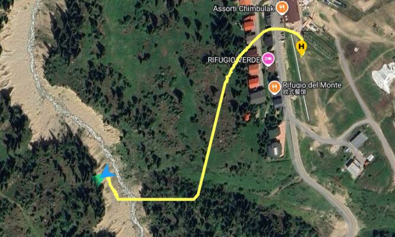

### Horse Meat, Lanzhou Noodles, Craft Beer

Up on the mountain we also had snacks at a horse-meat place. The texture was odd, a flavor I can't quite put a name to — anyway, my palate never quite took to it. My friends did discover a Lanzhou noodle shop, though — wander half a lifetime, come home still with a Chinese stomach.

In the evening we went to a local bar for craft beer. According to my friends, local craft beer is extremely cheap: a large pour is just 30 RMB (≈ US$4), when the same volume back home runs 50. Surprisingly, the bar's vibe was very everyday — you could even see moms and dads bringing their three-to-five-year-old kids along, none of the standoffishness of Chinese bars.

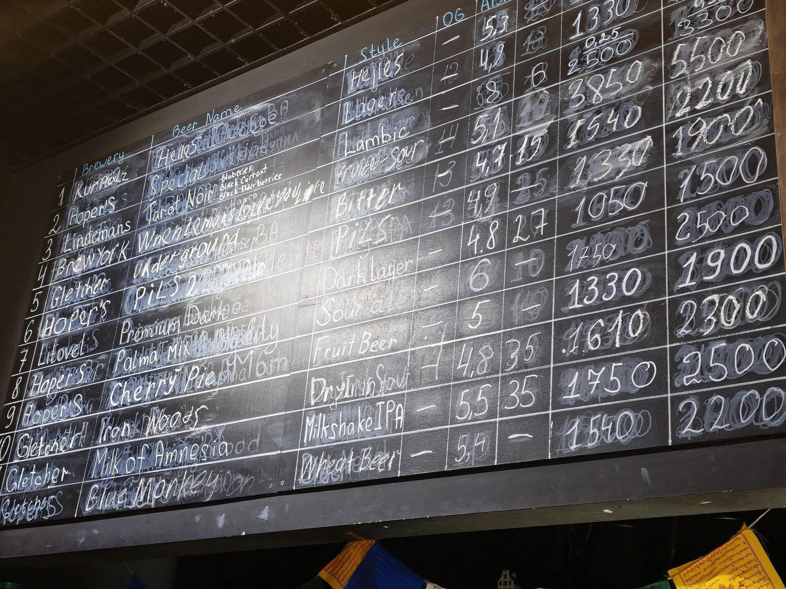

---

## 6. Almaty Day 3: The Pipeline Hike, a Study in Failure

My friends and I hike quite a lot normally, so for day three we picked the Almaty Aqueduct trail. A spur-of-the-moment decision — no hiking boots, no trekking poles, we went with nothing prepared.

The route opens with a sustained climb along a giant pipeline, and it is exhausting. The weather didn't cooperate either — heavy fog, heavy humidity; the whole hike was shrouded in thick mist with visibility very low. At the top, the lake was entirely frozen over, and there were no distant views to speak of.

I had GPT generate an "expected view" image to compare against reality, and the gap was striking — what AI paints for you is a fog-free blue lake; what reality hands you is a grey smear where you can't see a thing.

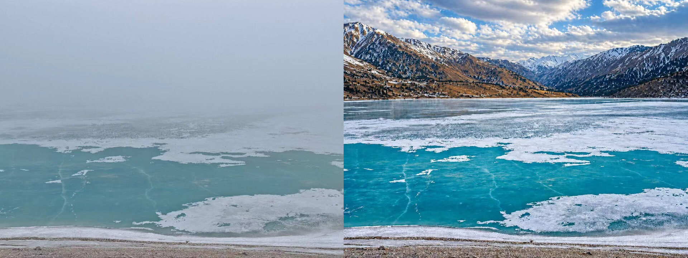

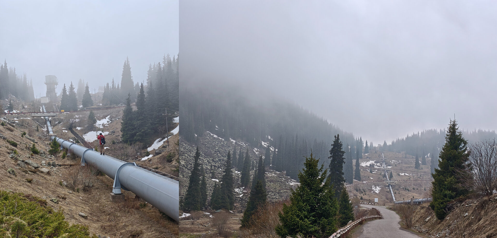

This trail is best described as an experience. On pure scenery, plenty of trails in China look better. The pipeline itself counts as a unique feature; the natural scenery, not so much. If you're planning to go, **picking your weather** matters more than anything. Second is flattening your mindset and adjusting expectations. If it feels too tiring, renting a car for the opening stretch straight to the summit is also a fine option — no need to force yourself; fatigue that money can solve is sometimes not worth gutting through.

---

## 7. Almaty Day 4: The Museum, Then Off to the Countryside

In the morning we visited the local art museum — an exhibition of works by the country's own artists: oil paintings, sculpture, video materials. Some pieces were quite interesting, and you could roughly feel some emotion in them, but without the local cultural and historical background there really is no going deeper.

This is where **Doubao** has to be mentioned — in most cases you snap a photo and ask it, or start a video call and let it look at the exhibit and narrate, and it answers quite convincingly: a culture consultant available anytime, anywhere. Of course, I don't have strong feelings for cultural matters myself, so I just treated it as broadening my horizons.

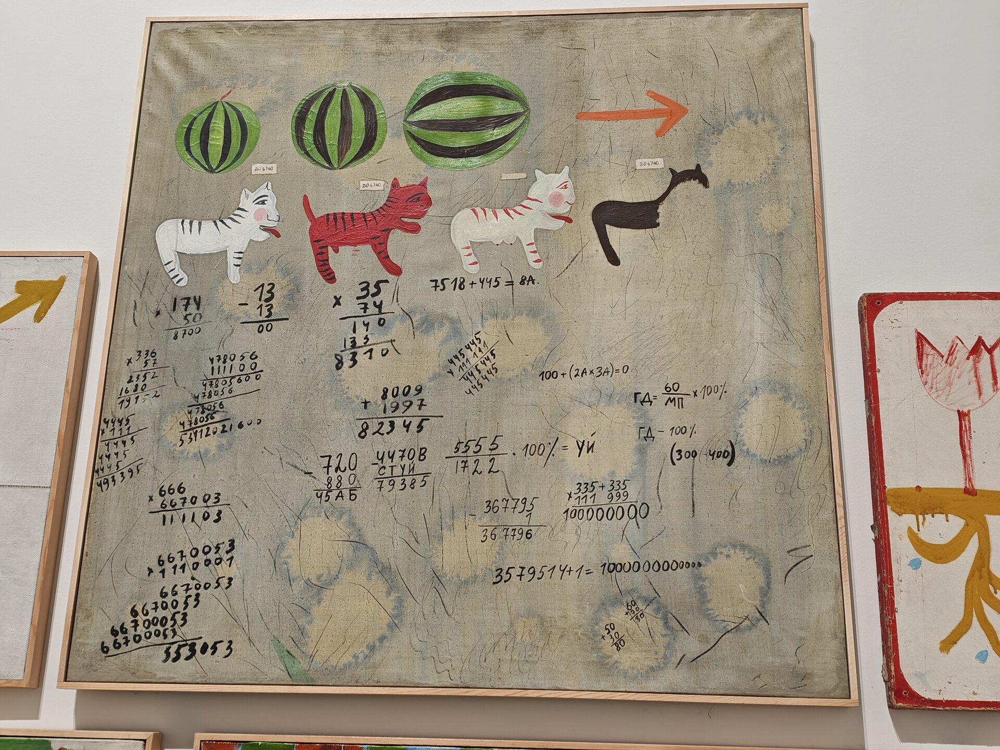

In the evening we joined a tour and headed out to a village rendezvous point in the Almaty countryside. The moment I stepped off the bus I felt I'd arrived at my grandmother's village — the familiar smell of livestock manure, the remote hamlet, the startlingly clear starry sky. Don't expect the amenities to be comprehensive; it was relatively clean, only the curtains blocked no light at all, and morning sunlight would wake you straight up. Since we were leaving early the next day anyway, it doubled as a natural alarm clock.

Signal was terrible; we went straight to bed.

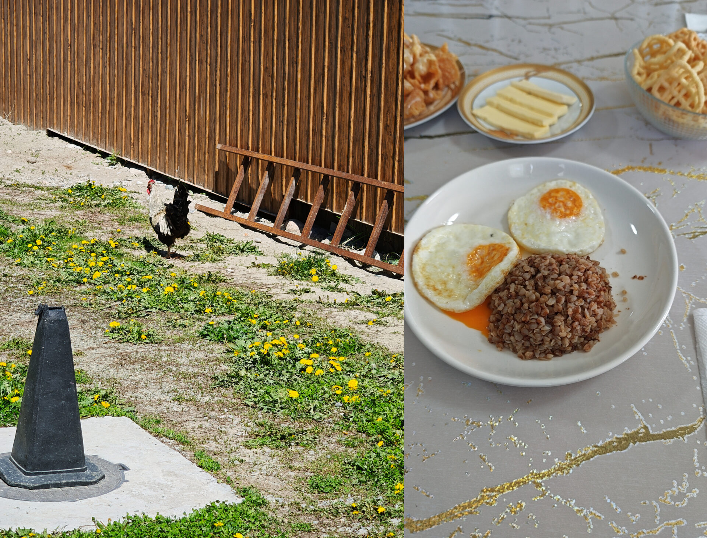

---

## 8. Two Lakes and a Valley: Bonfires, a Filipino Couple, and Chen Jingfei's "North Sea"

"Two lakes and a valley" is the classic nature loop around Almaty: Kolsai Lake (easy hiking + lakeside boating + hillside photo spots), Kaindy Lake (the sunken forest), and Charyn Canyon (often marketed as Kazakhstan's answer to the Grand Canyon; hiking inside the canyon).

On the bus out to the lakes, the guide enthusiastically played "Gangnam Style." Last time I heard that song was in middle school — the image that surfaced was watching a girl I liked dance to it in a KTV (Chinese-style karaoke room). A decade-plus on, the song is the same song; the people listening have all changed.

The region really is under strong Korean cultural influence — seeing an Asian face, many locals' first question is whether you're Korean.

The lake scenery met expectations. On scenery alone it's no Jiuzhaigou (China's famously colorful alpine lake district), but there weren't so many people here — it was quiet. We also tried the horse cart and horseback ride up the hill: 40 minutes for 100 RMB (≈ US$14), much cheaper than in China.

### On AI-Composited Photos: No Need to Waste Time on Photography

There are eagles (or vultures?) tethered locally for you to pay for a photo with. I would certainly have paid for that in the past, but now I don't think it's necessary.

Just shoot a rough frame of the background — or snap someone else's photo as reference — and let GPT Image 2 composite it for you: seamless, completely undetectable. Same logic for photos of your girlfriend or boyfriend: take a draft of background and person and blend them, and it's more than enough for WeChat Moments-level purposes (Moments is WeChat's social feed). There's no need to spend much time chasing the perfect shot; the line between retouching and AI composition isn't a clear one anyway.

**My own feeling: seeing it with your own eyes is enough.** I'm not that keen on taking photos, but I am keen on shooting video — it's more three-dimensional: sound, motion, ambient noise, letting you truly recall later how that moment felt. A carefully retouched photo can't do that.

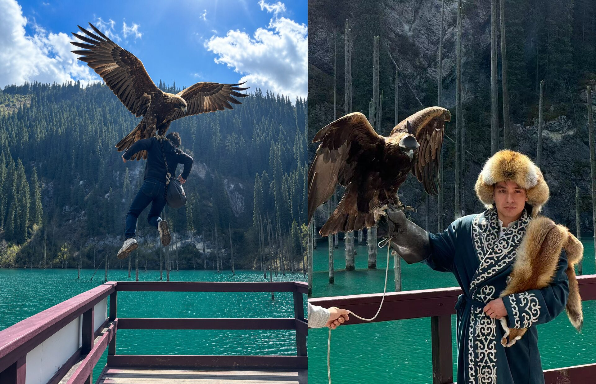

### The Bonfire Party

There was a bonfire party at night. Who'd have thought such a small place could assemble travelers from so many countries on one tour group: China, South Korea, India, the Philippines, Russia, the US, Canada, Scotland. And the bonfire was wonderfully unpolished, unlike the heavily commercialized bonfire nights back in China — everyone loosened up after a few drinks, chatting idly around the fire. A genuinely good experience.

We met a Filipino couple on their first trip abroad, honeymooning. We talked for over an hour — their English was fluent, mine relatively mediocre; I understood most of it but didn't quite know how to organize my expression. Gesturing got the meaning across too. We talked, naturally, about how we'd each met our partners, how this trip was arranged, that sort of thing. We even exchanged banknotes — and I discovered Philippine bills actually have a transparent window. Rather interesting.

In the home of the villager family we were staying with, you could hear trending Douyin songs (Douyin is TikTok's Chinese version) — quite surreal. They were also collecting currencies from various countries, so we left them a Chinese banknote.

### A Boat Ride, Then the Grand Canyon

The other lake has boats, and the commercialization is done competently. While on the boat I played Chen Jingfei's **"North Sea."**

The last time I took a lakeside-trail trip like this was September 2024, in Xinjiang. Though only a bit over a year has passed, many details of the memory have blurred, leaving only fragments to sketch what it was like. Except that by now that person is gone, and the state of mind is entirely different.

> At this moment, are you living the life you long for?

Half a question, half a blessing. May all my friends get to live the lives they long for.

The meals out in the countryside were plain — eaten with the local family; some dishes fine, some just plain oats lacking seasoning, and the vegetables were carrots and pickled cabbage, more or less. Food-wise, if you also have a Chinese stomach, I'd suggest bringing some food from home that complies with customs and quarantine rules.

The next day was the Grand Canyon. The scenery is desolate, with long stretches of no signal. Desolation like that easily breeds a mournful mood; my mind wasn't quite in it, and mostly I just followed the road.

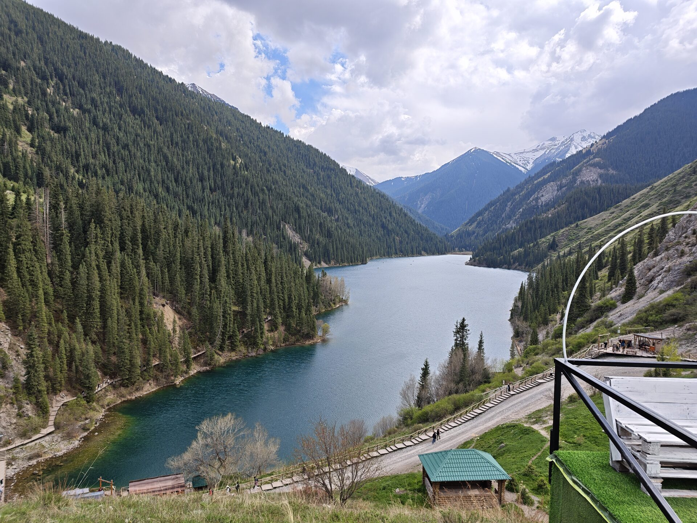

---

## 9. Aktau: Seabed Relics and Caspian Fog

Only looking at the map did I realize Aktau already sits near the Caspian Sea, comparatively close to Europe — probably the closest I will ever be to Iran in my life.

### Arrival

May 1 is Kazakhstan's Unity Day. In the morning we watched the holiday performances in Almaty — a multiethnic village-variety stage, quite lively. In the afternoon we flew to Aktau.

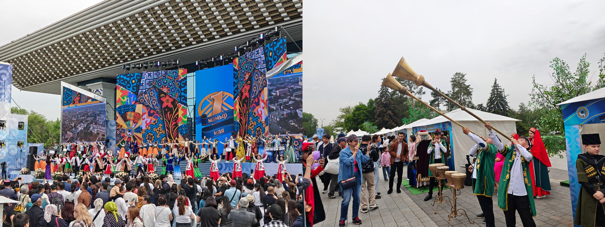

The Aktau hotel had a strong formaldehyde smell, though overall it looked reasonably presentable, and we weren't asking for more. In the evening we went for Chinese food — the very restaurant that transliterates its Chinese menu into Russian, mentioned earlier.

### The Mangystau Seabed Relics

The next day we set out on a tour — the "3 Locations in one day" day trip, departing 08:45 and ending 21:30, about 13 hours, 17,000 tenge per person (≈243 RMB, roughly US$33). The main sights are Bozzhyra Valley (Martian terrain) and Kyzylkup (Tiramisu Canyon). The story goes that geological uplift pushed an ancient seabed up above the water, and you can see all kinds of geological formations and sedimentary rock.

But the road itself was a real ordeal: four hours out by bus, four hours back, on violently bumpy tracks that regularly launched your whole body into the air — wear your seatbelt, absolutely. On the way back the road surface turned to mud and the bus **got stuck outright**; everyone had to get off and push before the bus was freed from the mire.

Of the fifteen-odd people on board, everyone but the guide, the driver, and two local passengers was Chinese — it was already China's May Day holiday by then. The guide was still running icebreaker games on the bus, and so a curious tableau appeared: a whole crowd of Chinese people introducing themselves to each other in English, on the Kazakh steppe. For a moment it was hard to tell whether we counted as the foreigners or they did.

### Red-and-White Terrain + Tiramisu

The first stop was the red-and-white banded landscape, magnificent in scale. A real regret to have no drone here — terrain on this scale simply can't be captured from the ground.

The more amusing interlude was the missing toilet. The surroundings were a boundless plain with nowhere to hide, so in the end I had to climb a rarely visited hilltop and let fly into the wind. I even recorded it — a unique memory, of a sort.

Next came the place known as "Tiramisu" — a few blocky hills rising abruptly from the barren plain, surrounded entirely by wind-eroded and sedimentary terrain. It really is photogenic, with a desolate, questioning-the-end-of-the-world air, hence the long queue of people waiting for their photo spot. A place with more drones than birds.

Some of the wind-eroded formations nearby are hollow at the base, with faint cracks above; I didn't quite dare linger on them too long. The guide also said there are no public toilet facilities here — you have to find your own "hidden place" — a silence-inducing arrangement :)

### A Caspian Café

The next day was free exploring in Aktau; we went to a café by the Caspian Sea and sat there all afternoon. The fog was heavy that day and the view wasn't crisp, but sitting there watching three large cargo ships drifting in the mist made my sense of the Caspian suddenly concrete.

Combined with the current situation in the Middle East, I couldn't help wondering where those ships were headed — feeling for the first time, on a map, just how close I was to Iran was a rather wonderful experience.

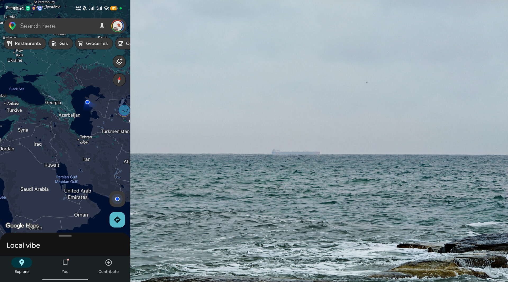

That evening we had local roast meat at another place. No surprises, no delights — as expected.

### The Way Home

From Aktau we flew back to Almaty to transfer, then waited for the evening flight back to Guangzhou. Paying the FlyArystan excess-baggage fee, the credit-card problem described earlier replayed itself: the CCB VISA wouldn't go through, the HK card was short on balance, and I could only log into another account on the spot and shuttle money over to the rescue. The time difference is 3 hours — we took off at 9 p.m. local and it was already past 5 a.m. when we landed in China. A night in the air; home, a shower, and straight to bed; woke up at two in the afternoon.

Realizing I had barely eaten any vegetables in days, I bought a hotpot base plus a full jin (500 g) of baby napa cabbage and gorged on them. That evening I started writing this travelogue.

---

## 10. Mental Provisions for the Road

Plane or bus, the time on the road is long. Read a book, watch a show, or listen to a podcast — something has to fill those seven or eight hours of bumping across the wilds.

### Books

- **Qin Ershi Must Die, by "Prince Ma" (Ma Boyong)**: unbridled imagination plus rigorous historical homework — a very interesting novel, quick to read, a great experience.
- **Nexus (the Yuval Noah Harari one; a re-read)**: reading it again against the current pace of large language model development, on one hand I marveled at insight that cuts across time, and on the other more questions kept forming — what will it look like when agents are deeply involved in every facet of human society? In AI's primitive era, algorithms could already sway elections; what about now? Nothing to be done but look forward. No one can unilaterally exit the game — would you be willing to hand your fate to someone else? Along the way I also came across an article about the permanent ["useless class" theory](https://archive.is/20260503132651/https://www.nytimes.com/2026/04/30/opinion/ai-labor-work-force-silicon-valley.html); stringing the two together, they are moving closer and closer to reality, and it grows more melancholic.
- **The original novel of Fanren Ge (Song of Ordinary People)**: recommended on the Feihua Lianpian podcast. The network was too poor to stream the show, so I went and found the source novel instead. Its characters are understandable, relatable even — though not necessarily endorsed.

  > On the five-hour bus ride out toward the Kazakh countryside, I heard the 2024 episodes of Feihua Lianpian recommend the drama Fanren Ge.
  >
  > The roaming signal came and went; watching full videos was out of the question. The best I could do was find the original novel and see whether I could finish it in that window.
  >
  > The novel is short and reads smoothly; its twists and turns, I could feel them as my own.
  >
  > The three male characters in the novel make you slap your forehead and beat your chest as you read — each detestable in his own way.
  >
  > Na Wei getting laid off and stumbling into traps early on — that's all tolerable. It just reads as dumb: his wife goes out to sell braised meat while he lifts not a finger, only moping about. Infuriating. Goddamn embarrassing.
  >
  > Na Jun seems clear-headed, yet is always fixated on wanting to change other people — a pure lunatic. "I wanted, I strove, I got." That smooth trajectory self-reinforces and drives him ever deeper at the execution layer. True learning lies in seeing the world clearly.
  >
  > Shen Lei runs against the grain. Honestly, his way of facing the world would be fine for a man living alone, affecting no one. But if you want to take part in the marriage market's transactions, you cannot expect the other person to share your contentment with poverty and quiet pleasures. When the mismatch is plain as day, why force them to stay?
  >
  > Which is why I think Xie Meilan leaving him was a very good choice — only it should have come sooner. This has nothing to do with fidelity; it is plain market behavior. Everyone has the right to pursue a better life of their own.
  >
  > Shen Lin, a truly remarkable woman: able to take it up, and finally able to set it down. Hidden within that soft frame is steel-grade energy that kept the whole household running. For Old Na to have married her — marrying up, truly.
  >
  > Li Xiaoyue — pretty good. Clear-eyed or blissfully ignorant, whichever it is: she enjoyed her happiness, has no particular regrets, and her big life choices are especially her own.
  >
  > Xie Meilan — I hope she gets to live the life she wants.
  >
  > ---
  >
  > As for this novel — the TV adaptation aired around August 2024. And ChatGPT appeared in early December 2022. It is now 2026, four years into AI's mad dash.
  >
  > So if we really push their lives forward from there:
  >
  > The ones thriving would be the cousins' renovation crew, and Shen Lin's braised-meat shop.
  >
  > They are the real producers, solving society's concrete, practical needs one by one.
  >
  > As for the rest of the friends — we can only wish them luck.
- **Gödel, Escher, Bach (GEB)**: because I'd previously read an article about the protocol- and text-first design philosophies people devised when compute was scarce in the early days — which unexpectedly collided with the needs of today's large language models. So I picked up this strange 1979 book. Around seven or eight chapters in I couldn't keep reading; after that I just talked with Gemini about the emergence of consciousness — the underlying mechanism maybe needn't be that complex, yet the upper layer can still give rise to consciousness. Looking at today's AI progress, it feels a bit magical.
  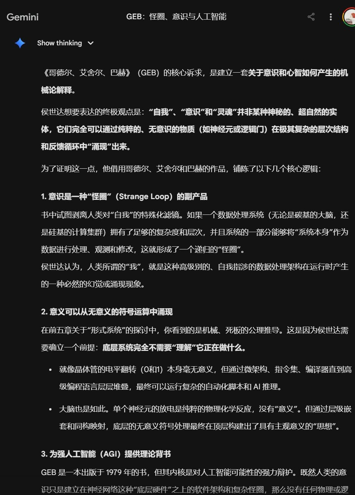
- **The Art of Unix Programming**: Unix philosophy has always had value; with the spread of LLMs and agents it has become newly prominent and important. The specific details don't actually need memorizing — the large language model certainly knows them better than you; you only need to know where the direction lies. A design philosophy from the barren-hardware era fitting the large-model era's needs so uncannily — quite wonderful.

An attitude I've already discussed in an earlier post — [from anxiety to acceptance](https://mp.weixin.qq.com/s/Rjxlr-O2kbH2vtHOWJ2G9A) — make the most of experiencing things now. No one can change this direction anymore.

### Shows

**Friends, first half of Season 1** — recommended on Feihua Lianpian; I wanted to polish my ear for listening. The plot is OK too; it'll probably become my regular mealtime companion viewing.

### Podcasts

**Feihua Lianpian** — probably my podcast of the year. A genuinely rare married-couple-in-conversation perspective, and the two get along so well you envy them. It may also help that the husband, like me, is from Dalian, Liaoning, so there's a natural affinity. It's on whatever I'm doing; I've listened to 130-plus episodes. Recommended.

---

## 11. An Accidental Discovery

For whatever reason, my sleep quality on this trip was exceptionally good. My fitness-band data showed: my sleep score normally averages around 70, but during this holiday trip it averaged 80, and one day even hit 95 — a high score I haven't seen in many years.

Cause unknown. Maybe the heavy daily walking burned a lot, maybe it was distance from everyday sources of anxiety, or maybe it was simply the good country air. Recording it here regardless.

---

## 12. Epilogue: Is the Golden Age of Outbound Travel Over?

After the trip, scrolling Xiaohongshu, I saw there had been an air-raid alert on landing at Dubai airport. The fuel situation, the world economy, all manner of uncontrollables… you can't help feeling something.

**The best era of outbound travel may already be behind us.** A decade-plus ago, prices were cheap, travel was smooth, and there wasn't much unpredictable risk of war. And now? It brings to mind that classic line — as bad as things already are compared with the past 10 years, this may even still be the best year of the next 10.

A great transformation unseen in a millennium — take it one step at a time, and experience more.

Now when I travel abroad I pay special attention to the local **geopolitical risk** — war and safety, economy, public order, strikes, whether the fuel supply is adequate. Things that never used to require a thought have now become mandatory checklist items.

Judging both by the holiday-travel experience and by how AI is developing, **the move is to return to a flexible, independent-work setup as early as possible** — earlier beats later. This time, with some ad-hoc work requests, I handled things remotely via [HAPI and Cloudflare](https://mp.weixin.qq.com/s/w8VnWJcUp5VkD5J-fYCUrg), and the whole experience went fairly smoothly — further confirming my judgment: on the road, all you need is a big screen, a good network, and a voice-input keyboard; leave the compute-intensive stuff to run on a high-performance server.

If you can work anywhere, you can live anywhere.

---

May everyone get to live the life they want. Dream more, experience more.

That's all.
