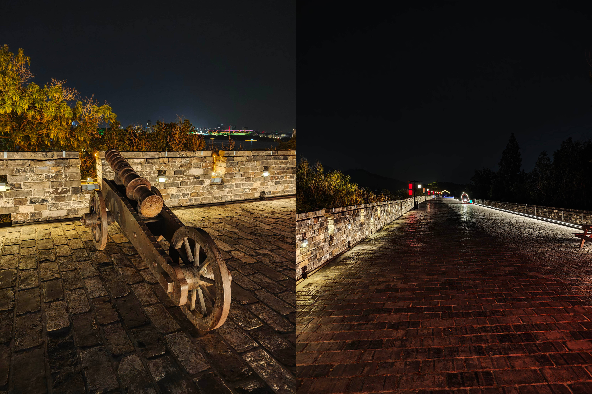
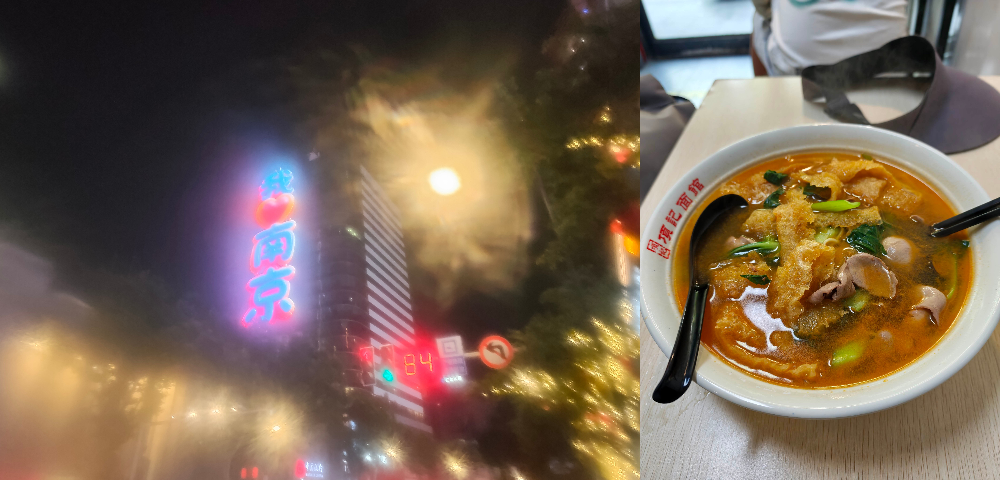
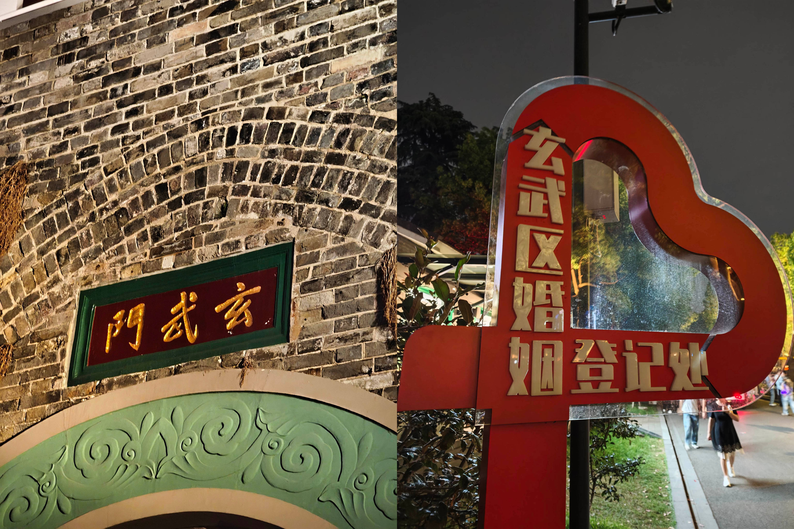
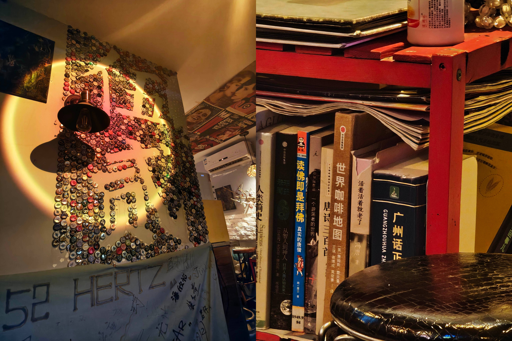
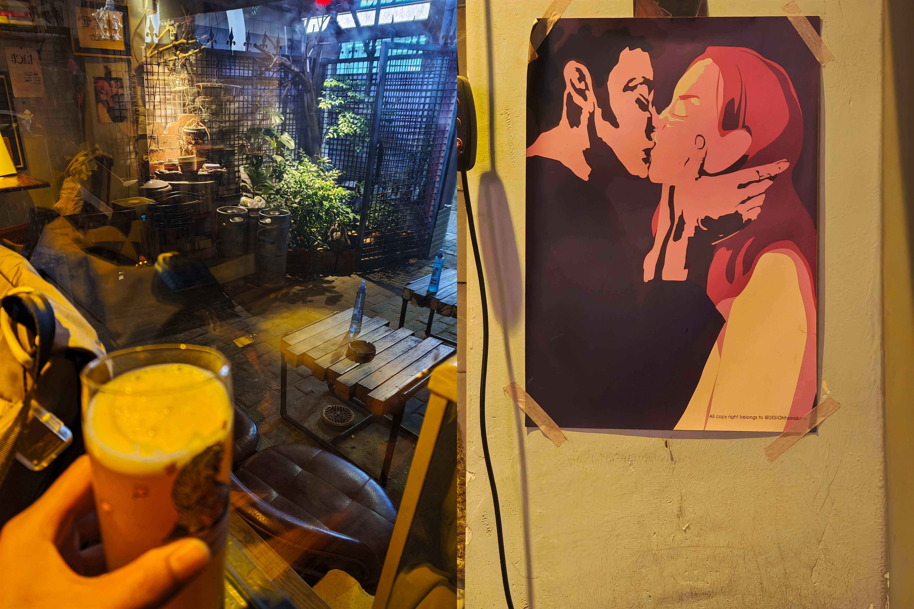
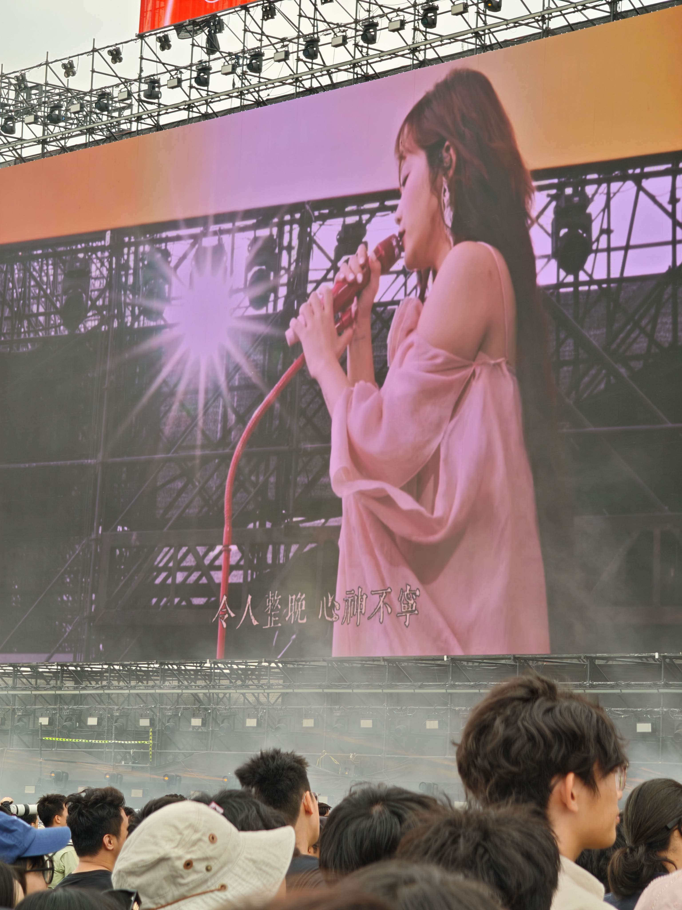
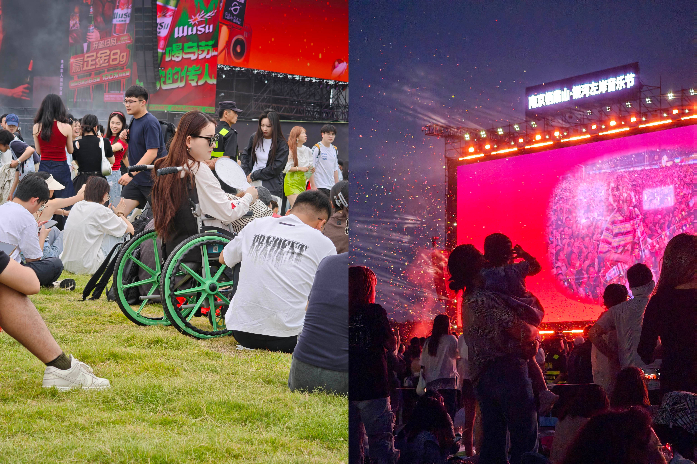
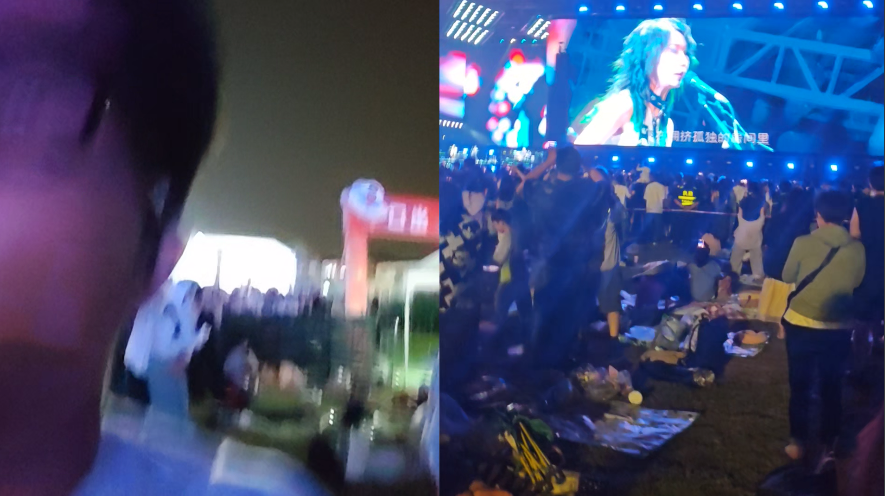
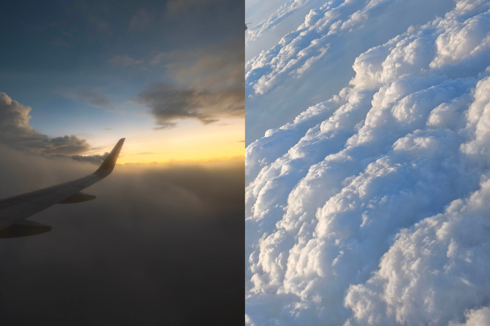
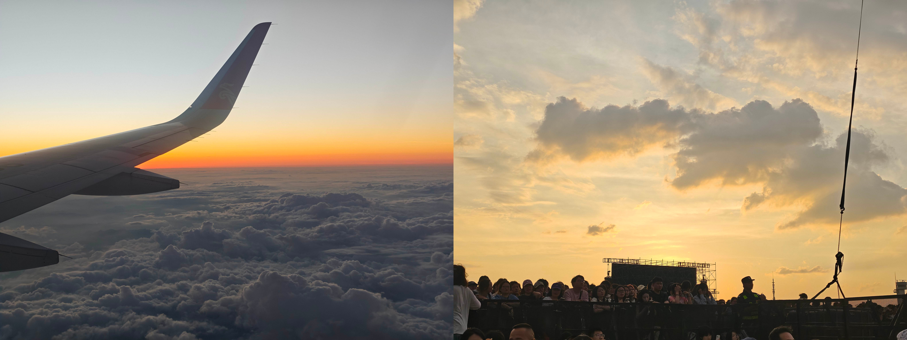

*Translated from the [Chinese original](/posts/260613-nanjing-music-festival/). Last synced 2026-09-26.*

---

I wanted to write a travel note but couldn't be bothered to write it properly, so I first rambled everything I wanted to say into the Feishu Recording Bean (a clip-on AI dictaphone from ByteDance's Feishu/Lark workplace suite) and untangled it slowly afterwards.

## 1. Origins

The origin was simple: a friend said there was a music festival in Nanjing with **Chen Jingfei** on the lineup, and asked me to come along. I said yes in half a second.

I thought it was my first time in Nanjing, then was startled to realize — it was actually my second. This time a last-minute mishap kept my friend from making the trip, so the whole thing turned into a solo trip.

## 2. Departure: the new Terminal 3 — good-looking but not that useful

My flight was a bit after nine, so I crawled out of bed at five-thirty and took the intercity train to Guangzhou's new Terminal 3 (T3).

The facilities are genuinely nice — a pity all that beauty isn't very practical. Dragging a suitcase across that long stretch of carpet made me want to curse. The charging details, though, were a clear step up from the old terminal.

## 3. Landing: pork-skin noodles, and a venue way out in the sticks

Landing in Nanjing, I headed to Xinjiekou first and had a bowl of pidu noodles (pork-skin noodles, a Nanjing specialty) — a local shop my friend picked out using Doubao (ByteDance's AI assistant). It tasted decent.

After eating I rushed for the suburbs, toward the Qixia Mountain Music Festival grounds. Good grief — this place is properly countryside. It's 20 kilometers from the airport to downtown, and another 20 from downtown to the venue; 40 kilometers on the road one way. By the time I'd checked in I was wrecked, and slept straight through until six in the evening.

Waking up, I figured: second time in Nanjing, I really ought to see more of the city. Why not head downtown for some food, then find a scenic spot to walk off the meal and talk to myself for a while.

## 4. Night at Xuanwu Lake: crab-roe noodles, a bike ride, and couples by the shore

I searched around and decided to eat near Xuanwu Lake first. I'd been hoping for xiaolongbao (steamed soup dumplings) with duck-blood vermicelli soup, but that shop wasn't open in the evening, so on Dianping (China's Yelp-like reviews app) I picked another place near the metro station — crab-roe noodles plus xiaolongbao.

A bowl of crab-roe noodles with a side of crab roe: 88 yuan. Honestly the flavor did nothing for me — maybe it's the craft — I ate without much enthusiasm, and needed a pile of side dishes to cut the richness.

Afterwards, off to Xuanwu Lake. Taxis were hard to hail, and it was only 4.7 kilometers, so I grabbed a shared bike and rode over, arriving a bit after eight. Nanjing's roads are well suited to cycling. Halfway there I saw a little girl sitting astride the back seat of an e-bike, leaning against the man — probably her dad — a lovely sight; by the time I thought to grab a shot we'd already ridden past.

I'd assumed Xuanwu Lake at night would be nearly empty, good for wandering alone — at the gate I discovered I had it completely wrong. Huge crowds, performances of every kind inside, commercialization turned all the way up.

Just past Xuanwu Gate, a couple of tourists next to me were asking — what does this Xuanwu Gate have to do with the Tang dynasty's Xuanwu Gate Incident? It stopped me short, and then made me smile.

> The two gates sharing a name is, at bottom, a reflection of the ancient Chinese tradition of naming places by direction:
> Xuanwu — the Black Tortoise, divine guardian of the north — is a cultural symbol that runs through the building of China's ancient capitals, and the north gates of palace cities and capital cities were often named "Xuanwu."
> The Tang dynasty's Xuanwu Gate took its name directly from its position as "the main north gate of the palace city"; Nanjing's Xuanwu Gate took its name indirectly from Xuanwu Lake (the lake was named for lying north of the Six Dynasties capital, fitting the "north belongs to Xuanwu" geomantic pattern) — both ultimately trace back to the same body of traditional culture.

I walked three or four kilometers around the lake without covering all of it. Normally I'd be listening to podcasts, but with a show to see the next day I put on Chen Jingfei's playlist instead and hummed along.

The lakeshore has no railings; you could see couples in twos and threes sitting together under the trees or at the water's edge. No phones out — just trading a few strands of small talk back and forth. Evening wind on the face. It was lovely.

> A teenager's secret feelings are the loveliest thing in the world.

Walking on, I spotted a Chayan Yuese (a cult-favorite Chinese tea chain) by the lake. I'd run into one in Changsha just two weeks before, and here it was again in Nanjing. A thought popped into my head: isn't Chayan Yuese adapted from some chengyu? The brand name is heard so often that the original idiom absolutely refused to surface. I asked Xiao Ai (Xiaomi's voice assistant) — probably didn't catch my pronunciation clearly, no answer. In the end it was Doubao that told me: oh — **hé yán yuè sè**, "a kind and pleasant face."

These days the idiom itself looks unfamiliar to me — I've gone too long without saying it. My head holds nothing but Chayan Yuese, Chayan Yuese.

## 5. Night on the City Wall: quiet within the bustle, and the things you only think when alone

Walking on I reached an exit, and suddenly noticed a ticket gate for the city wall right beside it. Figured you could still go up? I asked the staff: closing at ten, and it was nine now. The ticket was 30 yuan. I hesitated a moment — well, I was already here; up I went for a look.

The ticket proved worth it. Very few people up there, maybe because closing time was near — a real feeling of **finding quiet within the bustle**. Up the steps, the noisy sounds behind me receded bit by bit and slowly went quiet; looking ahead, there might be no one but you on the whole walkway. Perfect for muttering to yourself.

So on the wall I started a recording, and slowly talked through some thoughts to the night.

> "The carved railings and jade steps should still be there — only the rosy faces have changed." (Li Yu, a tenth-century poet-king, looking back on a lost kingdom)

I always thought I'd never been to Nanjing, until one day it suddenly hit me: I most likely did come, during my sophomore year of college. Only that stretch of memory is too shallow — nothing concrete remains, just blurred fragments: a bookstore on a downward-sloping street, a little bear charm I bought and hung on my shoulder bag; later I stopped carrying the bag, and the charm snapped. So many things quietly fall apart just like that. Maybe that's why Nanjing has always left such a faint impression on me.

Coming back now, I'm far more at ease as a person. After going through everything I've been through, I see more clearly what kind of person I am, what kind of relationship I want, what exactly I'm chasing. Wherever I go, there's no longer any compulsion to check boxes or to guarantee photogenic shots — mostly I just want to experience more and record more.

The night breeze was wonderful, cool as it brushed past my face, and I put on Chen Jingfei's "Evening Breeze."

> Evening breeze — how many sweet dreams you've blown in, how many hidden aches you've blown away.

Walking alone, your thoughts inevitably drift, and you can't help asking yourself: what kind of days will the future turn out to be?

The lakeside had a touch of "Moonlight over the Lotus Pond" (Zhu Ziqing's classic essay) about it. Some chatted under the trees, some sang by the lake; the friends strolling ahead carried bright laughter between their talk and their teasing.

I thought of watching Li Dan (one of China's best-known comedians) livestreaming, where a bookish viewer wrote in about the fluttering state of his young crushes — the kind of heart-flip that lands at first glance. Li Dan said he genuinely envied him — and honestly, watching, I felt the same.

It's just that as the years accumulate and experiences pile up, everything I look at now passes through a layer of settled rationality; it's hard to be "swept away" anymore. I see a pretty girl and get no further than "hm, she's pretty" — and then what? What I want now is the state of being with someone you can **really talk to and really fall asleep beside**.

A while ago, by a turn of chance, I got to know Teacher Gu and Teacher Zhu, and binged their yearly-updated relationship chronicles (published on WeChat Official Accounts — China's dominant blogging-plus-newsletter platform). I couldn't help marveling — it was the most beautiful discovery of my day: a scarce sample of genuine human sincerity, a slice of love done right. The kind that makes onlookers green with envy.

Just — on the other side of that. The times are moving too fast; so fast that AI is already deeply involved in humanity's emotional life.

When your first instinct for everything is to go talk it over with the AI, people inevitably start to feel a bit… less "reasonable." A couple of days ago I watched the podcast "Lao Gong Bu Zai, Liao Dian Zhen De" (roughly, "Husband's Away — Let's Talk for Real"), where four hosts of different cultural backgrounds, all living in the US, talked about AI. One clash in it was quite interesting.

> Hilary shared a real conflict with her partner Lao Gao. After one argument, Lao Gao demanded "a gentle wife." Hilary's answer: "Then go say that to an AI — tell it to ChatGPT, have ChatGPT coddle you." That made Lao Gao angrier still, and he shot back heatedly: "I'm a human being with warmth… I damn well am not going to talk things over with an AI. What I want is a gentle wife!"

A question that cuts to the soul — does cheating with an AI count as cheating? If you're interested, go search the hashtag "#人机恋" (rénjī liàn, "human–AI romance"); it's an entirely new world.

On one hand, I think it's precisely human **desire and stubbornness** that separate us most from AI — a difference in initiative, in agency. On the other hand, those same sharp edges are destined to grind against each other when you live in each other's pockets — a bit like recommendation algorithms and short videos: it understands you too well, but with the threshold dialed this high, is that really a good thing?

A while back I read a piece arguing that marriage isn't a good solution for love. I agree. But then what? The evolution of a society's institutions always lags behind the transformation of its ideas; standing right at such an inflection point, you feel the impact of that tangled crossing all the more. If human society still exists a hundred years from now, what will its social thought be like then?

## 6. The little bar under the city wall

Just before ten I went down to the metro; the car doors were about to close when I glanced at the map — last train 23:49. Well then, plenty of time. Heading back this early would be a waste of a night — why not have a drink at a nearby bar and take in a bit of Nanjing flavor.

It was one of those tiny shops inside a residential compound, no bigger than a palm, with beautifully kept greenery, plus one supremely cunning orange cat forever trying to slip out the door.

The place was full of small touches, and I took a few photos: characters spelled out in bottle caps, a Cantonese phrasebook on the bookshelf, and a painting of a couple locked in a passionate kiss. The owner was lovely; the whole place had the feel of "a folk singer, done drifting, landed and opened a small bar."

One drink down, it was nearly eleven; back to the hotel to wash up and sleep, and to lay out what to bring to the festival the next day.

## 7. Festival day: Chen Jingfei, lying on the grass with a book, and New Pants lighting the fuse

This was still my first-ever music festival. Looking at the lineup for the 13th, the act I most wanted to see was surely Chen Jingfei; Chen Li and New Pants were slotted for the evening, and I wanted to use the chance to hear them live too — several of their songs that everyone knows are ones I quite like: "Zou Ma," "Xiao Ban," "Ni Ni Ni Yao Tiao Wu Ma (Do You You You Want to Dance)". Besides, I was in Nanjing already, and with the venue out in these mountain outskirts there was nowhere else to go — might as well hold out to the end.

Chen Jingfei was on around 13:30; I left the hotel a bit after eleven, ate a big, filling lunch, and headed for the venue.

I was quite lucky that day. Overcast — not the scorching sun of the day after — and the occasional leak of sunshine was bearable. During Chen Jingfei's afternoon set I squeezed all the way to the front and stood there thrilled for more than half an hour; most of the acts after her I didn't know, so I simply lay down on my picnic mat and read.

At night the temperature dropped, and once the evening wind picked up, a short-sleeve shirt was honestly a bit cold. I admit, for a few moments I was scheming — would wrapping myself in the picnic mat be warmer? But with girls in short sleeves and hot shorts all around me, doing that would have made me stand out like a crane among chickens.

And then New Pants opened with "Ni Ni Ni Ni Yao Tiao Wu Ma." Good grief — it catapulted me straight up and dancing, a lit match to the whole body; the band knows how to bring the noise. The crowd very visibly caught fire too.

I rather like these two shots; they make a matched pair. An adult who came to the music festival even in a wheelchair; a small child clamping hands over the ears, finding it all just noise.

While we're here I have to add: at a show like this, rather than only filming the performers, you're genuinely better off turning on front and rear cameras at once, recording the stage and your present self simultaneously — something like a flattened panoramic camera. Or put it this way — **your self of that moment deserves the shot more than the singer on the stage does**.

Years from now when you look back, if all you hold are photos and videos of the singer, with no record of how you reacted in that moment, you'll most likely regret it.

There will always be someone who films the singer better and more sharply; that isn't scarce. But you — no one but you will ever film you. That's the truly rare keepsake. So now I always run front and rear cameras together and record whatever thought crossed my mind at the time. Replaying today that clip of myself bouncing along, I can still feel that **happy-to-the-point-of-blur** energy.

After two or three New Pants songs, I didn't know the rest, and fearing the exit crush, I pulled out early. The official exit routing was pretty badly done and the order a bit chaotic — but I slipped out fast and was through without much delay.

One stranger point: by whatever rule this was, at security check you had to twist the cap off your bottled water before they'd let you in — odd, to say the least. Were they strong-arming me into buying the official water? It left me out of sorts the whole evening; even reading, I had to hold the bottle in my teeth. Should have smuggled a spare cap in my pocket.

Downstairs at the hotel happened to be a food street; I ordered Hunan food to take up, and grabbed a beer from the supermarket. And with that, the day was done.

## 8. The trip home: an old affinity for Yang's Pan-Fried Buns, and clouds like cotton candy

Checked out at noon the next day, meaning to forage in the mall downstairs, but the lines were long everywhere; in the end I picked Yang's Pan-Fried Buns (Xiao Yang Shengjian, a famous chain for shengjian — pan-fried pork buns), with a bowl of duck-blood vermicelli soup.

Speaking of Yang's — it just came back to me now: the first time I ever ate the stuff was, I believe, in Nanjing.

Back then it seemed absolutely heavenly, and I couldn't stop thinking about it — so much so that later, flying home from Guangzhou with a SIM card to sort out mid-journey, I deliberately squeezed in another taste during the layover. But the second time lacked the revelation of the first. Or rather: the Yang's buns that stunned me in Nanjing became, eaten in Shanghai, a flavor within expectations. Six or seven years gone in a blink — time really does hurry past.

At the airport, one glance at Guangzhou's weather — sure enough, dragon-boat rains season (South China's stretch of daily downpours around the Dragon Boat Festival), so, sorry in advance to everyone. The 4:10 flight was dragged out to a 6:10 takeoff. At least there was no cancellation and no diversion — comparatively smooth.

The view beside the porthole was quite lovely: right after takeoff I looked down at vast sheet after vast sheet of cloud below, and where the sunlight hit, they looked like huge swaths of cotton candy, watercolor-smeared across the land.

Nearing Guangzhou, the plane descending, in the few seconds before it dove into the cloud layer I caught just the right frame: white cloud, sunset, blue sky — a few colors stirred together, unreasonably beautiful.

Landed at T3 — this time the taxiing wasn't the endless crawl the internet had warned about; what I didn't expect was that the new terminal routes departures and arrivals through the same corridor, which startled me for a second. .

I'd meant to take the intercity train home, but reached the station just in time to miss one, so it was a bus transfer to the metro — a bit of a haul.

Got home, pushed the door open, and nearly couldn't catch my breath. My cat Huhu had tipped over the trash can, garbage strewn across the floor; seeing me return, Huhu came trotting up, meowing away. Ah, what can you even say. Thank goodness there was nothing soggy; I cleaned it all up and gave the trash can another round of citrus deterrent spray.

I meant to open the laptop and finish this travel note in one sitting, but there was just too much stuff — easier to record it first; the photos will take longer still. And that's about it. A small Nanjing note, for the record.

## 9. Coda: the book for the road

Oh right — one more thing to add: for most of this trip, I was actually reading.

Lately I've been collecting material on Lee Kuan Yew. At first I just dumped it into NotebookLM and asked it questions, but after a while it felt unsatisfying — hard to build a framework-level understanding, and the details slipped away badly; after all, I genuinely enjoy reading his material. So for the road I kept hold of **From Third World to First: The Singapore Story, 1965–2000** (the second volume of his memoirs), which tells of the many designs at Singapore's founding, and of his judgments on Southeast Asia as a whole and on the situation of every country in the world. Far more comprehensive than *One Man's View of the World* or *Lee Kuan Yew: The Grand Master's Insights on China, the United States, and the World*.

Seeing things through his eyes, then circling back to old documentaries and history, adds another layer of corroboration — quite interesting. Take the 1979 Sino-Vietnamese War: set against the Southeast Asian situation of the time, it gains a shade of comprehensible motive. Or take the trials of former presidents at each change of power in South Korea, and a public grown suspicious and disillusioned toward every kind of authority — from society's standpoint, it's hard to say whether that's good or bad.

He was an intensely pragmatic man. In a way, I think he and Deng Xiaoping were the same kind of person — seek truth from facts, unshackled by ideology, clear-eyed about exactly where reality binds. When the two met, Lee broke precedent and had his smoke-free hotel improve the ventilation so as to give Deng an environment where he could smoke; Deng, mindful that Lee was allergic to tobacco, went without for a day. There was something of kindred spirits recognizing each other in it.

Very few people have stood in a position to narrate, firsthand, the 0-to-1 of a nation. That is quite different from a question-and-answer session with NotebookLM — the memoir has a through-line, one unbroken vein of it, and reading it is a genuine pleasure. Finishing the whole book left me understanding both Lee Kuan Yew himself and Singapore as a whole a level deeper.

Standing at this juncture of "great changes unseen in a thousand years," I feel rather at sea. Sometimes I truly wish I could go consult that wise old man once more — and after listening, would my heart settle a little?

---

A floating life, six records — this one filed under "idle pleasures." (A nod to Shen Fu's Qing-dynasty classic *Six Records of a Floating Life*.)

That's all.
