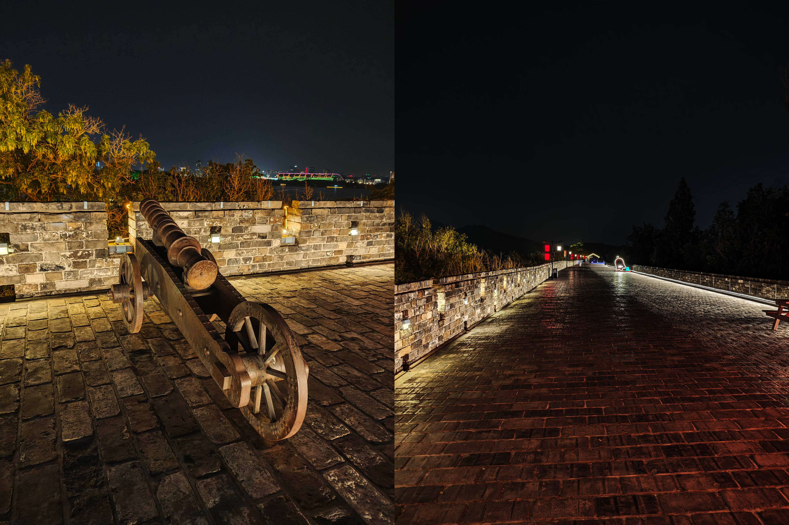
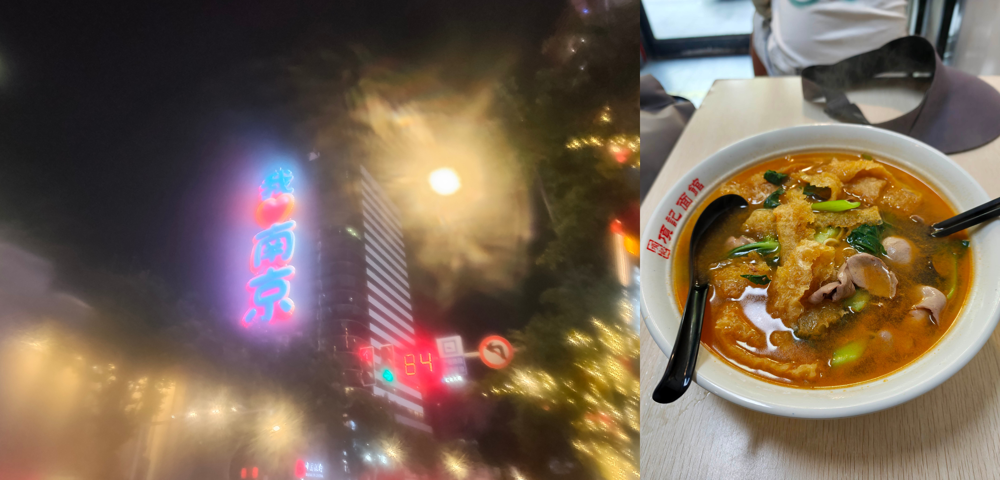
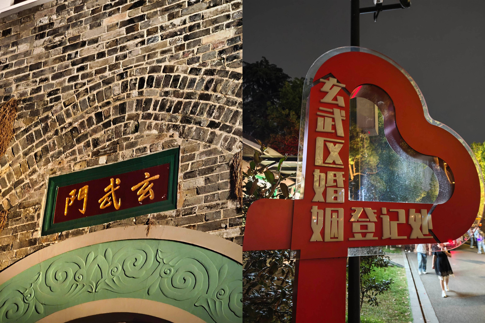
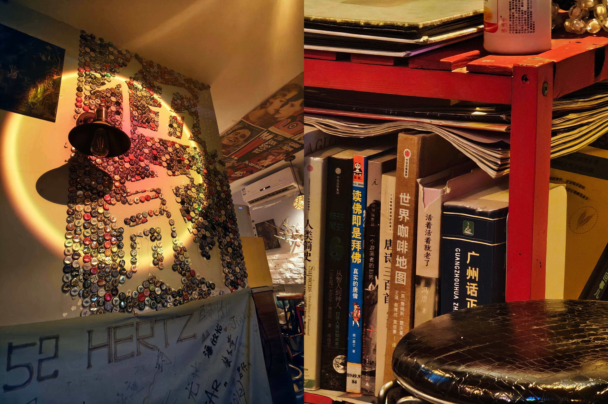
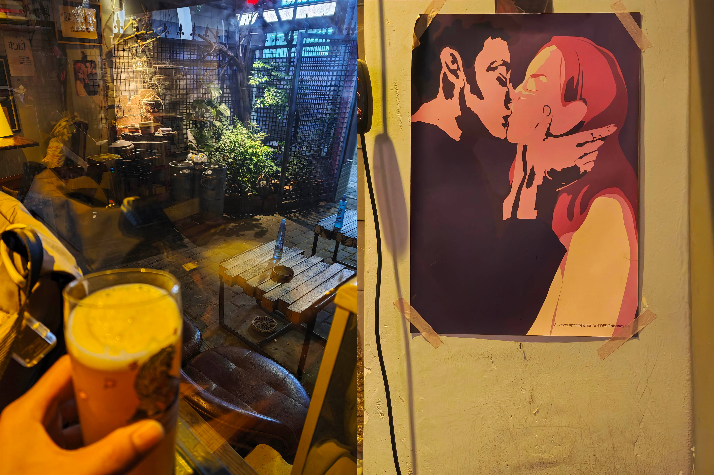
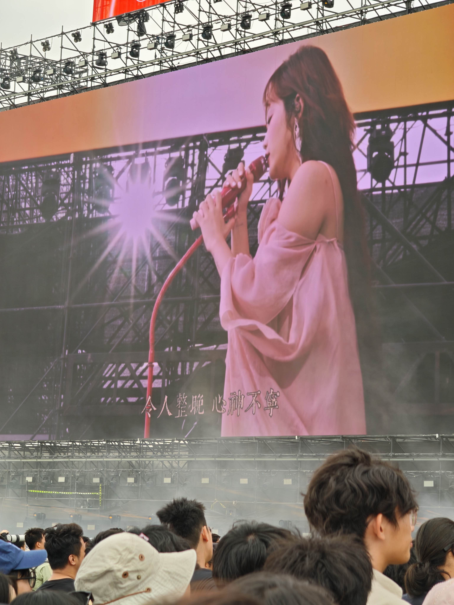
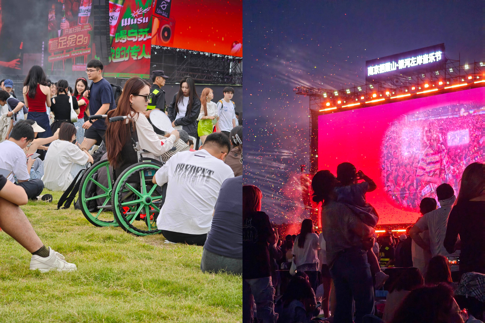
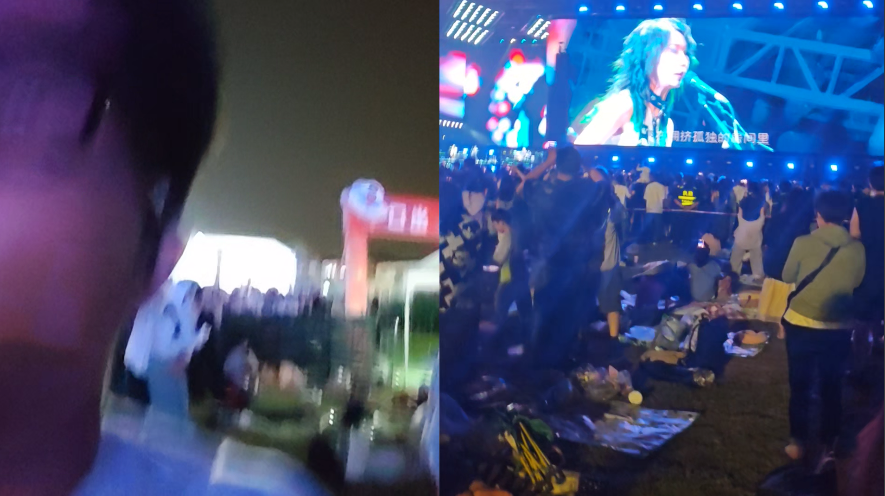
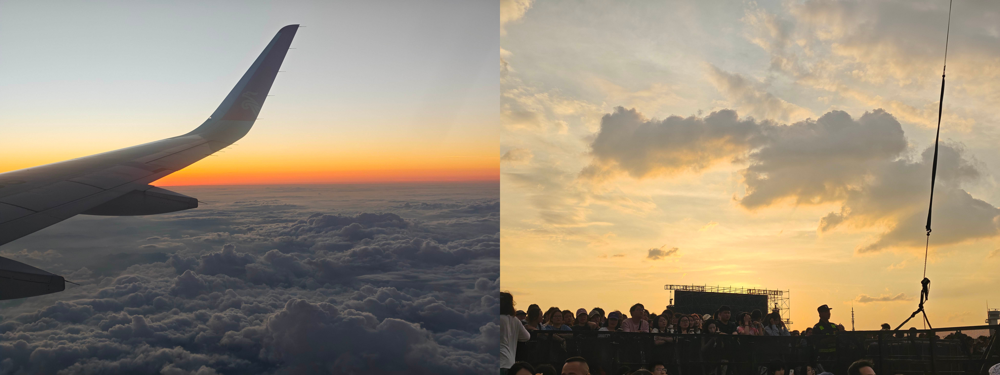

---

想写篇游记，又懒得正经写，于是先对着录音豆把想说的絮叨了一遍，再慢慢理出来。

## 一、缘起

缘起很简单：朋友说南京有音乐节，里面刚好有**陈婧霏**，喊我去。我秒 call。

本来以为是头一回来南京，后来才惊觉——其实是第二次了。朋友这次临时出了点意外没能成行，于是整趟就成了我一个人的 solo trip。

## 二、出发：新 T3，好看但不太中用

九点多的飞机，五点半就爬起来，坐城际赶去广州新 T3 机场。

设施是真不错，可惜美得不太实用——拖着箱子走那段地毯，费劲得想骂人。倒是充电那些细节，比老航站楼好了不少。

## 三、落地：皮肚面，和太乡下的场地

到南京先去新街口，吃了碗皮肚面——朋友照着豆包的攻略找的当地馆子，味道还行。

吃完往郊区赶，奔栖霞山音乐节的场地。好家伙，这地方是真乡下。机场到市区 20 公里，市区到场地又是 20 公里，这单程光路上就 40 公里。办完入住，人已经累瘫，倒头睡到下午六点。

醒来寻思：第二次来南京，总得多逛逛。不如去市区吃点东西，再找个景点散散食、自言自语嘚啵一段时间。

## 四、玄武湖夜游：蟹黄面、骑行，和湖边的情侣

搜了一圈，决定先去玄武湖附近吃饭。本想吃小笼包配鸭血粉丝，结果那家店晚上不开，只好在地铁站附近的点评上另找了一家，蟹黄面加小笼包。

一碗蟹黄面配蟹黄，88 块。说实话我对这风味没什么感觉——也可能是工艺的问题——吃得意兴阑珊，还得靠一堆配菜来解腻。

吃完去玄武湖。打车不好打，一看也就 4.7 公里，干脆骑了辆共享单车过去，八点多。南京的路修得挺适合骑车。半道上看见个小女孩跨坐在电动车后座，背靠着大概是她爸的人，挺有意思，可惜想抓拍时已经骑远了。

本以为夜里的玄武湖没什么人、适合一个人溜达，到门口才发现完全想错了——人巨多，里头各种表演，商业化拉满。

刚进玄武门那会儿，旁边一对游客在问——这玄武门，跟唐朝的玄武门之变有啥关系？听得我一愣，又觉得好笑。

> 两座城门同名，本质是中国古代 “方位命名传统” 的体现：
> 玄武作为北方之神的文化符号贯穿了中国古代都城建设，宫城、都城的北门常以 “玄武” 命名。
> 唐朝玄武门直接因 “宫城北正门” 的方位得名；南京玄武门则间接得名于玄武湖（湖泊因位于六朝都城以北、契合北玄武的风水格局而得名），二者最终都溯源到同一套传统文化逻辑。

绕着湖走了三四公里，倒也没走全。平时都是听播客，但想着第二天要看演出，也就循环起了陈婧霏的歌单，跟着哼唱了起来。

湖边没围栏，能看见三三两两的情侣，在树下抑或岸边结对坐着。也不刷手机，就那么你来我往闲言碎语几句。晚风拂面，挺美好的。

> 少年的心事，最是可爱。

走着走着，瞥见湖边一家茶颜悦色。上上周才在长沙见过，转头南京又撞上了。脑子里突然冒出个念头：茶颜悦色不是从某个成语改的吗？可这词听太多，原成语死活想不起来。问小爱同学，大概没收清音，没给答案。最后还是豆包告诉我——哦，**和颜悦色**。

这词如今看着都陌生，太久没说过了，满脑子只剩茶颜悦色、茶颜悦色。

## 五、城墙夜行：闹中取静，和一个人才会想的事

走着走着到了出口，忽然瞅见旁边有城墙的检票口。寻思城墙应该能上吧？问工作人员，说十点关，现在九点。门票 30 块，我犹豫了一下——来都来了，上去看看。

事后证明这票买得值。上面人很少，可能快关了，颇有种**闹中取静**的意思。顺着台阶往上走，身后那些喧闹的声响一点点退远，慢慢静下来；往前看，整条路上可能就你一个人。很适合自我嘚啵嘚。

于是我在城墙上打开录音，对着夜色，慢慢聊起了一些想法。

> 雕栏玉砌应犹在，只是朱颜改。

我一直以为自己没来过南京，直到某天才猛地想起：大二大概率是来过的。只是那段记忆太浅，具体的东西全然记不清了，只剩些模糊的碎片——好像有个斜下坡的书店，买过一个小熊挂件挂在单肩包上，后来包不背了，挂件也断了。很多东西就这么不声不响地散掉。或许是这个原因，我对南京的印象，一直很淡。

现在再来，整个人从容多了。经历这么些事，会更清楚自己是怎样的人、想要怎样的关系、到底在追什么。去哪儿也完全没有必然打卡、必然出片的执念，更多是想多体验、多记录。

夜里的晚风很舒服，清清凉凉地拂过脸，我顺手放了陈婧霏的《晚风》。

> 晚风，吹来多少美梦，吹走无数隐痛。

一个人走着，思绪总会飘远，也会忍不住问自己：未来究竟会是怎样的日子？

湖边颇有几分荷塘月色的味道。有人树下聊天，有人湖边唱歌；前面散步的朋友，说话玩闹之间还夹着开朗的笑声。

想起之前看李诞直播，有读书的朋友投稿讲自己青春萌动的状态，大体是看过一眼就特别心动。李诞说他特别羡慕——说实话，我看了也有同感。

只是年岁渐长、经历渐多，如今看什么都隔着一层沉寂的理性，很难再"上头"。看见好看的姑娘，也只剩一句"嗯，挺好看"，然后呢？现在更想要的，是那种**说得上话也睡得来**的状态。

前阵子因缘际会认识了顾老师和朱老师,追完了他俩的[年更感情史记](https://mp.weixin.qq.com/s/veL_r5t37VQ2mbxtq4r1Gg)，不由地惊叹——那是我那天最美好的一个发现，稀缺的人类真诚、美好的爱情切片样本。羡煞旁人。

只是另一方面。时代发展的速度太快了，快到 AI 已经高度介入人类的情感生活里了。

当你什么事都第一时间想找 AI 聊的时候，难免会觉得人有点……不那么"合情理"。前两天看播客《老公不在 聊点真的》，四位在美国的、多种文化背景的主播聊到 AI，有个冲突还蛮有意思。

> 希拉里分享了与伴侣老高的一次真实冲突。在一次争吵后，老高要求一个“温柔的老婆”，希拉里的回应是：“那你就去跟AI说啊，跟ChatGPT说，要ChatGPT哄你去。” 结果老高更加生气，并激烈反驳：“我一个有温度的人……我他妈不要跟AI对话，我要的就是一个温柔的老婆！”

灵魂拷问——出轨 AI，算不算出轨呢？有兴趣的朋友们可以去搜搜 "#人机恋" 这个 tag，完全是新的世界。

一方面，我觉得人的**欲望和偏执**，或许才是人和 AI 最大的不同，是一种主动性、能动性上的差别；可另一方面，这点棱角在朝夕相处里也注定会硌着彼此——有点像算法和短视频，它太懂你了，但是阈值拉的这么高，真的是好事吗？

前阵子看到一篇文章说，婚姻并不是爱情的好解法。我也认可。可然后呢？时代制度的演进，终归慢过思想的变革，切实站在这种节点上，更能感受到交错混乱的冲击感。如果百年之后人类社会依然在的话，那个时候又是怎样一种社会思潮呢？

## 六、城墙下的小酒吧

快十点，下到地铁，车门都要关了，我瞄了眼导航——末班车 23:49。得，时间还宽裕得很，这么早回去也没什么意思，不如附近酒馆喝一杯体验下南京的风情。

是小区里那种小店，巴掌大，绿植养得很到位，还有只贼狡猾的橘猫，一个劲儿想往门外溜。

店里的小心思挺多，我拍了几张：瓶盖拼成的字，书架上一本广州话学习指南，还有一幅热烈接吻的情侣画像。老板娘人很 nice，整个店有种"民谣歌手漂够了、落地开了间小酒馆"的味道。

一杯下肚，快十一点，回酒店洗洗睡，顺手把第二天音乐节要带的东西备好。

## 七、音乐节正日：陈婧霏、躺草地看书，和新裤子炸场

这还是我头一回去音乐节。看 13 日的阵容，最想看的肯定是陈婧霏；陈粒和新裤子排在晚上，也想趁这个机会听听现场——他们有几首大众都熟的歌我挺喜欢，《走马》《小半》《你你你要跳舞吗》。再说人都在南京了，离了这山村也没别处可去，索性坚持到散场。

陈婧霏大概 13:30 上，我十一点多就从酒店出发，吃了个饱饱的午饭然后奔赴现场。

那天我还是蛮幸运的。多云的天气，不像第二天那么晒，偶尔漏一点太阳也能扛。下午陈婧霏的时候，我挤到最前面站着，激动了半个多钟头；后面的歌手大多不认识，干脆躺到野餐垫上躺着看书。

到了晚上，气温降下来，晚风一吹，身上就件短袖，还真有点冷。我承认，有几个瞬间我在绸缪，是不是把野餐垫裹在身上比较暖和。可前前后后的姑娘们短袖热裤的，我这么搞多少有点鹤立鸡群了。

结果新裤子开场就是《你你你你要跳舞吗》。好家伙——直接让我弹射开蹦，整个人被点着了，丫够燥的。人群明显也嗨了起来。

这两张照片我还蛮喜欢的，很对帐。成年人坐着轮椅也要来看音乐节，小孩子紧紧捂住耳朵只觉得吵闹。

说到这我得补一句：这种现场，相较于只拍歌手，真不如把前后双摄一起打开，同时记录当下的自我和舞台，有点类似于平面化的全景相机。或者说——**当时的你自己，比台上的歌手更值得拍**。

等若干年后回头看，要是手里只有歌手的照片视频，但没有你当下的反应，多半会遗憾。

歌手嘛，总有人拍得更专业更清楚，并不稀缺的；可你自己，除了你没人会拍，这才是真正难得的回忆。所以我现在都是前后双摄一起开，把当时的念头原原本本录下来。如今回看那段跟着蹦的视频，还能感到那股**快乐到模糊**的劲儿。

新裤子唱完两三首，后面的歌我也不熟，又怕散场堵，就提前撤了。官方的散场通道做得挺烂，秩序有点乱，好在我溜得快，没怎么耽搁就出了场。

还有个比较奇怪的点：不知哪门子规矩，安检的时候矿泉水瓶得把盖拧了才让进——透着古怪，难道是逼我买官方的水？弄得我浑身不自在，看书的时候都得叼着水瓶，早知道偷揣个瓶盖进去。

回酒店楼下正好是小吃街，点了份湘菜带上去，又去超市拎了瓶啤酒。一天就这样结束了。

## 八、返程：小杨生煎的旧缘分，和云朵棉花糖

第二天十二点退房，本想去楼下商场觅食，结果处处排长队，最后挑了个小杨生煎，配碗鸭血粉丝汤。

说到这小杨生煎，也是刚刚才想起来——我头一回吃这玩意，好像就在南京。

当年觉得惊为天人，念念不忘，以至于后来有回从广州飞回家、中途办手机卡，还专门挤出转机的空档又去尝了一回。可第二次就没第一次那么惊艳了。或者说，南京那回的小杨生煎，再到上海吃，就成了预期之内的味道。一晃六七年过去，时间还真是匆匆流过。

到了机场，瞟一眼广州的天气——果不其然，龙舟水的时节，那又得 sorry 全场了。本来 4:10 的航班，硬生生拖到 6:10 才起飞。好在没取消、没备降，比较顺利。

舷窗旁边的景色还是蛮不错的，起飞时低头看见底下大片大片的云，被阳光一照，像被晕染开的一大块一大块棉花糖。

快到广州、飞机往下降，钻进云层前的那几秒，刚好抓拍到一幕：白云、夕阳、蓝天，几样颜色搅在一块儿，美得不像话。

落地 T3，这回倒没像网上说的滑行那么久，只是没想到新机场出发和到达走同一个通道，看得我一愣。。

本想坐城际回家，可到站刚好错过一班，只好公交转乘地铁，有点折腾。

等到家，推门一看，一口气差点没上来。家里的猫呼呼把垃圾桶掀了，垃圾散落一地；呼呼见我回来，颠颠地迎上来喵喵叫。哎，真不知说啥好，还好没什么汤汤水水，收拾收拾，给垃圾桶补喷了一些柑橘喷雾。

本想开电脑一口气把游记写完，无奈东西太多，干脆先录下来，照片更得慢慢补。大概就这样，记一笔南京小记。

## 九、尾声：路上的那本书

嗷对了，还有件事得补：这一路，其实大半时间都在看书。

前阵子我在攒李光耀的资料。本来是丢进 NotebookLM 里提问，可用了一段时间，感觉不够尽兴，很难搭起一个框架性的理解，细节也丢得厉害，毕竟我还是蛮喜欢读他的资料的。于是路上一直捧着**《李光耀回忆录：1965—2000》**（新加坡的第二本），里头讲了新加坡建国之初的种种设计，他对整个东南亚、对世界各国局势的判断。比起《李光耀观天下》和《李光耀论中国与世界》，信息要全面得多。

顺着他的视角，再回头看从前那些纪录片和历史，多一重印证，挺有意思。比如中越自卫反击战，结合当时的东南亚形式，才多了一点缘由的理解；再比如韩国政权更替时对前总统的审判，民众对一切权威都产生了怀疑和失望，站在社会的角度很难说是好是坏了。

他是个极务实的人。某种程度上，我觉得他跟邓是一类人——实事求是，不被意识形态绑住，清楚现实到底卡在哪。两个人会面的时候，李破例让禁烟的酒店做好通风来给邓提供一个可以抽烟的环境，邓则考虑到李对烟草过敏禁烟了一日。颇有些惺惺相惜的感觉。

很少有人能从一国元首的位置，把从 0 到 1 的过程亲口讲一遍。这跟你对着 NotebookLM 一问一答很不一样，它有种一脉相承的通畅感，读着是真过瘾。整本看完，无论对李光耀本人还是对整个新加坡，理解都深了一层。

在如今这"千年未有之大变局"的当口，多少挺迷茫。有时候真希望能跟这位睿智的老人再讨教讨教，听完，心里会不会踏实一点呢？

---

浮生六记，闲情记趣。

以上。
