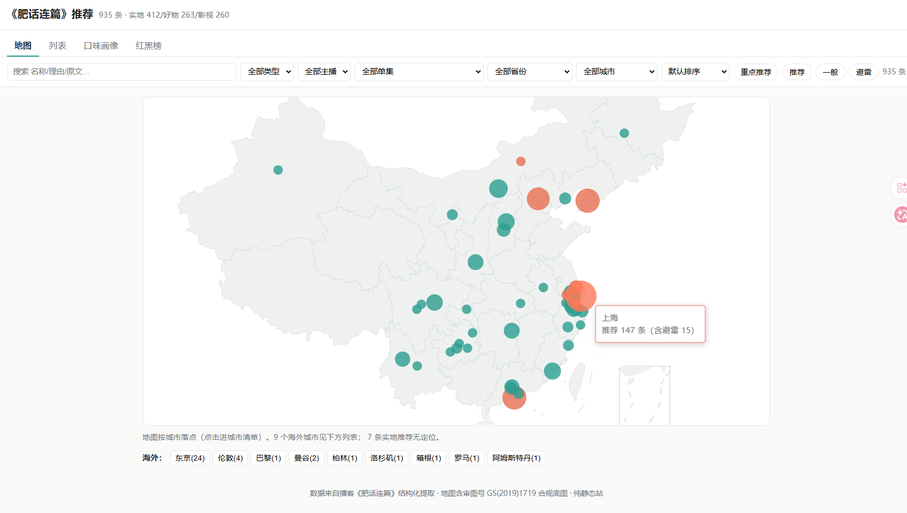
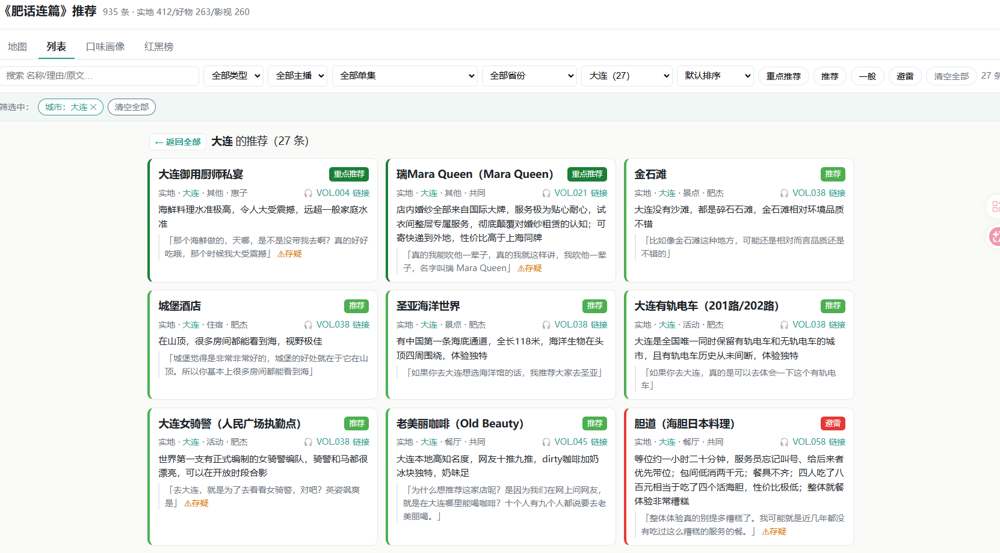

前两天在南京，刚好把《肥话连篇》历史上的 234 期播客全听完了。

这档节目里时不时会推荐点东西——某个城市的馆子、最近在追的剧、用着顺手的小物件。听的时候觉得不错，心里记一句"回头试试"，然后……就没有然后了。等过阵子真想找回来某家店叫什么，只能凭着模糊的印象在脑子里翻，基本翻不到。小宇宙的这个对音频里的文本的搜索能力目前是缺位的。

**听播客这件事的尴尬就在这儿：信息是流过去的，你很难在当下停下来做整理，事后又无从检索。**

但这次我手里正好有半套现成的工具，于是干脆让它自己长出了个解法。最后的成品是一张地图：

👉 **[《肥话连篇》推荐地图](https://feihua.lexgogo.site/web/)**

下面说说怎么做出来的。

## 起点：我本来就有半套工具

我之前做过一个 [VideoTranscriptAPI](https://github.com/zj1123581321/VideoTranscriptAPI)——一个音视频转录服务，能把小宇宙、YouTube、B 站的音频转成**区分说话人、并且经过 LLM 校对**的文字稿。这东西本来是给我那套[信息处理体系](https://mp.weixin.qq.com/s/w8VnWJcUp5VkD5J-fYCUrg)用的，这次要处理播客，自然第一个就想到它。

所以这件事的起点不是从零开始，而是"我手上正好有半套积木"。剩下的，就是让 Claude Code 在后台帮我把缺的那半套补齐。

## 做了什么：转录 → 提取 → 地图

整件事大致分三步，断断续续后台跑了两天。

**第一步，把声音变成字。** 先得抓下《肥话连篇》全部单集的链接——这一步本身就有个坎：小宇宙网页端默认只展示最近 10 集，想拿到全部 234 集的历史内容并不现实。好在这块我之前也探过，做[在线音视频消费记录](https://github.com/zj1123581321/online-video-history-server)的时候就研究过怎么抓小宇宙的历史列表，这次直接复用。

拿到全部链接，写脚本一股脑提交到我那台 VideoTranscriptAPI 的服务器。234 期音频排着队跑了大概一天，DeepSeek 的校对成本花了快 20 块。跑完，我就有了 234 篇区分说话人、校对过的文字稿。

（这中间还有个小插曲：ASR 总把主播的名字写错，得专门做一步人名归一，不然后面全乱。这种活儿正好适合丢给 AI 顺手解决。）

**第二步，把字变成结构化数据。** 光有文字稿没用，得把里面"推荐了什么"抠出来——是美食、影视剧还是产品，各自该有哪些字段，都要规整成统一的结构。

这一步我没写传统脚本，而是用了 Claude Code 最新的 **Workflow** 功能：对 234 篇稿子跑同一套提取逻辑。模型用的是成本更低的 Sonnet，并发大概 8，三四十分钟就全跑完了。比起自己写脚本，它更灵活——过程里冒出来的各种小毛病，它能边跑边处理掉。

这里我额外较了个真：每条推荐都要能**反查回原文出处**。这样既能确认不是模型自己编的，回头也能跳回播客原话去听上下文。处理这么多内容，"可信"比"好看"重要。

**第三步，把数据变成地图。** 这里没做到精确每家店的经纬度，只停留在城市层级——把推荐按城市聚到地图上。那具体某家店怎么找？取了个巧：高德地图网页版支持把搜索词直接嵌进 URL（类似 Google 那种 URL 搜索），所以点一下店名就能跳到高德里搜，精确定位的活儿就甩给高德了。整个可视化另起一个项目，部署到 Cloudflare 上。（顺带一提，地图底图特意用了带审图号的合规版本——这种细节不较真，哪天就出问题。）

## 成品

就是开头那张图：[《肥话连篇》推荐地图](https://feihua.lexgogo.site/web/)。

你可以按城市看节目里推荐过的馆子，也能切到列表翻影视剧和产品，每条都带着分类和推荐理由。再也不用对着"他们好像提过一家店"干着急了。

代码都在这里，有兴趣可以翻：[podcast-insights](https://github.com/zj1123581321/podcast-insights)。

## 一点感受

如果硬要总结，大概是这么几点：

一是**工程化**。这套东西本质是在几个现成组件之间搭积木——转录、提取、地图，各管一段，拼起来就成了。而且上量做批处理也不难，它有一个确定性的预期；不像 skill，本质上还得指望背后那个模型足够强。

二是 **Workflow 在这种场景下是真好用**。对几百篇内容跑同一套处理，这种规模化的活儿，workflow 比写脚本灵活太多。

三是这种"言出法随"的感觉，想到什么、几乎马上就能做出来，还是太爽了。

---
以上。
