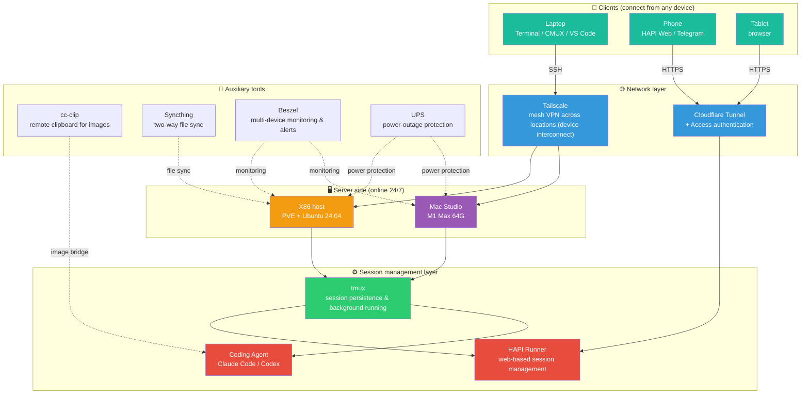
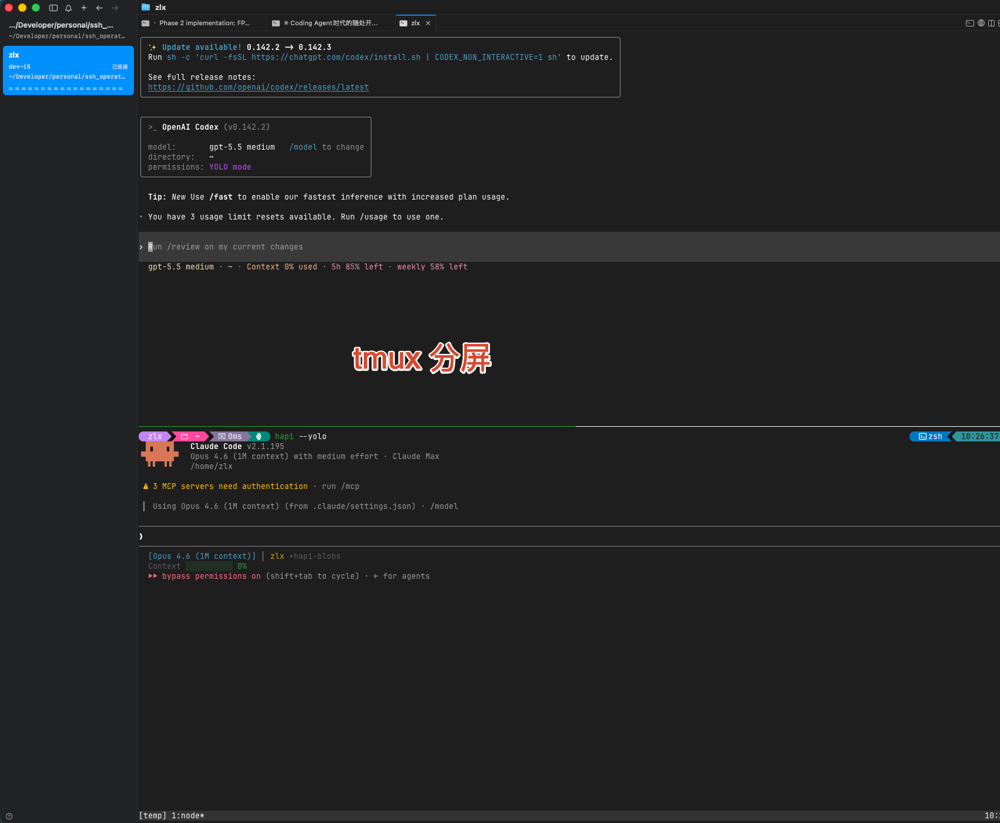
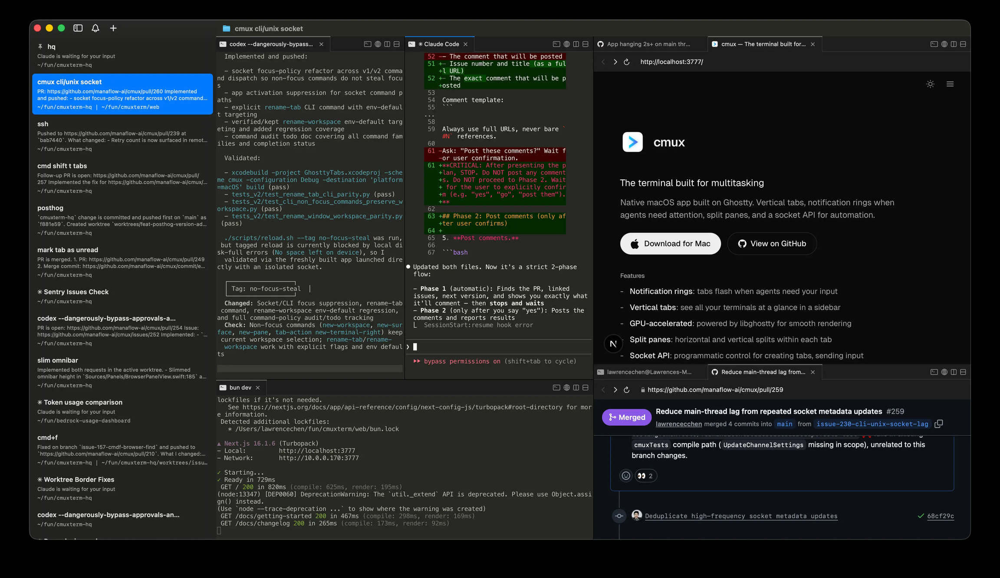
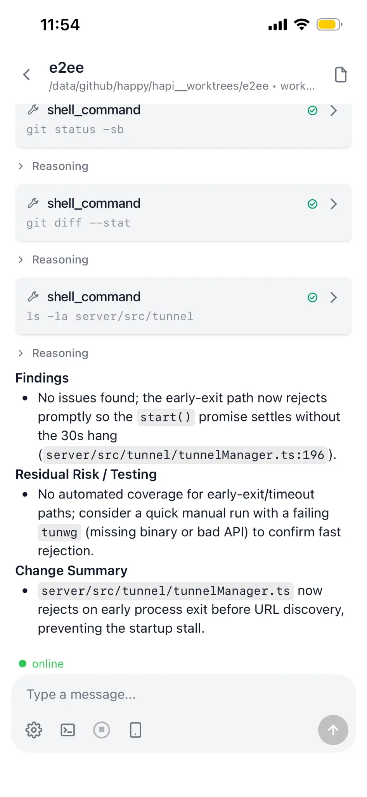
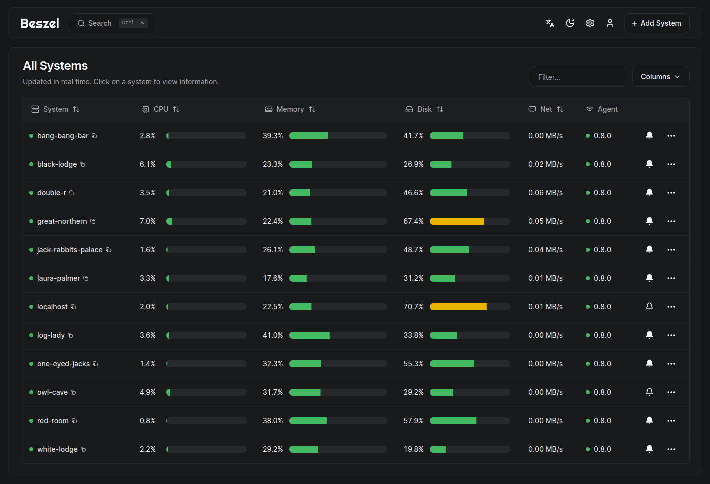

*Translated from the [Chinese original](/posts/260628-agent-era-dev-anywhere/). Last synced 2026-09-26.*

> This post is the development-environment installment of the "LLMs Eat Everything" series. For how to set up the hardware foundation, see the previous post, [The Agent's Home: A Personal Hardware Foundation for the AI Era](/en/posts/260329-ai-hardware-data-security/); for the software layer, see [The Tools I Grew Out of Using AI](https://mp.weixin.qq.com/s/w8VnWJcUp5VkD5J-fYCUrg) (published on my WeChat official account). This post is about: once hardware and software are both in place, how to keep your Agent online 24 hours a day while you connect from anywhere, at any time, on any device.
>
> Same rule as always — **as a human, all you need to understand is the architecture logic of this post. For every concrete software install and environment configuration, just hand this post to Claude Code or Codex and let it do the work.**

## 1. A Mindset Shift

I already said this in [the hardware post](/en/posts/260329-ai-hardware-data-security/): at the current pace Coding Agents are improving, I most likely won't ever buy a high-performance laptop again. My entire budget will migrate to a high-performance desktop machine. The only remaining need for a laptop on the go is a bigger screen to look at more comfortably — which is exactly why a portable, long-battery-life product like the MacBook Air fits the AI-era programming needs better.

A while back, word got out that Apple's supply chain costs were going to rise, so I ordered a MacBook Air M5 32G + 1T overnight — a nearly-new, in-warranty second-hand unit for 10,300 RMB (about $1,450), against a list price of 15,000 RMB (about $2,100). Within days of it arriving, Apple did raise prices across the line. Consider it a small dividend paid out on awareness.

Why the Air and not the Pro? Because in this era, **a laptop is nothing but a screen plus a keyboard.** All the compute, all the code repositories, all the running Coding Agent processes live on a remote server. The only thing the device in your hands has to do is — connect to it.

The core idea in one sentence:

> **A server that's online 24 hours a day runs the Coding Agent; every other device is a thin client that connects to it remotely.**

That is the underlying logic of this entire post. Everything below is built around this idea.

## 2. Architecture Overview

Let me start with a global topology diagram so you get the big picture. Each layer will be expanded one by one afterwards.



The whole architecture splits into four layers: **server → session management → network → clients**, plus a set of auxiliary tools. Let me expand layer by layer, from the inside out.

---

## 3. The Server: the Agent's 24/7 Home Base

### OS Choice: Why Not Windows

I recommend **Linux** or **Mac** as the server for a Coding Agent, and I don't recommend Windows.

The reason is simple: in the training data of large language models, an enormous share of the code, commands, and environment configurations is based on the Unix family (both Linux and Mac belong to it). When you ask an Agent to set up an environment and run commands on Windows, it keeps stumbling over things unrelated to the actual task — path formats, the permission model, package management, all of it works differently from Unix. You end up spending huge amounts of time debugging things that have nothing to do with your business. It's pointless.

What's more, the AI era has made the command line more convenient than the graphical interface again — Agents are naturally good at processing command-line instructions, not clicking a mouse. If you used to be intimidated by the command line, you can let that go now, because you don't need to type the commands yourself; just let the Agent type them.

### The Mac Route

For a Mac as server, there's exactly one principle: **prioritize memory above everything**.

A single Claude Code process routinely eats 800–900 MB of memory, and if you want to run several Agents in parallel for speed, memory becomes the hard bottleneck.

CPU, counterintuitively, matters much less. The baseline CPU performance of Apple's M-series chips is already very high; between M1 and M5, unless you're doing particularly heavy compilation or rendering, daily use makes the difference nearly imperceptible. Besides, the Agent mostly works in the background — if a task takes two or three extra minutes because of a CPU difference, you won't even notice.

Don't overthink the disk either. Mac storage is expensive, but a 256G or 512G internal disk for the system and common tools is enough; code repositories and large files can live entirely on an external multi-terabyte drive.

So my recommendation is a second-hand **M1 Max Mac Studio** — compared with the current M4/M5 machines, the same budget buys you more memory, and that's what actually matters. There's no point paying a premium for a newer chip. As for Mac mini vs. Mac Studio, it hardly matters — the core consideration is memory size.

> On the unique advantages of the Mac unified-memory architecture in the AI era, and on price trends in the hardware market, see [the hardware post](/en/posts/260329-ai-hardware-data-security/).

### The Linux Route

Recommended setup: **PVE underneath + Ubuntu 24.04 LTS, server edition without a desktop**.

A few concepts are involved, so let me explain them briefly first:

- **PVE (Proxmox VE)**: a virtual-machine management platform. You install it on the physical machine, then create and manage virtual machines inside it. The mental model: one physical computer can, through PVE, simulate several independent "virtual computers" that don't interfere with each other.
- **Ubuntu**: one of the most popular Linux operating systems, with an active community, abundant tutorials, and the most complete development-tool ecosystem.
- **Debian**: another Linux operating system, lighter and more stable than Ubuntu, but with slower package updates.
- **LTS (Long-Term Support)**: means the vendor keeps shipping security updates for several years — a good fit for servers that need to run stably for a long time.

Why not install Ubuntu directly on the bare metal, and instead install PVE first and virtual machines inside it? The core reason is **data safety**. PVE can package an entire virtual machine into a single image file for backup. Something goes wrong? Restore the image, and the whole environment, configuration, and data come back. That is far more convenient than repairing the system on bare metal.

Why Ubuntu rather than Debian? For development and running Coding Agents, Ubuntu's tool ecosystem is more complete. If you're only hosting a few small always-on services, Debian is the better fit.

The Linux route does have a higher barrier to entry — you at least need a basic grasp of SSH (explained in the next section). But its range of application is wider: essentially **any computer that can install Windows can install Linux**, so you don't need to buy new hardware.

And let me say it again: **you don't need to learn the tutorials yourself.** You only need to know "what I want to do"; leave the concrete operations to Claude Code connecting over SSH. Most of the time you'll just type a password and click a confirmation.

### Server Software: Coding Agents

The most important thing to install on the server is the Coding Agent itself — the AI that writes code for you.

What I currently use, mainly:

- **[Claude Code](https://docs.anthropic.com/en/docs/claude-code)**: Anthropic's official CLI tool, my daily driver
- **[Codex](https://github.com/openai/codex)**: OpenAI's CLI Agent
- **[OpenCode](https://opencode.ai/)**: the open-source option, kept as the lowest-level fallback
- **[Hermes](https://github.com/NousResearch/hermes-agent)**: an autonomous AI Agent from Nous Research; I mainly use it to bridge WeChat (China's dominant messaging app) communication and scheduled Agent tasks

None of these tools is complicated to install — just have the Agent look up the official docs and install itself.

---

## 4. SSH and tmux: The Bedrock of Remote Control

### What Is SSH?

If you've never touched a server, SSH is probably the first unfamiliar word you'll run into.

Have you ever used a remote desktop? Like Windows Remote Desktop, Mac Screen Sharing, or tools such as TeamViewer — you sit at your own computer, see the screen of another computer, and your mouse and keyboard operate that remote machine.

**SSH does the same thing as a remote desktop — it controls another computer remotely.** The only difference is that a remote desktop transmits the screen image, while SSH transmits text. When you connect to a server over SSH, what you see is a plain-text interface (the kind of black window where hackers type commands in the movies). You type instructions into it, the server executes them, and prints the results back as text. That black window has a proper name: the **Terminal** — this term will come up again and again in the rest of this post. All you need to know is that it's "that window where you interact with a computer in text."

Why not use a remote desktop instead? Because text is far lighter than pixels — SSH stays smooth even on a terrible network, while a remote desktop may already have degraded into a slideshow. And a Coding Agent works in a plain-text interface anyway, so SSH fits it perfectly.

In this architecture, SSH is the most fundamental connection method — you SSH from your laptop into the remote server, start Claude Code or Codex there, and start collaborating with the Agent. The whole process is encrypted; even if someone intercepts it, they can't read it.

**Passwordless SSH login** is a configuration I recommend. By default, every SSH connection asks for a password; with key-based login configured, a single command connects you. Let the Agent set it up — it's a matter of a few commands.

### tmux: Keeping the Agent Online Forever

tmux is **the single most critical piece of server software** in this architecture. No contest.

#### What Is tmux?

In plain language: tmux is a **"virtual desktop that never goes offline."**

Normally, you SSH into the server and start a Claude Code process to talk code with it. Then your network drops, your laptop lid closes, your phone locks — the SSH connection breaks, and the Claude Code process dies with it, taking the entire conversation context with it.

With tmux, your Claude Code process runs inside tmux's "virtual desktop." SSH disconnected? Doesn't matter. tmux keeps running in the background, and Claude Code keeps executing its task. When your network comes back, you SSH in again, run `tmux attach`, and the previous screen comes back exactly as it was — the Agent may already have finished writing your code.

That's why it matters so much: **tmux is what allows a Coding Agent to run 24 hours a day without interruption, completely unaffected by the state of your network or your devices.**

And tmux can open multiple "windows" within a single SSH connection, each running a different Agent task. Switch between them like browser tabs — very convenient.



#### tmux Gotchas I've Already Hit

tmux itself is neither hard to install nor hard to use, but there are several configuration pitfalls specific to the Coding Agent scenario. Handle them in advance or they'll hurt the experience:

**① Title passthrough**

While Claude Code and Codex run, they report their current status through the terminal title (that line of text at the top of your window/tab) — the little dot in the title moves or blinks while the Agent is working.

But many default tmux configurations don't propagate these title changes to your outer terminal tab. The result: you have to click into each one to see what each Agent is doing, which is painful when several are running at once.

With title passthrough configured, one glance at the tabs tells you which Agent is still running and which has stopped.

**② Bell notifications**

When Claude Code finishes a task or needs your input, it sends a bell signal (the terminal "ding"). tmux may not respond to it by default, leaving you sitting there waiting with no idea the Agent finished long ago. Once configured, the tmux status bar highlights the alert and the outer terminal triggers a system notification.

**③ Special key passthrough**

Tools like Codex use key combinations like Shift+Enter. tmux may not forward these keys by default, so pressing them does nothing.

**④ Escape delay**

tmux ships with a half-second delay after pressing Esc, which is annoying in interactive-heavy scenarios. Setting it to 0 fixes it.

I've hit all of these pitfalls already; my tmux configuration is in the appendix at the end of this post — just have the Agent copy it onto the server.

---

## 5. File Workflow: Reading Code and Moving Files Comfortably

Server and Agents are in place. The next question: code and files now live on a remote server — how do you browse and manage them conveniently?

### VS Code + Remote SSH: A Local-Like Development Experience

[VS Code](https://code.visualstudio.com/) (Visual Studio Code) is a free code editor from Microsoft — think of it as the programmer's "Word": writing code, reading code, and managing project files all happen inside it. It is currently the most popular code editor in the world, with an enormous supply of tutorials and extensions.

VS Code has an extension called Remote SSH (an "extension" is a add-on package that adds functionality to software). Once installed, you can **browse and edit files on the remote server directly inside your local VS Code UI** — it looks and feels exactly like working on local files, while the files actually live on the remote server.

When the network is decent, you can browse the remote directory structure, read code, and copy file paths to give the Agent instructions — a very smooth experience.

But it's better suited to text and code, which are small. Large files — a PDF or Excel file of several hundred MB — get very laggy when opened over the network.

### Syncthing: Two-Way Sync for Large Files

For the bigger files in your repositories — Excel sheets, design files, datasets in the tens or hundreds of MB — I recommend [Syncthing](https://syncthing.net/) for two-way sync.

Syncthing is an open-source file synchronization tool. The mental model: it builds an "automatic conveyor belt" between your local computer and the remote server. You edit an Excel file locally and hit save, and it syncs the change to the server; the Agent generates a new file on the server, and it syncs back to your machine automatically.

Compared with the laggy experience of forcing large files open through VS Code Remote SSH, Syncthing lets you open and edit them locally in native apps like Excel or WPS Office (Kingsoft's office suite, ubiquitous in China) — a far better experience.

### SMB Shares: The Fallback for Ad-hoc File Transfers

Sometimes you just want to push a file to the server or pull one down, outside everything Syncthing is configured to sync.

**SMB** is a file-sharing protocol — you've probably used "shared folders" at work: in Windows Explorer or Finder you can see folders your colleagues shared and drag files into them. SMB is the technology behind that. You can share a folder on the remote server, then open it from your laptop or phone and copy files in and out as if it were a USB drive.

Just have the Agent set up an SMB share on the server — the configuration isn't complicated.

### cc-clip: Pasting Screenshots Remotely

This is an open-source tool I help maintain (I contributed the Windows client), and it solves a very specific pain point: **you spot a problem on a web page locally and want to send a screenshot to the remote Claude Code for analysis — how?**

Your screenshot sits in your local clipboard, but Claude Code runs on a remote server — a direct paste won't cross over.

[cc-clip](https://github.com/ShunmeiCho/cc-clip) exists to solve exactly this. It runs a small service on your local machine and, via SSH port forwarding (you don't need to understand that detail), "bridges" your local clipboard onto the remote server. The effect: you take a screenshot locally, paste directly in the remote Claude Code terminal, and the image crosses over — **completely seamlessly**.

The experience is excellent on macOS; Windows support is experimental.

---

## 6. Clients: Connect from Whatever Device You Have

With the server side fully ready, the next question is what device and what tools to connect with.

This part **doesn't involve that many hard rules** — for clients, whatever works comfortably for you is right. But there are experience differences per device worth mentioning.

### Desktop: Terminal Tools

The simplest option is of course VS Code's built-in terminal, which supports multiple instances. But when you want several different projects running Agents in parallel at the same time, VS Code's multi-window management gets tiring.

I recommend a proper terminal tool instead (that "black window" from earlier). A dedicated terminal can open many tabs at once, each tab attached to one tmux session — everything at a glance. Often you don't even need to open VS Code: you know what the topic is, and you just talk to the Agent in the terminal.

**Windows:** Windows Terminal is enough; it's first-party from Microsoft.

**Mac:** I recommend [CMUX](https://github.com/manaflow-ai/cmux). It's built on the Ghostty rendering engine (GPU-accelerated) and specifically optimized for the AI Coding Agent workflow:

- **Notification system**: when an Agent needs your attention (waiting for input, task finished), the pane shows a blue glow, the tab highlights, and you get a system-level notification — no need to keep staring at the screen
- **Sidebar**: shows the current git branch, PR status, working directory, and more
- **Built-in browser**: view your dev server's page right inside the terminal, no window switching



Of course there are many terminal tools on the Mac — iTerm2, Ghostty, and Warp all work. CMUX's edge is its deep integration with the AI Agent workflow. Note that **CMUX is macOS-only**.

### Phone: HAPI (Highly Recommended)

Phones do have SSH clients that can reach back to the server, but honestly — the screen is tiny and the keyboard is awful; reading Claude Code output and typing commands on a phone is a terrible experience.

And there's a more important reason: **risk-control safety**. I analyzed this in detail in my post on [Claude Code risk control](/en/posts/claude-code-risk-model-philosophy/): the sensor information a phone app can reach (GPS location, cell-tower info, system timezone, and so on) goes far beyond what you can disguise at the network layer. For services with risk-control policies, installing a native client on your phone amounts to handing over your physical location voluntarily. That's why on my phone I only use the PWA web versions of Claude and ChatGPT (a PWA is a web page "installed" to the phone's home screen that looks like a native app but is really still the browser running it, and it can't get at the phone's sensor data), and **every interaction with my Coding Agents goes through HAPI** — the phone is nothing but a display terminal and exposes none of its sensor information.

I recommend [HAPI](https://github.com/tiann/hapi).

#### What Does HAPI Do?

In plain language: **HAPI turns the Claude Code command-line interface into a web page you can operate from your phone's browser.**

But it's far more than "terminal as a web page." HAPI has three parts:

1. **CLI**: wraps the Claude Code and other Agent processes on the server, syncing session state out in real time
2. **Hub**: a central service that stores the session data and presents it to you as a web page
3. **Runner**: a background daemon — with it, you can start a brand-new Agent session straight from the phone's web page, without first SSH-ing in, opening tmux, and typing commands

#### Why Is It Better than SSH from the Phone?

1. **Rendering optimization**: HAPI's web UI adjusts width and font size to the phone screen automatically — a reading experience in a completely different league from squinting at tmux
2. **One-tap approvals**: when the Agent needs you to confirm something, one tap does it — no fumbling on a tiny keyboard
3. **Seamless handoff**: you're talking with the Agent on your computer and have to head out — open HAPI's web page on your phone and take over the session right where it was. Back home, switch back to the computer — **zero context lost**
4. **PWA support**: mentioned earlier — a PWA installs the web page to your home screen as an app. HAPI supports it too, so you're not opening the browser and typing a URL every time
5. **Telegram integration**: when an Agent task finishes, it can push a notification to your Telegram
6. **Multi-Agent management**: Claude Code, Codex, and OpenCode can all be managed from one place



When I'm out, this is basically all I do — connect back through HAPI and talk to Claude Code. Paired with a voice keyboard on the phone, the experience is genuinely decent. Down the road, a foldable phone plus HAPI — with the bigger screen — should resolve the last of the pain.

---

## 7. Networking: What Makes Anytime-Anywhere Possible

Server and clients are set; one link is still missing in the middle — **the network**.

Normally your server sits on your home LAN (the local network your home Wi-Fi covers) and is reachable only from that same Wi-Fi. But the entire point of this exercise is "anytime, anywhere" — you can't stay home forever.

Buying a public IP (so the outside internet can reach your home server directly)? Expensive and insecure — it's like leaving your front door wide open onto the street.

So you need two network solutions working together.

### Tailscale: One Secure Virtual Wi-Fi for All Your Devices

What [Tailscale](https://tailscale.com/) does, in plain language: **no matter which physical network your devices are on — home Wi-Fi, the office network, a café's Wi-Fi, your phone's 4G — it pulls them all into the same virtual LAN.**

The mental model: Tailscale builds an "invisible private Wi-Fi" for all your devices. Only you can see and access this virtual network; the rest of the world has no idea it exists.

Once it's installed, you can SSH to your home server with the internal address Tailscale assigned, from a bullet train or a trip abroad, as if you were sitting at home.

**And it's free for personal use.**

#### NAT and Peer Relay

One concept is involved here: **NAT**. Simply put, NAT is a way your home router works — it lets all the devices in your home share a single public IP to access the internet. The side effect: devices on the outside can't actively reach devices inside your home.

Tailscale tries hard to make two devices talk to each other directly (called "hole punching"). But if both sides' NAT is too strict and punching fails, Tailscale relays the data through its globally distributed relay servers (called DERP). It works, but adds some latency.

[Peer Relay](https://tailscale.com/docs/features/peer-relay) is an advanced feature: **you can designate one of your own devices that has a public IP as a relay node.** Relaying through your own public server beats going through Tailscale's overseas public relays — lower latency, faster speed.

The setup is simple: Alibaba Cloud and Tencent Cloud (Chinese cloud providers) both sell lightweight servers for 99 RMB a year (about $14), with roughly 3 Mbps of bandwidth — the amount of data shuttling back and forth while writing code is tiny, so that's plenty. All you do is install the Tailscale client on that server and enable the Peer Relay feature; Tailscale will then automatically route through it when the network is bad, guaranteeing baseline connection quality. Achieving this used to require building your own complicated relay service; now it's one config option. Highly recommended.

> An analogy: DERP ≈ "parcels relayed through Tailscale's public courier stations, which are overseas and far away"; Peer Relay ≈ "you bought your own courier relay station nearby — much closer."

### Cloudflare Tunnel + Access: Reaching HAPI from Your Phone

Tailscale solves "device-to-device interconnection." If your phone also runs Tailscale, you can open HAPI in the browser directly via the internal IP Tailscale assigned — no problem at all.

But there's a catch on phones: Tailscale runs as a VPN, and a phone can only run one VPN app at a time. If you're also using other network tools, they conflict. That's when you need a fallback that doesn't depend on a VPN — [Cloudflare Tunnel](https://developers.cloudflare.com/cloudflare-one/connections/connect-networks/).

**What Cloudflare Tunnel does is expose a service on your server to the public internet securely, bound to your own domain.** All you need is a domain (the cheapest ones run about a dozen RMB a year, a couple of dollars), and the whole world can reach the service you designate through that domain.

An analogy: your home is normally accessible only to family. Cloudflare Tunnel builds an encrypted private corridor between your home and the public internet — outsiders can reach in only by walking that corridor through the domain you set up. Anyone outside the corridor sees nothing.

In our scenario, you expose the HAPI Hub through Cloudflare Tunnel; your phone's browser visits your domain and operates HAPI directly, no Tailscale VPN required.

#### Access: One More Lock on the Door

Although HAPI has its own login authentication, if you want more assurance you can stack [Cloudflare Access](https://developers.cloudflare.com/cloudflare-one/policies/access/) on top.

Access's logic: **require the user to verify their identity before they ever touch your web page** — via email verification codes, Google sign-in, and so on. Only your own email gets through. Everyone else never even sees what the page looks like.

HAPI auth + Cloudflare Access, two layers stacked, and even exposed to the public internet there's no security concern.

By the way: Tailscale, Cloudflare Tunnel, and Cloudflare Access are **all free**. It's hard to imagine services of this caliber costing nothing — I use them heavily and have barely paid a cent.

---

## 8. Security and Stability

Finishing the architecture isn't the finish line. For a system online 24x7, you must make sure it **runs stably** and the data **never gets lost**.

### Data Backup

Take data safety seriously. Multiple backups, multiple machines, even off-site backups. **The value of your data is orders of magnitude higher than the cost of storing it.**

I wrote about concrete backup strategies in detail (the 3-2-1 principle, PVE image cross-backup, 115 Cloud Drive — a Chinese cloud storage service) in [the hardware post](/en/posts/260329-ai-hardware-data-security/); I won't repeat it here.

### UPS: Blackout Insurance for ~300 RMB

A UPS (uninterruptible power supply) is an inline battery unit that keeps your server from dying instantly when the power cuts out, buying you enough time to shut down safely and avoid data corruption.

Don't underestimate this box — a sudden outage can corrupt data being written and leave PVE virtual machines in a broken state; repairing that costs far more than a UPS. On JD.com (a major Chinese e-commerce retailer) they run three to four hundred RMB (about $40–60). Completely worth it.

### Beszel: Monitoring and Alerts across Devices

Once your devices and virtual machines multiply, you need to know whether they're all actually healthy.

[Beszel](https://beszel.dev/) is an open-source, free, lightweight server monitoring tool. You install a tiny Agent (a few MB) on each device, and a Hub on one machine as the dashboard — one web page shows CPU, memory, disk, temperature, and network status for every device.

Crucially, it supports alerts: memory nearly full, CPU pegged, a machine went offline — it sends you a notification, and you then have Claude Code SSH in and investigate.



Compared with heavyweight stacks like Grafana + Prometheus that need a pile of components wired together, Beszel's advantage is **minimalism** — a single binary deployed, five minutes done.

---

## 9. Four Payoffs of This Setup

### 1. The Local Device No Longer Matters

All the important code and repositories live on the remote server. Your local laptop can lose power, shut down, or drop off the network at any moment without affecting the Agent at all.

It even works in reverse — signal dropping in and out on a high-speed train? No problem. When you have signal, sync the progress and fire off a few commands for the Agent to continue; when you don't, it keeps running in the server's background anyway. **You can actually put those fragmented hours to work, with the Agent toiling in the background.**

### 2. Switching Devices Is Nearly Free

When I switched from a Windows laptop to a MacBook Air recently, there was almost nothing to migrate locally — the important repositories live on GitHub and the dev machines, and everything else is in cloud drives. Configure SSH key login, and the new device is immediately ready to work.

### 3. Data Is Safer

Macs have Time Machine, and PVE can snapshot and back up entire virtual machines off-site. Restore at any time when something breaks. Compared with the traditional model of piling everything onto one laptop, this is far safer.

### 4. Better Value for Money

The more consumer electronics chase portability and integration, the more premium you pay for "small." But in the Coding Agent era, all we need from the client is a screen to view results — it doesn't need horsepower of its own.

Pile the entire compute budget into the server — the Mac Studio has no screen, keyboard, or mouse, dissipates heat well, performs strongly, and costs less per unit of compute. A Linux host even more so. **Thin clients + a strong server turn out to be the most economical option.**

---

## Closing Thoughts


On this setup, my Coding Agent is online 24 hours a day. At home, at the office, on a high-speed train, or abroad over the May Day holiday — wherever the network reaches, I can reach my Agent. Laptop, phone, tablet — any device works.

I've run this setup across multiple cities and all kinds of network conditions without a single failure.

One more time: **as a human, all you need to understand is the architecture of this method.** For all the execution-level work, send this post to your Claude Code or Codex, let it read it, then tell it what you want to set up, and it will get it done for you.

One practical tip: services like Tailscale and Cloudflare mentioned above all support creating API keys. As long as you hand the Coding Agent SSH access and the relevant API keys, it can handle most of the configuration end to end, without you clicking through admin consoles. **But once configuration is complete, revoke or rotate those API keys promptly** to avoid key leaks. One special warning: if you're on a third-party relay service rather than the official API, never let any sensitive key information appear in your conversations — the relay operator may see what you say.

---

## Appendix: Reference Material and Gotchas for Agents

> The following is aimed at Coding Agents (Claude Code / Codex and the like). If you're a human reader, feel free to skip it — send your Agent the link to this post and it will come read this section on its own.

### Server Environment Setup

| Component | Reference docs | Gotchas |
|------|---------|--------|
| PVE | [Proxmox VE Installation](https://pve.proxmox.com/wiki/Installation) | After install, the enterprise apt repository (subscription required) is enabled by default; you must switch to the `pve-no-subscription` repository or `apt update` will fail |
| Ubuntu 24.04 LTS | [Ubuntu Server Guide](https://ubuntu.com/server/docs/installation) | Choose the server edition (no desktop); allocate 16G+ of memory to each VM |
| tmux | config below | Requires tmux 3.2+; older versions don't support `extended-keys` and `allow-passthrough`. Check with `tmux -V` |

#### tmux Config Reference (write to `~/.tmux.conf`)

```bash
# ======== Baseline experience ========
set -g default-terminal "tmux-256color"
set -as terminal-features ",*:RGB"
set -g mouse on                # mouse support
set -g history-limit 50000     # scrollback buffer
set -g escape-time 0           # eliminate ESC delay
set -g focus-events on

# ======== Window/pane numbering starts at 1 ========
set -g base-index 1
setw -g pane-base-index 1
set -g renumber-windows on

# ======== Keep current directory when splitting ========
bind '"' split-window -v -c "#{pane_current_path}"
bind '%' split-window -h -c "#{pane_current_path}"
bind 'c' new-window -c "#{pane_current_path}"

# ======== Status bar ========
set -g status-right-length 60
set -g status-left-length 20

# ======== vi copy mode ========
setw -g mode-keys vi
bind -T copy-mode-vi v send -X begin-selection
bind -T copy-mode-vi y send -X copy-selection-and-cancel

# ======== Quick config reload ========
bind r source-file ~/.tmux.conf \; display "Config reloaded"

# ======== Terminal title passthrough ========
# Let Claude Code / Codex title changes propagate to the outer terminal tab
set -g set-titles on
set -g set-titles-string "#{pane_title}"
setw -g allow-rename on
set -g allow-passthrough on

# ======== Task notifications: bell signal ========
# When Claude Code finishes a task: tmux status-bar highlight + passthrough to the outer terminal
set -g monitor-bell on
set -g bell-action any
set -g visual-bell both
set -g window-status-bell-style "fg=red,bold"

# ======== Special key passthrough ========
# Let Shift+Enter and other combos reach tools like Codex correctly
set -g extended-keys on
set -as terminal-features 'xterm*:extkeys'
```

### Network Configuration

| Component | Reference docs | Gotchas |
|------|---------|--------|
| Tailscale | [Download](https://tailscale.com/download) | Runs as a VPN on phones and conflicts with other VPN/proxy apps. Mitigate by letting specific devices forward traffic via an Exit Node, but the barrier is higher |
| Tailscale Peer Relay | [Peer Relay Docs](https://tailscale.com/docs/features/peer-relay) | Requires Tailscale >= 1.86; configure with `tailscale set --relay-server-port=40000`; verify with `tailscale status \| grep peer-relay` |
| Cloudflare Tunnel | [Get Started](https://developers.cloudflare.com/cloudflare-one/connections/connect-networks/get-started/) | Prerequisite: the domain's NS records must point to Cloudflare; run `cloudflared` as a systemd service for auto-start (`sudo cloudflared service install`); in config.yml set url to `http://localhost:<HAPI Hub port>` |
| Cloudflare Access | [Access Policies](https://developers.cloudflare.com/cloudflare-one/policies/access/) | Configured in the Zero Trust Dashboard; the Telegram Mini App requires HTTPS, which Tunnel provides out of the box |

### Clients and Tools

| Tool | Reference docs | Gotchas |
|------|---------|--------|
| VS Code Remote SSH | [official docs](https://code.visualstudio.com/docs/remote/ssh) | Configure Host and key-based login in `~/.ssh/config` first |
| Syncthing | [Getting Started](https://docs.syncthing.net/intro/getting-started.html) | You must configure `.stignore` to exclude `node_modules`, `.git`, and similar directories; pause Agent writes during the first sync of a large repository to avoid conflicts |
| cc-clip | [GitHub](https://github.com/ShunmeiCho/cc-clip) | After install, `cc-clip setup <SSH host name>` deploys automatically; requires `xclip` or `wl-paste` on the remote; diagnose with `cc-clip doctor --host <host>`; authenticates with user-level tokens — not suitable for shared servers |
| CMUX | [GitHub](https://github.com/manaflow-ai/cmux) | `brew tap manaflow-ai/cmux && brew install --cask cmux`; macOS only |
| HAPI | [installation docs](https://github.com/tiann/hapi/blob/main/docs/guide/installation.md) | For the npm global install, prefer the official registry (regional mirrors may lack platform packages); for remote mode use `hapi hub --relay` + `hapi runner start`; Telegram integration needs `TELEGRAM_BOT_TOKEN` and `HAPI_PUBLIC_URL` (HTTPS required) |
| Beszel | [Getting Started](https://beszel.dev/guide/getting-started) | Agent and Hub communicate over SSH; configure an SSH key when adding a device for the first time |

---

> Drafted from voice memos recorded in Feishu (Lark, ByteDance's workplace collaboration suite) and transcribed to text with Doubao; the article's structure and content were organized through conversations with Claude Code + Opus 4.6. Images come from the official websites plus gpt image 2.
