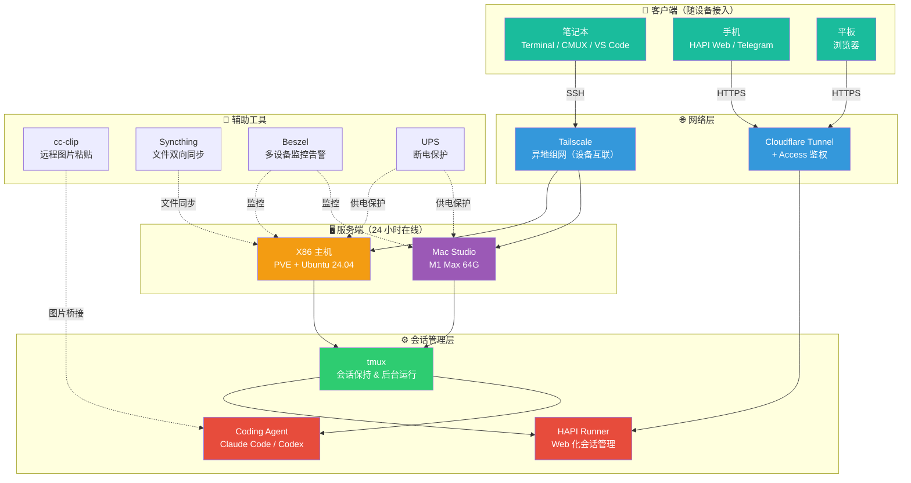
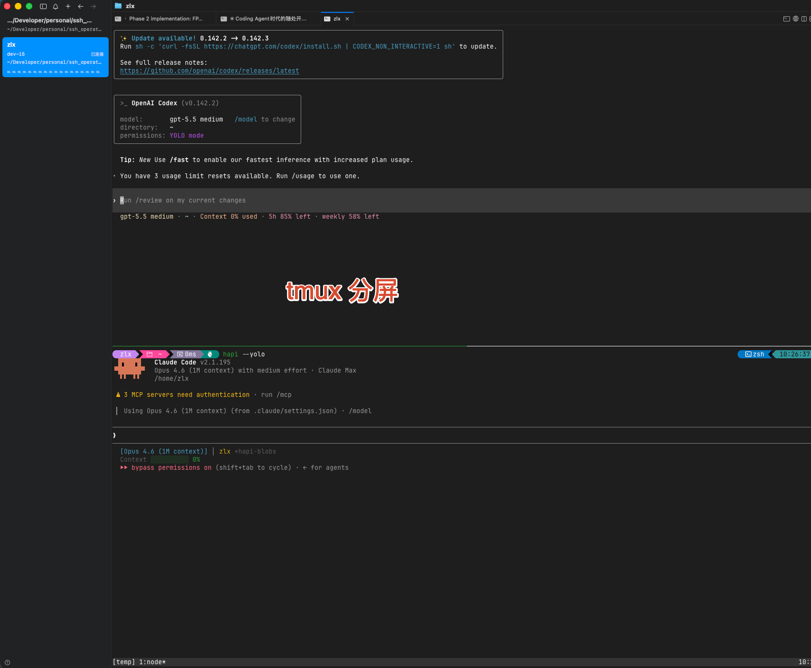
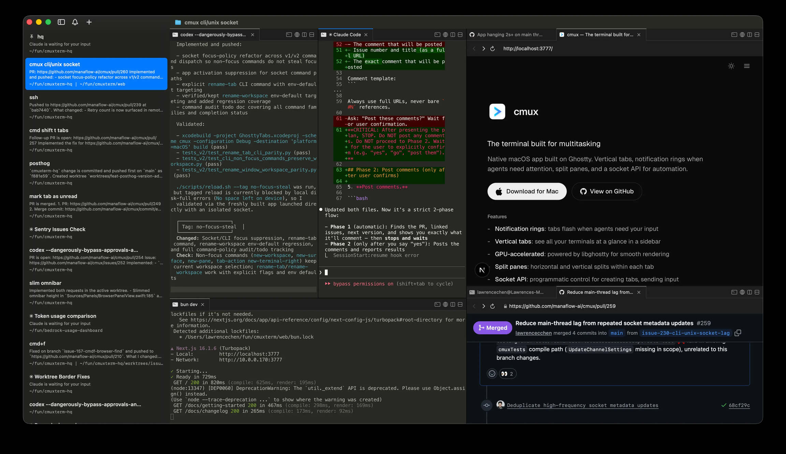
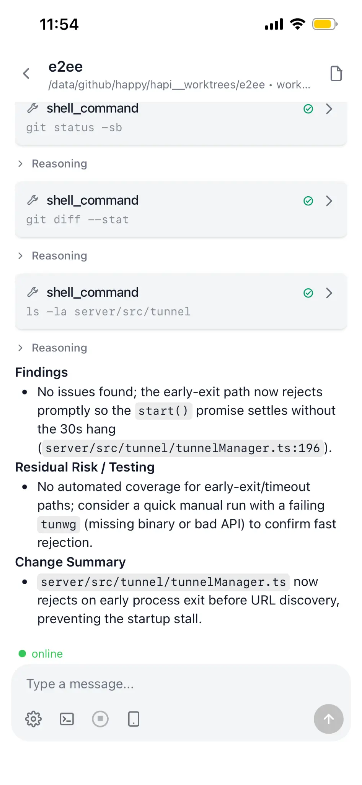
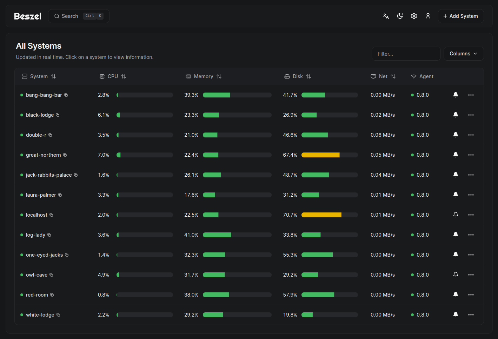

> 本文是「LLM 吞噬一切」系列的开发环境篇。硬件基座怎么搭，见上一篇 [Agent 的家，AI 时代个体的硬件基座](../260329-ai-hardware-data-security/)；软件层怎么搭，见 [我用 AI 长出来的那些工具](https://mp.weixin.qq.com/s/w8VnWJcUp5VkD5J-fYCUrg)。这篇聊的是：硬件和软件都就位以后，怎么让你的 Agent 24 小时在线，而你可以随时随地、用任何设备接入。
>
> 还是那句话——**作为人类，你只需要读懂这篇文章的架构逻辑。所有具体的软件安装、环境配置，把这篇文章丢给 Claude Code 或 Codex，让它去执行就行。**

## 一、一个认知转变

在 [硬件篇](../260329-ai-hardware-data-security/) 里我就提过：按 Coding Agent 当前的发展速度，我大概率不会再买高性能笔记本了。所有预算会迁移到高性能主机上。笔记本出门唯一的需求就是更大的屏幕看得更舒服——MacBook Air 这种便携续航型产品，才更符合 AI 时代编程的需求。

前阵子听说苹果供应链成本要上涨，连夜就订了一台 MacBook Air M5 32G + 1T，准新在保二手 10,300 块，同款原价 15,000。收到手没几天，苹果果然全线涨价。也算享受了一下认知变现的红利。

为什么买 Air 不买 Pro？因为在这个时代，**笔记本只是一块屏幕加一个键盘**。所有的算力、所有的代码仓库、所有正在跑的 Coding Agent 进程，全都在远程的服务器上。你手里的设备只需要做一件事——连上去。

核心思路就一句话：

> **24 小时在线的服务器跑 Coding Agent，所有其他设备都是远程接入的瘦客户端。**

这是整篇文章的底层逻辑。下面的所有内容，都是围绕这个思路展开的。

## 二、架构总览

先上一张全局拓扑图，让你有个整体概念。后面每一层会逐个展开。



整套架构分四层：**服务端 → 会话管理 → 网络 → 客户端**，再加一组辅助工具。从里到外逐层展开。

---

## 三、服务端：Agent 的 24 小时大本营

### 系统选型：为什么不用 Windows

推荐用 **Linux** 或 **Mac** 做 Coding Agent 的服务器，不建议用 Windows。

原因很简单：大语言模型的训练数据里，大量的代码、命令、环境配置都是基于 Unix 体系（Linux 和 Mac 都属于这个体系）的。你让 Agent 在 Windows 上帮你装环境、跑命令，它会在各种和主线业务无关的事情上反复踩坑——路径格式、权限模型、包管理方式，全都跟 Unix 不一样。你会花大量时间在跟业务无关的事情上来回纠错，很没有意义。

而且 AI 时代反倒让命令行变得比图形界面更方便了——Agent 天然擅长处理命令行指令，而不是点鼠标。如果你之前对命令行有畏惧感，现在反而可以放下了，因为你不需要自己敲命令，让 Agent 去敲就行。

### Mac 路线

Mac 做服务器，核心就一个原则：**优先堆内存**。

一个 Claude Code 进程动辄八九百兆内存，你想并行开多个 Agent 提速，内存就是硬瓶颈。

CPU 反而没那么重要。Mac M 系列芯片的 CPU 性能本身基准线就很高了，M1 到 M5 之间的差异，除非是特别重的编译或渲染任务，日常使用很难体感到区别。况且大部分时候 Agent 是在后台工作的，就算某个任务因为 CPU 差异多花个两三分钟，对你来说也无关紧要。

硬盘也不用太纠结。Mac 的硬盘贵，但你只需要 256G 或 512G 的内置硬盘装系统和常用工具就够了，代码仓库和大文件完全可以外接一个几 TB 的移动硬盘解决。

所以推荐买二手的 **M1 Max Mac Studio**——相比当前 M4/M5 的新机型，同预算能买到更大的内存，这才是最实际的。没必要为更新的芯片付溢价。

> 关于 Mac 统一内存架构在 AI 时代的独特优势，以及硬件市场的价格趋势，详见 [硬件篇](../260329-ai-hardware-data-security/)。

### Linux 路线

推荐方案：**PVE 底层 + Ubuntu 24.04 LTS 无桌面版**。

这里涉及几个概念，先简单解释一下：

- **PVE（Proxmox VE）**：一个虚拟机管理平台。你把它装在物理机上，然后在它里面创建和管理虚拟机。你可以理解成——你的一台物理电脑通过 PVE 可以模拟出好几台独立的"虚拟电脑"，彼此互不影响。
- **Ubuntu**：最流行的 Linux 操作系统之一，社区活跃，教程多，开发工具生态最完善。
- **Debian**：另一个 Linux 操作系统，比 Ubuntu 更轻量稳定，但软件包更新慢一些。
- **LTS（长期支持版）**：意味着官方会持续提供安全更新好几年，适合服务器这种需要长期稳定运行的场景。

为什么不直接在物理机上装 Ubuntu，而要先装 PVE 再装虚拟机？核心是为了**数据安全**。PVE 可以把整个虚拟机打包成一个镜像文件来备份。出了问题？恢复镜像就行，所有环境、配置、数据都回来了。这比直接在裸机上修系统方便太多了。

为什么选 Ubuntu 而不是 Debian？做开发、跑 Coding Agent 的场景，Ubuntu 的工具生态更完善。如果你只是跑一些长期在线的小服务，Debian 更合适。

Linux 路线的门槛确实会高一点，你至少需要对 SSH 有个基本概念（下一节会解释）。但重申一下：**你不需要自己学教程。** 你只需要知道"我要做什么"，具体的操作让 Claude Code 通过 SSH 连上去帮你搞定。你大部分时候只是输个密码、点个确认。

### 服务端软件：Coding Agent

服务器上最核心要装的就是 Coding Agent 本身——也就是那个替你写代码的 AI。

我目前主要用的是：

- **[Claude Code](https://docs.anthropic.com/en/docs/claude-code)**：Anthropic 官方的 CLI 工具，我的主力
- **[Codex](https://github.com/openai/codex)**：OpenAI 的 CLI Agent
- **[OpenCode](https://github.com/opencode-ai/opencode)**：开源方案，作为最底层的备用
- **[Hermes](https://github.com/anthropics/hermes)**：Anthropic 的多 Agent 编排工具

这些工具的安装本身都不复杂，让 Agent 自己去查官方文档装就行。

---

## 四、SSH 和 tmux：远程控制的基石

### SSH 是什么？

如果你从来没接触过服务器，SSH 可能是你遇到的第一个陌生词。

你用过远程桌面吗？比如 Windows 的远程桌面、Mac 的屏幕共享、或者 TeamViewer 这类工具——你在自己的电脑上，能看到另一台电脑的屏幕画面，鼠标键盘操作的也是那台远程电脑。

**SSH 和远程桌面做的是同一件事——远程控制另一台电脑。** 区别只是：远程桌面传输的是画面，而 SSH 传输的是文字。你通过 SSH 连到服务器后，看到的是一个纯文字的界面（类似电影里黑客敲命令的那种黑色窗口），你在里面打字下达指令，服务器执行完把结果用文字显示出来。这个黑色窗口有个专业名称叫**终端（Terminal）**——后面的文章会反复提到这个词，你知道它就是"那个用文字跟电脑交互的窗口"就行了。

为什么不用远程桌面？因为文字比画面轻得多——SSH 在网络很差的情况下依然很流畅，远程桌面可能已经卡成幻灯片了。而且 Coding Agent 本身就是在纯文字界面里工作的，用 SSH 刚好。

在我们这套架构里，SSH 是最基础的连接方式——你在自己的笔记本上通过 SSH 连到远程服务器，然后在服务器上启动 Claude Code 或 Codex，就可以开始和 Agent 协作了。整个过程是加密的，别人截获了也看不懂。

**SSH 免密登录**是一个推荐的配置。默认每次 SSH 连接都要输密码，配好免密登录后直接一条命令就连上去了。这个让 Agent 帮你配就行，几条命令的事。

### tmux：让 Agent 永不掉线

tmux 是这套架构里**最关键的服务端软件**，没有之一。

#### tmux 是什么？

用大白话说：tmux 就是一个**"后台不掉线的虚拟桌面"**。

正常情况下，你通过 SSH 连到服务器，开了一个 Claude Code 进程跟它聊代码。这时候如果你的网络断了、笔记本合盖了、手机锁屏了——SSH 连接断开，Claude Code 进程也跟着死掉，之前聊的上下文全没了。

有了 tmux，你的 Claude Code 进程跑在 tmux 的"虚拟桌面"里。SSH 断了？没关系，tmux 还在后台跑着，Claude Code 照样在执行它的任务。等你网络恢复了，重新 SSH 连进去，`tmux attach` 一下，之前的界面原封不动地回来了——Agent 可能已经帮你把代码写完了。

这就是为什么它如此重要：**tmux 保证了 Coding Agent 可以 24 小时不间断运行，完全不受你的网络状态和设备状态影响。**

而且 tmux 还能在一个 SSH 连接里开多个"窗口"，每个窗口跑一个不同的 Agent 任务。你可以用标签页切换查看，非常方便。



#### tmux 的踩坑经验

tmux 本身不难装不难用，但有几个专门针对 Coding Agent 场景的配置坑，不提前处理会影响体验：

**① Title 透传**

Claude Code 和 Codex 在运行过程中，会通过终端标题（就是你窗口/标签页最上面显示的那行文字）来显示当前状态——运行时标题里的小圆点会不断移动或闪烁。

但很多 tmux 的默认配置不会把这个标题变化传递到你的外层终端标签页上。结果就是你得一个个点进去才能看每个 Agent 现在是什么状态，同时开好几个的时候就很痛苦。

配置好 title 透传后，你直接扫一眼标签页就能判断哪个 Agent 还在跑、哪个已经停了。

**② Bell 通知**

Claude Code 任务完成或需要你输入的时候会发一个 bell 信号（就是终端"叮"一声那个）。tmux 默认可能不响应这个信号，导致你坐在那干等也不知道 Agent 其实已经做完了。配置好之后，tmux 状态栏会高亮提示，外层终端也会触发系统通知。

**③ 特殊按键透传**

Codex 等工具会用到 Shift+Enter 这样的组合键。tmux 默认可能不转发这些按键，导致按了没反应。

**④ Escape 延迟**

tmux 默认按 Esc 键后有半秒延迟，对需要频繁交互的场景很烦人，设成 0 就好了。

#### 我的 tmux 配置参考

以下是我在开发机上实际使用的配置，已经踩完了上面所有的坑。你可以直接让 Agent 把这段配置写到服务器的 `~/.tmux.conf` 文件里：

```bash
# ======== 基础体验 ========
set -g default-terminal "tmux-256color"
set -as terminal-features ",*:RGB"
set -g mouse on                # 支持鼠标操作
set -g history-limit 50000     # 回滚缓冲区
set -g escape-time 0           # 消除 ESC 延迟
set -g focus-events on

# ======== 窗口/面板编号从 1 开始 ========
set -g base-index 1
setw -g pane-base-index 1
set -g renumber-windows on

# ======== 分屏时保持当前目录 ========
bind '"' split-window -v -c "#{pane_current_path}"
bind '%' split-window -h -c "#{pane_current_path}"
bind 'c' new-window -c "#{pane_current_path}"

# ======== 状态栏 ========
set -g status-right-length 60
set -g status-left-length 20

# ======== vi 复制模式 ========
setw -g mode-keys vi
bind -T copy-mode-vi v send -X begin-selection
bind -T copy-mode-vi y send -X copy-selection-and-cancel

# ======== 快速重载配置 ========
bind r source-file ~/.tmux.conf \; display "Config reloaded"

# ======== 终端标题透传 ========
# 让 Claude Code / Codex 的标题变化同步到外层终端标签页
set -g set-titles on
set -g set-titles-string "#{pane_title}"
setw -g allow-rename on
set -g allow-passthrough on

# ======== 任务通知：bell 信号 ========
# Claude Code 完成任务时，tmux 状态栏高亮 + 透传到外层终端
set -g monitor-bell on
set -g bell-action any
set -g visual-bell both
set -g window-status-bell-style "fg=red,bold"

# ======== 特殊按键透传 ========
# 让 Shift+Enter 等组合键正确传递给 Codex 等工具
set -g extended-keys on
set -as terminal-features 'xterm*:extkeys'
```

---

## 五、文件交互：怎么舒服地看代码、传文件

服务端和 Agent 都就位了，接下来的问题是：代码和文件都在远程服务器上，怎么方便地查看和管理？

### VS Code + Remote SSH：本地般的开发体验

[VS Code](https://code.visualstudio.com/) 是微软出品的一款免费代码编辑器，可以理解成程序员的"Word"——写代码、看代码、管理项目文件都在里面。它是目前全世界最流行的代码编辑器，教程和插件极其丰富。

VS Code 有一个叫 Remote SSH 的插件（插件就是给软件加功能的扩展包），装上之后，你可以**在本地的 VS Code 界面里直接浏览和编辑远程服务器上的文件**——看起来跟操作本地文件一模一样，但实际上文件都存在远程服务器上。

在网络比较好的情况下，你可以浏览远程服务器的目录结构、查看代码、复制文件路径来给 Agent 下指令，体验非常顺滑。

但它更适合文本和代码这类比较小的文件。几百兆的 PDF、Excel 这种大文件，通过网络打开就会很卡。

### Syncthing：大文件双向同步

对于仓库里那些比较大的文件——几十兆的 Excel、设计稿、数据集——推荐用 [Syncthing](https://syncthing.net/) 做双向同步。

Syncthing 是一个开源的文件同步工具。你可以理解成它在你的本地电脑和远程服务器之间建了一个"自动搬运通道"：你在本地改了 Excel 保存，它会自动把改动同步到服务器上；服务器上 Agent 生成了新文件，也会自动同步到你本地。

比起在 VS Code Remote SSH 里硬打开大文件的卡顿体验，Syncthing 让你在本地用 Excel、WPS 等原生应用打开和编辑，体验好得多。

### SMB 共享：临时传文件的兜底

有时候你就是临时想往服务器传个文件，或者从服务器拉个文件下来，不在 Syncthing 配好的同步范围内。

**SMB** 是一种文件共享协议——你可能用过公司里的"共享文件夹"，在"我的电脑"或 Finder 里能看到同事共享出来的文件夹，可以直接往里面拖文件。SMB 就是背后的技术。你可以在远程服务器上共享一个文件夹，然后在你的笔记本或手机上打开它，像操作 U 盘一样直接复制粘贴文件。

让 Agent 在服务器上配一个 SMB 共享就行，配置不复杂。

### cc-clip：远程截图粘贴

这是一个我参与维护的开源工具（我贡献了 Windows 版本的客户端），解决一个很具体的痛点：**你在本地看到一个前端页面的问题，想截图发给远程的 Claude Code 分析，怎么办？**

你的截图在本地剪贴板里，但 Claude Code 跑在远程服务器上——直接粘贴粘不过去。

[cc-clip](https://github.com/ShunmeiCho/cc-clip) 就是为了解决这个问题。它在你本地跑一个小服务，通过 SSH 的端口转发机制（你不用理解这个细节），把你本地的剪贴板"桥接"到远程服务器上。效果就是：你在本地截图，然后在远程 Claude Code 的终端里直接粘贴，图片就过去了，**完全无感**。

macOS 上体验非常好，Windows 上是实验性支持。

---

## 六、客户端：随设备接入

服务端一切就绪后，接下来就是用什么设备、什么工具连过去。

这块**没有那么多讲究**——客户端更多是你个人用着顺手就行。但针对不同设备，有一些体验差异值得说。

### 电脑端：Terminal 工具

最简单的当然是用 VS Code 内置的终端，它也能多开。但当你想同时开几个不同的项目并行运行 Agent 的时候，VS Code 的多窗口管理还是有点累。

更推荐用专业的终端工具（就是前面说的那个"黑色窗口"）。专业终端工具可以同时开很多标签页，每个标签页连一个 tmux 会话，一目了然。很多时候你甚至不需要打开 VS Code，因为你清楚议题是什么，直接在终端里跟 Agent 聊就行了。

**Windows：** Windows Terminal 就够用了，微软官方出品。

**Mac：** 推荐 [CMUX](https://github.com/manaflow-ai/cmux)。它基于 Ghostty 渲染引擎（GPU 加速），专门为 AI Coding Agent 的工作流做了优化：

- **通知系统**：Agent 需要你关注时（比如等待输入、任务完成），窗格会显示蓝色光环，标签页高亮，还有系统级通知——你不用一直盯着屏幕
- **侧边栏**：显示当前 git 分支、PR 状态、工作目录等信息
- **内置浏览器**：可以直接在终端里看 dev server 的页面，不用切窗口



当然 Mac 上的终端工具很多——iTerm2、Ghostty、Warp 都可以。CMUX 的优势是对 AI Agent 工作流的深度集成。注意 **CMUX 仅 macOS**。

### 手机端：HAPI（重点推荐）

手机上虽然也有 SSH 客户端可以连回服务器，但说实话——手机屏幕那么小，键盘那么难按，在上面看 Claude Code 的输出、敲命令，体验非常差。

而且还有一个更重要的原因：**风控安全**。我在 [风控篇](../claude-code-risk-model-philosophy/) 里详细分析过，手机 APP 能获取的传感器信息（GPS 定位、基站信息、系统时区等）远超你通过网络层面能伪装的范围。对于有风控策略的服务来说，在手机上装原生客户端等于主动把自己的物理位置交出去。所以我在手机上只使用 Claude 和 ChatGPT 的 PWA 网页版（PWA 就是把网页"安装"到手机桌面上，打开后看起来像原生 APP，但本质上还是浏览器在跑，不会获取手机传感器信息），**所有和 Coding Agent 的交互都走 HAPI**——手机只是一个显示终端，不会暴露任何手机端的传感器信息。

我更推荐 [HAPI](https://github.com/tiann/hapi)。

#### HAPI 做了什么？

用大白话说：**HAPI 把 Claude Code 的命令行界面变成了一个网页，让你用手机浏览器就能操作。**

但它远不只是"终端转网页"。HAPI 由三个部分组成：

1. **CLI**：在服务器上包裹 Claude Code 等 Agent 的进程，实时把会话状态同步出去
2. **Hub**：一个中心服务，把会话数据存起来，并通过网页展示给你
3. **Runner**：一个后台守护进程——有了它，你可以直接从手机网页上启动一个全新的 Agent 会话，不需要先 SSH 进去、开 tmux、再敲命令

#### 为什么比手机 SSH 好？

1. **渲染优化**：HAPI 的网页端会根据手机屏幕大小自动调整宽度和字体，阅读体验跟在 tmux 里硬看完全不同
2. **一键审批**：Agent 需要你确认什么操作的时候，点一下就行，不用在小键盘上敲
3. **无缝切换**：你在电脑上正跟 Agent 聊着，临时要出门——打开手机上的 HAPI 网页，直接接管这个会话继续工作。回到家再从电脑切回来，**完全没有上下文丢失**
4. **PWA 支持**：前面提过，PWA 可以把网页安装到桌面当 APP 用。HAPI 同样支持，不用每次打浏览器输网址
5. **Telegram 集成**：Agent 任务完成后，可以推送到你的 Telegram 通知你
6. **多 Agent 管理**：Claude Code、Codex、OpenCode 都可以在一个入口管理



我自己出门基本就是用 HAPI 连回去和 Claude Code 聊。手机上配合语音输入法，体验其实还行。未来折叠屏手机 + HAPI，屏幕大了，基本就解决了最后的痛点。

---

## 七、网络：随时随地的保障

有了服务端和客户端，中间还差一环——**网络**。

正常情况下，你的服务器在家里的局域网里（局域网就是你家 WiFi 覆盖的那个网络），只有连着同一个 WiFi 才能访问。但我们做这一切的目的就是"随时随地"——你不可能永远待在家里。

买一个公网 IP（让外网能直接访问你家服务器）？又贵又不安全——相当于把家门直接对着大街敞开了。

所以需要两个网络方案互相配合。

### Tailscale：把所有设备拉进同一个安全的虚拟 WiFi

[Tailscale](https://tailscale.com/) 做的事情用大白话说就是：**不管你的设备在哪个物理网络上——家里的 WiFi、公司的网络、咖啡厅的 WiFi、手机的 4G——它都能把这些设备拉进同一个虚拟的局域网里。**

你可以理解成：Tailscale 给你所有设备建了一个"隐形的专属 WiFi"。这个虚拟网络只有你自己能看到和访问，别人完全不知道它的存在。

装好之后，你在高铁上、出国旅游，都可以用 Tailscale 分配的内网地址直接 SSH 到家里的服务器，就像你坐在家里一样。

**而且它对个人免费。**

#### NAT 和 Peer Relay

这里涉及一个叫 **NAT** 的概念。简单说，NAT 就是你家路由器的一种工作方式——它让你家里的设备共用一个公网 IP 上网。副作用是外面的设备没法主动找到你家里的设备。

Tailscale 会尽量让两个设备之间直接通信（叫"打洞"）。但如果两边的 NAT 都很严格，打洞失败了，Tailscale 就会通过它全球分布的中继服务器（叫 DERP）来转发数据。能用，但会增加一些延迟。

[Peer Relay](https://tailscale.com/docs/features/peer-relay) 是一个进阶功能：**你可以把自己网络里的某台设备指定为中继节点**。比如你的服务器网络出口比较好，就让它当中继——比走 Tailscale 的公共中继站更快。

> 类比：DERP ≈ "走 Tailscale 的公共快递站中转"，Peer Relay ≈ "让你家门口的邻居帮你转交，更近更快"。

### Cloudflare Tunnel + Access：手机访问 HAPI 的方案

Tailscale 解决了"设备之间互联"的问题。如果你手机上也装了 Tailscale，直接用 Tailscale 分配的内网 IP 在浏览器里访问 HAPI 就可以了，完全没问题。

但手机上有个麻烦：Tailscale 作为 VPN 运行，手机上同一时间只能开一个 VPN 应用。如果你同时在用别的网络工具，就会冲突。这时候你就需要一个不依赖 VPN 的备选方案——[Cloudflare Tunnel](https://developers.cloudflare.com/cloudflare-one/connections/connect-networks/)。

**Cloudflare Tunnel 做的事情就是：把你服务器上的某个服务安全地暴露到公网上，绑定到你自己的域名。** 你只需要一个域名（最便宜的一年十几块钱），就可以让全世界通过这个域名访问你指定的服务。

打个比方：你家本来只有家里人能进。Cloudflare Tunnel 相当于在你家和公网之间建了一条加密的专用通道——别人通过你设置的域名走这条通道才能访问。通道之外的人什么都看不到。

在我们这个场景里，你把 HAPI Hub 通过 Cloudflare Tunnel 暴露出去，手机浏览器直接访问你的域名就能操作 HAPI，不需要开 Tailscale VPN。

#### Access：再加一道锁

虽然 HAPI 本身有登录鉴权，但如果你希望更保险，可以再叠一层 [Cloudflare Access](https://developers.cloudflare.com/cloudflare-one/policies/access/)。

Access 的逻辑是：**在用户接触到你的网页之前，先要求他验证身份**——支持邮箱验证码、Google 登录等方式。只有你自己的邮箱才能通过验证。其他人连页面长什么样都看不到。

HAPI 鉴权 + Cloudflare Access，两层防护叠起来，即使暴露在公网上也没有安全顾虑。

顺便提一句：Tailscale、Cloudflare Tunnel、Cloudflare Access，**全都是免费的**。很难想象这种级别的服务竟然不花钱——我自己重度使用，但也确实没怎么付过费。

---

## 八、安全与稳定性

架构搭完不是终点。7x24 小时在线的系统，你需要确保它**稳定运行**、数据**不会丢失**。

### 数据备份

一定要做好数据安全。多备份、多机备份、甚至异地备份。**数据的价值远远高于存储的成本。**

具体的备份策略（3-2-1 原则、PVE 镜像互通、115 网盘等），我在 [硬件篇](../260329-ai-hardware-data-security/) 里详细写过，这里不重复展开。

### UPS：300 块的断电保险

UPS（不间断电源）就是一块前置电源，保证突然断电时你的服务器不会立刻关机，给你充足的时间安全关机，避免数据损坏。

别小看这个东西——突然断电可能导致正在写入的数据损坏、PVE 虚拟机状态异常，修起来比买 UPS 贵多了。京东上三四百块钱，非常值得。

### Beszel：多设备监控告警

设备和虚拟机多了以后，你需要知道它们是不是都在正常运行。

[Beszel](https://beszel.dev/) 是一个开源免费的轻量级服务器监控工具。你在每台设备上装一个极小的 Agent（只有几 MB），然后在一台机器上装一个 Hub 作为仪表盘——一个网页看到所有设备的 CPU、内存、磁盘、温度、网络状态。

最关键的是它可以设置告警：内存快满了、CPU 跑满了、某台机器断线了——给你发通知，你再让 Claude Code SSH 连进去排查。



比起 Grafana + Prometheus 那种需要配一堆组件的重量级方案，Beszel 的优势就是**极简**——单个程序部署，五分钟搞定。

---

## 九、这套体系的四个好处

### ① 本地设备不重要了

所有重要的代码和仓库都在远程服务器上。你本地的笔记本随时断电、关机、断网，都不影响 Agent 的运行。

甚至反过来——在高铁上信号断断续续？没关系。有信号的时候把进度同步回来，发几个命令让 Agent 继续执行；没信号的时候它反正在服务器后台跑着。**你反而可以利用这些碎片时间让 Agent 在后台持续工作。**

### ② 设备迁移成本极低

我这次从 Windows 笔记本切换到 MacBook Air，本地几乎没有什么要迁移的——重要的仓库都在 GitHub 和开发机上，其他资料都在云盘里。配好 SSH 免密登录，新设备立刻就能接入工作。

### ③ 数据安全性高

Mac 有 Time Machine，PVE 可以对整个虚拟机做快照和异地备份。出了问题随时恢复。比起所有东西都堆在一台笔记本里的传统模式，安全性高太多了。

### ④ 性价比更高

消费电子越追求便携和集成，你就要为"体积小"付溢价。但 Coding Agent 时代，我们需要的只是屏幕来查看效果，不需要客户端有多强的算力。

把计算预算全堆到服务器上——Mac Studio 没有屏幕键盘鼠标，散热好性能强，同算力的成本更低。Linux 主机就更是了。**瘦客户端 + 强服务端，反而是最经济的方案。**

---

## 写在最后


基于这套体系，我的 Coding Agent 24 小时在线。不论在家、在公司、在高铁上、还是五一出国玩，只要网络连得到，我就能随时随地和 Agent 建立联系。笔记本、手机、平板——什么设备都行。

我自己在多个城市、多种网络环境下都走这套体系，没有出过问题。

再强调一遍：**作为人类，你只需要懂整套方法的架构。** 所有执行层的工作，把这篇文章发给你的 Claude Code 或 Codex，让它读完，然后告诉它你想搭什么，它会替你完成。

补充一个实操小技巧：上面提到的 Tailscale、Cloudflare 这些服务，都支持创建 API Key。你只要把 SSH 权限和相关的 API Key 给到 Coding Agent，很多配置它可以直接帮你一条龙搞定，不需要你在各个管理后台来回点。**但配置完成后，一定要及时撤销或轮换这些 API Key**，避免密钥泄露。特别提醒：如果你用的不是官方 API 而是第三方中转服务，千万不要在对话里出现任何敏感的密钥信息——你的对话内容可能会被中转方看到。

---

## 附录：给 Agent 的参考资料与踩坑经验

> 以下内容面向 Coding Agent（Claude Code / Codex 等）。如果你是人类读者，可以跳过这部分——把整篇文章的链接发给你的 Agent，它会自己来读这一节。

### 服务器环境搭建

| 组件 | 参考文档 | 踩坑点 |
|------|---------|--------|
| PVE | [Proxmox VE Installation](https://pve.proxmox.com/wiki/Installation) | 安装后默认启用企业 apt 源（需订阅），必须改成 `pve-no-subscription` 源，否则 `apt update` 会报错 |
| Ubuntu 24.04 LTS | [Ubuntu Server Guide](https://ubuntu.com/server/docs/installation) | 选无桌面版（Server），虚拟机建议分配 16G+ 内存 |
| tmux | 配置见正文第四节 | 需要 tmux 3.2+，低版本不支持 `extended-keys` 和 `allow-passthrough`。用 `tmux -V` 检查版本 |

### 网络配置

| 组件 | 参考文档 | 踩坑点 |
|------|---------|--------|
| Tailscale | [Download](https://tailscale.com/download) | 手机上作为 VPN 运行，与其他 VPN/代理应用冲突。可通过 Exit Node 让特定设备转发流量来缓解，但门槛较高 |
| Tailscale Peer Relay | [Peer Relay Docs](https://tailscale.com/docs/features/peer-relay) | 需要 Tailscale >= 1.86；配置命令 `tailscale set --relay-server-port=40000`；验证 `tailscale status \| grep peer-relay` |
| Cloudflare Tunnel | [Get Started](https://developers.cloudflare.com/cloudflare-one/connections/connect-networks/get-started/) | 前提：域名 NS 需指向 Cloudflare；`cloudflared` 建议配为 systemd 服务自启动（`sudo cloudflared service install`）；config.yml 中 url 写 `http://localhost:<HAPI Hub 端口>` |
| Cloudflare Access | [Access Policies](https://developers.cloudflare.com/cloudflare-one/policies/access/) | 在 Zero Trust Dashboard 中配置；Telegram Mini App 要求 HTTPS，Tunnel 自带 HTTPS 正好满足 |

### 客户端与工具

| 工具 | 参考文档 | 踩坑点 |
|------|---------|--------|
| VS Code Remote SSH | [官方文档](https://code.visualstudio.com/docs/remote/ssh) | 先在 `~/.ssh/config` 配好 Host 免密登录 |
| Syncthing | [Getting Started](https://docs.syncthing.net/intro/getting-started.html) | 必须配 `.stignore` 排除 `node_modules`、`.git` 等目录；首次同步大仓库时暂停 Agent 写入避免冲突 |
| cc-clip | [GitHub](https://github.com/ShunmeiCho/cc-clip) | 安装后 `cc-clip setup <SSH Host名>` 全自动部署；需要远程有 `xclip` 或 `wl-paste`；出问题用 `cc-clip doctor --host <host>` 诊断；使用用户级 token 认证，不适合共享服务器 |
| CMUX | [GitHub](https://github.com/manaflow-ai/cmux) | `brew tap manaflow-ai/cmux && brew install --cask cmux`；仅 macOS |
| HAPI | [安装文档](https://github.com/tiann/hapi/blob/main/docs/guide/installation.md) | npm 全局安装建议用官方 registry（国内镜像可能缺平台包）；远程模式用 `hapi hub --relay` + `hapi runner start`；Telegram 集成需设 `TELEGRAM_BOT_TOKEN` 和 `HAPI_PUBLIC_URL`（需 HTTPS） |
| Beszel | [Getting Started](https://beszel.dev/guide/getting-started) | Agent 和 Hub 通过 SSH 通信，首次添加需配 SSH Key |

---

> 本文由飞书录音豆语音转文字构思底稿，通过 Claude Code + Opus 4.6 对话完成文章架构设计与内容整理。图片来自于官网+ gpt image 2 。
