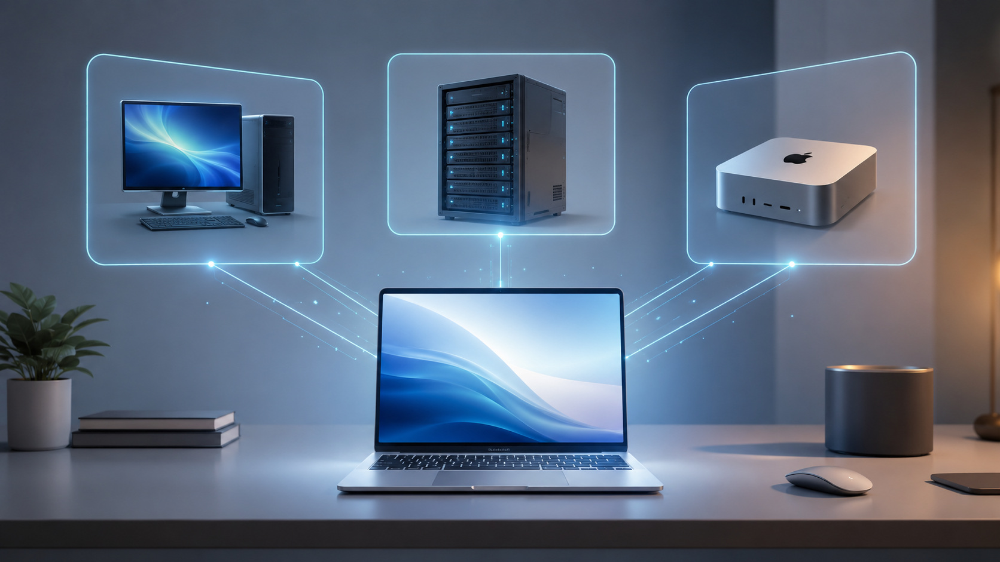
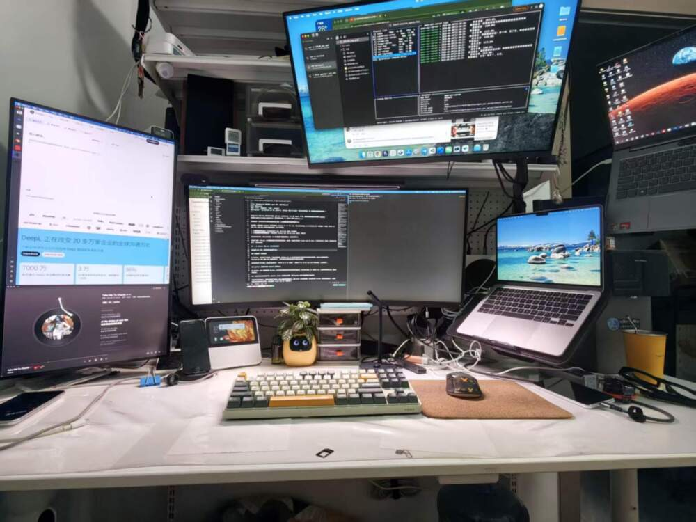
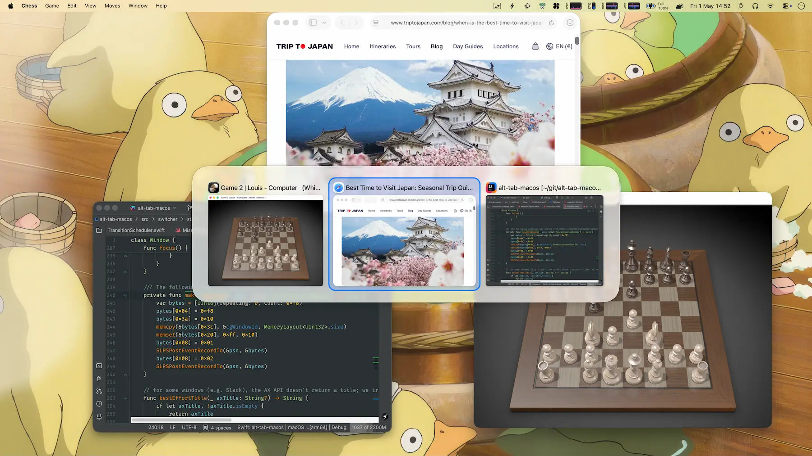
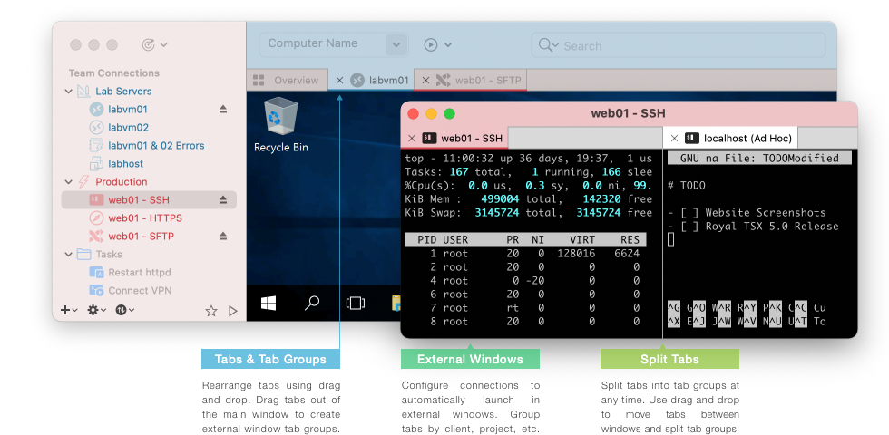
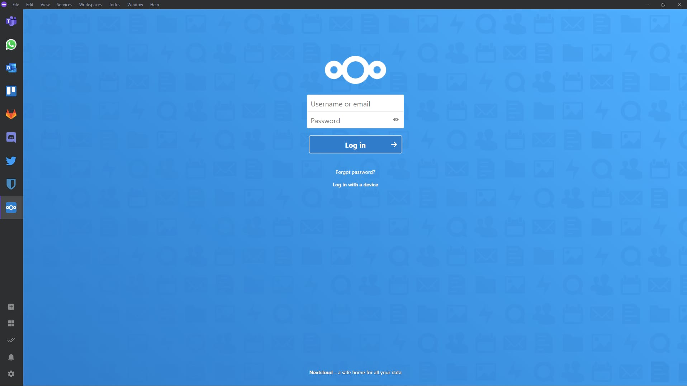
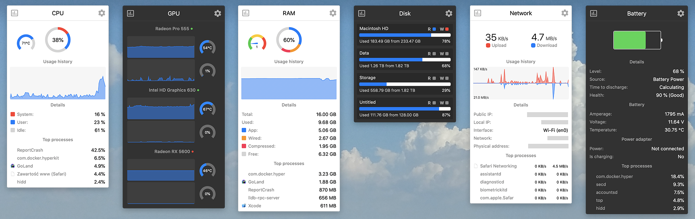

本文是「LLM 吞噬一切」系列的客户端篇。远端 24h 大本营怎么搭，见上一篇 [Agent 不下班：随时随地随设备的开发体系](/posts/260628-agent-era-dev-anywhere/)；硬件基座怎么选，见 [Agent 的家](/posts/...)。

这篇聊的是：当你的开发主力都在远端服务器上跑着，**手里这台笔记本到底该装什么**。

先说背景。我最近刚从 Windows 笔记本切到了 MacBook Air M5 32G。在上一篇文章里我就提过，这个时代笔记本只是一块屏幕加一个键盘，所以买 Air 不买 Pro。这台 MBA 不承担长期开发任务，它只干两件事：

1. **临时性的本机小活**：给本机软件提个 bug、改个小工具、管理一下云端服务
2. **当云端所有机器的遥控台**：远程桌面连 Windows 主机、SSH 进 Linux 虚拟机、管理文件

所以这份软件清单，本质上是在回答：**一台"遥控器"级别的笔记本，怎么配才顺手**。



还是那个原则：作为人类，你只需要知道自己有没有类似的痛点。如果有，把这篇文章丢给 Claude Code 或 Codex，让它帮你找方案、装软件。我的选择只是参考，不是标准答案。

## 一、从 Windows 切到 Mac：两个曾经的顾虑

在决定换 Mac 之前，有两件事让我犹豫了很久。

### 外接屏幕：三块变两块

在 Windows 上我外接了三块屏幕，工作区非常宽裕。MacBook Air M5 芯片在开盖状态下最多原生支持两块外接屏幕。超出这个数量需要借助 DisplayLink 方案（通过 USB 传输视频信号），但它的显示效果和稳定性都不如原生支持到位。

最终还是接受了这个限制。我现在外接两块屏：一块小米 34 寸 2K 带鱼屏，一块普通 27 寸 2K 屏。加上 MBA 自带的屏幕，三块也够用了。

### Quicker：曾经离不开的 Windows 自动化工具

在 Windows 上我一直重度使用 Quicker。它可以很方便地做各种自动化操作和快速启动，设计得非常直观。我一度觉得，Mac 上如果没有类似的工具，我就很难切过来。

Mac 上确实没有完全对标的产物。RayCast、uTools 这些都差点意思，没有 Quicker 那种"所见即所得"的直觉感。

但最终我还是切过来了。原因不是找到了替代品，而是**需求本身在消失**。随着 Agent 能力越来越强，我发现自己用 Quicker 的频率越来越低了。以前需要靠自动化脚本解决的事情，现在直接跟 Claude Code 说一句就搞定了。

有点像泡面和外卖的关系：不是泡面变难吃了，而是外卖太方便了，从另一个维度解决了同一个问题。

## 二、多屏：让 2K 外屏在 Mac 上能用



这一节是我觉得信息增量最高的部分。多屏在 Windows 上几乎是零配置的事，到了 Mac 上坑不少。

### BetterDisplay：2K 屏的救命稻草

这是整个多屏体验里**最关键**的一个软件。

问题出在 macOS 的显示缩放策略上。Mac 的 Retina 显示逻辑是为 4K 及以上分辨率设计的：4K 屏用 2 倍缩放，等效于 1080p 的布局但保持 4K 的清晰度，效果非常好。

但 2K 屏就很尴尬了。2K（2560x1440）用 2 倍缩放，等效分辨率只有 720p，能显示的内容太少；用 1 倍缩放，字又小得看不清。macOS 原生没有给 2K 屏一个好的中间方案。

BetterDisplay 的解法是：在 2K 屏上强行开启 HDPI 模式，创建一个虚拟的高分辨率，然后缩放到 2K 屏上显示。效果类似于让 macOS 以为连接了一块高分辨率屏幕，用更高分辨率渲染后再缩放到 2K 屏上显示。

不过这个方案**只适用于标准比例的 2K 屏**。我的 27 寸 2K 屏开了 HDPI，效果勉强可用。但那块 34 寸带鱼屏（3440x1440）就不行了——带鱼屏的分辨率本来就不高，开 HDPI 等于再砍一半显示面积，字大得离谱，完全没法用。所以带鱼屏我用的是原生分辨率，不开 HDPI。带鱼屏要真正解决这个问题，得上 5K 分辨率（5120x2160）。

诚实说：**即便是 27 寸 2K 屏开了 HDPI，也只是勉强可用**。跟 MBA 自带那块屏幕的素质差距依然明显——文字边缘没那么锐利，颜色也差一截。但比不开好太多了，至少不会看着难受。

如果预算允许，直接买 4K 屏是最彻底的解法。但如果你和我一样已经有了 2K 屏不想换，BetterDisplay 是必装的。

### eqMac：让外接屏幕的音箱音量键重新生效

这是一个很小但很恼人的问题。

我的外接屏幕通过 HDMI 连接，音频走 HDMI 数字通道输出到屏幕自带的音箱。但 macOS 在检测到 HDMI 数字音频输出后，键盘上的音量键直接灰掉了，按了没反应。你只能去系统设置里手动拖音量条，或者去音箱上拧物理旋钮。

eqMac 接管了系统的音频输出，让键盘音量键重新能控制外接音箱的音量。它本身还是个均衡器，但我用它纯粹就是为了这一个功能。

### 窗口管理三件套

| 工具 | 解决什么 |
|---|---|
| **Stay** | 每次插拔外屏，所有窗口位置全乱。Stay 按显示器配置记忆窗口位置，插上自动归位 |
| **AltTab** | macOS 原生 Cmd+Tab 功能太简陋：只显示应用图标，看不到窗口内容；而且所有屏幕的窗口混在一起。AltTab 解决两个问题：一是切换时能**实时预览**每个窗口正在做什么，不用盲猜；二是可以设置**只切换当前屏幕的窗口**，多屏工作时不会被其他屏幕的窗口干扰 |
| **Rectangle** | 键盘快速分屏。Windows 用户的肌肉记忆，Win+方向键分屏，Rectangle 把这个体验搬到了 Mac 上 |



这三个我觉得对任何 Mac 多屏用户来说都是刚需，不展开了。

## 三、外接键盘：用 Windows 模式 + 改键，反而更好

这一节的核心工具是 **Karabiner-Elements**。

### 问题：第三方键盘的 Mac 模式是个坑

很多第三方键盘号称支持 Mac 模式，做了键位兼容。但实际用下来，兼容往往是半吊子的。

我用的是一把米物（MIIIW）键盘。它的 Mac 模式会把自己伪装成 Apple 键盘（在系统里显示的是 Apple 的设备 ID），导致 macOS 按照"内置键盘"的逻辑来处理它。结果就是 F1-F12 发送的不是真正的 F 键信号，而是亮度、音量这些功能码。你想用 F1-F12 的快捷键？没门。而且这个问题在系统设置和 Karabiner 里都改不了，因为系统认为它就是一把 Apple 键盘。

解法反而是：**把键盘顶部的物理开关拨到 Windows 模式**。Windows 模式下，F1-F12 发送的就是真正的 F 键信号，一切正常。

但 Windows 模式下，Cmd 键和 Option 键的物理位置跟 Mac 的习惯是反的。这时候就需要 Karabiner-Elements 出场了。

### 我的 Karabiner 配置

**基础改键（针对外接键盘）：**

- **Cmd 和 Option 互换**：Windows 模式下，键盘上 Alt 的位置对应的是 Option，Win 键的位置对应的是 Command。但 Mac 用户习惯 Command 在空格旁边（也就是 Win 键的物理位置上应该是 Command）。互换一下就恢复了 Mac 的手感。
- **CapsLock 映射成 Fn**：这是语音输入时代的刚需。豆包输入法的语音输入触发方式是长按 Fn 键，但外接键盘的 Fn 键要么没有，要么不被 Mac 识别。CapsLock 是键盘上最顺手、最没用的一个键，把它变成 Fn，左按 CapsLock 就开始语音输入。

**全局规则：**

- **禁用 Cmd+Shift+Q**：macOS 有个"退出登录"的快捷键是 Cmd+Shift+Q，离"退出应用"的 Cmd+Q 只差一个 Shift。虽然系统会弹确认框，但快速操作时很容易手快点了确认，所有应用全关。而且 Option+Shift+Cmd+Q 更狠——直接跳过确认立即注销。我的 Karabiner 配置把这一整组快捷键全禁了，彻底杜绝误触。
- **左Ctrl+左Cmd + I/J/K/L 映射成方向键**：类似 Vim 的方向键逻辑，手不用离开主键区就能移动光标。
- **右Cmd+\` 一键切换共享显示器**：我有一块显示器是 Mac Studio 和 Mac mini 共用的，这个快捷键触发一个脚本，在两台机器之间一键切换这块屏幕的输入源。

## 四、遥控台：一台 Mac 管住云端所有机器

切到 Mac 以后，所有 Windows 应用都跑在云端的 Windows 主机上，另外还有一堆 Linux 虚拟机要管。远程管理变成了这台 MBA 最核心的日常。

### 远程桌面：不要迷信大一统

试了一圈下来，我的结论是**按场景分工，体验比全塞进一个软件里更好**。

| 场景 | 我的选择 | 为什么 |
|---|---|---|
| **连 Windows 主机** | **Windows App**（微软官方） | 免费，RDP 协议支持最到位，触控板手势、多显示器、剪贴板全都比第三方工具更流畅 |
| **Mac 连 Mac** | **NoMachine** | VNC 协议太费带宽，在网络一般的情况下卡成幻灯片。NoMachine 用的 NX 协议，带宽占用小得多，体验好很多 |
| **多台 Linux 虚拟机** | **Royal TSX** | 支持 RDP、VNC、SSH、SFTP 多协议，可以在一个窗口里用标签页管理所有 Linux 设备 |
| **临时救急** | **ToDesk** | 国内穿透方便，偶尔用 |

Royal TSX 理论上可以一个软件管所有设备——它什么协议都支持。追求省事的话当然可以全用它。但实践下来，Windows 用微软官方的体验确实更好，Mac 配 Mac 因为带宽原因必须走 NoMachine。

**最终 Royal TSX 在我这里退化成了一个"Linux 虚拟机管理器"**，专门管那些需要 SSH 和 SFTP 的虚拟机。



### 网络前提

远程管理的前提是网络互通。这块在上一篇文章里已经详细写过了，核心就是 **Tailscale** 把所有设备拉进同一个虚拟局域网。这里不重复。

代理工具用的是 **Clash Party**（也就是 mihomo 的 GUI 客户端），brew cask 安装。

## 五、本机软件：临时活和日常工具

### Coding Agent：临时用，但必须有

- **Claude Code**：主力 Agent，独立安装
- **Codex**：OpenAI 的 CLI Agent，备用
- **OpenCode**：开源方案，最底层的备用

虽然这台机器不做长期开发，但临时提个 bug、改个脚本、管理一下远端服务器的时候，还是需要在本机跑 Agent。重点是**它们只处理临时性的事**，跑完就走。

开发运行时也是同理——**fnm**（Node）、**uv**（Python）、**bun**、**go** 都装了，按项目隔离、即用即装。但它们不是这台机器的重点。

### Ferdium：多个 AI 服务的聚合入口

如果你同时开了 ChatGPT、Claude、Gemini、Kimi 等多个 AI 服务的会员，在浏览器里它们就是一堆标签页，切来切去很容易找不到。

Ferdium 把每个网页服务"固定"成一个独立的 APP 面板，在侧边栏一键切换。本质上它是一个多标签的浏览器壳，但比你在 Chrome 里开一堆标签页要好管理得多。



### CotEditor：Mac 上的 Notepad++

有时候你只是想打开一个文件看一眼、改两行，不需要启动 VS Code 那么重的东西。CotEditor 就是这个定位：轻量、秒开、语法高亮够用。类似 Windows 上的 Notepad++。

我把 `.env`、`.json`、`.log` 这些文件的默认打开方式都设成了 CotEditor，双击就开，看完就关。

## 六、小工具箱：每个都解了一个具体的问题

这些工具单拎出来都不值得写一篇文章，但每个确实解决了一个真实的痛点。

### 截图和录屏

- **PixPin**：截图 + 贴图 + OCR。比系统自带截图强在两个地方：一是"贴图"功能（截完图可以 Pin 在屏幕上不消失，对照着写代码很方便）；二是 OCR 文字识别。
- **Cap**：轻量录屏工具。需要录个操作过程发给别人的时候用。

### 视频和媒体

- **Downie**：视频下载工具。在 Windows 上我用 IDM 下 YouTube，它通过浏览器扩展直接捕获视频流，成功率非常高，比 yt-dlp 稳定得多。Mac 上没有 IDM，Downie 是我找到的最接近的替代。
- **IINA**：Mac 上最好的视频播放器，没有之一。
- **HandBrake / ffmpeg**：视频转码。有 GUI 需求用 HandBrake，命令行操作用 ffmpeg。

### 效率增强

- **Maccy**：剪贴板历史。复制过的东西都留着，随时调出来。轻量，只做这一件事。
- **Stats**：菜单栏系统监控。CPU、内存、温度、网速一目了然。不需要专门开个窗口，扫一眼菜单栏就知道机器状态。


- **Synergy**：一套键鼠控制多台电脑。我桌上有 MBA 和 Mac Studio 两台机器，Synergy 让我用一套键盘鼠标在两台电脑之间无缝移动，不用伸手换。
- **Logi Options+（精简版）**：罗技鼠标的驱动软件，用来配置鼠标的快捷键和滚轮行为。但官方原版非常臃肿——后台常驻一堆组件，还会上传使用数据。推荐用 GitHub 上的 [logi-options-plus-mini](https://github.com/Qetesh/logi-options-plus-mini) 来安装，它通过官方安装包的命令行选项，在安装时就把 analytics（数据上传）、Flow（跨设备协同，和 Synergy 功能重复）、SSO 登录、自动更新这些不需要的组件全部关掉，只保留核心的设备配置功能。
- **Thaw / LaunchManager**：管理 macOS 的启动项和后台服务。Mac 的 LaunchAgent / LaunchDaemon 系统对普通用户来说非常不直观，这两个工具让你能用 GUI 看到所有后台服务，随时启用或禁用。

### 输入法

- **豆包输入法**：AI 辅助输入。配合前面 Karabiner 的 CapsLock→Fn 映射，长按 CapsLock 就开始语音输入。在 Agent 时代，很多时候你跟 Claude Code 交流就是"说"出来比"打"出来快。另外建议把系统自带的 ABC 输入法移除，让电脑只保留豆包一个输入法，用 Shift 键切换中英文。这样你永远不用关心"当前是什么输入法"这个问题，少一层心智负担。

## 七、写在最后

回头看这份清单，有一个贯穿全文的主题：**Agent 的能力越强，本机需要的工具越少**。

以前在 Windows 上，我需要 Quicker 做自动化、需要一堆效率工具来组织工作流。现在大部分事情跟 Agent 说一句就搞定了，本机真正不可替代的工具反而是那些"跟 Agent 无关"的东西：显示器怎么让它好看、键盘怎么让它顺手、远程桌面怎么让它流畅。

这些都是物理层面的问题，是 Agent 暂时帮不了你的。但找到哪个软件能解决这些问题，Agent 倒是可以帮你。

所以如果你在这篇文章里看到了和自己类似的痛点，不用记住我用了什么软件。把你的问题描述清楚，丢给你的 Agent，让它帮你找方案就行。

---

## 附录：给 Agent 的软件安装清单

以下内容面向 Coding Agent（Claude Code / Codex 等）。如果你是人类读者，可以跳过。

### Homebrew 一键安装

```bash
# Formulae
brew install bat btop coreutils displayplacer duti eza fd ffmpeg findutils fnm fzf gawk gh git git-delta git-lfs gnu-sed gnupg go grep handbrake imagemagick jq neovim pandoc pnpm pngpaste shellcheck shfmt starship syncthing uv watch wget yarn yq zoxide zsh-autosuggestions zsh-syntax-highlighting

# Taps
brew tap oven-sh/bun && brew install oven-sh/bun/bun
brew tap rtk-ai/tap && brew install rtk-ai/tap/rtk
brew tap tiann/tap && brew install tiann/tap/hapi

# Casks
brew install --cask clash-party cmux codex ferdium handbrake-app iina iterm2 karabiner-elements launchmanager maccy neteasemusic nomachine nutstore obsidian openvpn-connect postman rectangle stay thaw visual-studio-code
```

### 非 Homebrew 安装（官网下载）

| 软件 | 安装方式 | 备注 |
|---|---|---|
| Claude Code | 官方 installer | `npm install -g @anthropic-ai/claude-code` 或官网下载 |
| BetterDisplay | 官网 DMG | https://betterdisplay.pro |
| eqMac | 官网 DMG | https://eqmac.app |
| AltTab | 官网 DMG | https://alt-tab-macos.netlify.app |
| Stats | 官网 DMG | https://github.com/exelban/stats |
| Synergy | 官网 DMG | https://symless.com/synergy |
| PixPin | 官网 DMG | https://pixpin.cn |
| Cap | 官网 DMG | https://cap.so |
| Downie | 官网 DMG | https://software.charliemonroe.net/downie |
| CotEditor | Mac App Store 或官网 | https://coteditor.com |
| Typora | 官网 DMG | https://typora.io |
| Royal TSX | 官网 DMG | https://royalapps.com/ts/mac |
| ToDesk | 官网 DMG | https://todesk.com |
| Windows App | Mac App Store | 微软官方远程桌面客户端 |
| Tailscale | Mac App Store 或官网 | 推荐独立版（非 App Store 版），功能更完整 |
| 豆包输入法 | 官网安装 | https://shurufa.doubao.com |
| Reqable | 官网 DMG | https://reqable.com （抓包调试） |
| Bark | Mac App Store | 推送通知 |

### 踩坑点

| 工具 | 踩坑 |
|---|---|
| BetterDisplay | 免费版功能有限，Pro 版买断。2K 屏开 HDPI 后 GPU 负载会上升，带鱼屏尤其明显 |
| eqMac | 需要安装系统扩展（Audio Driver），首次安装需要重启 |
| Karabiner-Elements | 需要安装虚拟 HID 驱动（系统扩展），首次需要在系统设置里手动允许。配置文件在 `~/.config/karabiner/karabiner.json` |
| Tailscale | Mac 上推荐用独立版（macsys），不要用 App Store 版。独立版支持更多底层网络功能（如 exit node、subnet routing） |
| Stay | 需要辅助功能权限。配置好后记得在偏好设置里开启"auto-restore" |
| NoMachine | 安装包比较大（~100MB），会注册系统级的 LaunchDaemon。如果你只用它做客户端不做服务端，可以在安装后关掉 NoMachine Server |
| Synergy | 需要在两台电脑上都安装。配置时注意哪台是 Server（接键鼠的那台）哪台是 Client |
| 豆包输入法 | 安装在 `/Library/Input Methods/` 目录下。如需卸载，直接删除 `/Library/Input Methods/DoubaoIme.app` |

---

> 本文由飞书录音豆语音转文字构思底稿，通过 Claude Code + Opus 4.6 对话完成文章架构设计与内容整理。图片来自于官网 + GPT Image 2。
