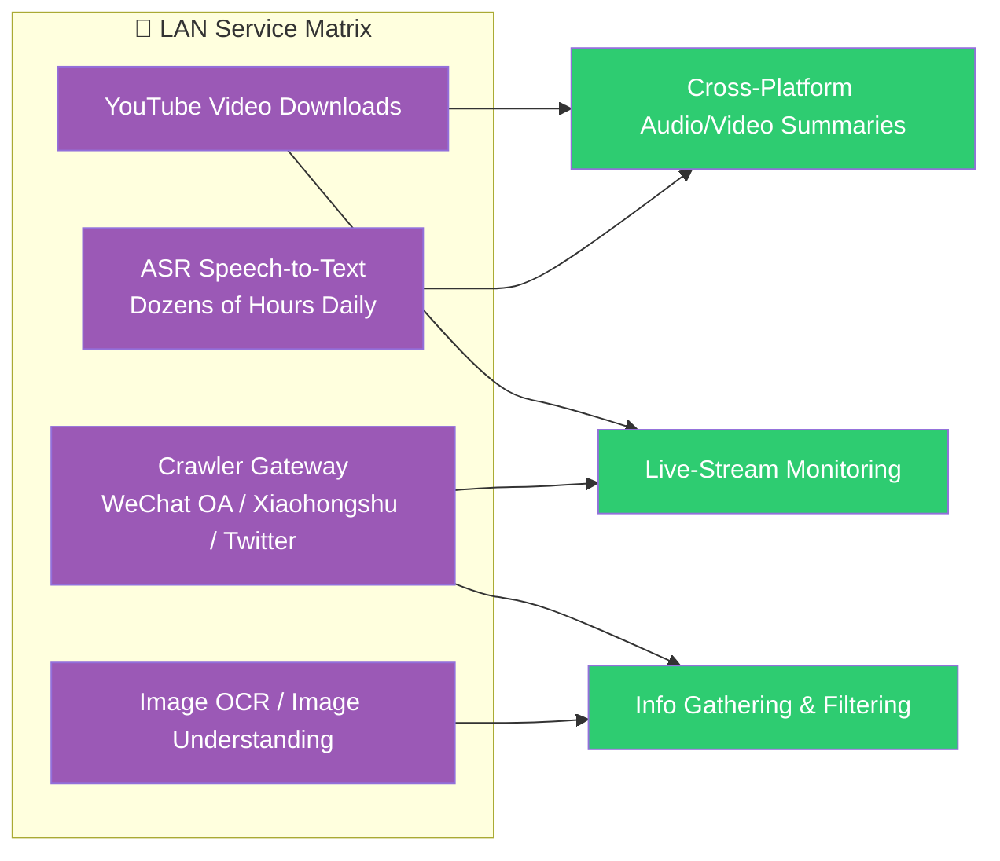
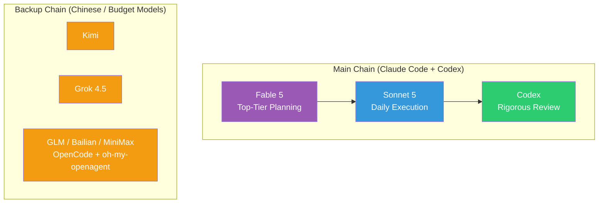

*Translated from the [Chinese original](/posts/260721-the-zelda-phase-of-life/). Last synced 2026-09-26.*

> The first draft of this post was an 80-minute voice recording covering a somewhat scattered mix of topics: my recent state of obsession, the logic of how I spend tokens, the boundary between Skills and software, the progression of human–agent collaboration, and all the models I currently use. It continues this series' tradition — **as a human, all you need to grasp is the ideas and the architecture logic; for every concrete execution detail, throw the post at your Claude Code or Codex and let it do the work.**

## Opening: The Night the Tokens Ran Out

It has been a while since my last update. The reason is simple: I've been obsessed with farming free token quota.

Claude Code hit its 7-day cap, Fable 5 (Claude's current top-of-the-line model) hit its cap, Codex hit its 7-day cap, and Kimi Code was at 94%. Among my backup channels, GLM had 63% left and Grok 32%, while DeepSeek and Bailian (Alibaba Cloud's model platform) still had plenty — but the main workhorses were all down.

So I figured I'd use the gaps while waiting for quotas to recover and write this post. I'd been meaning to write about this for a while, under the title — **the Zelda phase of life**. It will range rather widely, mostly about AI. Dear readers, here we go.

## 1. The Zelda Phase of Life

Zelda is a game on the Nintendo Switch.

I was never much of a gamer — what I'd played before was mostly party games or two-player games, something to pass the time with friends. The last single-player game I could trace dates back to elementary school: KartRider. But when I picked up The Legend of Zelda: Breath of the Wild, I was instantly hooked.

During that period, the only thing in my head all day was the unexplored corners of Hyrule. I'd often play until two or three in the morning, and basically spend entire weekends inside the game. You don't feel fatigue; meals and errands can all wait — **there is only the land of Hyrule in your head.**

The thing Zelda players say most is: I wish I had a brain that has never played Zelda. The game is finite, after all — once you've explored most places and finished the side quests, it's hard to recapture the surprise and obsession of a first encounter. When Tears of the Kingdom came out, I played it too, but it clearly didn't grip me the way the first one did — objectively, much of it had already been explored.

But recently, I feel I've found that feeling again.

**Or rather, I may have entered a Zelda phase of life.**

Every day actually feels stuffed full of curiosity: exploring many different directions, solving many concrete problems. Once I get going, I often end up talking with an Agent until one or two in the morning. I hold a plain belief: if something's data lives online, and large language models have seen relevant training data, then in principle it's worth trying with an Agent — my earlier [software edition](/en/posts/260220-ai-时代的自用软件工具分享-正文稿/) and [hardware edition](/en/posts/260329-ai-hardware-data-security/) were both figured out exactly this way.

Objectively speaking, my entire July schedule was organized around the validity window of Fable 5 in Claude Code and Codex's quota reset times. Before July 10, my daily token consumption averaged only seven or eight hundred million; when the new quota cycle started on July 10, I wanted to burn through the Fable 5 and Codex quotas before they reset and went to waste, so consumption shot up — for several days straight it averaged over 4 billion (all channels combined).

Note: **that 4 billion means the 20x plan's quota was being maxed out, not that I couldn't hold up any more.**

This is the token-usage monitoring dashboard I built myself. The last 30 days of total processing (cache included) comes out to an equivalent value of over US$27,000 at API prices — note this is only a notional equivalent at list prices, not an actual bill; what I actually pay is two $200 subscriptions. By coding agent, Claude Code and Codex each take about half; by model, the biggest by volume are gpt-5.6-sol (33%, the mainstay of the Codex pipeline), Sonnet 5 (24%), Opus 4.8 (18.6%), and Fable 5 (5.6%).

Going from frugal to lavish is easy; going from lavish back to frugal is hard. Raising token usage is easy enough, but once it comes back down I feel useless — for many things my subconscious first thought is "can the Agent do this?", and I've already forgotten how to do them by hand.

I wrote a line in [the days of running ahead of the bear](/en/posts/260315-ai-时代闲言几则-正文稿/): "This building process is far more fun than games, far more addictive, and makes flow states easy to enter." Back then it was an impression; now it is empirically verified.

## 2. Reading the Bonus Period: Milk It for All It's Worth

Conclusion first: **while the token freebie window lasts, convert as much of it as possible into productive assets that can still be reused afterwards. Milk it for all it's worth.**

I started using coding agents around March 2025, switching from Cursor to Claude Code, and I've upgraded my plans alongside it ever since: the Claude Code + Codex combination went from 20+0, 100+0, 100+20, 200+20, 200+100 all the way up to 200+200 (the first number is the Claude Code subscription tier, the second is Codex's). Now I'm already planning to subscribe to a second Codex account.

Why so aggressive? It comes down to one judgment: **although the average cost of tokens keeps falling for many models, the cost of the genuinely high-intelligence tokens is actually going up.**

Think of today's subscription plans as early-bird tickets, or the flash-sale prices of an e-commerce mega-promotion — the prices are so good they don't feel real, precisely because the platforms are still fighting for territory and need low prices to buy users and training data, not because they want to profit off you. This is also why I don't believe the current low-price plans can last: neither Anthropic nor OpenAI is publicly listed, and what they want right now is user scale and behavioral data, not near-term profit. On a $200-per-month plan I can easily run the equivalent of $10,000 worth of API usage; Codex is even more extreme — $200 stretches to the equivalent of twenty or thirty thousand dollars. A word of thanks here to Tibo, the person in charge of Codex's quota-reset mechanism: the reset cadence is tuned so well that subscription utilization is absurdly high.

This price inversion obviously can't hold for long. At the end of [my post on Claude Code's design philosophy](/en/posts/claude-code-risk-model-philosophy/) I wrote "cherish it while it lasts" — that time it was a forecast; this time it counts as adding to the position.

So the question becomes: **how should the farmed tokens be spent so they don't count as waste?** That's what the next section is about.

## 3. Turning Tokens into Code: The Boundary Between Skills and Software

One premise first: if high-intelligence tokens could in the future only be bought at API prices, many of today's playbooks would stop working. So while it lasts, tokens should be converted into a few kinds of things that can be reused long-term: cleaned high-quality data, tool software, and Skills. The thing I've thought about most is **where exactly to draw the boundary line between Skills and software**.

### The Essence of a Skill and Its Limits

A Skill's quality depends both on how well it's written and on the model's own capability — neither can be missing; fall short on either side and the output quality wobbles.

Its strength is the low barrier: it's all natural language, anyone can write one, and it's especially well suited to workflows that keep changing. Put plainly, **you are borrowing the Agent's ability to handle uncertainty** — that is the most valuable thing about a Skill.

But the limits live right there too. You'll notice the same Skill run on a different model may or may not keep its instruction-following quality (some of that can be pinned down with scripts). The more critical problem is attention. As I wrote in [Context is All You Need](/en/posts/context-is-all-you-need/): **an Agent's attention is the most precious resource, and it should be saved for resolving uncertainty.**

How should that be understood? Think of the Agent's attention as a person's working energy — if you make it spend an hour on login CAPTCHAs, it has an hour less for real work. People are the same: nobody wants their working hours eaten up by this kind of trivia.

An example. Say you have a browser-scraping Skill that can crawl all kinds of web pages. Used once in a while, of course it's fine. But once usage gets frequent, you'll find the Agent spending a large share of its energy on chores unrelated to the main task: retrying account logins on some site, wrestling with CAPTCHAs... Multiply that out, and the attention wasted costs more than the time saved, and the Skill's return on investment naturally sinks. **Put plainly: the more frequently a scenario is used, the less it should keep being handled live by an Agent, and the more it should become a program.**

### The Answer for High-Frequency Scenarios: Componentize, Engineer

So the better answer is: **once a scenario is used frequently enough, turn it into a program.**

From an efficiency and cost standpoint, this is about like shifting gears while driving — on stretches of road you know well, you'll eventually want to switch from manual to automatic, and spend the attention you save on road conditions that genuinely require judgment. Or put another way: for a dish you cook every day, better to buy a bread machine — hand the deterministic steps to the machine and keep for yourself only the seasoning, the part that truly needs judgment. **Turning tokens into code is, as I see it, the highest-leverage conversion available right now** — with the precondition that the code genuinely runs in a production environment and gets called continuously. Code's marginal cost is nearly zero; most of the time it needs no tokens at all, or tokens several orders of magnitude fewer than the Agent approach.

Take my own example again. I took one information-processing and filtering pipeline and wrote it as a programmatic service — it still calls an LLM, but through traditional single-shot calls, not the Agent pattern, and the model can be swapped for something cheap like DeepSeek. As a result, a single project burning seven to ten million tokens a day works out to **less than ¥10 (about $1.50) per day**. The same job done the Agent way could easily burn one to two hundred million tokens — survivable under a subscription plan, but not a viable path in the long run.

At the moment I've accumulated a batch of services like this on my LAN, for example: a YouTube download service that handles IP risk control, multi-country language/region switching, and non-downloadable live streams; a crawler gateway that takes any URL and returns content from WeChat Official Accounts (the dominant publishing platform in China), Xiaohongshu (Rednote, a popular Chinese lifestyle-sharing platform), and Twitter without spending a single token; an ASR speech-to-text service that batch-transcribes dozens of hours of audio and video every day; and an image OCR and image-understanding service.

Once built, these things get consumed repeatedly by many downstream scenarios and recombined into new tricks — whether it's summarizing audio and video across platforms or watching live streams on different platforms for me, everything is composed on top of the engineered foundations laid down earlier. Each service usually has two or three downstream consumers, four or five at most. This is the latest progress on the "Skills for fast validation, engineering for stability" idea from [the tools I grew with AI](/en/posts/260220-ai-时代的自用软件工具分享-正文稿/).

### My Principles for Using Skills

Which is why I don't actually have many Skills installed. The only one in constant daily use is the [gstack](https://github.com/garrytan/gstack) Skill pack open-sourced by YC CEO Garry Tan — the multi-perspective review Skill inside it is something I use every day. Anything else, even if installed, is mostly installed at project level, never globally. Or I'll simply go study the principles behind some Skill and absorb it into my own engineered projects.

One more heuristic worth sharing: **whether a Skill will be iterated on long-term is my main yardstick for judging whether it's worth anything.** Most Skills shared by influencer bloggers, if they aren't continuously updated, were mostly written for reach and have never genuinely run in a production environment. A good Skill is necessarily iterated constantly — if even the author treats it as write-and-forget, then in all likelihood it has never been repeatedly tested in real scenarios, and its value is limited.

## 4. From Supervising to Letting Go: A Self-Repairing System

Everything so far has been about the "stuff" — how to convert tokens into long-term assets. This chapter is about the "person": as Agents become able to do more and more, where should the human stand?

### The Three Stages of Human–Agent Collaboration

I once read a practice write-up by a Silicon Valley AI engineer ([What does it really take for AI agents to land](https://mp.weixin.qq.com/s/cbEtEbDb-A1_YFyf00dj0A)) that divides AI usage into three stages, and I think the division is spot-on. The first stage is **Copilot**: the human leads, the AI is just a tool, and every judgment, every execution needs a human nod. The second stage is **supervised Agents**: you can now hand off more complex tasks, which is progress in itself — but the problem is you can't walk away. When the Agent drifts off course you have to pull it back; when it gets stuck you have to push it forward. Like looking after an infant, you stay tethered to the computer, and the decisions that actually matter get no energy left for them. The third stage is **Agents running autonomously**: the team works in the background on its own, and you show up only at the most critical decision points, letting go completely the rest of the time.

My own experience is that **I'm in the middle of stepping from the second stage to the third**. One feeling in this transition is especially strong: as you interact with Agents more and more, you find everyone runs into the same problem — **the human is the bottleneck in the loop.** You have to clear that blockage in yourself first before you can move your energy to more valuable things.

To some extent this is very like founding a startup: early on you do everything personally and build the infrastructure; once you scale up, your bandwidth runs out and you must hand things over, relying on standards and division of roles to keep the business growing — you gradually step back from front-line executor to department manager, and then to CEO. Collaborating with Agents follows the same road: Agents push the human toward the two ends — you are either the lowest-level executor or the highest-level planner. The process from stage two to stage three is the process of the human continuously climbing to a higher level.

### The System I Built: Principles Only, No Details

Counting my own personal services plus the ones serving my team, I maintain roughly thirty to forty. Maintaining one or two is no problem, but once the projects pile up — old projects with bugs to fix, new features to add, and new things I still want to explore — large amounts of time get eaten by trivial ops work and bug fixing.

So the natural thought: **when the system breaks, can it dispatch an Agent to fix itself?** The Agent fixes it, sends me a message, I confirm everything is fine, and the problem is resolved directly in production — the whole way through, all I do is press one button in Feishu (Lark, ByteDance's workplace collaboration suite).

The idea sounds simple, but actually doing it reveals a pile of infrastructure that has to be filled in first: should all services' logs be consolidated onto one platform? How do you give the Agent enough context to locate problems in production? And how do you guarantee the Agent's repair doesn't introduce new problems?

This whole setup is already running, and it really did go through one live production incident end to end, the full flow. The overall logic fits in one diagram:

In the entire flow I perform exactly two actions: after an incident, reply "go investigate" in Feishu; after the fix, press "merge" on the approval card. The diagnosis, repair, PR, tests, and review in between are all done by the Agents themselves.

By the way: the PRs from work I proactively hand out day to day (new features, bug fixes) go through this same CI gate, which is why it isn't drawn separately in the diagram.

This system boils down to three rules:

**First: if the gate isn't all green, don't even think about merging.** Tests must pass, the diff size must stay under the cap, and deployment-infrastructure files are off-limits to Agents — fail any one condition and it gets bounced, no mercy.

**Second: the Agent that writes the code can't be the same Agent that picks it apart.** Opening a PR automatically triggers the unified gate: run the tests, bring in an independent Agent for review (reviewer and author are kept separate, otherwise it's easy to hallucinate yourself into self-confirmation), and front-end projects additionally run end-to-end tests automatically with a screen recording shown to me. The Agents carry all of this themselves; none of it takes my time.

**Third: the moment I get called in must be the moment everything is ready except the final decision.** When a PR first opens, Feishu receives only a progress card with no buttons; only after the gate has run fully green does that same card grow a button. The process of running tests, reviews, and waiting for results in between never disturbs me at all.

Because this system is still being iterated at high frequency and is nowhere near a stable form, I'm only describing the architectural principles here, not implementation details — once it settles down, maybe it gets its own post like [Agents Don't Clock Out](/en/posts/260628-agent-era-dev-anywhere/). The supporting infrastructure is worth a mention, though: a while ago I moved many of my personal GitHub repos under one organization, because an organization can natively reuse a single set of CI templates — new repos automatically get the whole workflow without per-repo configuration.

### Once the System Is Running

With the system built, you find that most of the time you're making only two kinds of decisions: **first, setting direction — what to do next; second, giving the green light — whether this thing can ship.** How exactly to execute is no longer something you need to touch.

My own development mode has become exactly that: first talk with an Agent for an hour or two, discussing the system goals, architecture, which things should and shouldn't be done, which engineering trade-offs to make — then throw it a long-horizon task and let it run on its own, anywhere from three to five hours to dozens of hours. In between I hold three hard rules: test-driven development (TDD), small granularity for commits and PRs, and a mandatory independent Agent review.

On this model I can currently sustain roughly ten projects moving in parallel. This is also why my token consumption looks a bit alarming — during peak hours, a half-hourly refresh of the dashboard shows another two to three hundred million consumed; since Codex removed its 5-hour cap, burning through an entire week of the 20x plan in a single day is something that genuinely happens.

## 5. Token Philosophy and the Model Arsenal

### Three Basic Judgments

Having talked this far, here are my three judgments about tokens themselves.

**First, tokens have become the fuel that powers curiosity — they are literally the arcade coins of this game called reality.**

**Second, tokens are cheaper than human energy, but an Agent's attention is scarce.** You have to first believe the sentence "tokens are cheaper than energy" before you'll be willing to spend them; but at the same time you must spend the Agent's attention only where it cuts. So my usage looks a bit contradictory: on one hand I'm fussy about efficiency — I never enable fast mode (it burns quota very fast, but output for the same task isn't proportional, so better to run high concurrency for volume), and I install tools like [RTK](https://github.com/rtk-ai/rtk) and [Graphify](https://github.com/Graphify-Labs/graphify) to compress per-task token consumption — the former is a CLI proxy that cuts the token cost of common dev commands by 60–90%, the latter turns a codebase into a queryable knowledge graph; on the other hand I'm not stingy at all about deliberately spinning up different Agents to cross-review project plans, expressly hunting for problems.

**Third, token consumption is not necessarily a good metric.** It's only because, for now, we can't find any other objective measure of effective token utilization and ROI that we settle for talking about consumption. What should really be pursued: can the same task be done with fewer tokens; can the same tokens lever greater value.

### Tiered Dispatch: How I Divide Work Across Models

Based on the judgments above, my overall dispatch strategy is tiered: **top-tier models do planning and overall orchestration; balanced-but-cheap models do concrete execution; engineer-flavored Agents do multi-round review.**

First, the naming: Claude's models break down by tier — Fable 5 is currently the very top, with Opus 4.8 and Sonnet 5 below it; gpt-5.6-sol is the mainstay model of the Codex pipeline. Every name that appeared in the consumption chart in section one will get matched to a role in this chapter.

Behind this division of labor is really just one sentence: **assign roles to models with different temperaments, instead of expecting one model to win every battle.**

**Fable 5 is the technical co-founder.** I only use it for top-level project planning, and sparingly. Its strongest point is that it judges from the business perspective — which things are worth investing in, which things this phase shouldn't touch, how technology choices should be made — and its advice on all of these is remarkably solid. It's not a command machine that does whatever you say; it will genuinely stop you, and it can genuinely help you think through how the road should go. **Both the gatekeeper and the navigator.**

**Codex is the rigorous engineer, and the king of value for money.** Thanks to the quota-reset mechanism Tibo built, it is the highest-value tier of all the subscriptions, which is exactly why I want to open a second account. When using Codex, watch out for controlling its complexity — no engineering project in the world is zero-bug, but Codex is natively, extremely rigorous and wants to lock down risk at every single point, so you need to explain the project goals upfront and tell it not to over-engineer, and when fixing problems, prefer subtraction over addition wherever possible — otherwise one problem gets solved and a pile of new ones come in. Its reviews really are beyond reproach: on engineering-perspective questions I've compared many models, and Codex still gives the best experience — and there's volume to spare.

**Grok 4.5 is the execution-layer workhorse.** Capability is roughly just-short-of-first-tier, but the speed is absurd — ludicrously, explosively fast. Through an India-region subscription, the plan that lists at $30 costs ¥30 (about $4) a month, with a weekly quota of roughly two to three hundred million tokens — an outstanding deal. When Claude Code and Codex are under heavy load, it's a great fit to throw work to it: runs fast and hits hard.

**Kimi's ¥699 plan: the aesthetics hold up; the CLI isn't mature yet.** K3's front-end aesthetics are honestly the strongest among Chinese models, and its overall capability is very good too, with a weekly volume of roughly seven to eight hundred million tokens. The sticking point is that Kimi CLI's experience still trails by a fair margin: information compression on long-horizon tasks, and support for some instructions, both lag behind mature tools — though these should improve step by step. Purely on value for money, Kimi's ¥699 plan definitely can't beat Codex, but I still want to support the domestic players — keep at it.

**GLM 5.2 (¥199 plan):** I use it inside OpenCode, not the official client. Decent overall, but with no multimodal support it always feels like something's missing; right now I mainly use it to run code reviews.

**MiniMax M3 (¥199 plan):** inside Hermes (an Agent framework from Nous Research, which I mainly use to hook up WeChat messaging and scheduled tasks) it handles ordinary tasks acceptably, but in coding scenarios it's genuinely poor — hallucinations and instruction-following are both weak, with the result that every other plan of mine gets maxed out while this one often can't find a use. These days it mostly does document tidying and summarization inside OpenCode.

**DeepSeek:** consumed via API by my programmatic services — the "under ¥10 a day" scenario from chapter three; inside Agents it actually gets little use.

**Bailian Coding Plan (¥199):** currently only qwen3.7-plus inside — no max or newest models. Used inside OpenCode; native multimodal support, passable for simple tasks.

Most of these I run inside OpenCode together with oh-my-openagent, assigned to different tasks by role — the group as a whole is still in catch-up mode.

### A Question Without an Answer Yet

About Chinese models, I have one hesitation I haven't thought through: on one hand I believe **the model and the Harness (the software carrying the model) should be tightly coupled** — only that combination takes the experience up a whole level, which is also Claude Code's design philosophy; on the other hand, Chinese models face tight compute and cost sensitivity, which pushes you toward reserving top Chinese models for top-level planning only and throwing concrete execution to cheaper models — and under that playbook, an open framework like OpenCode plus oh-my-openagent actually fits better, letting different models focus on solving different problems with more controllable costs. Which of the two roads is better, I have no clear comparative conclusion on yet — reporting it as it is.

## 6. Running Ahead of the Bear, Continued: The Age of Exploration

Everything above is my own little plot of land — concrete usage, concrete trade-offs. Step outside and look at the whole industry, and the same logic applies; this is the sequel to [the days of running ahead of the bear](/en/posts/260315-ai-时代闲言几则-正文稿/).

### The Trend Holds, but the Process Will Be Long

Conclusion first: the big direction hasn't changed. **Agents entering the productive fabric of society as a whole — nobody can change this trend.** But the process may be very long, blocked at two levels.

**First, coding is an accidental and scarce scenario; other domains can hardly replicate it.** Why has AI progressed fastest on writing code? Because only coding has both prerequisites at once: "high-value data in the open" and "a closed behavioral loop" — code, once written, runs, tests, and verifies, forming a complete feedback loop. The rest of the world mostly lacks these two conditions: the data may be extremely valuable, but it sits in the heads of front-line industry practitioners; too many factors influence outcomes, and a decision can at most raise the probability of success without guaranteeing the thing gets done — so loops are hard to close. The physical world is harder still: startups spend serious money collecting physical-world data, but in both quality and quantity it can't compare with the coding scenario, so progress is destined to be much slower. Put another way, **the combination of well-paid programmers and open-source community culture is itself accidental and scarce** — reality offers hardly a second scenario like it. This is also the "dark knowledge" problem I discussed in [the days of running ahead of the bear](/en/posts/260315-ai-时代闲言几则-正文稿/): the less an experience has been digitized, the further beyond AI's reach it is.

**Second, technical problems are the small problems; distribution of interests is the big one.** The first threshold sits in data and scenarios; the second sits in people. The British comedy Yes, Minister has a line that gets it exactly right: whatever a department's founding purpose, it ends up with only one purpose — proving the necessity of its own existence. That is what pushing a new technology into an enterprise truly has to face. So **AI entering the enterprise must be something the person at the very top personally drives and personally signs off on.**

### But You Only Need a Relative Lead

Viewed from another angle, though: **high barriers are the same for everyone.** Slow agent adoption isn't slow for you alone; the whole industry is slow — and competition has never been against AI, it's against your peers. Unless you hold a license, or are bound especially tightly to the physical world, in the competition of the online world someone will always use a more advanced approach to squeeze the old rivals out. And the barriers differ enormously from industry to industry: **enterprises compete on relative position, not absolute position** — on AI skills we certainly can't out-match the researchers at Silicon Valley giants, but as long as your competitors are using the basics and you're one or two body-lengths ahead of them, you get to eat a lot of the benefits.

### What's Most Valuable

The most valuable thing in this era is surely "knowing what should be done" — setting direction. One level down, the valuable things are: **ideas, insight, best practices, and the scars from pitfalls — things that are not in AI's training data.**

Anything online, as long as I can see it, can probably be reproduced. But what's behind things is far more complicated — industry know-how and pitfall experience are the truly scarce goods. Two recent industry examples make this especially vivid.

One is Cloudflare's [vinext](https://blog.cloudflare.com/vinext/): an internal Cloudflare project that re-implemented Next.js from scratch — one engineer plus AI finished it in **one week**, with a token cost of only US$1,100. The precondition for pulling it off was that Next.js's documentation is complete enough and its test suite comprehensive enough to be carried over directly as acceptance criteria.

The other is [pgrust](https://mp.weixin.qq.com/s/JaZiPYscoR349M0dbDuf3g) — a project rewriting PostgreSQL in Rust, with an even more interesting story: the author first tried a **from-scratch rewrite, and failed**, archiving the entire codebase; the path that actually survived was to first use tooling to mechanically translate PostgreSQL's C source into Rust, then have AI rewrite it module by module — and what finally passed was PostgreSQL's own original 46,066 regression tests.

These two examples point to the same conclusion: **whether AI can reproduce something depends on two assets — whether there is a complete test suite to anchor acceptance, and whether the pitfall experience accumulated by the original system can be inherited.** vinext relied on the former, lifting Next.js's test suite directly as its acceptance standard; pgrust relied on the latter, with mechanical translation preserving thirty years of accumulated code intact — whereas the from-scratch rewrite threw away exactly that entire accumulation, which is why it failed.

**At bottom, tests are pitfall experience made concrete.**

This kind of pitfall experience is extremely valuable — one of the most important things for saving tokens and raising ROI. **Anyone willing to genuinely share this kind of experience with you is truly transmitting value to you.**

So all in all, this is an age of exploration: risk and opportunity coexist, and the bigger the problem, the richer the reward for solving it. In every industry, the ground may well be strewn with gold.

## Closing Thoughts

Zelda players want a brain that has never played Zelda because the game's content is finite — once you've explored it all, there is nothing left.

But this time is different — **this new continent grows bigger every day**, and every morning there are new corners waiting to be explored. That is probably the happiest part of the "Zelda phase of life".

Of course, bonus periods always pass in the end: quotas will tighten, plans will wind down, and high-intelligence tokens will sooner or later be billed at their true price. So while the grabbing is still good, grab everything you can; and more importantly, convert the tokens you grab into code, services, and workflows — **long-term reusable productive assets**. On the day tokens get expensive, what you have banked will be the real end-of-game reward.

Happy exploring, everyone.

---

> This post's first draft was conceived from a Feishu voice recording transcribed to text with Doubao (ByteDance's voice assistant); the article's architecture design and content organization were completed in collaboration with Kimi CLI + K3, with full final optimization by Claude Code + Opus 4.6.
