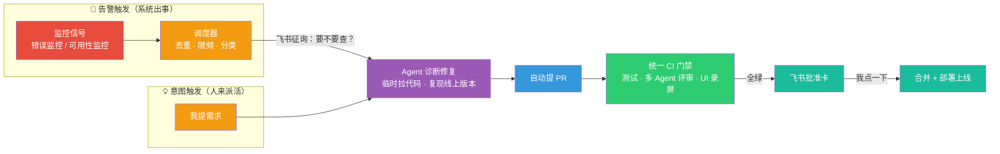
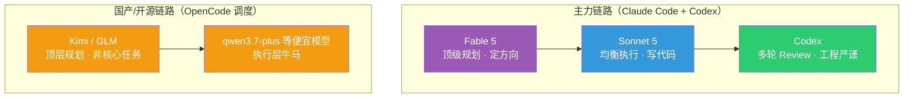

> 本文是「LLM 吞噬一切」系列的最新一篇。前文见：[我用 AI 长出来的那些工具](../260220-ai-时代的自用软件工具分享-正文稿/)、[跑在熊前面的日子——AI 时代闲言几则](../260315-ai-时代闲言几则-正文稿/)、[Context is All You Need](../context-is-all-you-need/)、[Claude Code：防封号、模型选择与设计哲学](../claude-code-risk-model-philosophy/)、[Agent 不下班：随时随地随设备的开发体系](../260628-agent-era-dev-anywhere/)。
>
> 这篇的底稿是一段 80 分钟的语音分享，聊的东西比较杂：我最近的沉迷状态、Token 的使用逻辑、Skill 和软件的边界、人机协作方式的进阶，以及我在用的所有模型。风格上依然延续这个系列的传统——**作为人类，你只需要读懂思路和架构逻辑；所有具体的执行细节，把文章丢给你的 Claude Code 或 Codex，让它去做就行。**

## 开头：Token 用光了这个晚上

好久没有更新了。原因很简单：Token 全部用光了。

Claude Code 7 天撞线、Fable 5 撞线、Codex 7 天撞线，Kimi Code 也到了 94%。备用渠道里 GLM 还剩 63%，Grok 剩 32%，DeepSeek 和百炼倒是余量充足——但主力全歇了。

所以干脆趁着等额度恢复的间隙，写写文章吧。这个话题其实之前就想写，定的主题叫——**人生的塞尔达时期**。聊的东西可能会比较杂，很多都是关于 AI 的，各位读者朋友，且看吧。

## 一、人生的塞尔达时期

塞尔达是 Switch 上的一个游戏。

我本身其实不怎么玩游戏，之前玩过的也都是派对游戏或者双人游戏，和朋友一起打发时光用的。一个人玩的游戏，大概只能追溯到小学时候的跑跑卡丁车。但当我接触《塞尔达传说：旷野之息》的时候，一下子就沉迷住了。

那段时间，每天脑子里只有塞尔达里没有探索到的地方。晚上经常玩到两三点，周末基本上一整天都泡在里面。你不知道疲惫，吃饭、出行之类的事情都可以往后排——**你的脑中只有海拉鲁大陆。**

塞尔达玩家最常说的一句话是：很想要一个没有玩过塞尔达的脑子。因为整个游戏毕竟是有限的，当你把很多地方都探索过、支线任务也打完了，再玩的时候就很难找回首次接触时那种惊喜和沉迷感。后来《王国之泪》出来，我也玩了一下，但明显没有一代上头——客观讲，很多地方都是已经探索过的了。

但是最近，我觉得我又找回了这种感觉。

**或者说，我可能进入了一段人生的塞尔达时期。**

每天实际上是被好奇心塞满的，去探索很多不同的方向，解决很多切实的问题。经常一干就跟 Agent 聊到一两点。我有一个朴素的信念：一个东西只要它的数据在线上，大语言模型之前有过相关的训练数据，那原则上都可以拿 Agent 去尝试——之前软件篇、硬件篇的文章，都是这么试出来的。

客观地说，我整个 7 月份的作息，都是围绕着 Claude Code 里 Fable 5 的额度有效期、还有 Codex 的额度重置时间来安排的。7 月 10 号之前，我的日均 Token 消耗大概只有七八亿；7 月 10 号之后迅速上升，因为要充分消耗 Fable 5 和 Codex 的额度——怕它重置浪费嘛——连续几天日均都是 40 亿往上。

注意，**这个 40 亿是 20x 套餐的额度被打满了，而不是我自己扛不住了。**

这是我自己做的 Token 用量监控面板。近 30 天总处理量（含 cache）折算下来等效估值 27,000 多美金——注意这只是按 API 价格的等效估值，不是真实账单，我实际花的钱是两个 200 刀的订阅。Coding Agent 维度，Claude Code 和 Codex 各占一半；模型维度，跑量最大的是 gpt-5.6-sol（33%）、Sonnet 5（24%）、Opus 4.8（18.6%）和 Fable 5。

由俭入奢易，由奢入俭难。Token 用量往上涨其实挺容易的，但 Token 降下来以后，感觉自己就像一个废物——很多东西下意识想的都是"这个能不能给 Agent 做"，自己已经想不起来怎么徒手搞了。

我在[跑在熊前面的日子](../260315-ai-时代闲言几则-正文稿/)里写过一句话："这种 building 的过程比游戏好玩得多，也容易上瘾得多，非常容易进入心流状态。"当时是感受，现在是实证。

## 二、红利期的判断：能薅尽薅

先说结论：**趁着 Token 的羊毛期，要尽可能沉淀下来之后也能复用的生产资料，能薅尽薅。**

我是 2025 年 3 月左右开始用 Coding Agent 的，从 Cursor 切到了 Claude Code，然后一路陪着它升级套餐：Claude Code 和 Codex 的组合从 20+0、100+0、100+20、200+20、200+100 一路加到 200+200（前面的数字是 Claude Code 的订阅档位，后面是 Codex 的）。现在，我已经打算再去订阅第二个 Codex 账户了。

为什么这么激进？本质上是一个判断：**虽然很多模型的 Token 平均成本在下降，但高智力 Token 的成本实际上是在上升的。**

这就导致我不认为当前这种低价订阅套餐的商业模式可持续。很大程度上，这是因为 Anthropic 和 OpenAI 还没有上市——它们需要积累用户，也需要积累更多的行为数据来训练下一代模型。每个月 200 美金的套餐，如果换算成 API 额度，我轻松可以跑到 1 万美金的等效消耗；Codex 更夸张，200 刀的订阅可以轻松拉到两三万刀的 API 等额消耗（这里要感谢 Tibo 哥——Codex 额度重置的负责人，额度重置机制让订阅的利用率高得离谱）。

这种价格倒挂显然不会长久。我在 [Claude Code 设计哲学](../claude-code-risk-model-philosophy/)那篇的结尾写过"且行且珍惜"——上次是判断，这次是加仓。

所以问题就变成了：**薅来的 Token，要怎么花才不算浪费？** 这是下一节的主题。

## 三、把 Token 变成代码：Skill 与软件的边界

先立一个前提：如果未来高智力的 Token 只能按 API 价格来买，今天的很多玩法就跑不动了。所以要趁现在，把 Token 转化成几种长期可复用的东西：高质量的数据清洗、工具软件、以及 Skill。这里面我思考最多的，是 **Skill 和软件的边界线应该怎么划**。

### Skill 的本质和它的局限

Skill 这个东西，既依赖 Skill 本身写得怎么样，同时也依赖模型自身的能力，二者缺一不可——不然输出质量会非常不稳定。

它的好处是：所有东西都是自然语言，人人都可以做，门槛很低，特别适合需要经常变动的工作流。**本质上，你是在利用 Agent 处理不确定性的能力**——这对 Skill 来说是最重要的东西。

但局限也在这里。你会发现，同一个 Skill 换一个模型，指令遵循的效果可能就没那么好了（当然，其中一部分可以通过脚本来约束）。更关键的是注意力问题。我在 [Context is All You Need](../context-is-all-you-need/) 里写过：**Agent 的注意力是最宝贵的资源，应该把它只投入到解决不确定性上面。**

举个例子。假设你有一个浏览器爬虫的 Skill，可以帮你爬各类网页。使用频率不高的话当然没问题。但用频繁了以后你会发现，Agent 在调用这个 Skill 的时候，花了大量精力处理一些和主线目标无关的事情：这个网页的账号登录流程来回重试、出了验证码来回折腾……这些事情和主线任务关系不大，但会实实在在地影响主线任务的完成。浪费这么多注意力，整个 Skill 的质量波动就会比较明显。

### 高频场景的答案：组件化、工程化

所以更好的解法是：**当一个场景用得足够高频的时候，就应该把它程序化掉。**

用程序去处理过程中那些确定性的问题，让 Agent 专注于意外的、我们不知道的事情。**把 Token 变成代码，这种转换目前我认为是杠杆最高的行为**——前提是代码要真正进入生产环境、被持续调用。代码的边际成本是 0，它大部分情况下不需要 Token，或者说需要的 Token 比 Agent 方式低好几个数量级。

还是举我自己的例子。同样一套信息处理过滤的流程，我把它写成了程序化架构的服务——虽然也调用 LLM，但走的是传统的单次调用，而不是 Agent 方式，模型可以切到 DeepSeek 这种便宜的。这样尽管单个项目一天也有七八百万、甚至上千万的 Token 消耗，但算下来**每天成本不到 10 块钱**。同样的活儿如果用 Agent 来做，可能要烧掉一两亿 Token——在订阅套餐下可以实现，长期看必然走不通。

目前我在局域网内已经沉淀了一批这样的服务：

- **YouTube 视频下载服务**：帮我解决了 IP 风控、不同国家语言地区切换、直播视频不可下载等各种问题——全是之前在 Agent 使用过程中真实踩过的坑；
- **爬虫中心化网关**：给它一个 URL，就能获取公众号、小红书、Twitter 等各类内容，过程中不消耗任何 Token；
- **ASR 语音转文本服务**：批量处理音视频，每天大概转录几十个小时；
- **图片 OCR 和图片理解服务**。

这些东西一旦建成，就可以给下游的很多场景消费，排列组合出新的东西——不管是总结各平台的音视频，还是帮我盯不同平台的直播推流，都是在之前搭好的工程化基础上组合出来的。我的这些服务，下游通常都有两到三个消费方，多的有四五个。这就是 [我用 AI 长出来的那些工具](../260220-ai-时代的自用软件工具分享-正文稿/)那篇讲的"Skill 快速验证、工程化追求稳定"的最新进展。

### 我的 Skill 使用原则

也因此，我现在安装的 Skill 其实比较少，最常用的就是 YC ceo 那套 gstack skill 包，多视角 review 太重要了。其他的即使装，很多也都是项目级别的安装，不会装到全局。或者我会去研究一个 Skill 背后用的是什么原理，然后把它吸收到我自己的工程化项目里。

还有一个判断标准分享给大家：**Skill 的长期迭代能力，是我判断它是否高价值的重要依据。** 很多自媒体博主分享的 Skill，也就是图一波传播，后续就不更新了，没办法用在生产环境里面。

一个好的 Skill 必然是要长期迭代的——写出来以后就再也不更新也没什么问题，这种 SKill 的价值就非常有限了。

## 四、从照看到放手：一套质量体系，两个触发器

### 人机协作的三阶段

之前看过一篇[硅谷 AI 工程师的实践分享](https://mp.weixin.qq.com/s/cbEtEbDb-A1_YFyf00dj0A)，它把 AI 使用分成三个阶段，我觉得划分得很准：

1. **Copilot 阶段**：人是主导，AI 是工具。每一次判断都由人做出，每次执行都需要人确认。
2. **照看 Agent 阶段**：你开始把更复杂的任务交给 Agent，但你离不开电脑——它跑偏了你要拉回来，卡住了你要推一把。那篇文章的比喻很生动：这就像在照看婴儿，你一秒都不能走神，但其实没做什么真正有意义的事。
3. **Agent 自主运行阶段**：Agent 团队在后台自己干活，你只在最关键的决策节点出现，其他时候放手。

我自我体会是，**我正在从第二阶段向第三阶段迈进**。这个过程中有个感受共鸣特别深：随着你和 Agent 的交互增强，你会发现大家面对的问题是相同的——**人是整个 loop 里面的瓶颈**。你必须解决自己这个卡点，把精力分配在更有价值的事情上面。

某种程度上这跟创业很像：前期你亲力亲为做很多事情、做基础建设；随着规模增大，你的精力顾不过来了，就必须把东西交出去，通过规范、通过划分职能，让业务规模继续扩大——你慢慢从一线执行者，退到部门经理，再退到 CEO。和 Agent 协作也是一样的路径：Agent 会把人的定位往两头推，你要么是最底层的执行者，要么是最顶层的规划者。2 到 3 的过程，就是人再往更高的层级走。

### 我搭的那套系统：只讲原理，不讲细节

我自己维护的自用服务加上给团队用的服务，大概有三四十个。维护一两个工程问题不大，但当项目多了以后——旧项目有 bug 要修、新功能要加、你还想探索新东西——大量时间会被琐碎的 bug 处理和日常运维消耗掉。

所以必然会去想：**能不能让系统在出问题的时候，自动派一个 Agent 去修复？** 修完自动给我发个消息，我审批确认没问题，就直接在线上把问题修掉——全程我只需要在飞书里点一个按钮。

这个想法听起来简单，但落地的时候会发现背后藏着很多基建需求：所有服务的日志是不是要归集到同一套平台？怎么让 Agent 有充分的上下文去定位生产环境的问题？又怎么确保 Agent 的修复不会带来新的问题？

目前这套东西我已经跑起来了，并且真的在一次真实故障里端到端走完过全流程。它的整体逻辑就一张图：

一句话概括：**一套质量体系，两个触发器。** 我主动派活（写新功能、改 bug）走右边这条线；系统自己出事（报错、宕机）走左边这条线。两条线最终汇合到同一个地方——飞书里的一张审批卡片，我点一下，合并部署。

有几个设计原则值得说：

- **合并和部署是唯一的人审环节**，但它有硬门把守：CI 必须全绿、改动量不能超过上限、部署基础设施文件禁止 Agent 修改。过线的一律打回。
- **提 PR 不等于能合并**。PR 提上去之后会自动触发一套统一的 CI 门禁：跑测试、独立 Agent 做评审（评审者和写代码的不是同一个 Agent，防止自我确认的幻觉）、有前端的项目还会自动跑端到端测试并录屏——这些成本本质上是 Agent 在负担，所以尽管流程对个人项目来说有点"重"，但它没有占用我的精力。
- **PR 开出来到审批之间是自动等待的**：PR 一开出，飞书先收到一张进度卡（没有按钮）；门禁全绿之后，同一张卡片才变成带按钮的批准卡。我不会被中间的等待过程打扰。

因为这套体系我还在高频迭代，远没有一个稳定的形态，所以这里只讲架构原理，不展开实现细节——等它稳定下来，也许会像"Agent 不下班"那篇一样单独写。配套的基建倒是可以说一句：我前段时间把很多 GitHub 个人仓库都转移到了一个组织下面，因为组织可以原生复用同一套 CI 模板体系，新仓库自动进入整套工作流，不用逐个配置。

### 这套体系运转起来之后

当整套系统搭建完成，你会发现自己更多时候只在做两件事：**第一，决定我们要做什么；第二，决定这件事允不允许做。** 至于具体的执行，你不需要干预了。

我自己的开发模式也变成了这样：先跟 Agent 聊一两个小时，把系统的目标、架构、哪些事该做哪些不该做、工程上面临哪些取舍聊透，然后派一个长程任务让它自主执行——短则三五小时，长则数十个小时。过程中有三个硬性要求：测试驱动开发（TDD）、commit 和 PR 的粒度要小、必须引入独立的 Agent 来 review。

靠这种模式，我现在可以支撑大概十个项目同时并行开展。这也是为什么我的 Token 消耗比较恐怖——经常半小时刷新一下，就是两三亿的消耗，一天就能跑完 20x 套餐一周的额度。

## 五、Token 哲学与模型军火库

### 三个基本判断

聊到这儿，可以谈谈我对 Token 本身的三个判断。

**第一，Token 已经变成了支撑好奇心的燃料——它就是我在现实这场游戏里的游戏币。**

**第二，Token 比人的精力廉价，但 Token 的注意力非常稀缺。** 你得有"Token 比精力廉价"这个信念，才不会吝啬使用 Token；但同时又必须确保它的注意力用在了刀刃上。所以我的用法看起来有点矛盾：一方面我从来不开 fast 模式（消耗太大），更追求用并发把 Token 量拉上去，也会装 [RTK](https://github.com/rtk-ai/rtk)（一个 CLI 代理，能把常见开发命令的 Token 消耗降低 60-90%）和 [Graphify](https://github.com/Graphify-Labs/graphify)（把代码库变成可查询的知识图谱，配合 Skill 使用）这类工具来提高单个任务里的 Token 利用效率；另一方面又毫不吝啬地调不同的 Agent 对我的项目计划做交叉 review，专门来找问题。

**第三，Token 消耗量未必是一个好指标。** 只不过我们暂时找不到别的客观指标来衡量 Token 的有效利用率和 ROI，才只能退而求其次拿消耗量说事。客观上我们应该追求的是：同样一个任务，能不能用更少的 Token 完成；同样的 Token，能不能撬动更大的价值。

### 分层调用：我的模型分工

基于上面的判断，我整体的调用策略是分层的：**顶级的模型用来做规划、做总调度；均衡但便宜的模型做具体执行；工程师风格的 Agent 做多轮 review。**

这里展开聊一下我在用的所有模型和工具。很多人其实没有同时用过这么多模型，我尽量把每个的定位、价格和真实体验说清楚，给大家一个参照。

### Claude Code 20x + Fable 5：项目合伙人

我的主力毫无疑问是 Claude Code 加 Codex，这是无可争议的第一梯队。

其中最顶级的 Fable 5，我只会用它来做顶级的项目规划，用得抠抠搜搜的。它给我的感觉是**项目合伙人级别**的——它会从用户的角度出发帮你思考很多问题，有些事情它会**拦着你做**。这个点非常厉害：它不是单纯的指令遵循，你说什么它就做什么，而是真的站在你的立场判断——哪些事情该做，哪些不该做，哪些事情不是这个阶段该做的。

### Codex 20x：严谨工程师 + 性价比之王

Codex 的风格则像一个非常严谨的工程师。因为有 Tibo 哥的额度重置机制，它的性价比是所有订阅里最高的——200 刀的订阅可以轻松拉到两三万刀的 API 等额消耗。这也就是为什么我想再开一个号。

使用 Codex 非常重要的一点是**控制它的复杂度**。世界上不存在一个 100% 没有 bug 的工程项目，Codex 的风格是极致的工程严谨，力求在每一个点上锁死风险。但项目显然是分级的：你自己在家庭网络里用的项目、公司内网的项目、对外服务的 SaaS，面临的安全风险完全不是一个级别，值得花的 Token 也不是一个级别。所以用 Codex 一定要跟它强调两点：第一，整个项目的目标是什么，不要过度设计；第二，修问题能不能先用做减法的方式，而不是做加法——不然一个问题解决了，又引入一堆新问题。

但 Codex 做 review 这一点确实没得说。工程视角的问题，我对比过很多模型，目前还是 Codex 的体验最好。关键还量大管饱。

### Kimi 699：审美能打，CLI 待成熟

Kimi 的 K3，前端和自带的审美还是非常能打的，整体能力也很不错。比较纠结的点是 Kimi CLI 目前的体验还差了一点：长程任务的信息压缩、一些指令的支持能力，都不如成熟的工具——不过这些应该会逐步提升。

纯性价比角度，Kimi 699 的套餐一周大概七八亿 Token 的量，肯定是不如 Codex 的。但还是要支持一下国产，希望它们再接再厉。

### Grok 4.5：执行层牛马

Grok 4.5 的能力大概是准第一梯队的水平，但**速度快得离谱**——窜稀一样的速度。如果你通过印度区订阅，原价 30 刀的 SuperGrok 套餐只要 30 块人民币一个月，每周大概两三亿 Token 的额度，非常划算。

在 Claude Code 和 Codex 现在负载都这么高的情况下，我很建议用一用 Grok，非常适合做执行层的牛马，非常能打。

### GLM 5.2 / MiniMax M3 / DeepSeek / 百炼

剩下几个简单过一下：

- **GLM 5.2**（199 套餐）：我是在 OpenCode 里用的（不是官方客户端），整体感觉还行，但因为没有多模态，总感觉差点意思。目前主要拿它跑一些 code review。
- **MiniMax M3**（199 套餐）：在 Hermes 里执行一些普通任务还行，但在 Coding 场景真的太烂了——幻觉、指令遵循能力都特别差，导致我其他套餐的用量都能打满，只有它经常找不到用途。目前更多是在 OpenCode 里做一些文档整理总结的工作。
- **DeepSeek**：API 方式给我的那些服务器和软件工具消费——就是上一节说的"每天不到 10 块钱"的那个，Agent 里反而用得少。
- **百炼 Coding Plan**（199）：里面只有 qwen3.7-plus，没有 max 或最新的模型。放在 OpenCode 里用，原生支持多模态，简单任务还可以。

### 一个还没有答案的问题

关于国产模型，我有个一直没想透的纠结：一方面我认为**模型和 Harness（承载模型的软件）应该高度耦合**，二者结合才能让体验上一个台阶——这也是 Claude Code 的设计哲学；但另一方面，国产模型算力紧缺、成本敏感，会让你倾向于把顶级国产模型只用在顶层规划上，具体执行丢给更便宜的模型——这种玩法下 OpenCode 加 oh-my-openagent 这种开放框架就更合适，让不同的模型专注解决不同的问题，Token 成本更可控。

这两条路哪条更好，我现在没有一个明确的对比评测结论，先如实告诉大家。

## 六、跑在熊前面·续：大航海时代

最后聊一点行业层面的新感悟，算是[跑在熊前面的日子](../260315-ai-时代闲言几则-正文稿/)的续篇。

### 趋势不变，但过程漫长

首先，大方向没有变：**Agent 进入整个社会的生产环境，这个趋势没有任何人能改变。** 但这个过程可能会非常漫长，具体是三个层次的问题。

**第一，世界分成 Coding 和非 Coding 两个模块。** 只有 Coding 这个场景同时具备"高价值数据开放"和"行为逻辑闭环"——写的代码能跑、能测、能验证，可以形成反馈回路。而另一部分世界是闭源的：数据可能很高价值，但潜藏在行业一线人员的头脑里；而且影响因子特别多，单一决策只能提高某件事的成功期望，不会必然让事情成功或失败——所以很难形成反馈回路。换一个说法讲，**高薪程序员加开源社区文化，这样一个场景是偶然的、稀缺的**，真实世界里很难找到第二个。

**第二，线上世界和物理世界是两个维度。** 物理世界有非常多的门槛，尽管各种创业公司在花大价钱采集物理世界的数据，但不论质量还是数量，显然都没法和 Coding 场景比，所以它的进程不会像 Coding 领域这么快。

**第三，技术问题是小问题，利益分配是大问题。** 英国喜剧《是，大臣》里讲过一个道理：不论一个部门成立之初是什么目的，它最终只会有一个目的——证明自己存在的必要性。这就是新技术往企业里推的时候真正面对的问题。所以为什么说 **AI 进企业必须是一号位动作、一号位的决定**。

### 但你只需要相对领先

不过从更大的角度看，这个问题也没那么可怕。除非你有牌照，或者跟物理世界绑定得非常紧密，否则线上世界的竞争里，总会有新的人用更先进的方式把老牌对手挤出局。而且行业和行业之间的门槛很深，**企业活的其实是相对位置的领先，而不是绝对位置的领先**——论 AI 技能我们肯定比不上硅谷大厂的研究员，但如果你的竞争对手用得都比较基础，你只需要比他们领先一两个身位，就能拿到很多胜利的果实。

### 什么最值钱

在这个时代，最重要的肯定是"知道做什么"——定方向。往下一个层级，值钱的东西是：**想法、看见、最佳实践、踩坑经验，是 AI 训练中没有用到过的东西。**

至少线上的东西，我看见了，大概率就可以复现。但背后的东西很复杂——行业的 knowhow、踩坑经验，这些是非常稀缺的。之前行业内有个例子：Cloudflare 做了个实验，把 Vercel 的 Next.js 用别的技术栈重新写了一遍，好像两周就搞定了；PostgreSQL 也被人用 Rust 重写过。这些能做成，本质上是因为**之前的测试足够完备**——而测试是什么？测试就是踩坑经验的具象化。

这种踩坑经验非常值钱，它是让你省 Token、提高 ROI 的最重要的东西之一。**谁愿意真的跟你分享这些东西，他是真的在向你传递价值。**

所以总的来说，这是一个大航海时代：风险和机遇并存，面临的问题越大，解决它的奖励就越丰厚。各行各业，可能都是黄金满地。

## 写在最后

塞尔达玩家想要一个没玩过塞尔达的脑子，是因为游戏的内容是有限的，探索完就没有了。

但这一次不一样——**这片新的大陆每天都在长大**，每天醒来都有新的角落可以探索。这大概就是"人生的塞尔达时期"最幸福的部分。

当然，红利期也总会过去：额度会收紧，套餐会退坡，高智力的 Token 迟早要按它真实的价格计费。所以在还能薅的时候，能薅尽薅；更重要的是，把薅来的 Token 沉淀成代码、服务和工作流这些**长期可复用的生产资料**——等到 Token 变贵的那一天，你手里攒下的东西，才是真正的通关奖励。

祝各位探索愉快。

---

> 本文由 80 分钟的语音分享（飞书妙记）转录为底稿，通过 Kimi K3 协作完成文章架构设计与内容整理。
