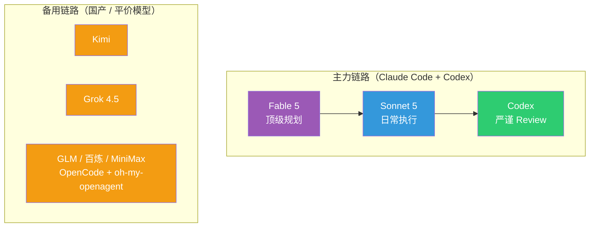

> 这篇的底稿是一段 80 分钟的语音分享，聊的东西比较杂：我最近的沉迷状态、Token 的使用逻辑、Skill 和软件的边界、人机协作方式的进阶，以及我在用的所有模型。依然延续这个系列的传统——**作为人类，你只需要读懂思路和架构逻辑；所有具体的执行细节，把文章丢给你的 Claude Code 或 Codex，让它去做就行。**

## 开头：Token 用光了这个晚上

好久没有更新了。原因很简单：沉迷于薅 Token 羊毛中。

Claude Code 7 天撞线、Fable 5（Claude 当前最顶级的模型）撞线、Codex 7 天撞线，Kimi Code 也到了 94%。备用渠道里 GLM 还剩 63%，Grok 剩 32%，DeepSeek 和百炼倒是余量充足——但主力全歇了。

所以干脆趁着等额度恢复的间隙，写写文章吧。这个话题其实之前就想写，定的主题叫——**人生的塞尔达时期**。聊的东西可能会比较杂，很多都是关于 AI 的，各位读者朋友，且看吧。

## 一、人生的塞尔达时期

塞尔达是 Switch 上的一个游戏。

我本身其实不怎么玩游戏，之前玩过的也都是派对游戏或者双人游戏，和朋友一起打发时光用的。一个人玩的游戏，大概只能追溯到小学时候的跑跑卡丁车。但当我接触《塞尔达传说：旷野之息》的时候，一下子就沉迷住了。

那段时间，每天脑子里只有塞尔达里没有探索到的地方。晚上经常玩到两三点，周末基本上一整天都泡在里面。你不知道疲惫，吃饭、出行之类的事情都可以往后排——**你的脑中只有海拉鲁大陆。**

塞尔达玩家最常说的一句话是：很想要一个没有玩过塞尔达的脑子。因为整个游戏毕竟是有限的，当你把很多地方都探索过、支线任务也打完了，再玩的时候就很难找回首次接触时那种惊喜和沉迷感。后来《王国之泪》出来，我也玩了一下，但明显没有一代上头——客观讲，很多地方都是已经探索过的了。

但是最近，我觉得我又找回了这种感觉。

**或者说，我可能进入了一段人生的塞尔达时期。**

每天实际上是被好奇心塞满的，去探索很多不同的方向，解决很多切实的问题。经常一干起来，就跟 Agent 聊到一两点。我有一个朴素的信念：一个东西只要它的数据在线上，大语言模型之前有过相关的训练数据，那原则上都可以拿 Agent 去尝试——之前的[软件篇](../260220-ai-时代的自用软件工具分享-正文稿/)、[硬件篇](../260329-ai-hardware-data-security/)，都是这么试出来的。

客观地说，我整个 7 月份的作息，都是围绕着 Claude Code 里 Fable 5 的额度有效期、还有 Codex 的额度重置时间来安排的。7 月 10 号之前，我的日均 Token 消耗大概只有七八亿；7 月 10 号新一轮额度周期开始，怕重置浪费，要集中消耗 Fable 5 和 Codex 的额度，消耗量迅速拉升——连续几天日均都是 40 亿往上（所有渠道合计）。

注意，**这个 40 亿是 20x 套餐的额度被打满了，而不是我自己扛不住了。**

这是我自己做的 Token 用量监控面板。近 30 天总处理量（含 cache）折算下来等效估值 27,000 多美金——注意这只是按 API 价格的等效估值，不是真实账单，我实际花的钱是两个 200 刀的订阅。Coding Agent 维度，Claude Code 和 Codex 各占一半；模型维度，跑量最大的是 gpt-5.6-sol（33%，Codex 链路的主力模型）、Sonnet 5（24%）、Opus 4.8（18.6%）和 Fable 5（5.6%）。

由俭入奢易，由奢入俭难。Token 用量往上涨其实挺容易的，但 Token 降下来以后，感觉自己就像一个废物——很多东西下意识想的都是“这个能不能给 Agent 做”，自己已经想不起来怎么徒手搞了。

我在[跑在熊前面的日子](../260315-ai-时代闲言几则-正文稿/)里写过一句话：“这种 building 的过程比游戏好玩得多，也容易上瘾得多，非常容易进入心流状态。”当时是感受，现在是实证。

## 二、红利期的判断：能薅尽薅

先说结论：**趁着 Token 的羊毛期，要尽可能沉淀下来之后也能复用的生产资料，能薅尽薅。**

我是 2025 年 3 月左右开始用 Coding Agent 的，从 Cursor 切到了 Claude Code，然后一路陪着它升级套餐：Claude Code 和 Codex 的组合从 20+0、100+0、100+20、200+20、200+100 一路加到 200+200（前面的数字是 Claude Code 的订阅档位，后面是 Codex 的）。现在，我已经打算再去订阅第二个 Codex 账户了。

为什么这么激进？说白了就是一个判断：**虽然很多模型的 Token 平均成本在下降，但真正高智力那部分 Token 的成本，其实是在往上走的。**

你可以把现在这批订阅套餐想象成早鸟票，或者电商大促里的限时秒杀价——价格好到不真实，恰恰是因为平台还在抢地盘，需要用低价换用户、换训练数据，而不是想赚你钱。这也是我不认为当前这种低价套餐能撑久的原因：Anthropic 和 OpenAI 都还没上市，它们现在要的是用户规模和行为数据，不是眼前的利润。每个月 200 美金的套餐，换算成 API 额度我轻松能跑到 1 万美金的等效消耗；Codex 更夸张，200 刀能拉到两三万刀的等额消耗——这里要感谢 Tibo 哥，Codex 额度重置机制的负责人，重置节奏卡得好，让订阅的利用率高得离谱。

这种价格倒挂显然撑不了太久。我在 [Claude Code 设计哲学](../claude-code-risk-model-philosophy/)那篇结尾写过“且行且珍惜”——那次是判断，这次算是加仓。

所以问题就变成了：**薅来的 Token，要怎么花才不算浪费？** 这是下一节要聊的。

## 三、把 Token 变成代码：Skill 与软件的边界

先立一个前提：如果未来高智力的 Token 只能按 API 价格买，今天很多玩法都跑不动了。所以要趁现在，把 Token 转化成几种能长期复用的东西：清洗过的高质量数据、工具软件、以及 Skill。这里面我想得最多的，是 **Skill 和软件的边界线该怎么划**。

### Skill 的本质和它的局限

Skill 这个东西，既要看它写得怎么样，也要看模型自身的能力，两者缺一不可——差一头，输出质量就飘。

它的好处是门槛低：全是自然语言，人人都能写，特别适合那种经常变来变去的工作流。说白了，**你是在借用 Agent 处理不确定性的能力**——这是 Skill 最值钱的地方。

但局限也在这儿。你会发现同一个 Skill 换个模型跑，指令遵循的效果说不准就掉了（当然一部分可以靠脚本约束住）。更关键的问题是注意力。我在 [Context is All You Need](../context-is-all-you-need/) 里写过：**Agent 的注意力是最宝贵的资源，得省着用在解决不确定性上。**

这句话怎么理解？你可以把 Agent 的注意力想象成一个人的工作精力——如果让它花一个小时去处理登录验证码，它就少一个小时去干正事。人也是这样，谁都不想上班时间被这种鸡毛蒜皮的事占满。

举个例子。假设你有一个浏览器爬虫的 Skill，能帮你爬各类网页，偶尔用一次当然没问题。但一旦用得频繁了，你会发现 Agent 的大量精力都花在了跟主线任务无关的琐事上：这个网页的账号登录来回重试、出了验证码来回折腾……次数一多，浪费掉的注意力比省下来的时间还贵，这个 Skill 的投入产出比自然就跌下去了。**说白了：一个场景用得越频繁，越不该继续靠 Agent 现场处理，而是该把它变成程序。**

### 高频场景的答案：组件化、工程化

所以更好的解法是：**一个场景用得足够高频的时候，就该把它程序化掉。**

这就跟开车换挡差不多——手动挡开熟练的路段，你迟早会想换成自动挡，把省下来的注意力用在真正需要判断的路况上。或者换个说法：一道菜你天天做，不如买台面包机，把确定性的步骤交给机器，自己只管调味那部分真正需要判断的事。**把 Token 变成代码，我认为是目前杠杆最高的一种转换**——前提是这段代码要真正跑在生产环境里、被持续调用。代码的边际成本几乎是零，它大部分时候根本不需要 Token，或者说需要的 Token 比 Agent 方式低好几个数量级。

还是拿我自己的例子说。同样一套信息处理过滤流程，我把它写成了程序化的服务——虽然也调用 LLM，但走的是传统的单次调用，不是 Agent 方式，模型也可以换成 DeepSeek 这种便宜货。这样一来，单个项目一天七八百万甚至上千万的 Token 消耗，算下来**每天成本不到 10 块钱**。同样的活儿要是用 Agent 来做，可能得烧掉一两亿 Token——订阅套餐下能撑得住，但长期看这条路走不通。

目前我在局域网内已经攒了一批这样的服务，比如说：帮我处理 IP 风控、多国语言地区切换、直播不可下载这些问题的 YouTube 下载服务；给一个 URL 就能拿到公众号、小红书、Twitter 内容、且不花一个 Token 的爬虫网关；每天批量转录几十个小时音视频的 ASR 语音转文本服务；还有一个图片 OCR 和图片理解服务。

这些东西一旦建成，就能被下游很多场景反复消费，排列组合出新玩法——不管是总结各平台的音视频，还是帮我盯不同平台的直播推流，都是在之前搭好的工程化基础上组合出来的。每个服务下游通常有两三个消费方，多的能到四五个。这也是[我用 AI 长出来的那些工具](../260220-ai-时代的自用软件工具分享-正文稿/)那篇讲的“Skill 快速验证、工程化追求稳定”，最新的进展。

### 我的 Skill 使用原则

也因此，我现在装的 Skill 其实不多，常年高频在用的就一个：YC CEO Garry Tan 开源的 [gstack](https://github.com/garrytan/gstack) Skill 包——里面那个多视角 review 的 Skill 我每天都在用。其他即使装了，大多也是项目级别的安装，不会往全局装。或者我干脆去研究一下某个 Skill 背后的原理，把它吸收进自己的工程化项目里。

还有个判断标准分享一下：**一个 Skill 会不会长期迭代，是我判断它值不值得的重要依据。** 大部分自媒体博主分享的 Skill，如果不是持续更新的，多半是为了传播效果写的，没在生产环境里真正跑过。一个好 Skill 必然是要不断迭代的——要是作者自己都觉得写完扔那不用管了，那大概率它没在真实场景里被反复检验过，价值也就有限了。

## 四、从照看到放手：一套会自我修复的系统

前面聊的都是“物”——怎么把 Token 沉淀成长期资产。这一章聊聊“人”：当 Agent 能做的事情越来越多，人自己应该站在什么位置。

### 人机协作的三阶段

之前看过一篇硅谷 AI 工程师的实践分享（[AI agent 到底怎么才算真正落地](https://mp.weixin.qq.com/s/cbEtEbDb-A1_YFyf00dj0A)），把 AI 使用分成三个阶段，我觉得分得很准：第一阶段是 **Copilot**，人主导，AI 只是工具，每个判断、每次执行都要人点头；第二阶段是 **照看 Agent**，你已经能把更复杂的任务丢出去了，这本身就是进步——但问题是你走不开，Agent 跑偏了你得拉、卡住了你得推，就像照看婴儿，人一直拴在电脑旁，真正有意义的决策反而没精力做；第三阶段是 **Agent 自主运行**，团队在后台自己干活，你只在最关键的决策节点露一面，其他时候彻底放手。

我自己的体会是，**正在从第二阶段往第三阶段迈**。这个过程里有个感受特别深：随着你和 Agent 的交互越多，你会发现大家碰到的问题其实是同一个——**人是整个 loop 里的瓶颈**。你得先解决自己这个卡点，才能把精力挪到更值钱的事情上。

某种程度上这跟创业很像：前期你事事亲力亲为，做基础建设；规模大了以后精力顾不过来，就必须把事情交出去，靠规范、靠职能划分让业务继续扩大——你慢慢从一线执行者退到部门经理，再退到 CEO。跟 Agent 协作也是同一条路：Agent 会把人往两头推，你要么是最底层的执行者，要么是最顶层的规划者。第二到第三阶段的过程，就是人不断往更高层走的过程。

### 我搭的那套系统：只讲原理，不讲细节

我自己维护的自用服务加上给团队用的服务，大概三四十个。维护一两个没问题，但项目一多——旧项目有 bug 要修、新功能要加、还想探索新东西——大量时间就被琐碎的运维和修 bug 吃掉了。

于是自然会想：**能不能让系统出问题的时候，自己派一个 Agent 去修？** 修完给我发条消息，我确认没问题，直接在线上把问题解决——全程我只要在飞书里点一下按钮。

这个想法听着简单，但真做起来会发现背后一堆基建要补：所有服务的日志要不要归到同一个平台？怎么让 Agent 有足够的上下文去定位生产环境的问题？又怎么保证 Agent 修的时候不会引入新问题？

这套东西我已经跑起来了，还真的在一次线上故障里端到端走完过一整套流程。整体逻辑就一张图：

整个流程里我只做两个动作：出事后在飞书里回一句“去查”，修完在批准卡上点一下“合并”。中间的诊断、修复、提 PR、跑测试、过评审，全是 Agent 自己干的。

顺带说一句：日常我主动派活（写新功能、改 bug）产生的 PR，走的也是这同一套 CI 门禁，所以图里没单独画出来。

这套系统说白了就三条规矩：

**第一，门禁不全绿，别想合并。** 测试要过、改动量不能超上限、部署基础设施的文件 Agent 不能碰——只要有一条不满足，直接打回，没有情面可讲。

**第二，写代码的和挑毛病的不能是同一个 Agent。** PR 提上去会自动触发那套统一门禁：跑测试、找一个独立的 Agent 来评审（评审者和写代码的分开，不然容易自我确认出幻觉）、有前端的项目还会自动跑端到端测试再录屏给我看。这些活儿都是 Agent 自己扛的，没占用我的时间。

**第三，我被叫出来的那一刻，必须是万事俱备、只差拍板的那一刻。** PR 刚开出来，飞书只会收到一张没有按钮的进度卡；等门禁全部跑绿，同一张卡才会变出一个按钮。中间跑测试、评审、等结果的过程，完全不会打扰到我。

因为这套体系还在高频迭代，远没到稳定形态，所以这里只讲架构原理，不展开实现细节——等它稳下来，也许会像 [Agent 不下班](../260628-agent-era-dev-anywhere/) 那篇一样单独写。配套的基建倒是可以提一句：我前段时间把很多 GitHub 个人仓库挪到了一个组织下面，因为组织可以原生复用同一套 CI 模板体系，新仓库自动接入整套工作流，不用逐个配置。

### 这套体系运转起来之后

系统搭好之后，你会发现自己大部分时候只在做两类决定：**一是定方向——接下来要做什么；二是放行——这件事能不能上。** 具体怎么执行，你不需要插手了。

我自己的开发模式也变成了这样：先跟 Agent 聊上一两个小时，把系统目标、架构、哪些事该做哪些不该做、工程上要做哪些取舍聊透，然后甩给它一个长程任务让它自己跑——短则三五小时，长则数十个小时。中间我卡三条硬规矩：测试驱动开发（TDD）、commit 和 PR 的粒度要小、必须有独立的 Agent 来 review。

靠这套模式，我现在能同时撑起大概十个项目并行推进。这也是为什么我的 Token 消耗看着有点吓人——高峰时段半小时刷新一下面板，就是两三亿的消耗；自从 Codex 把 5 小时的限额取消掉以后，一天把 20x 套餐一周的额度跑完，是真会发生的事。

## 五、Token 哲学与模型军火库

### 三个基本判断

聊到这儿，说说我对 Token 本身的三个判断。

**第一，Token 已经变成了支撑好奇心的燃料——它就是我在现实这场游戏里的游戏币。**

**第二，Token 比人的精力便宜，但 Agent 的注意力很稀缺。** 你得先信“Token 比精力便宜”这句话，才不会舍不得用；但同时又得把 Agent 的注意力用在刀刃上。所以我的用法看起来有点矛盾：一方面我很计较效率——从来不开 fast 模式（烧配额很快，但同样的任务产出不成比例，不如开并发跑量），还会装 [RTK](https://github.com/rtk-ai/rtk) 和 [Graphify](https://github.com/Graphify-Labs/graphify) 这类工具压单个任务的 Token 消耗，前者是个 CLI 代理，能把常见开发命令的 Token 消耗降低 60-90%，后者能把代码库变成可查询的知识图谱；另一方面我又完全不吝啬，专门调不同的 Agent 对项目计划做交叉 review，就是冲着找问题去的。

**第三，Token 消耗量未必是个好指标。** 只是我们暂时找不到别的客观东西来衡量 Token 的有效利用率和 ROI，才退而求其次拿消耗量说事。真正该追求的是：同样一个任务，能不能用更少的 Token 完成；同样的 Token，能不能撬动更大的价值。

### 分层调用：我的模型分工

基于上面这几条判断，我整体的调用策略是分层的：**顶级的模型用来做规划、做总调度；均衡但便宜的模型做具体执行；工程师风格的 Agent 做多轮 review。**

先交代一下命名：Claude 家的模型按档位分，Fable 5 是当前最顶级的，往下是 Opus 4.8 和 Sonnet 5；gpt-5.6-sol 是 Codex 链路里的主力模型。第一节消耗图里出现的名字，这一章都会对上号。

这套分工背后其实就一句话：**不同角色交给性格不同的模型，而不是指望一个模型包打天下。**

**Fable 5 是技术合伙人。** 我只拿它做顶级的项目规划，用得很省。它最厉害的地方是会从业务的视角帮你做判断——哪些事情值得投入、哪些事情这个阶段不该碰、技术选型该怎么选，它都能给出非常扎实的建议。不是那种你说什么它就做什么的指令机器，而是真的会拦着你，也真的能帮你想清楚路该怎么走。**既是拦路人，也是领航员。**

**Codex 是严谨工程师，也是性价比之王。** 因为 Tibo 哥搞的额度重置机制，它是所有订阅里性价比最高的一档，这也是我想再开一个号的原因。用 Codex 要注意控制它的复杂度——世界上不存在零 bug 的工程项目，但 Codex 天生极致严谨，恨不得在每个点上都锁死风险，你得提前跟它说清楚项目目标、别过度设计，修问题也尽量先做减法而不是加法，不然一个问题解决了，又引入一堆新问题。它做 review 这件事确实没得说，工程视角的问题我对比过很多模型，目前还是 Codex 体验最好，而且量大管饱。

**Grok 4.5 是执行层牛马。** 能力大概是准第一梯队的水平，但速度快得离谱——窜稀一样的速度。通过印度区订阅，原价 30 刀的套餐只要 30 块人民币一个月，每周大概两三亿 Token 的额度，非常划算。Claude Code 和 Codex 负载高的时候，很适合把活儿甩给它，跑得快又能打。

**Kimi 699 套餐：审美能打，CLI 待成熟。** K3 的前端审美确实是国产模型里最能打的，整体能力也很不错，一周大概七八亿 Token 的量。比较纠结的是 Kimi CLI 目前体验还差一截：长程任务的信息压缩、一些指令的支持能力都不如成熟工具——不过这些应该会逐步提升。纯性价比角度 Kimi 699 肯定是不如 Codex 的，但还是要支持一下国产，希望它们再接再厉。

**GLM 5.2（199 套餐）：** 我是在 OpenCode 里用的，不是官方客户端。整体还行，但没有多模态总感觉差点意思，目前主要拿它跑一些 code review。

**MiniMax M3（199 套餐）：** 放在 Hermes（Nous Research 出的 Agent 框架，我主要用它对接微信沟通和定时任务）里执行一些普通任务还行，但 Coding 场景真的太拉了——幻觉和指令遵循能力都很差，导致我其他套餐都能打满用量，只有它经常找不到用途。目前更多是在 OpenCode 里做些文档整理总结的活。

**DeepSeek：** API 方式给我那些程序化服务消费——就是第三章说的“每天不到 10 块钱”的那个场景，Agent 里反而用得少。

**百炼 Coding Plan（199）：** 里面目前只有 qwen3.7-plus，没有 max 或最新的模型。放在 OpenCode 里用，原生支持多模态，简单任务还凑合。

这几家我大多放进 OpenCode 配合 oh-my-openagent 来用，按角色分给不同任务，整体还在追赶阶段。

### 一个还没有答案的问题

关于国产模型，我有个还没想透的纠结：一方面我认为**模型和 Harness（承载模型的软件）该高度耦合**，两者结合才能把体验往上提一个台阶——这也是 Claude Code 的设计哲学；但另一方面，国产模型算力紧、成本敏感，会让你更想把顶级国产模型只用在顶层规划，具体执行丢给更便宜的模型——这种玩法下，OpenCode 加 oh-my-openagent 这种开放框架反而更合适，让不同模型专注解决不同问题，成本也更可控。这两条路哪个更好，我现在没有明确的对比结论，先如实告诉大家。

### 图证：5.6% 的规划，撬动了其余九成的执行

回头看第一节那张消耗分布图，它其实验证了分层策略真的在运转：Fable 5 只占 5.6% 的 Token，但它做的是规划——其余九成多的 Token（gpt-5.6-sol 33%、Sonnet 5 24%、Opus 4.8 18.6%）花在哪个方向上，很大程度上是这 5.6% 决定的。

## 六、跑在熊前面·续：大航海时代

前面说的都是我自己的一亩三分地——具体的用法、具体的取舍。跳出来看整个行业，其实也能套上同一套逻辑，这算是[跑在熊前面的日子](../260315-ai-时代闲言几则-正文稿/)的续篇。

### 趋势不变，但过程漫长

先说结论：大方向没变，**Agent 进入整个社会的生产环境，这个趋势没人能改。** 但这个过程可能会很漫长，核心卡在两个层次上。

**第一，Coding 是一个偶然且稀缺的场景，其他领域很难复制。** 为什么 Agent 在写代码这件事上进展最快？因为只有 Coding 同时具备两个条件：“高价值数据开放”和“行为逻辑闭环”——代码写出来能跑、能测、能验证，形成一个完整的反馈回路。剩下的世界大多不具备这两个条件：数据可能很值钱，但都窝在行业一线人员的脑子里；影响因素太多，一个决策顶多提高成功的概率，不代表事情一定能成——所以很难闭环。物理世界就更难了，各种创业公司花大价钱去采集物理世界的数据，但不管是质量还是数量，都没法跟 Coding 场景比，进程注定慢得多。换个说法，**高薪程序员加开源社区文化，这种组合本身就是偶然的、稀缺的**，现实里很难找到第二个这样的场景。这也是我在[跑在熊前面的日子](../260315-ai-时代闲言几则-正文稿/)里聊过的“暗知识”问题：越是没被信息化的经验，AI 越够不着。

**第二，技术问题是小问题，利益分配才是大问题。** 第一道门槛卡在数据和场景上，第二道门槛卡在人身上。英国喜剧《是，大臣》里有句话说得特别对：不管一个部门成立的初衷是什么，它最后都只会有一个目的——证明自己存在的必要性。这就是新技术往企业里推的时候，真正要面对的东西。所以说 **AI 进企业，必须是一号位亲自下场、一号位拍板的事。**

### 但你只需要相对领先

不过换个角度看，**门槛高这件事，对谁都一样。** Agent 落地慢，不是慢你一个人，是整个行业都慢——而竞争从来不是跟 AI 比，是跟同行比。除非你有牌照、或者跟物理世界绑得特别紧，否则线上世界的竞争里，总会有人用更先进的方式把老对手挤出局。而且行业和行业之间的门槛差得很远，**企业拼的是相对位置的领先，不是绝对位置的领先**——论 AI 技能我们肯定比不过硅谷大厂的研究员，但只要你的竞争对手用得比较基础，你比他们领先一两个身位，就能吃到很多好处。

### 什么最值钱

这个时代最值钱的肯定是“知道该做什么”——定方向。再往下一层，值钱的东西是：**想法、见识、最佳实践、踩过的坑，这些是 AI 训练数据里没有的东西。**

线上的东西，只要我看得见，大概率就能被复现。但背后的东西复杂得多——行业的 know-how、踩坑经验，这些才是真正稀缺的。最近行业里有两个例子特别能说明问题。

一个是 Cloudflare 的 [vinext](https://blog.cloudflare.com/vinext/)：这是 Cloudflare 内部一个把 Next.js 重新实现了一遍的项目，一个工程师带着 AI **一周时间**就搞完了，Token 成本只花了 1,100 美金。能做成的前提是 Next.js 的文档足够完备、测试套件足够齐全，直接搬过来就能当验收标准。

另一个是 [pgrust](https://mp.weixin.qq.com/s/JaZiPYscoR349M0dbDuf3g)——一个用 Rust 重写 PostgreSQL 的项目，故事更有意思：作者先试了一次**从零重写，失败了**，代码整套归档；真正活下来的路径，是先用工具把 PostgreSQL 的 C 源码机械翻译成 Rust，再让 AI 逐个模块重写——最后跑通的，也是 PostgreSQL 原版那 46,066 条回归测试。

这两个例子指向同一个结论：**AI 能不能复现一个东西，取决于两样东西——有没有完备的测试当验收的锚，以及原系统攒下的踩坑经验能不能被继承下来。** vinext 靠的是前者，Next.js 的测试套件直接拿来当验收标准；pgrust 靠的是后者，机械翻译把三十年的代码积累原样保留了下来，而从零重写恰恰是把这些积累全部扬掉，所以才失败了。

**说到底，测试就是踩坑经验的具象化。**

这种踩坑经验非常值钱，是帮你省 Token、提高 ROI 最重要的东西之一。**谁愿意真的把这些经验分享给你，他是真的在向你传递价值。**

所以总的来说，这是一个大航海时代：风险和机遇并存，问题越大，解决它的奖励就越丰厚。各行各业，可能都是黄金满地。

## 写在最后

塞尔达玩家想要一个没玩过塞尔达的脑子，是因为游戏的内容是有限的，探索完就没有了。

但这一次不一样——**这片新的大陆每天都在长大**，每天醒来都有新的角落可以探索。这大概就是“人生的塞尔达时期”最幸福的部分。

当然，红利期也总会过去：额度会收紧，套餐会退坡，高智力的 Token 迟早要按它真实的价格计费。所以在还能薅的时候，能薅尽薅；更重要的是，把薅来的 Token 沉淀成代码、服务和工作流这些**长期可复用的生产资料**——等到 Token 变贵的那一天，你手里攒下的东西，才是真正的通关奖励。

祝各位探索愉快。

---

> 本文由飞书录音豆语音转文字构思底稿，通过 Kimi CLI + K3 协作完成文章架构设计与内容整理, claude code + opus 4.6 完整最终优化。
