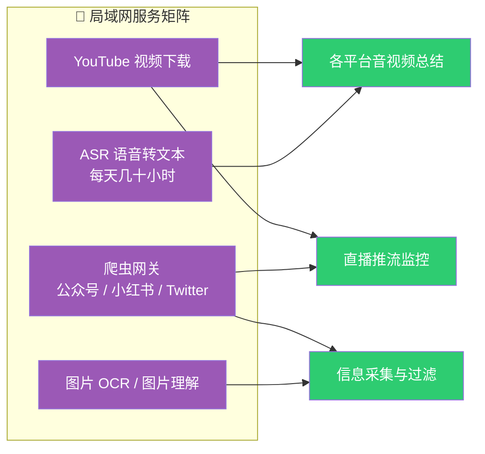
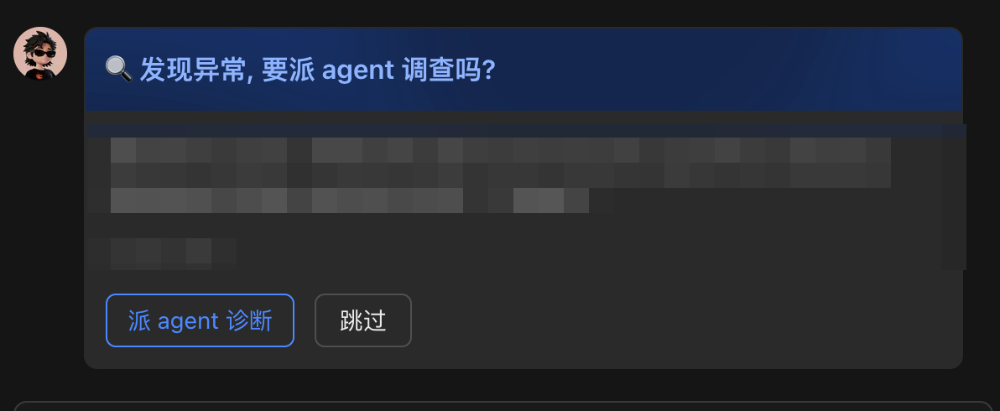
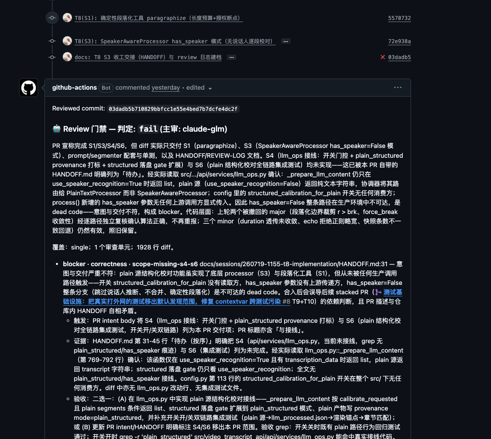
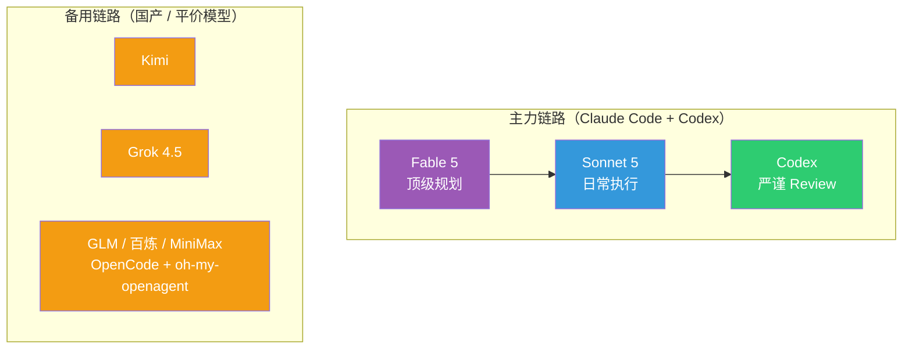
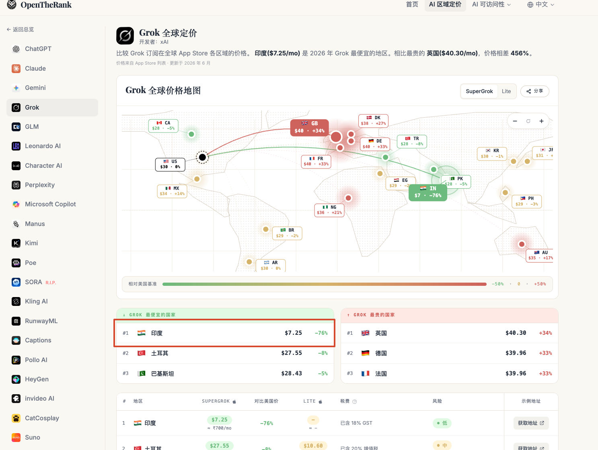

# 日均 40 亿 Token 的那一周：我怎么把羊毛变成长期生产资料

> 这篇是应亦仁的邀请在生财有术做的一次分享。原始文章发在我的博客上：[人生的塞尔达时期](https://zj1123581321.com/posts/260721-the-zelda-phase-of-life/)，技术细节比较多。飞书文档的链接 Agent 不太好直接读，如果想让 Agent 帮你解读，可以直接把博客链接丢给它，不懂的让它解释。这一版是专门为生财圈友做的优化版——移除了大量技术实现细节，更方便大家理解。核心就一句话：**趁 Token 还便宜，把它变成代码、服务和工作流这些长期可复用的生产资料。**

## 开头：Token 用光了这个晚上

好久没有更新了。原因很简单：沉迷于薅 Token 羊毛中。

Claude Code 7 天撞线、Fable 5（Claude 当前最顶级的模型）撞线、Codex 7 天撞线，Kimi Code 也到了 94%。备用渠道里 GLM 还剩 63%，Grok 剩 32%，DeepSeek 和百炼倒是余量充足——但主力全歇了。

所以干脆趁着等额度恢复的间隙，写写文章吧。

## 一、人生的塞尔达时期

玩过《塞尔达传说》的人都知道那种感觉：脑子里只剩下没有探索过的地方，吃饭出行都可以往后排，晚上一抬头就两三点了。塞尔达玩家最常说的一句话是"很想要一个没有玩过塞尔达的脑子"——因为游戏内容终究有限，探索完就再也找不回那种惊喜和沉迷感了。

但最近，我觉得自己又找回了这种感觉。**或者说，我可能进入了一段人生的塞尔达时期。**

每天被好奇心塞满，去探索不同的方向，解决切实的问题，经常一干起来就跟 Agent 聊到一两点。我有一个朴素的信念：**一个东西只要它的数据在线上，大语言模型之前有过相关的训练数据，原则上都可以拿 Agent 去尝试。** 之前写过的[软件篇](https://mp.weixin.qq.com/s/w8VnWJcUp5VkD5J-fYCUrg)和硬件篇，都是这么试出来的。

客观地说，我整个 7 月份的作息，都是围绕着 Claude Code 里 Fable 5 的额度有效期、还有 Codex 的额度重置时间来安排的。7 月 10 号新一轮额度周期开始，怕重置浪费，要集中消耗，连续几天日均都是 40 亿往上（所有渠道合计）。

注意，**这个 40 亿是 20x 套餐的额度被打满了，而不是我自己扛不住了。**

这是我自己做的 Token 用量监控面板。近 30 天总处理量（含 cache）折算下来等效估值 27,000 多美金——注意这只是按 API 价格的等效估值，不是真实账单，我实际花的钱是两个 200 刀的订阅。Coding Agent 维度，Claude Code 和 Codex 各占一半；模型维度，跑量最大的是 gpt-5.6-sol（33%，Codex 链路的主力模型）、Sonnet 5（24%）、Opus 4.8（18.6%）和 Fable 5（5.6%）。

由俭入奢易，由奢入俭难。Token 降下来以后，感觉自己就像一个废物——很多东西下意识想的都是"这个能不能给 Agent 做"，自己已经想不起来怎么徒手搞了。

这种 building 的过程比游戏好玩得多，也容易上瘾得多，非常容易进入心流状态——而且跟塞尔达最大的不同是：**这片新大陆每天都在长大，永远有新的角落可以探索。**

## 二、红利期的判断：能薅尽薅

先说结论：**趁着 Token 的羊毛期，要尽可能沉淀下来之后也能复用的生产资料，能薅尽薅。**

我是 2025 年 3 月左右开始用 Coding Agent 的，从 Cursor 切到了 Claude Code，然后一路陪着它升级套餐：Claude Code 和 Codex 的组合从 20+0、100+0、100+20、200+20、200+100 一路加到 200+200（前面的数字是 Claude Code 的订阅档位，后面是 Codex 的）。现在，我已经打算再去订阅第二个 Codex 账户了。

为什么这么激进？说白了就是一个判断：**虽然很多模型的 Token 平均成本在下降，但真正高智力那部分 Token 的成本，其实是在往上走的。**

你可以把现在这批订阅套餐想象成早鸟票，或者电商大促里的限时秒杀价——价格好到不真实，恰恰是因为平台还在抢地盘，需要用低价换用户、换训练数据，而不是想赚你钱。这也是我不认为当前这种低价套餐能撑久的原因：Anthropic 和 OpenAI 都还没上市，它们现在要的是用户规模和行为数据，不是眼前的利润。每个月 200 美金的套餐，换算成 API 额度我轻松能跑到 1 万美金的等效消耗；Codex 更夸张，200 刀能拉到两三万刀的等额消耗——这里要感谢 Tibo 哥，Codex 额度重置机制的负责人，重置节奏卡得好，让订阅的利用率高得离谱。

这种价格倒挂显然撑不了太久。

所以问题就变成了：**薅来的 Token，要怎么花才不算浪费？** 这是下一节要聊的。

## 三、把 Token 变成代码：Skill 与软件的边界

先立一个前提：如果未来高智力的 Token 只能按 API 价格买，今天很多玩法都跑不动了。所以要趁现在，把 Token 转化成几种能长期复用的东西：清洗过的高质量数据、工具软件、以及 Skill。这里面我想得最多的，是 **Skill 和软件的边界线该怎么划**。

### Skill 的本质和它的局限

Skill 这个东西，既要看它写得怎么样，也要看模型自身的能力，两者缺一不可——差一头，输出质量就飘。

它的好处是门槛低：全是自然语言，人人都能写，特别适合那种经常变来变去的工作流。说白了，**你是在借用 Agent 处理不确定性的能力**——这是 Skill 最值钱的地方。

但局限也在这儿。**Agent 的注意力是最宝贵的资源，得省着用在解决不确定性上。** 这个观点我在 [Context is All You Need](https://mp.weixin.qq.com/s/az3gUGA24mXs1ptYdayFjQ) 那篇里展开写过。

这句话怎么理解？你可以把 Agent 的注意力想象成一个人的工作精力——如果让它花一个小时去处理登录验证码，它就少一个小时去干正事。人也是这样，谁都不想上班时间被这种鸡毛蒜皮的事占满。

举个例子。假设你有一个浏览器爬虫的 Skill，能帮你爬各类网页，偶尔用一次当然没问题。但一旦用得频繁了，你会发现 Agent 的大量精力都花在了跟主线任务无关的琐事上：这个网页的账号登录来回重试、出了验证码来回折腾……次数一多，浪费掉的注意力比省下来的时间还贵，这个 Skill 的投入产出比自然就跌下去了。**说白了：一个场景用得越频繁，越不该继续靠 Agent 现场处理，而是该把它变成程序。**

### 高频场景的答案：组件化、工程化

所以更好的解法是：**一个场景用得足够高频的时候，就该把它程序化掉。**

从效率和成本角度，这就跟开车换挡差不多——手动挡开熟练的路段，你迟早会想换成自动挡，把省下来的注意力用在真正需要判断的路况上。或者换个说法：一道菜你天天做，不如买台面包机，把确定性的步骤交给机器，自己只管调味那部分真正需要判断的事。**把 Token 变成代码，我认为是目前杠杆最高的一种转换**——前提是这段代码要真正跑在生产环境里、被持续调用。代码的边际成本几乎是零，它大部分时候根本不需要 Token，或者说需要的 Token 比 Agent 方式低好几个数量级。

还是拿我自己的例子说。同样一套信息处理过滤流程，我把它写成了程序化的服务——虽然也调用 LLM，但走的是传统的单次调用，不是 Agent 方式，模型也可以换成 DeepSeek 这种便宜货。这样一来，单个项目一天七八百万甚至上千万的 Token 消耗，算下来**每天成本不到 10 块钱**。同样的活儿要是用 Agent 来做，可能得烧掉一两亿 Token——订阅套餐下能撑得住，但长期看这条路走不通。

目前我在局域网内已经攒了一批这样的服务，比如说：帮我处理 IP 风控、多国语言地区切换、直播不可下载这些问题的 YouTube 下载服务；给一个 URL 就能拿到公众号、小红书、Twitter 内容、且不花一个 Token 的爬虫网关；每天批量转录几十个小时音视频的 ASR 语音转文本服务；还有一个图片 OCR 和图片理解服务。

这些东西一旦建成，就能被下游很多场景反复消费，排列组合出新玩法——不管是总结各平台的音视频，还是帮我盯不同平台的直播推流，都是在之前搭好的工程化基础上组合出来的。每个服务下游通常有两三个消费方，多的能到四五个。这也是[我用 AI 长出来的那些工具](https://mp.weixin.qq.com/s/w8VnWJcUp5VkD5J-fYCUrg)那篇讲的"Skill 快速验证、工程化追求稳定"，最新的进展。

### 我的 Skill 使用原则

也因此，我现在装的 Skill 其实不多，常年高频在用的就一个：YC CEO Garry Tan 开源的 [gstack](https://github.com/garrytan/gstack) Skill 包——里面那个多视角 review 的 Skill 我每天都在用。其他即使装了，大多也是项目级别的安装，不会往全局装。或者我干脆去研究一下某个 Skill 背后的原理，把它吸收进自己的工程化项目里。

还有个判断标准分享一下：**一个 Skill 会不会长期迭代，是我判断它值不值得的重要依据。** 大部分自媒体博主分享的 Skill，如果不是持续更新的，多半是为了传播效果写的，没在生产环境里真正跑过。一个好 Skill 必然是要不断迭代的——要是作者自己都觉得写完扔那不用管了，那大概率它没在真实场景里被反复检验过，价值也就有限了。

## 四、从照看到放手：一套会自我修复的系统

前面聊的都是"物"——怎么把 Token 沉淀成长期资产。这一章聊聊"人"：当 Agent 能做的事情越来越多，人自己应该站在什么位置。

### 人机协作的三阶段

之前看过一篇硅谷 AI 工程师的实践分享（[AI agent 到底怎么才算真正落地](https://mp.weixin.qq.com/s/cbEtEbDb-A1_YFyf00dj0A)），把 AI 使用分成三个阶段，我觉得分得很准：

**第一阶段是 Copilot（人主导，AI 辅助）。** 说白了就是你干活、AI 打下手。每个判断、每次执行都要人点头——写文案让它改改、写代码让它补补、查资料让它总结一下。这个阶段大多数人已经在了。

**第二阶段是照看 Agent（人监督，AI 执行）。** 你已经能把更复杂的任务丢出去了，这本身就是进步——但问题是你走不开。Agent 跑偏了你得拉、卡住了你得推，就像照看婴儿，人一直拴在电脑旁，真正有意义的决策反而没精力做。

**第三阶段是 Agent 自主运行（AI 主导，人拍板）。** 团队在后台自己干活，你只在最关键的决策节点露一面，其他时候彻底放手。

这三个阶段不只适用于写代码。做内容的人也一样：第一阶段你让 Agent 帮你改改文案、总结总结资料；第二阶段你把选题调研、初稿撰写整个丢给它，但每一篇还得自己盯着看它有没有跑偏；第三阶段它自己监控热点、生成初稿、按你的风格排版，你只管最后扫一眼点发布。做电商也是同样的路：从让 Agent 帮你写产品描述，到让它管理整个上新流程，再到它自己盯数据、调价格、你只审批关键决策。

我自己的体会是，**正在从第二阶段往第三阶段迈**。这个过程里有个感受特别深：随着你和 Agent 的交互越多，你会发现大家碰到的问题其实是同一个——**人是整个流程里的瓶颈**。你得先解决自己这个卡点，才能把精力挪到更值钱的事情上。

某种程度上这跟管团队很像：前期你事事亲力亲为，做基础建设；规模大了以后精力顾不过来，就必须把事情交出去，靠规范、靠职能划分让业务继续扩大——你慢慢从一线执行者退到部门经理，再退到 CEO。跟 Agent 协作也是同一条路。

### 从第二阶段到第三阶段：我自己的例子

我自己维护的自用服务加上给团队用的服务，大概三四十个。维护一两个没问题，但项目一多——旧项目有 bug 要修、新功能要加、还想探索新东西——大量时间就被琐碎的运维和修 bug 吃掉了。

于是自然会想：**能不能让系统出问题的时候，自己派一个 Agent 去修？** 修完给我发条消息，我确认没问题，直接在线上把问题解决——全程我只要在飞书里点一下按钮。

这套东西我已经跑起来了，还真的在一次线上故障里从头到尾走完过一整套流程。整体逻辑就一张图：

整个流程里我只做两个动作：出事后在飞书里回一句"去查"，修完在批准卡上点一下"合并"。中间的诊断、修复、提交代码改动、跑自动化测试、找另一个 Agent 检查，全是 Agent 自己干的。

这套系统说白了就三条规矩：

**第一，所有自动化检查没通过，别想上线。** 测试要过、改动量不能超上限、核心基础设施的文件 Agent 不能碰——只要有一条不满足，直接打回，没有情面可讲。

**第二，写代码的和挑毛病的不能是同一个 Agent。** 代码改动提交后，会自动触发一整套检查流程：跑测试、找一个独立的 Agent 来挑毛病（写的和审的必须分开，不然容易自我感觉良好——人也一样，自己写的方案自己审，基本审不出问题）、有界面的项目还会自动模拟真实用户操作一遍再录屏给我看。这些活儿都是 Agent 自己扛的，没占用我的时间。

**第三，我被叫出来的那一刻，必须是万事俱备、只差拍板的那一刻。** 代码改动刚提交，飞书只会收到一张没有按钮的进度卡；等所有检查全部通过，同一张卡才会变出一个按钮。中间跑测试、评审、等结果的过程，完全不会打扰到我。

### 这套体系运转起来之后

系统搭好之后，你会发现自己大部分时候只在做两类决定：**一是定方向——接下来要做什么；二是放行——这件事能不能上。** 具体怎么执行，你不需要插手了。

我自己的开发模式也变成了这样：先跟 Agent 聊上一两个小时，把系统目标、架构、哪些事该做哪些不该做、工程上要做哪些取舍聊透，然后甩给它一个长程任务让它自己跑——短则三五小时，长则数十个小时。中间我卡三条硬规矩：先写验收标准再动手改（确保每次改动都有明确的"对还是错"的判断依据）、每次改动要小而完整（改一点提交一次，出了问题容易定位）、写代码的和检查代码的必须是不同的 Agent。

靠这套模式，我现在能同时撑起大概十个项目并行推进。这也是为什么我的 Token 消耗看着有点吓人——高峰时段半小时刷新一下面板，就是两三亿的消耗；自从 Codex 把 5 小时的限额取消掉以后，一天把 20x 套餐一周的额度跑完，是真会发生的事。

## 五、Token 哲学与模型军火库

### 三个基本判断

聊到这儿，说说我对 Token 本身的三个判断。

**第一，Token 已经变成了支撑好奇心的燃料——它就是我在现实这场游戏里的游戏币。**

**第二，Token 比人的精力便宜，但 Agent 的注意力很稀缺。** 你得先信"Token 比精力便宜"这句话，才不会舍不得用；但同时又得把 Agent 的注意力用在刀刃上。所以我的用法看起来有点矛盾：一方面我很计较效率——从来不开 fast 模式（烧配额很快，但同样的任务产出不成比例，不如开并发跑量），还会装一些工具来压缩单个任务的 Token 消耗（有的能降低 60-90%）；另一方面我又完全不吝啬，专门调不同的 Agent 对项目计划做交叉 review，就是冲着找问题去的。

**第三，Token 消耗量未必是个好指标。** 只是我们暂时找不到别的客观东西来衡量 Token 的有效利用率和 ROI，才退而求其次拿消耗量说事。真正该追求的是：同样一个任务，能不能用更少的 Token 完成；同样的 Token，能不能撬动更大的价值。

### 分层调用：我的模型分工

基于上面这几条判断，我整体的调用策略是分层的：**顶级的模型用来做规划、做总调度；均衡但便宜的模型做具体执行；工程师风格的 Agent 做多轮 review。**

先交代一下命名：Claude 家的模型按档位分，Fable 5 是当前最顶级的，往下是 Opus 4.8 和 Sonnet 5；gpt-5.6-sol 是 Codex 链路里的主力模型。第一节消耗图里出现的名字，这一章都会对上号。

这套分工背后其实就一句话：**不同角色交给性格不同的模型，而不是指望一个模型包打天下。**

**Fable 5 是技术合伙人。** 我只拿它做顶级的项目规划，用得很省。它最厉害的地方是会从业务的视角帮你做判断——哪些事情值得投入、哪些事情这个阶段不该碰、技术选型该怎么选，它都能给出非常扎实的建议。不是那种你说什么它就做什么的指令机器，而是真的会拦着你，也真的能帮你想清楚路该怎么走。**既是拦路人，也是领航员。**

**Codex 是严谨工程师，也是性价比之王。** 因为 Tibo 哥搞的额度重置机制，它是所有订阅里性价比最高的一档，这也是我想再开一个号的原因。用 Codex 要注意控制它的复杂度——世界上不存在零 bug 的工程项目，但 Codex 天生极致严谨，恨不得在每个点上都锁死风险，你得提前跟它说清楚项目目标、别过度设计，修问题也尽量先做减法而不是加法，不然一个问题解决了，又引入一堆新问题。它做 review 这件事确实没得说，工程视角的问题我对比过很多模型，目前还是 Codex 体验最好，而且量大管饱。

**Grok 4.5 是执行层牛马。** 能力大概是准第一梯队的水平，但速度快得离谱——窜稀一样的速度。之前印度区订阅只要 30 块人民币一个月，现在那个优惠没了，不过仍然可以一次买三个月（相当于月均价格还是比原价便宜不少），每周大概两三亿 Token 的额度。Claude Code 和 Codex 负载高的时候，很适合把活儿甩给它，跑得快又能打。

**Kimi 699 套餐：审美能打，工具待成熟。** K3 的前端审美确实是国产模型里最能打的，整体能力也很不错，一周大概七八亿 Token 的量。比较纠结的是 Kimi 的命令行工具目前体验还差一截：长任务的上下文管理、一些指令的支持能力都不如成熟工具——不过这些应该会逐步提升。纯性价比角度 Kimi 699 肯定是不如 Codex 的，但还是要支持一下国产，希望它们再接再厉。

国产和平价模型我也在用，整体还在追赶阶段，放一张表供参考：

| 模型 | 月费 | 我怎么用 | 体感 |
|---|---|---|---|
| GLM 5.2 | 199 | 跑 code review | 还行，缺多模态 |
| MiniMax M3 | 199 | 文档整理、日常任务 | Coding 太拉，经常找不到用途 |
| DeepSeek | API 按量 | 给程序化服务当"便宜劳力" | 第三章说的"每天不到 10 块"就是它 |
| 百炼 Coding Plan | 199 | 简单任务 | 支持多模态，凑合用 |

## 六、大航海时代：你的行业离 Agent 还有多远

前面说的都是我自己的一亩三分地——具体的用法、具体的取舍。跳出来看整个行业，其实也能套上同一套逻辑，这算是[跑在熊前面的日子](https://mp.weixin.qq.com/s/Rjxlr-O2kbH2vtHOWJ2G9A)的续篇。有几个判断我觉得值得分享，尤其对正在考虑"AI 在我的行业到底能不能用"的人。

### 趋势不变，但过程漫长

先说结论：大方向没变，**Agent 进入整个社会的生产环境，这个趋势没人能改。** 但这个过程可能会很漫长，核心卡在两个层次上。

**第一，Coding 是一个偶然且稀缺的场景。** 为什么 Agent 在写代码这件事上进展最快？因为代码写出来能跑、能测、能验证，Agent 可以自己判断做对了还是做错了，形成一个完整的反馈回路。再加上开源社区文化，大量程序员多年积累的代码和文档全部公开可训练。**高薪人才加上开源文化，这种组合本身就是偶然的、稀缺的**，现实里很难找到第二个这样的场景。剩下的世界大多不具备这两个条件：很多行业的核心经验都窝在一线人员的脑子里，没有被信息化；而且很多决策是概率性的——做了一个营销方案，效果好不好受太多因素影响，不像代码一样能给出明确的"对"或"错"。这些领域 Agent 要大规模落地，进程注定慢得多。

### 技术问题是小问题，利益分配才是大问题

第一道门槛卡在数据和场景上，第二道门槛卡在人身上。英国喜剧《是，大臣》里有句话说得特别对：不管一个部门成立的初衷是什么，它最后都只会有一个目的——证明自己存在的必要性。这就是新技术往企业里推的时候，真正要面对的东西。所以 **AI 进企业，必须是一号位亲自下场、一号位拍板的事**——这一点亦仁在直播里也反复强调了。

### 但你只需要相对领先

不过换个角度看，**门槛高这件事，对谁都一样。** Agent 进入整个社会的生产环境，大方向没人能改——但这个过程会很漫长。好消息是：**竞争从来不是跟 AI 比，是跟同行比。** 你不需要跟硅谷大厂的研究员比 AI 技能，你只需要在自己的行业里，比你的竞争对手多领先一两个身位。

而且说实话，**你能读到这篇文章、读到这个位置，你大概率已经领先了。** 你所在行业的大多数人，可能连 Agent 是什么都还没搞清楚。这个领先本身就是一种优势。

### 行业 know-how + Agent = 最大杠杆

但光有 AI 技能还不够。这个时代最值钱的组合是：**你的行业 know-how，加上 Agent 的执行能力。**

Agent 最缺的不是算力，是你脑子里那些东西——想法、见识、踩过的坑、最佳实践。这些是 AI 训练数据里没有的。

举个直观的例子。同样让 Agent 帮你做一套客服话术，一个刚入行的人和一个干了五年的老手，喂给 Agent 的东西完全不同：新人可能只能说"语气要好"，老手能告诉 Agent "退货问题先确认是否在 7 天内、金额超过 500 走主管审批、遇到情绪激动的先共情再解决问题"。后者喂进去的就是五年踩坑经验的结晶——Agent 拿到这些，输出质量会高出一个量级。

**行业十年的 know-how，配合 Agent 的执行能力，才能发挥出最大的杠杆。** 经验越深、踩坑越多的人，做出来的 Agent 越好用。这也是为什么在这个遍地黄金的时代，行业老手反而最该兴奋——你攒下的那些经验，以前只能靠自己一个人慢慢用，现在可以通过 Agent 成倍地放大出去。

**谁愿意真的把这些经验分享给你，他是真的在向你传递价值。**

## 给生财圈友的几条实操建议

前面说了很多思路和判断，最后收束成几条可以直接拿走的东西：

**一、现在的 Token 价格是限时秒杀，不会长期存在。** 200 刀订阅能跑出 1-3 万刀的等效消耗，这种价格倒挂是平台抢用户阶段的产物。趁便宜，把 Token 转化成代码、服务、Skill 和工作流——等它涨价的时候，你手里攒下的这些东西还在。

**二、重复的事情要算一笔账：继续让 Agent 现场处理，还是一次性做成程序。** Agent 的注意力比 Token 更稀缺。如果一件事你反复在让 Agent 做、每次都花不少精力，就值得衡量一下：把它做成程序的一次性投入，跟长期占用 Agent 注意力的成本比，哪个更划算？不是所有重复都值得程序化——频率够高、流程够固定的才值得；偶尔做一次、每次都不太一样的，继续交给 Agent 反而更合理。

**三、不要指望一个模型包打天下。** 顶级的做规划，便宜的做执行，严谨的做 review——不同角色交给不同模型，就像公司里不同岗位用不同人一样。

**四、你的行业经验 + Agent 的执行能力 = 最大杠杆。** Agent 最缺的不是算力，是你脑子里那些行业 know-how。经验越深、踩坑越多的人，做出来的 Agent 越好用——你攒下的那些经验，以前只能靠自己慢慢用，现在可以通过 Agent 成倍放大。

**五、这个时代最值钱的是"知道该做什么"。** 想法、见识、踩坑经验、行业 know-how——这些是 AI 训练数据里没有的东西。你在自己行业里积累的真实经验，恰恰是 Agent 最需要、也最缺的。

## 写在最后

塞尔达玩家想要一个没玩过塞尔达的脑子，是因为游戏的内容是有限的，探索完就没有了。但这一次不一样——**这片新的大陆每天都在长大**，每天醒来都有新的角落可以探索。

红利期总会过去：额度会收紧，套餐会退坡，高智力的 Token 迟早要按它真实的价格计费。所以在还能薅的时候，能薅尽薅；更重要的是，把薅来的 Token 沉淀成代码、服务和工作流这些**长期可复用的生产资料**——等到 Token 变贵的那一天，你手里攒下的东西，才是真正的通关奖励。

祝各位探索愉快。
