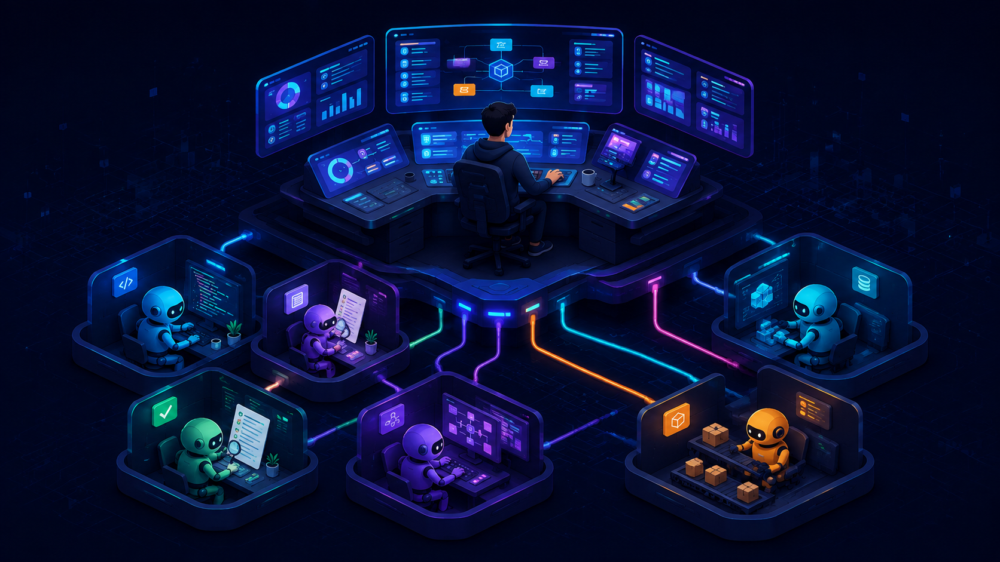
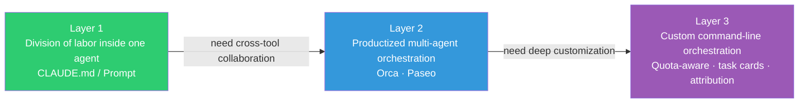
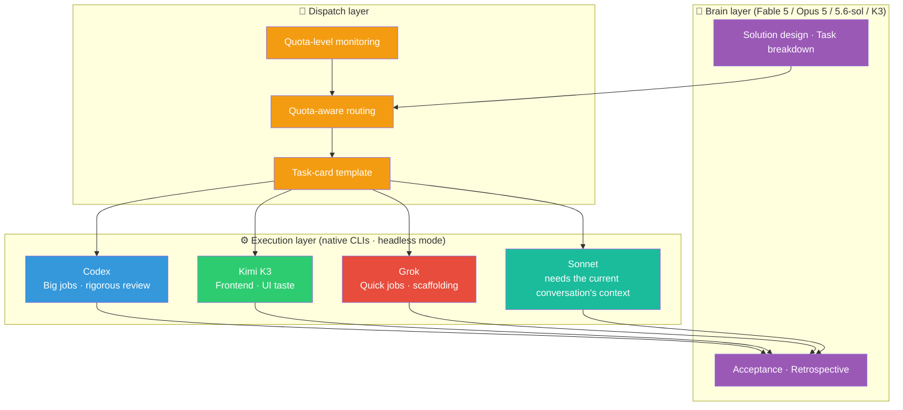
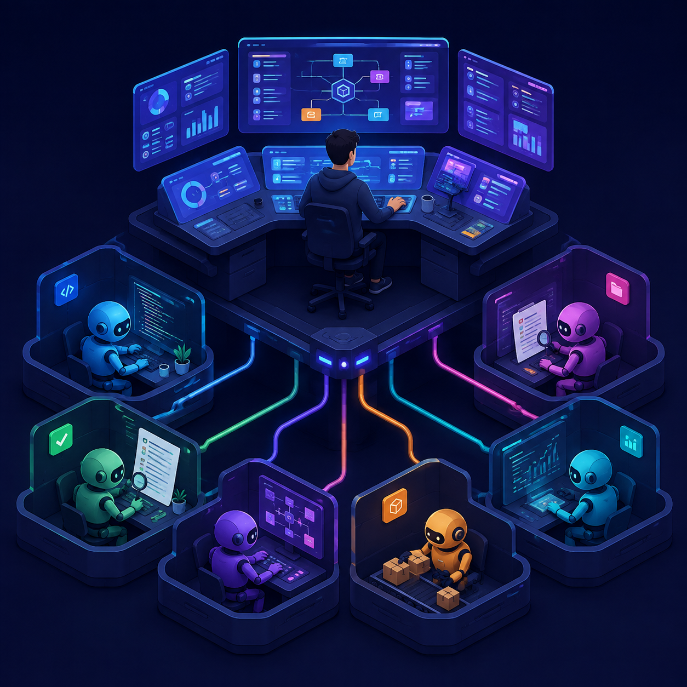
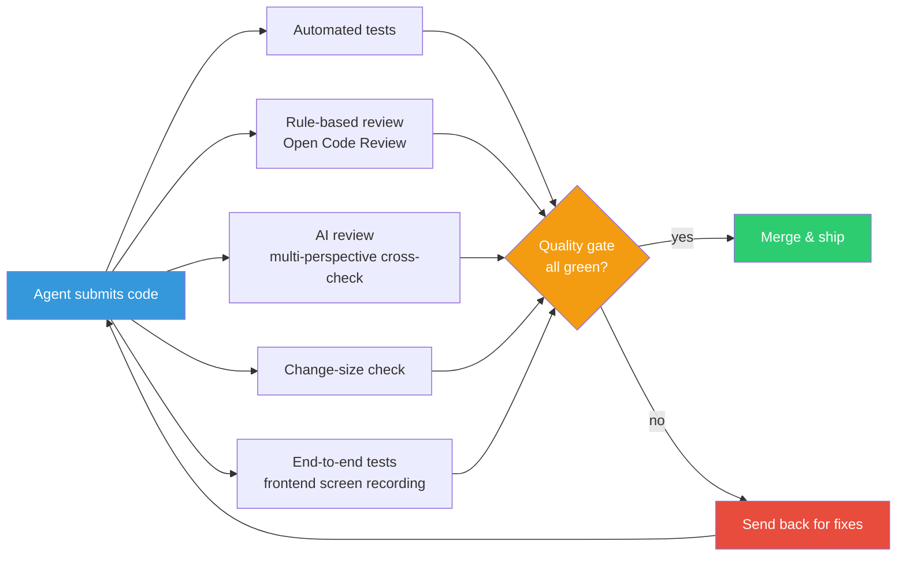
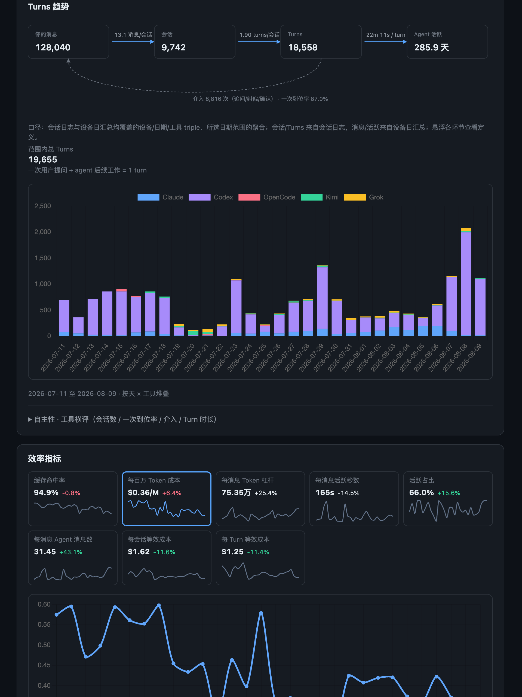

*Translated from the [Chinese original](/posts/260809-multi-agent-scheduling-architecture/). Last synced 2026-09-26.*

> The draft of this piece was an 80-minute voice talk. It keeps the tradition of this series: **as a human, all you need to understand is the thinking and the architectural logic — for every concrete execution detail, just throw this post at your Claude Code or Codex and let it do the work.**

## Opening: Why Talk About a Scheduling System

In [The Zelda Phase of Life](/en/posts/260721-the-zelda-phase-of-life/), I touched on the topic of "multi-agent scheduling" with an architecture diagram and a short overview — the brain does the planning, the execution layer does the work, and the quality gates stand guard. But the focus of that post was token economics and the model arsenal; the scheduling system itself got only a passing mention.

This post is the deep dive.

Let's start from the one-line principle: **an agent's attention is a precious thing, and you should spend it on resolving high-quality uncertainty, not on trivial chores.**

How should you read that? Picture an agent's attention as a person's working energy. If it spends an hour solving login CAPTCHAs, that's an hour less for real work. In [Context is All You Need](/en/posts/context-is-all-you-need/) I used a metaphor: attention is like your workbench — the bench is only so big, and once it's covered in clutter there's no room for real work. That post was about managing one agent's workbench; this one is about making good use of every agent's workbench when you simultaneously have a whole pile of agents — Claude Code, Codex, Kimi, Grok.

The analogy to a CEO's allocation of energy is exact. A CEO's energy is limited and should go only to decisions, high-value judgment on direction, and hunting for resources — never to the details of front-line execution. **The general marches; the general does not chase rabbits.**

## 1. How This System Grew

When people hear "multi-agent scheduling" they may picture a heavyweight piece of architecture, but it began as a very plain idea.

At the time, Fable 5 (the current top-of-the-line model in the Claude family) was in a limited beta, with no guarantee I'd ever get to use it again. So I used it stingily: Fable 5 handled only planning and design, and every concrete execution task was outsourced to Sonnet 5 (a cheap model with well-balanced capabilities). **Cost pressure forced out the original division of labor.**

The path of evolution after that:

1. **Starting point**: the various coding agents each had their own config files, which were a pain to maintain, so I set up a dedicated code repository (think: a single place where all of a project's files live) to manage them in one spot.
2. **Step one**: now that the config files were centralized, could other coding agents be turned into an execution layer?
3. **Step two**: with the execution layer running automatically, I needed to know how much quota each subscription had left — so I built a monitoring dashboard.
4. **Step three**: with the dashboard producing data, could the system pick executors automatically based on remaining quota? That's how quota-aware scheduling came to be.

Not one of these steps was designed up front; each one "grew out" of actual use. You'll find that once a component exists, it sprouts unexpected new uses:

- The **monitoring dashboard** started out merely tallying usage per subscription, then gained token-consumption stats (by model, by project, by device), then memory and workspace-cleanliness monitoring for the dev machines, then health checks for the CI test machines — and finally became the scheduling system's "instrument panel," informing the decision of "who should get this task."

- The **scheduling system** started as a bare script for picking an executor, then gained quota gates, a task-card template, commit tracking, and retrospective reports — and eventually became a complete multi-agent orchestration infrastructure.

**In the agent era, allow your ideas to be "wasted." You never know how useful a tool a simple starting idea will eventually grow into.** It takes shape bit by bit through your collaboration with your agents. If your curiosity is still alive, you'll have a great many interesting things to play with.

## 2. The Overall Architecture: Three Progressive Layers

The scheduling system breaks into three layers. Most people are well served by the first layer alone; if you want to run several agents at once without building infrastructure yourself, ready-made products exist at the second layer; only people with deep customization needs — like me — end up at the third.



### Layer 1: "Brain + Sub-agents" Inside a Single Agent

This is most people's daily reality: you use a single coding agent (only Claude Code, say, or only Codex) and split the roles of brain and executor inside it.

How? For example: Claude Code has a global config file called `CLAUDE.md` where you can write something like "you are the brain; you only design solutions and break work into tasks, and all concrete code changes are delegated to sub-agents" — and the model will then decide which things to do itself and which to hand off. You can even assign roles to sub-agents: an `implementer` (the executor, writes the code) and a `reviewer` (read-only, in charge of finding faults). Codex works on similar logic, constrained via prompts and config files.

The core technique at this layer is the one I covered in [Context is All You Need](/en/posts/context-is-all-you-need/): keep the brain's attention on planning and decisions, and let sub-agents do the grunt work on their own separate "workbenches" — don't let the brain's bench get buried in clutter.

For most people, mastering this layer alone already brings a large productivity gain. The appendix at the end of this post has a sanitized reference template; you can hand it straight to your agent and have it set things up for you.

### Layer 2: Productized Multi-Agent Orchestration (Where Most People Should Start)

If you hold subscriptions to several coding agents (Claude Code + Codex + Kimi, say) and want them working together without building the infrastructure yourself, use off-the-shelf products:

- **[Orca](https://github.com/stablyai/orca)** (a YC-incubated project): focused on parallel agent orchestration. It manages multiple agents working simultaneously on different copies of your code, ships desktop, mobile, and server clients, and supports running any coding agent on your own subscription accounts.
- **[Paseo](https://github.com/getpaseo/paseo)**: focused on lightweight orchestration. It too schedules multiple agents from desktop and mobile, with command-line and Docker deployment modes.


What these two tools share: they too work by directly leveraging each vendor's native coding agent (like my layer three, they're built on the premise that "a model and its native tools should be used together"), and they take the thorniest problem off your hands — "how do multiple agents work at the same time without colliding." Both also have a GUI, which lowers the barrier to entry considerably. If your need is "I have several subscriptions and want them all working for me at once," start at this layer and go no further.

My own orchestration setup has in fact learned a lot from these two open-source projects — for instance how they monitor task-state changes in the execution layer and how they assign tasks. Both are worth studying.

### Layer 3: Custom Command-Line Orchestration (My Setup)

I moved on to layer three not because the layer-two products are bad, but because I had more customization needs.

First, the plainest pain point: **switching between tools is itself exhausting.** When you have this many tools at once — Claude Code, Codex, Kimi Code, Grok Build — just the mental "gear-shifting" of hopping between them burns a great deal of energy.

Layers two and three share one premise: **a model and its native tools should be used together.** I discussed this in my post on [Claude Code's design philosophy](/en/posts/claude-code-risk-model-philosophy/) — to bring out a model's maximum capability, it's best to use the development tool it was natively paired with; ideally, the model should even be deeply coupled with the tool's feedback data during training. Recent interviews with the Claude Code team confirmed the same point: they deleted 80% of the system prompt and the agent's capability did not drop.

By the way, open frameworks like [OpenCode](https://github.com/opencode-ai/opencode) already have multi-agent routing by task type built in — they automatically assign different models according to the task, out of the box. The problem is that they lock you into a single framework, cutting you off from the evolutionary dividends of each vendor's native tooling.

On top of that shared premise, I have a few extra customization needs:

**First, Anthropic explicitly restricts Claude Code subscription quota from being spent in other tools.** And their attitude toward "headless mode" (explained below) has been wavering — possibly because they want to collect human-correction data on agent behavior. So day to day I don't run Claude in headless mode; I pick other vendors' tools for automated execution instead.

**Second, I need scheduling driven by real-time quota levels.** I have a self-built monitoring dashboard that tracks the remaining quota of every subscription in real time. The scheduling system reads that data and automatically decides "who gets this task" — accounts running low stop receiving dispatches, accounts with ample headroom take on more work.

**Third, I need complete task tracking and retrospectives.** Every task gets a standardized task-card template (goal, change boundary, acceptance criteria), and every commit can be traced back to which executor and which model did it.

One more thing that matters: **the whole orchestration system is built as a hybrid of "prompts + scripts," not software in the traditional sense.** Some rules are written into prompts for the model to follow (role division, engineering standards); others are enforced deterministically by scripts (task assignment, worktree creation and cleanup, quota queries). Why split them? Because global prompt space is precious — cram too much in and the model tends to lose key instructions over long conversations. **Whatever a script can guarantee, don't leave to a prompt alone.** That design principle applies no matter which layer you're on. The current system runs on both Linux and Mac; Windows would be considerably more complicated.

So layer three is designed like this:



**The brain does only four things**: design solutions, break work into task cards, accept results, and run periodic retrospectives. It writes no code (except single-line tweaks).

**The dispatch layer** assigns task cards to the best-suited executor based on task type and each subscription's remaining quota:

| Task type | First-choice executor | Why |
|---|---|---|
| Big jobs: complex tasks spanning multiple files | Codex | High quality, ample quota |
| Quick/rush jobs: scaffolding a new project, bulk renames | Grok | Extremely fast, low cost |
| Frontend/UI: pages, components, visual styling | Kimi K3 | The strongest visual taste among Chinese models |
| Unhurried slow jobs: adding tests, writing docs | Codex | Quality first |
| Tasks needing tools scoped to the current conversation | Sonnet sub-agent | Coupled to the current session's context |

**The execution layer** runs entirely in "headless mode." To explain the concept: when we normally use a coding agent, we open a conversation window — you say a sentence, it takes a step; that's "conversation mode." "Headless mode" is the other way of using it: you write up a task description, pass it to the agent through the command line, it quietly finishes the work in the background and hands back the result — no watching required at any point. It's like emailing an employee "get this done" instead of standing beside them directing every step. Why choose this mode? Because the scheduling system needs to programmatically dispatch dozens of tasks at once and collect results automatically — a human sitting there holding conversations one by one cannot achieve that kind of automation.

A side recommendation for managing multiple agent sessions in a terminal environment: **[herdr](https://github.com/herdrdev/herdr) + [mosh](https://mosh.org/)**. herdr is a terminal multiplexer designed for AI agents that manages multiple agent windows at once; mosh solves the dropped-connection problem of remote sessions. This combo has replaced the tmux + SSH setup I recommended in [Agents Don't Clock Out](/en/posts/260628-agent-era-dev-anywhere/) — more stable and better suited to agent scenarios. If you're interested, also see [this best-practices guide on keeping accounts alive and interacting with agents](https://mp.weixin.qq.com/s/U0Ha_Zia3brKntMvPPeurA).

The concrete implementation details of this layer (task-card template, routing config, sub-agent role definitions, etc.) are in the appendix as sanitized reference material; interested readers can hand the appendix to their own agent and have it build a similar system.

### Parallel Development: One Brain, Multiple Pipelines

Using a single brain as the manager has one more huge benefit: **parallel development gets dramatically faster.**

What is parallel development? An analogy: suppose one project needs three features built at the same time — a login page, a payment API, push notifications. Done serially, you finish one before starting the next; done in parallel, all three start together, three times as fast. The difficulty with parallel is that all three features touch the same code, and without isolation they collide as they go.

The way to solve this is called a **worktree** — think of "photocopying" the project into multiple copies, with each agent working independently on its own copy, none interfering with the others. When they're done, the brain is responsible for merging each result back into the main line.

In my system the brain manages these copies itself: which ones can start simultaneously, which must wait for the previous one to finish, how naming stays consistent, how they get cleaned up afterward — all arranged automatically by the brain.



In actual operation, thirty to fifty agents are often running in the background, while the brain windows I keep open in the foreground number maybe seven or eight. Under each brain, five to eight tasks run in parallel, each on its own copy, and the brain handles the merge conflicts once they finish.

Without a brain managing things centrally, you'd be hand-creating these copies and development branches (think: "parallel versions" of the code), and over time it gets messier and messier — things you forgot to clean up, copies running wild everywhere. Let the brain do it, and the benefit is that it strictly enforces the rules you've set: uniform naming conventions, automatic cleanup on completion, automatic conflict handling.

### Choosing the Brain's Model

The hard part of every problem eventually reduces to a single question: **is the brain that breaks down the task cards actually good enough?**

"Good enough" here doesn't mean raw model intelligence; it means the combined "model + tools" capability: can it plan the work properly against your business goals? Can it exploit parallelism efficiently to speed up development? Can it adjust course promptly based on errors along the way?

The current runaway leader for brain duty is still Fable 5. What makes it formidable isn't cleverness but its **sense of proportion** — it can push back against you at the right moments and propose a better solution. Without any deliberate coaxing, it has the built-in instinct to "think one dimension up": rather than patching the bug in front of it head-first, it can propose a solution at a higher level so that this entire class of problems never happens again. That ability is genuinely scarce.

Since Fable 5's quota is limited after all, I also use Opus 5, GPT-5.6-sol xHigh, and Kimi K3 as brains. For clearly-defined engineering tasks, they're all decent. But each has its own temperament: GPT-5.6-sol is **too much the engineer** — everything must be done with ultimate rigor, it over-engineers constantly, and you have to keep telling it in your instructions "don't make it so complicated"; K3 is compute-constrained — it thinks deeply but runs slow.

As for the execution layer — at the current pace of model releases, I think they're all fine. My mainline execution layer has already switched to GPT-5.6-sol Luna xHigh mode; on Codex's $200/month plan, roughly 30 billion tokens are available over 7 days, which is very ample. Any of today's first-line models, dropped back a year or two, would beat that era's best coding assistants by a wide margin. What they lack is global vision and big-picture judgment — but if the task cards are broken down well, the execution layer is a basically solved problem. **So all of the difficulty concentrates on the brain.**

## 3. Quality Assurance: Making Agents Keep Themselves in Check

Everything I pay attention to — scheduling and orchestration, testing and evaluation, autonomous ops — is fundamentally one and the same logic: **human energy is finite, so outsource everything that can be outsourced, don't fuss over token consumption, and reserve your own energy for the two ends — setting direction at the very start, and accepting the result at the very end.**

Even more extreme: **just do the approvals.**

But that has a precondition — you need an automated quality-control mechanism. Otherwise nobody is reviewing what the agents produce, and sooner or later something will break badly.

### Write the Tests First, Then the Code

In my system, long-running tasks (the kind where you issue one instruction and the agent may run on its own for hours) achieve reasonably good results by relying on three hard rules:

1. **Write the tests before the implementation**: the easiest way for an agent to go wrong in a long-running task is to drift — it wanders off the original goal as it works. The tests are its anchor; anchored in place, it can't drift far.
2. **Small, frequent commits**: save after each small feature is done rather than batching everything into one giant save at the end. That way, if something breaks, you know precisely which step introduced it.
3. **Gates that keep hunting for problems**: the automated checks scrutinize every commit; when they find an issue they feed it back to the agent, which fixes it and resubmits — a self-correcting closed loop.

Put these three together, and autonomous agent execution over long tasks generally behaves quite well.

### The Writer and the Critic Must Be Different Agents

I raised this in [The Zelda Phase of Life](/en/posts/260721-the-zelda-phase-of-life/): **the agent that writes the code cannot be the same agent that reviews it** — just as you can hardly spot the errors in your own writing, an agent will "self-confirm" and believe what it wrote is fine. Only having a separate, independent agent do the review actually surfaces problems.

In practice, I use two layers of review:

- **AI review**: once code is submitted, an independent agent is triggered automatically to do a code review. The reviewer is separated from the author — a different model, a different context — which amounts to bringing in a complete "outsider" who has no idea how you wrote it. Multiple reviewers with different perspectives cross-checking each other raises the probability of catching problems by a great deal.

- **Rule-based review**: here I want to specially recommend [Open Code Review (OCR)](https://github.com/nicepkg/opencodereviewer) from Alibaba. It doesn't use AI to "understand" the code; it scans mechanically against a fixed set of rules — like a factory's QC assembly line, checking one item at a time. The benefit is extremely low cost: even if the model you configure is quite basic (a cheap DeepSeek or MiniMax model, for instance), it can mine out large numbers of issues at minimal expense. Of course it also produces plenty of false positives (flagging places that are actually fine), but you just hand its findings to an agent to adjudicate — **a very good bargain all around**. My OCR currently burns on the order of 100-200 million tokens a day. Highly recommended.

### Keep Every Change Small

The size of each commit needs to stay within what an agent can comfortably handle. Why? Because an agent's "workbench" (the context window) is finite — stuff too much into it and its "intelligence" drops noticeably, dragging review quality down with it.

My rule of thumb: **keep a single PR (one complete reviewable unit of code changes) under 3,500 lines** — that's the hard ceiling in the gate system, leaving some headroom for auto-generated files. In day-to-day experience, most tasks break down to the scale of a few hundred lines. That keeps the reviewing agent working within its "sweet spot" of intelligence.

### For Frontend, Screen-Record What Got Built

For backend code, run the tests and, results passing, you're done. Frontend is different — you can't judge whether a page looks good and the interactions feel right purely by running tests.

My approach is to require the agent to actually launch the application and walk through the full user flow from start to finish with a real account, **recording the screen and attaching the recording to the commit**. At acceptance time I just watch the video instead of running everything myself again.

### One Unified Automatic Gate

All the checks above — tests, AI review, rule-based review, change-size control, frontend screen recordings — are integrated into one and the same automatic gate. **If the gate isn't all green, don't even think about merging.**



This gate doesn't only serve the auto-fix scenario — the commits produced by work I proactively assign go through this same pipeline. Rules are rules; no going soft just because it's "one of our own."

## 4. Letting Agents Enter Production Autonomously

The self-repair system I described in [The Zelda Phase of Life](/en/posts/260721-the-zelda-phase-of-life/) (a production incident occurs → automatic diagnosis → agent fixes it → code submitted → passes the gate → approval in Feishu → deployed to production) was the first form of agents entering production. Here are a few more scenarios, all fundamentally the same road: **pick out the things you currently do repeatedly, let agents replace you step by step, and free up your own energy.**

### Scheduled Bulk Issue Triage

While building the agent orchestration system, the early phase produced fifty to sixty issues a day (think: work tickets waiting to be handled). Once things stabilized it was still one or two a day. Handling them manually drains energy.

The approach: bulk-handle them in the early phase; later turn it into a scheduled job — every morning the agent automatically goes through the pending tickets and proposes how to handle each one, and I just tap "approve" in Feishu.

### Periodic Architecture Scans and Security Audits

An agent's strength is its strong sense of goals, but its weakness is also that strong sense of goals — it tends to solve the problem in front of it and nothing more. Without deliberate guidance, it won't take the initiative to "think one dimension up": could an adjustment at the architecture level make this entire class of problems stop happening?

So two things need doing periodically:

1. **Architecture review**: step outside the current task and have the agent scan the whole codebase, looking for architecture-level optimization opportunities.
2. **Security scans**: for example, OpenAI's **[Codex Security](https://github.com/openai/codex-security)** tool — it burns a lot of tokens and takes a long time, unfit to run every time, but well suited to a run every once in a while. **Pitfall warning**: if your account doesn't have Cyber certification, running security scans with GPT's built-in models can get intercepted by the safety guardrails — you spend the quota and get no conclusions out. I'd suggest preferring models without that restriction instead, such as DeepSeek V4 Flash.

### Periodic Retrospectives

Every week I run a retrospective over the past development records using the best model available. The core inputs for the retrospective are the locally saved conversation logs and trajectory data (the next chapter explains in detail why to keep this data and how). Combined with the official best practices from Claude Code and Codex, I look at where the collaboration between my agents and me still has friction points and room to improve.

The inspiration this kind of retrospective brings you is far greater than you'd imagine.

## 5. Which Metrics to Monitor

Having covered "how to build it," let's talk about "how to measure it."

One caveat first: there is currently no single perfect metric that directly reflects the quality of human-agent collaboration. These metrics are **not suitable for competing with other people**; they're more of an honest dashboard for yourself — an objective, sideways read on whether your collaboration with your agents is smooth or full of friction.


### 1. Daily Token Consumption (Including Cache)

The most intuitive metric. Without deliberately wasting tokens, pushing consumption up already takes considerable skill and infrastructure — otherwise large amounts of tokens leak away into agents going off track, redoing work, and spinning in circles.

My current daily peak is about 5 billion tokens, with a daily average of 2 to 3 billion.

### 2. First-Pass Completion Rate

OpenAI measures agent workload with a metric called [Codex agent turns](https://openai.com/index/how-agents-are-transforming-work/) — simply put: you issue one instruction, and everything the agent does afterward adds up to one turn.

From this we can derive a **first-pass completion rate** — you start a task and the agent completes all the goals with zero intervention from you in between. Every time you step in mid-course to correct something, something was misaligned — maybe your description wasn't clear enough, maybe the agent's own capability fell short.

### 3. Longest Unattended Run of a Long Task

How long can an agent run autonomously without going wrong? This metric best reveals the match between you and your agents: on one side it tests whether you can set goals well and break down task cards well; on the other it tests the agent's and the tools' ability to handle long-running tasks.

The premise of all metric monitoring is — **the goal actually gets accomplished**. Chasing a nice-looking number on its own is meaningless.

### 4. Keep Every Trace of Trajectory Data

As mentioned under periodic retrospectives, retrospectives hinge on local conversation logs and trajectory data. **No records means no retrospective; no retrospective means no improvement.**

Your machine already keeps records of your agents' work trails (log files for every conversation and operation) — excellent retrospective material. **First thing to do: keep them for the long term.** Claude Code by default keeps only 30 days of trajectory data; you can set it to keep everything permanently, plus scheduled backups.

This is your own proprietary data on agent task paths, and its value is extremely high. Put it this way: a large share of the revenue of relay platforms (third-party API reselling platforms) comes from reselling users' task-trajectory data — the model vendors quote outrageous prices for high-quality "model task-execution path" data. This data is lying on your disk; all the more reason you should preserve it and put it to use.



### 5. Task-Execution Cost per Million Tokens

This metric directly answers "is your token spending worth it?" My current cost per million tokens of task execution has fallen from about $0.60 at the very beginning to around $0.40, with hopes of optimizing further to the neighborhood of $0.30.

Why care about it? Because the current price inversion across vendors' subscription plans cannot last forever — I discussed that judgment in [the Zelda post](/en/posts/260721-the-zelda-phase-of-life/). The day the subsidies taper off and high-intelligence tokens have to be bought at API prices, the routing experience you've accumulated by then — knowing which tasks to dispatch to which models, and which configurations are cost-optimal — is genuine, hard competitive strength.

### 6. Cache Hit Rate

When an agent reads the same stretch of code or documentation repeatedly, anything still in cache doesn't need to be reprocessed, saving a lot of tokens. Cache hit rate measures the proportion of "how much content hit the cache."

95% and above is the normal baseline; a good tool configuration can reach 97% or 98%.

This metric has one special trait: **the range you can actively control is fairly limited.** The cache validity window and pricing are decided by the platform — different platforms have different cache time windows (anywhere from minutes to hours), and a hit within the valid window costs far less than reprocessing. What you can do mainly is: keep conversations continuous and avoid frequently switching topics, which invalidates the cache. So it's more of an **auxiliary monitoring metric** — you don't need to deliberately "optimize" it, but if you find it clearly below the normal range, something is wrong with how you're working, and it's worth investigating.

### 7. Every Commit Traceable to "Who Did It"

Every code commit should be traceable to: **which tool** did it (Claude Code, Codex, or Kimi), **which model**, **what configuration**, **linked to which conversation session**.

That gives you a clean "report card":

```
time + tool + model + config + conversation context → task outcome
```

With it, you can review which model paired with which tool suits which kind of work, and what usually causes failures. **Implementing this is actually simple** — two layers of hooks do the job: one layer is a Git hook that automatically writes tracking fields into the commit message at commit time; the other is the coding agent's own hook mechanism (like Claude Code's hooks), which automatically records metadata before and after each agent operation. Tell your agent the requirement and it will configure both layers for you. The entire cost is some local disk usage; the payoff is very high.

### 8. The Brain Grades the Execution Layer

In the scheduling system, the brain grades the executor as a side effect of acceptance — how did this model perform in this scenario?

It's a subjective metric, but as time accumulates you develop a precise sense of each model's capability boundaries. That is far more cost-effective than spending several hundred or even several thousand dollars on a single formal evaluation run — as individual users, we're not capable of running evaluations at that scale, but we can accumulate judgment at low cost in daily work. Those accumulations in turn help you make better decisions about agent scheduling and assignment.

## 6. Context Management: The Most Easily Neglected Core Battlefield

However much the various tools improve, one fundamental problem is unchanged: **every agent's core prowess is a contest of context management.**

The most classic failure is "context rot" — as the conversation grows longer and the agent processes more and more information, it gradually drifts from the original task goal and loses important details, and you can feel its overall intelligence level sinking.

Humans are actually the same: you've been busy at your desk all day, the desk is buried under files and sticky notes, and by the afternoon your efficiency and judgment are certainly nothing like when you first arrived in the morning. What to do? **Clear the desk; move to a clean one.**

My personal favorite zone is **the first 20% of a conversation window** — the agent's quality of thought is usually at its best within that range. Of course, in actual use it's impossible to be that disciplined every time, and I do occasionally run conversations to sixty or seventy percent. As models and tools both evolve, this ratio is not a universal law. The key is cultivating an instinct: knowing when to summarize the key information of the current conversation into a document, then open a brand-new conversation so the agent comes back "at full health."

One more principle: **pursue every low-cost form of record-keeping.** Who cares whether it's useful at this moment? Have the agent judge, in the context of your business scenarios, which logs should be recorded and which context should be preserved, to make later localization and analysis easier. In the digital world the cost of recording is nearly zero, yet the payoff tends to pop up when you least expect it.

## 7. Industry References: I'm Not the Only One Doing This

### "Don't Build Loops; Build a Software Factory"

[Dexter Horthy](https://www.youtube.com/watch?v=xgkjtF89-44) (founder of the multi-agent orchestration tool Orca, YC-incubator background) put forward the concept of the "software factory" — and he and I share a highly consistent observation:

The traditional development process is a loop: write code → review → merge → deploy → receive feedback → write more code. Once agents take over the "write code" step, code gets written blazingly fast, but **the bottleneck rapidly shifts to "reviewing code"** — however fast you write, it's wasted if review can't keep up.

His solution resembles my line of thinking: automated review, multi-model cross review, safety nets added into the automated pipeline. But he goes a step further with a **four-stage model**: first figure out what product you're building → then design the system architecture → then plan the code structure → then implement vertical slices, one feature at a time. The core idea — **front-load human intuition and architectural capability**, making the key decisions before the agents start writing code, instead of remediating afterward.

He issues one warning with particular force: **if you never look at the code and read only plans and task lists, a few weeks later the codebase will turn into "a pot of mush."** His team lived through it — even the strongest combination of models could not repair a codebase they had gone a long time without reviewing. This is the same logic as my system's insistence that "the gate must be all green before you may merge": you can skip writing code yourself, but you cannot entirely give up your feel for code quality.

Interestingly, multi-agent orchestration has already started becoming productized — **[Orca](https://github.com/stablyai/orca)** focuses on parallel agent orchestration, with cross-device control across desktop/mobile/server; **[Paseo](https://github.com/getpaseo/paseo)** focuses on lightweight orchestration and mobile management. Which shows this direction is no longer a personal pastime for geeks.

### Every Loop Succeeds — So Why Does the System Keep Getting Worse?

[A deep-dive article from the Castbox Guru team](https://mp.weixin.qq.com/s/CiV0mZwwB6ZT-CEHbpBq3Q) (who run AI-driven R&D on the [Trellis](https://docs.trytrellis.app/) framework) diagnosed a deeper problem:

Every task the agents performed succeeded, every test passed — yet accumulated over time, the system as a whole became harder and harder to maintain. Why?

The answer: **tests only verify "we got it right this time," not "is the system's overall architecture still healthy."** One successful task, ten successful tasks — none of that equals these successes composing into a long-term healthy system. Rules got duplicated in different places, state management turned chaotic, docs and code drifted further and further apart — all green lights on the surface, festering underneath.

The fix they propose is called the "architecture decision baseline" — a continuously updated architecture document that records: what the system currently looks like, what the target architecture looks like, where the gap is, and why a given design decision was made. Every task must read this document before starting and must update it after finishing.

This points in the same direction as the practice in my system of "periodically dispatching agents to scan the repo for architecture-level optimizations": **don't just let agents be executors — make them shoulder part of the responsibility for architecture governance too. The precondition, though, is that you have a complete governance mechanism in place.**

### Vibe Coding Will Collapse on Big Projects, Unless…

[Xu Wenhao's talk on AI Alchemy](https://mp.weixin.qq.com/s/kpeoDfe87-PY5yXpOm00fA) gave me a great deal of inspiration on engineering practice:

> Pure vibe coding (letting AI write code by feel) will inevitably collapse on a big project. There is only one road that avoids collapse — build, and keep iterating, your tooling and process system.

Before I built my own system I already had some base convictions — for example, the gate cannot be skipped, and writing and reviewing must be separate. But his team went deeper at the implementation level: dual code review, dozens of quality gates, automated tests plus screen recordings, regular whole-repo architecture reviews, automatic fixing of production errors. I learned many concrete engineering-practice ideas from it; the differences lie mainly in scale (he's team-level, I'm an individual) and in specific tool choices.

One line of his lands especially well: **AI hasn't flattened engineers — on the contrary, it has pried the gap between good engineers and bad engineers even wider.** The better you understand architecture, the more familiar you are with the codebase, the better ideas you have, the easier the system you build is to maintain, and the smoother the agents run inside it.

## Closing Thoughts

Looking back on this whole system, the core comes down to one line: **save attention, not tokens.**

Objectively speaking it has indeed brought a large increase in token allowance (especially stacked on top of the trend of falling model prices), but saving money was never the point. The point is — when you're managing thirty or forty projects, without a system that takes the execution-layer load off your shoulders, you will be drowned by trivia ops and problem fixing, with no energy left for the genuinely valuable work: setting direction, doing architecture, exploring new possibilities.

Since we've come this far, let me also talk about how I learn new things now — this is actually a byproduct of the same system.

Now, when I come across an interesting technical article or talk, my approach is: **as the human, I read only the architectural thinking and the core ideas, and judge whether this thing is worth learning and which parts are worth learning.** If I judge it valuable, I throw it straight to Fable 5 and have it look, against the scheduling, testing, and ops systems I currently run, at what can be learned, absorbed, and reused. The concrete technical details I no longer go read myself — unless I'm especially curious.

The logic works in reverse for this article too: **you, the reader, only need to understand the architecture and the ideas. All of the technical details — just throw them to your agent.**

Working this way, I take on new things very fast, and my overall capability improves very fast. In a sense, every day is a newer version of me. On one hand energy remains the biggest bottleneck; on the other there's an endless stream of new, interesting things worth exploring.

Those are some of my recent thoughts. One person's view — not necessarily correct, and it may well change with time. I hope it helps you.

---

## Appendix: Reference Material for Your Agent

> The reference material below has been split out from the body of the post and lives in [the references/ folder of the GitHub repository](https://github.com/zj1123581321/zj1123581321.github.io/tree/main/content/posts/260809-multi-agent-scheduling-architecture/references). Human readers don't need to read it closely — **just hand the corresponding links to your agent and tell it "use these as reference to help me build a similar system."**

| File | Corresponding section | What it is |
|------|---------|------|
| [01-claude-code-sub-agent-setup.md](https://github.com/zj1123581321/zj1123581321.github.io/blob/main/content/posts/260809-multi-agent-scheduling-architecture/references/01-claude-code-sub-agent-setup.md) | Layer 1 | Claude Code implementer/reviewer sub-agent configuration |
| [02-codex-sub-agent-setup.md](https://github.com/zj1123581321/zj1123581321.github.io/blob/main/content/posts/260809-multi-agent-scheduling-architecture/references/02-codex-sub-agent-setup.md) | Layer 1 | Codex AGENTS.md brain orchestration + implementer/reviewer/explorer three roles |
| [03-task-card-template.md](https://github.com/zj1123581321/zj1123581321.github.io/blob/main/content/posts/260809-multi-agent-scheduling-architecture/references/03-task-card-template.md) | Layer 3 | Task-card template (goal / change boundary / completion criteria) |
| [04-routing-profile.md](https://github.com/zj1123581321/zj1123581321.github.io/blob/main/content/posts/260809-multi-agent-scheduling-architecture/references/04-routing-profile.md) | Layer 3 | Quota-aware routing config (executor precedence / level gates) |
| [05-agents-template.md](https://github.com/zj1123581321/zj1123581321.github.io/blob/main/content/posts/260809-multi-agent-scheduling-architecture/references/05-agents-template.md) | Quality assurance | Repo-level AGENTS.md global guide template |
| [06-acceptance-scorecard.md](https://github.com/zj1123581321/zj1123581321.github.io/blob/main/content/posts/260809-multi-agent-scheduling-architecture/references/06-acceptance-scorecard.md) | Metrics monitoring | Acceptance scorecard (executor x task type → quality dimensions) |
| [07-gate-ci-overview.md](https://github.com/zj1123581321/zj1123581321.github.io/blob/main/content/posts/260809-multi-agent-scheduling-architecture/references/07-gate-ci-overview.md) | Quality assurance | Gate system overview (tier/chain/shadow, multi-agent review architecture) |

---

> This post was drafted from voice recordings in Feishu transcribed to text with Doubao; the article's architecture design and content organization were completed with Claude Code + Opus 4.6. The title image was generated with GPT Image-2.
