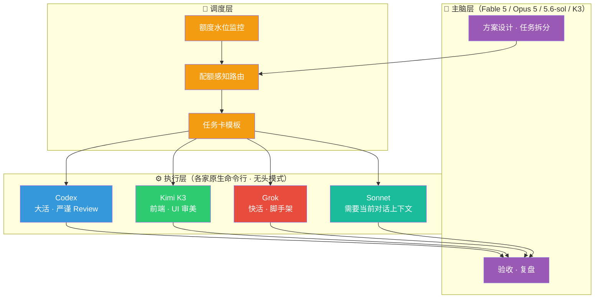
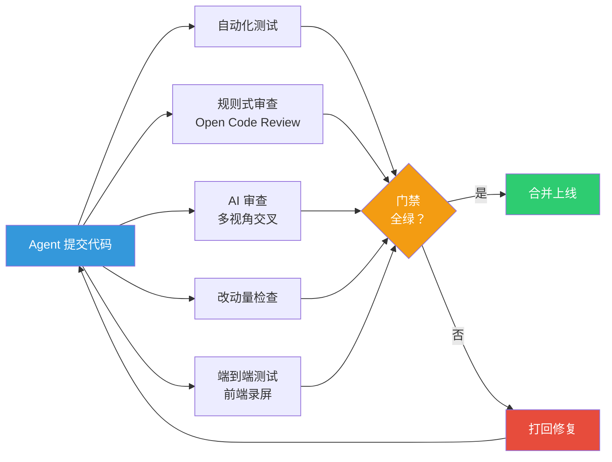

> 这篇的底稿是一段 80 分钟的语音分享。依然延续这个系列的传统——**作为人类，你只需要读懂思路和架构逻辑；所有具体的执行细节，把文章丢给你的 Claude Code 或 Codex，让它去做就行。**

## 开头：为什么要聊调度体系

在[人生的塞尔达时期](../260721-the-zelda-phase-of-life/)那篇文章里，我用了一张架构图和一段概述提过"多 Agent 调度"这个话题——主脑负责规划、执行层负责干活、门禁负责把关。但那篇的重心在 Token 经济学和模型军火库，调度体系本身只是一笔带过。

这篇就是展开讲。

先回到一句话原则：**Agent 的注意力是非常宝贵的东西，你应该把它用在解决高质量的不确定性上面，而不是琐碎的事情。**

怎么理解这句话？你可以把 Agent 的注意力想象成一个人的工作精力。如果它花一个小时去处理登录验证码，就少一个小时去干正事。我在 [Context is All You Need](../context-is-all-you-need/) 里用过一个比喻：注意力就像你的工作台面——台面就那么大，放了杂物就没地方干正事。在那篇文章里聊的是管好一个 Agent 的"工作台"；这篇是——当你同时有 Claude Code、Codex、Kimi、Grok 这一堆 Agent 的时候，怎么把每个 Agent 的工作台面都利用好。

这完全可以类比 CEO 的精力分配。CEO 的精力是有限的，应该只用来决策、高价值的方向判断、找资源——而不应该浪费在一线执行层的细节上。**将军赶路，不追小兔。**

## 一、这套体系是怎么长出来的

很多人看到"多 Agent 调度"可能觉得这是个很重的架构设计，但它最开始其实是一个非常朴素的想法。

那时候 Fable 5（Claude 家目前最顶级的模型）还是限量内测，不知道以后还有没有机会再用。所以我用得抠抠搜搜：Fable 5 只负责规划设计，所有具体的执行任务全外包给 Sonnet 5（一个便宜且能力均衡的模型）。**成本倒逼出了最初的分工逻辑。**

后来的演化路径是这样的：

1. **起点**：多个 Coding Agent 各有各的配置文件，维护起来很麻烦，单独建了个代码仓库（可以理解为一个项目所有文件集中存放的地方）来统一管理。
2. **第一步**：既然配置文件都集中了，能不能试着把其他 Coding Agent 变成执行层？
3. **第二步**：执行层能自动跑了，需要知道各家套餐还剩多少额度——于是写了个监控面板。
4. **第三步**：监控面板有数据了，能不能根据剩余额度自动选执行器？于是有了配额感知调度。

每一步都不是预先设计的，而是在使用过程中"长出来的"。你会发现建好一个组件之后，它会产生意想不到的新用途：

- **监控面板**一开始只是统计各套餐的用量，后来加了 Token 消耗统计（分模型、分项目、分设备），又加了开发机的内存和工作区清洁度监测，再加了 CI 测试机的健康状况——最终它变成了调度系统的"仪表盘"，辅助决策"这个任务该分给谁"。

- **调度系统**一开始只是一个选执行器的脚本，后来加了额度闸门、任务卡模板、代码提交追踪、复盘报告——最终变成了一套完整的多 Agent 编排基础设施。

**在 Agent 时代，要允许自己的想法浪费。你也不知道最开始一个简单的想法，最终会演化成一个多么实用的工具。** 它会在你和 Agent 的协作里一点点长出来。你的好奇心如果还在的话，你会有非常多有意思的东西可以玩。

## 二、整体架构：三层递进

这套调度体系可以分成三层。大多数人用好第一层就够了；如果你想同时管多个 Agent 但不想折腾，第二层有现成的产品可以用；只有像我这样有深度自定义需求的，才会走到第三层。


### 第一层：单 Agent 内部的"主脑 + 子代理"

这是绝大多数人的日常：你只用一个 Coding Agent（比如只用 Claude Code 或只用 Codex），在它内部做主脑和执行者的分工。

怎么做？举个例子：Claude Code 有一个叫 `CLAUDE.md` 的全局配置文件，你可以在里面写上"你是主脑，只负责方案设计和拆任务，所有具体的代码修改派子代理去做"——模型就会据此决定哪些事情自己做、哪些事情派出去。你甚至可以给子代理分角色：`implementer`（执行者，负责写代码）和 `reviewer`（审查者，只读不写，负责挑毛病）。Codex 的逻辑类似，只是用 prompt（提示词）和配置文件来约束。

这一层的核心技巧是我在 [Context is All You Need](../context-is-all-you-need/) 里讲过的：让主脑把注意力集中在规划和决策上，琐碎的执行交给子代理在独立的"工作台"上跑——别让主脑的工作台被杂物堆满。

对大多数人来说，用好这一层已经能带来很大的效率提升了。具体怎么配置，文末附录里有脱敏后的参考模板，可以直接丢给你的 Agent 让它帮你设置。

### 第二层：产品化的多 Agent 编排（推荐大多数人从这里开始）

如果你同时有多个 Coding Agent 的订阅（比如 Claude Code + Codex + Kimi），想让它们协同工作但又不想自己搭基建，可以直接用现成的产品：

- **[Orca](https://github.com/stablyai/orca)**（YC 孵化项目）：主打并行 Agent 编排。它帮你管理多个 Agent 同时在不同的代码副本上干活，有桌面端、手机端和服务器端，支持你用自己的订阅账号跑任意 Coding Agent。
- **[Paseo](https://github.com/getpaseo/paseo)**：主打轻量编排。同样支持从桌面和手机端调度多个 Agent，还有命令行和 Docker 部署模式。

这两个工具的共同点是：它们也是直接借助各家原生 Coding Agent 的能力来工作的（和我的第三层一样，都基于"模型和它的原生工具应该配套使用"这个前提），同时帮你处理了"多个 Agent 怎么不互相冲突地同时干活"这个最头疼的问题。而且都有图形界面（GUI），使用门槛低得多。如果你的需求是"我有几个套餐，想让它们同时帮我干活"，从这一层开始就好，不用往下走了。

我的编排体系实际上也从这两个开源项目学到了很多东西——比如它们是怎么监测执行层的任务状态变化、怎么分配任务的。这些都是值得研究的。

### 第三层：自定义命令行编排（我的方案）

我走到第三层，不是因为第二层的产品不好用，而是因为我有更多自定义需求。

先说一个最朴素的痛点：**在不同工具之间切换本身就很累。** 当你同时有 Claude Code、Codex、Kimi Code、Grok Build 这么多工具时，来回切换光是脑子里的"换挡"就消耗大量精力。

第二层和第三层有一个共同的前提：**模型和它的原生工具应该配套使用。** 这是我在 [Claude Code 设计哲学](../claude-code-risk-model-philosophy/) 里聊过的——想要发挥一个模型的最大能力，最好用它原生搭配的开发工具，甚至理想情况下模型在训练阶段就应该和工具的反馈数据深度耦合。Claude Code 团队最近的访谈也印证了这一点：他们删掉了 80% 的系统提示词，Agent 的能力并没有下降。

顺便说一句，其实像 [OpenCode](https://github.com/opencode-ai/opencode) 这类开放框架已经内置了多 Agent 分类调度的能力——根据任务类型自动分配不同模型，开箱即用。但问题是它会把你锁定在单一框架里，无法享受各家原生工具各自的进化红利。

在共同前提上，我有几个额外的自定义需求：

**第一，Anthropic 明确限制了 Claude Code 的订阅额度不能用在其他工具上。** 而且他们对"无头模式"（后面会解释这个概念）的态度一直比较摇摆——可能是想收集人类对 Agent 行为的纠偏数据。所以日常我不会让 Claude 走无头模式，而是选用其他家的工具来做自动化执行。

**第二，我需要基于实时额度水位做自动调度。** 我有一个自己写的监控面板，实时追踪各家套餐的剩余额度。调度系统读取这些数据，自动决定"这个任务该派给谁"——额度快用完的就暂停派发，余量充裕的就多接活。

**第三，我需要完整的任务追踪和复盘能力。** 每个任务有标准化的任务卡模板（目标、修改边界、验收条件），每次代码提交都能追溯到是哪个执行器、什么模型干的。

还有一点很重要：**整套编排体系是用"提示词 + 脚本"混合构建的，不是传统意义上的软件。** 有些规则写在提示词里让模型遵守（比如角色分工、工程规范），有些则用确定性的脚本来强制执行（比如任务分配、副本创建和清理、额度查询）。为什么要分开？因为全局提示词的空间非常宝贵——塞太多东西进去，模型在长对话里容易丢失关键指令。**能用脚本保证的事情，就不要只靠提示词。** 这个设计原则不管你用第几层，都适用。目前这套体系在 Linux 和 Mac 上都可以跑，Windows 会复杂得多。

所以第三层的设计是：



**主脑只做四件事**：方案设计、拆任务卡、验收结果、定期复盘。不写代码（除非单行小改）。

**调度层**根据任务类型和各家套餐的剩余额度，把任务卡分配给最合适的执行器：

| 任务类型 | 首选执行器 | 原因 |
|---|---|---|
| 大活：涉及多个文件的复杂任务 | Codex | 质量高，额度充裕 |
| 快活/赶时间：搭项目初始框架、批量改名 | Grok | 速度极快，成本低 |
| 前端/UI：页面、组件、视觉样式 | Kimi K3 | 审美能力国产最强 |
| 不赶时间的慢活：补测试、写文档 | Codex | 质量优先 |
| 需要调用当前对话里的专属工具 | Sonnet 子代理 | 与当前会话上下文耦合 |

**执行层**全部走"无头模式"。解释一下这个概念：我们平时用 Coding Agent，通常是打开一个对话窗口，你说一句、它做一步——这叫"对话模式"。而"无头模式"是另一种用法：你写好一段任务描述，通过命令行传给 Agent，它在后台默默干完，把结果交回来，全程不需要你盯着。就像你给员工发了一封邮件说"把这个做完"，而不是站在他旁边一步步指挥。之所以选这种模式——因为调度系统需要程序化地同时派出几十个任务、自动收结果，人坐在那里一个个对话是做不到这种自动化的。

顺带推荐一个在命令行环境下管理多个 Agent 会话的工具组合：**[herdr](https://github.com/herdrdev/herdr) + [mosh](https://mosh.org/)**。herdr 是一个专为 AI Agent 设计的终端多路复用器，可以同时管理多个 Agent 窗口；mosh 则解决了远程连接的断线续传问题。这个组合已经取代了我在 [Agent 不下班](../260628-agent-era-dev-anywhere/) 那篇文章里推荐的 tmux + SSH 方案——更稳定、更适合 Agent 场景。感兴趣的朋友也可以参考[这篇保号和交互最佳实践](https://mp.weixin.qq.com/s/U0Ha_Zia3brKntMvPPeurA)。

这一层的具体实现细节（任务卡模板、路由配置、子代理角色定义等），文末附录里有脱敏后的参考材料，感兴趣的读者可以把附录丢给自己的 Agent，让它帮你搭一套类似的体系。

### 并行开发：一个主脑，多条流水线

用一个主脑来做管理，还有一个巨大的好处：**并行开发的速度能大幅提升。**

什么叫并行开发？打个比方：假设你有一个项目要同时做三个功能——登录页面、支付接口、消息推送。如果串行做，一个完了做下一个；如果并行做，三个同时开工，速度快三倍。但并行的难点在于——三个功能改的是同一份代码，如果不隔离，改着改着就会互相冲突。

解决这个问题的方式叫 **Worktree**——你可以理解为把项目"复印"出多份副本，每个 Agent 在自己的副本上独立干活，互不干扰。干完以后，主脑负责把各自的成果合并回主线。

在我的体系里，主脑会自己管理这些副本：哪些可以同时开工，哪些必须等前一个做完，命名怎么统一，做完以后怎么清理——全部由主脑自动安排。

实际运行时，后台经常有三五十个 Agent 同时在跑，但前台我打开的主脑窗口可能只有七八个。每个主脑下面会并行管理五六个甚至七八个任务，它们各自在自己的副本上干活，做完以后主脑来处理合并冲突。

如果不靠主脑统一管理，你自己手动创建这些副本和开发分支（可以理解为代码的"平行版本"），时间一长就会越来越乱——很多东西忘了清理，到处乱窜。让主脑来做这件事，好处就是它会严格执行你定好的规则：统一的命名规范、完成后自动清理、冲突自动处理。

### 主脑模型怎么选

所有问题的难点最终都会转换到一个问题上：**拆任务卡的主脑，它自己能力到底行不行？**

这里说的"能力"不是单纯的模型智力，而是"模型 + 工具"的组合能力：能不能结合你的业务目标把事情规划到位？能不能高效利用并行来加速开发？能不能根据过程中的错误及时反馈调整？

目前做主脑断档式领先的还是 Fable 5。它最厉害的地方不是聪明，而是**分寸感**——它能在需要的时候及时反对你，提出更好的解决方案。不用你刻意引导，它自己就有"升一维想问题"的意识：不只是头痛医头地解决眼前的 Bug，而是能从更高的层面提出一个方案，让这类问题根本不会再发生。这种能力非常稀缺。

因为 Fable 5 毕竟额度有限，我也会用 Opus 5、GPT-5.6-sol xHigh 和 Kimi K3 做主脑。对于比较明确的工程任务，它们也都不错。但各有各的脾气：GPT-5.6-sol **太像工程师了**，事事都要做到极致严谨，经常过度设计，你得在指令里反复告诉它"别搞这么复杂"；K3 则是算力有限，想得很深但速度偏慢。

至于执行层——以当前模型厂的迭代速度，我觉得都问题不大。我现在的主力执行层已经切到 GPT-5.6-sol Luna xHigh 模式，在 Codex $200/月的套餐下，7 天大概有 300 亿 Token 可用，非常充裕。当前一线的模型，放到一两年前都比那个时代最好的编程助手强很多。它们只是欠缺全局视野和大局观，但如果任务卡拆得到位，执行层已经是一个基本被解决的问题。**所以问题的难点全部集中在了主脑上。**

## 三、质量保障：让 Agent 自己管住自己

所有我关注的方向——调度编排、测试评价、自主运维——本质上都是同一个逻辑：**人的精力有限，所以应该把一切能外包的东西都外包掉，不要在意 Token 消耗，只把自己的精力用在一头一尾——最开始定方向，最后做验收。**

甚至更极端一点：**做审批就行了。**

但这有个前提——你得有一套自动化的质量把关机制。不然 Agent 写出来的东西没人看，迟早出大问题。

### 先写测试，再写代码

在我的体系里，长程任务（就是那种你发起一个指令、Agent 可能自己跑好几个小时的任务）能做到比较好的效果，靠的是三条硬规矩：

1. **先写测试，再写实现**：Agent 在长时间运行的任务里最容易跑偏——做着做着偏离了最初的目标。测试就是它的锚点，锚在那里，它就偏不到哪去。
2. **小步提交**：每完成一个小功能就保存一次，而不是攒到最后一把保存。这样万一出了问题，可以精确知道是哪一步引入的。
3. **门禁持续找问题**：自动化检查一直在审视每次提交，发现问题后反馈给 Agent，它修完再提交，形成一个自我纠错的闭环。

这三条加在一起，Agent 在长程任务里的自主执行通常会有比较好的效果。

### 写代码的和挑毛病的必须分开

这一点在[人生的塞尔达时期](../260721-the-zelda-phase-of-life/)里提过：**写代码的和审查代码的不能是同一个 Agent**——就像你自己写的东西自己很难挑出错误一样，Agent 也会"自我确认"，觉得自己写得挺好的。让另一个独立的 Agent 来审查，才能真正发现问题。

在实践中，我用了两层审查：

- **AI 审查**：代码提交上来后，自动触发一个独立 Agent 做代码评审。评审者和写代码的分开，用不同的模型、不同的上下文，相当于找了一个完全不知道你怎么写的"外人"来挑毛病。多个不同视角的审查者交叉审查，能大幅提升发现问题的概率。

- **规则式审查**：这里要重点推荐阿里巴巴推出的 **[Open Code Review（OCR）](https://github.com/nicepkg/opencodereviewer)**。它不是用 AI 去"理解"代码，而是用一套固定的规则去机械式地扫描——就像工厂里的质检流水线，一项一项过。好处是成本极低：哪怕你配的模型能力很基础（比如 DeepSeek 或 MiniMax 的便宜模型），都可以以极低的消耗挖掘出大量问题。当然它也有很多误报（就是把没问题的地方也报出来），但挖出来的东西交给 Agent 去判断就行——**这是一种非常划算的生意**。我现在 OCR 每天的 Token 消耗也有一两亿的水平，非常推荐。

### 控制每次改动的大小

每次代码提交的改动量需要控制在 Agent 能舒适处理的范围内。为什么？因为 Agent 的"工作台面"（上下文窗口）是有限的——塞太多东西进去，它的"智力"会明显下降，审查质量也跟着掉。

我的经验值是：**单个 PR（一次完整的代码提交审查单元）控制在 3,500 行以内**——这是门禁系统的硬上限，留了一些余量给自动生成的文件。日常体感来说，大多数任务拆下来都在几百行的量级。这样负责审查的 Agent 能在它的"智力甜点区间"工作。

### 前端做了什么样，录个屏给我看

后端的代码跑个测试、结果对了就行。但前端不一样——你没法纯靠跑测试来判断页面好不好看、交互顺不顺手。

我的做法是要求 Agent 真实启动应用，用真实账号从头到尾完整走一遍操作流程，**把操作过程录屏附到代码提交里**。这样验收的时候直接看视频就行，不用自己再去跑一遍。

### 统一的自动门禁

上面这些检查——测试、AI 审查、规则审查、改动量控制、前端录屏——全部集成到同一套自动门禁里。**门禁不全绿，别想合并。**



这套门禁不只服务于自动修复场景——日常我主动派活产生的提交，走的也是这同一套流程。规矩是规矩，不因为是"自己人"就放水。

## 四、让 Agent 自主进入生产环境

在[人生的塞尔达时期](../260721-the-zelda-phase-of-life/)里提过的那套自修复系统（线上出问题→自动诊断→Agent 修复→提交代码→过门禁→飞书审批→部署上线），是 Agent 进入生产环境的第一种形态。这里补充几个其他场景，本质上都是同一条路：**挑出你目前在重复做的事情，逐步让 Agent 替代你，把你的精力解放出来。**

### Issue 批量定时分诊

开发 Agent 编排系统的时候，前期每天能产生五六十个 Issue（可以理解为待处理的问题工单）。后期稳定下来也有一两个/天。手动处理很费精力。

做法是：前期批量处理；后期做成定时任务——每天早上 Agent 自动把待处理的工单看一遍，给出处理建议，我在飞书上点一下审批就行。

### 定期架构扫描与安全审计

Agent 的优势在于目标感很强，但劣势也在于目标感很强——它倾向于就事论事地解决眼前的问题。如果你不刻意引导，它不会主动"升一维"去想：能不能从架构层面做一个调整，让这一类问题根本不再发生？

所以需要定期做两件事：

1. **架构审查**：跳出当前任务，让 Agent 全局扫描代码库，看有没有架构层面的优化方案。
2. **安全扫描**：比如 OpenAI 推出的 **[Codex Security](https://github.com/openai/codex-security)** 工具，虽然很耗 Token 且用时很久，不适合每次都跑，但适合每隔一段时间跑一次。**踩坑提醒**：如果你的账号没有通过 Cyber 认证，用 GPT 自带模型跑安全扫描可能会被安全护栏拦截——花了额度但出不来结论。建议优先用 DeepSeek V4 Flash 这类没有该限制的模型来替代。

### 周期性复盘

每周我都会针对过去的开发记录，调最好的模型做一次复盘。复盘的核心依据就是前面提到的那些本地保存的对话日志和轨迹数据——这也从侧面印证了"多记录"的必要性：**没有记录就没办法复盘，没有复盘就没办法提升。** 会结合 Claude Code 和 Codex 的官方最佳实践，看当前和 Agent 的协作过程中还有哪些卡点、可以提升的地方。

这种复盘给你带来的启发，远比你想象的多。

## 五、该监测什么指标

聊完"怎么建"，聊聊"怎么衡量"。

先说前提：目前没有一个完美的单一指标能直接反映人和 Agent 协作的质量。这些指标**不适合拿来和别人比拼**，更多是给自己看的诚实看板——客观地、侧面地反映你和 Agent 之间的协作是顺畅还是充满摩擦。

### 1. 每日 Token 消耗（含缓存）

最直观的指标。在不刻意浪费的前提下，能把 Token 消耗拉上去，本身就需要相当的技巧和基础设施——不然大量 Token 会浪费在 Agent 跑偏、重来、兜圈子上。

我目前单日峰值约 50 亿 Token，日均 20 到 30 亿。

### 2. 一次到位率

OpenAI 用一个叫 [Codex agent turns](https://openai.com/index/how-agents-are-transforming-work/) 的指标来衡量 Agent 的工作量——可以简单理解为：你发一个指令，Agent 后续干的所有工作加起来算一个 Turn。

基于这个可以延伸出**一次到位率**——发起一个任务后，中间完全不用你干预，Agent 直接完成所有目标。每一次你中间插手纠偏，都说明某个地方没对齐——可能是你的描述不够清楚，也可能是 Agent 自身能力不够。

### 3. 长程任务最长执行时间

Agent 能自主跑多久不出岔子？这个指标最能看人和 Agent 的能力匹配：一方面考验你能不能设好目标、拆好任务卡，另一方面考验 Agent 和工具对长时间运行任务的驾驭能力。

所有指标监测的前提都是——**得能完成目标**。单纯追求某一个数字好看没有任何意义。

### 4. 保留一切轨迹数据

你的本地其实已经有 Agent 的工作轨迹记录（每次对话和操作的日志文件），这是非常好的复盘材料。**第一件事：把它们长期保留下来。** Claude Code 默认只保存 30 天的轨迹数据，你可以设置成永久保存，再加上定时备份。

这些是你独有的 Agent 任务路径数据，价值极高。这么说吧：中转站（第三方代理平台）的很大一部分收入来源是贩卖用户的任务轨迹数据——各家模型厂商对高质量的"模型执行任务路径"数据开价非常夸张。你本地就躺着这些数据，你更应该好好保留和利用它们。

### 5. 每百万 Token 的任务执行成本

这个指标直接回答"你的 Token 花得划不划算"。我目前每百万 Token 的任务执行成本大概从最初的 0.6 美元降到了 0.4 美元左右，有望进一步优化到 0.3 美元上下。

为什么要关注这个？因为当前各家订阅套餐的价格倒挂不可能永远持续——我在[塞尔达那篇](../260721-the-zelda-phase-of-life/)里也聊过这个判断。等到补贴退坡、高智力 Token 必须按 API 价格买的那一天，你今天积累的路由经验——知道什么任务该派给什么模型、什么配置下成本最优——就是实打实的竞争力。

### 6. 缓存命中率

当 Agent 反复读取同一段代码或文档时，如果这些内容还在缓存里，就不需要重新处理，节省大量 Token。缓存命中率就是衡量"有多少内容命中了缓存"的比例。

正常情况下 95% 以上是基本水平，好的工具配置能达到 97%、98%。

但这个指标有个特点：**你能主动控制的范围比较有限。** 缓存的有效期和定价是平台决定的——不同平台有不同的缓存时间窗口（从几分钟到几小时不等），在缓存有效期内命中的话价格远低于重新处理。你能做的主要是：保持对话的连续性、避免频繁切换话题让缓存失效。所以它更像是一个**辅助监测指标**——你不需要刻意去"优化"它，但如果发现它明显低于正常值，说明你的使用方式有问题，值得去排查。

### 7. 每次提交都能追溯到"谁干的"

每一次代码提交都应该能追溯到：是**哪个工具**干的（Claude Code 还是 Codex 还是 Kimi）、用的**什么模型**、**什么配置**、**关联哪个对话会话**。

这样你就得到了一张清晰的"成绩单"：

```
时间 + 工具 + 模型 + 配置 + 对话上下文 → 任务完成情况
```

有了这个，你就能复盘不同模型配不同工具适合干哪类活、失败通常由什么引起。**实现它反而简单**——靠两层钩子（hook）就能做到：一层是 Git hook，在代码提交时自动往提交信息里写入追踪字段；另一层是 Coding Agent 自己的 hook 机制（比如 Claude Code 的 hooks），在 Agent 每次操作前后自动记录元数据。把需求告诉 Agent，它帮你配好这两层就行。全部成本不过是本地磁盘的一些占用，收益非常高。

### 8. 主脑给执行层打分

在调度系统里，主脑在验收时会顺手给执行层打个分——这个模型在这个场景下表现如何？

这是个感性指标，但随着时间积累，你会形成对不同模型能力边界的精确认知。这比花大几百甚至大几千美金跑一次正式评测要划算得多——作为个人用户，我们没有能力做那种规模的评测，但可以在日常工作中低成本地积累判断力。这些积累反过来又会帮你更好地决策 Agent 调度分配。

## 六、上下文管理：最容易被忽视的核心战场

虽然各家工具都在进步，但一个根本问题没变：**所有 Agent 的核心功力拼的都是上下文管理。**

最经典的问题叫"上下文腐烂"——随着对话越来越长、Agent 处理的信息越来越多，它会渐渐偏离最初的任务目标，丢失重要细节，你会感觉它整个智力水平在往下掉。

这和人类其实很像：你在工位上忙了一整天，桌面堆满了各种文件和便签纸，到下午你的工作效率和判断力肯定不如早上刚到的时候。怎么办？**收拾桌面，换一张干净的桌子。**

我个人的习惯是：**尽量在对话窗口的前 20%-50% 空间里完成核心工作**，这个区间里 Agent 的思维质量通常是最好的。当然，随着模型和工具都在进化，这个比例不是放之四海而皆准的定律——有时候我也会用到五六成甚至更多。关键是培养一种直觉：知道什么时候该把当前对话里的关键信息总结成一份文档，然后开一个全新的对话让 Agent "满血复活"。

还有一条原则：**所有低成本的记录方式，都应该去做。** 管它当下有没有用呢？让 Agent 结合你的业务场景，判断应该记录哪些日志、保留哪些上下文，方便它之后定位分析。数字世界里的记录成本几乎为零，但收益经常在你意想不到的时候冒出来。

## 七、行业参考：不是只有我在做这件事

### "别做 Loop，建软件工厂"

[Dexter Horthy](https://www.youtube.com/watch?v=xgkjtF89-44)（多 Agent 编排工具 Orca 的创始人，YC 孵化器背景）提出了"软件工厂"的概念——他和我有一个高度一致的观察：

传统的开发流程是一个循环：写代码→审查→合并→部署→收到反馈→再写代码。当 Agent 接管了"写代码"这一步之后，写代码的速度飞快了，但**瓶颈迅速转移到了"审查代码"上**——写得再快，审查跟不上就是白搭。

他的解法和我思路很像：引入自动化审查、多模型交叉审查、在自动流水线里加安全网。但他更进一步提出了一个**四阶段模型**：先搞清楚要做什么产品→再设计系统架构→然后规划代码结构→最后一个功能一个功能地垂直切片实现。核心思想是——**把人类的直觉和架构能力前置**，在 Agent 动手写代码之前就做出关键决策，而不是事后补救。

他特别警告了一个风险：**如果你完全不看代码、只看计划和任务列表，几周后代码库会变成"一团浆糊"。** 他的团队亲身经历过——最强的模型组合也无法修复一个他们长期没有审查的代码库。这和我的体系里坚持"门禁不全绿别想合并"是同一个逻辑：你可以不亲自写代码，但不能完全放弃对代码质量的感知。

有意思的是，多 Agent 编排已经开始走向产品化了——**[Orca](https://github.com/stablyai/orca)** 主打并行 Agent 编排，支持桌面/手机/服务器跨端操控；**[Paseo](https://github.com/getpaseo/paseo)** 主打轻量编排和移动端管理。说明这个方向已经不只是极客的个人玩法了。

### 每个 Loop 都成功，系统为什么还在变坏？

[一篇来自 Guru（AI 编程框架）团队的深度文章](https://mp.weixin.qq.com/s/CiV0mZwwB6ZT-CEHbpBq3Q)诊断了一个深层问题：

Agent 做的每一个任务都成功了，测试都通过了——但日积月累下来，整个系统反而越来越难维护了。为什么？

答案是：**测试只验证"这次做对了"，不验证"系统的整体架构还健康吗"。** 一次任务成功、十次任务成功，不等于这些成功能组合成一个长期健康的系统。规则在不同地方重复了，状态管理混乱了，文档和代码渐行渐远了——表面全绿灯，底下在溃烂。

他们提出的解法叫"架构决策基线"——用一份持续更新的架构文档来记录：当前的系统是什么样的、目标架构是什么样的、差距在哪里、为什么做了某个设计决策。每个任务开始前必须读这份文档、做完后必须更新它。

这和我体系里"定期派 Agent 扫描仓库做架构级优化"的实践指向同一个方向：**不能只让 Agent 当执行者，还要让它承担一部分架构治理的责任——但前提是你得有一套完整的治理机制。**

### Vibe Coding 做大项目一定会塌掉，除非……

[徐文浩在 AI 炼金术的分享](https://mp.weixin.qq.com/s/kpeoDfe87-PY5yXpOm00fA)和我的判断完全一致：

> 纯 vibe coding（凭感觉让 AI 写代码）做大项目一定会塌掉。不塌只有一条路——搭并持续迭代你的工具和流程体系。

他的团队在这方面走得很深：双重代码审查、几十道质量门禁、自动化测试加录屏、定期全库架构审查、自动修复线上报错。这些和我的门禁体系在思路上几乎一致，差异主要在规模（他是团队级别，我是个人）和具体工具选型上。

他有句话说得特别到位：**AI 不是把工程师拉平了，反而把好工程师和差工程师之间的差距拉得更开。** 你越懂架构、对代码库越熟、越有好想法，搭出来的这套体系就越容易维护，Agent 在里面跑得就越顺。

## 写在最后

回顾这套体系，核心其实就一句话：**省注意力，不省 Token。**

虽然客观上它确实带来了 Token 额度的大幅增长（特别是叠加模型降价的趋势），但出发点从来不是省钱。出发点是——当你管理三四十个项目的时候，如果没有一套体系帮你把执行层的负担卸掉，你会被琐碎的运维和问题修复淹没，根本没有精力去做真正有价值的事：定方向、做架构、探索新的可能。

说到这里，顺便聊聊我现在学习新东西的方式——这其实也是这套体系的一个副产品。

现在看到一篇有意思的技术文章或者分享，我的做法是：**人只看架构思路和核心思想，判断这个东西值不值得学、哪些地方值得学。** 如果觉得有价值，直接丢给 Fable 5，让它结合我现在在用的调度系统、测试体系、运维系统，看看能学习吸收复用哪些东西。具体的技术细节，我已经不会再自己去看了——除非特别感兴趣。

这个逻辑反过来也适用于这篇文章：**你作为读者，只需要理解架构和思想。所有的技术细节，丢给你的 Agent 就好。**

靠这种方式，我现在收新东西收得非常快，整个能力提升也非常快。某种程度上来说，每天都是一个更新的自己。一方面精力是最大的瓶颈，另一方面你会有源源不断的新的、有意思的东西值得去探索。

以上就是我近期的一些思考。一家之言，不一定对，也可能随着时间会有新的变化。希望对各位有所帮助。

---

## 附录：给 Agent 读的参考材料

> 以下参考材料已从正文中独立出来，放在本文同目录的 [`references/`](references/) 文件夹下。人类读者不需要细看——**把对应的文件丢给你的 Agent，告诉它"参考这个帮我搭一套类似的体系"就行了。**

| 文件 | 对应章节 | 说明 |
|------|---------|------|
| [01-claude-code-sub-agent-setup.md](references/01-claude-code-sub-agent-setup.md) | 第一层 | Claude Code 的 implementer/reviewer 子代理配置 |
| [02-codex-sub-agent-setup.md](references/02-codex-sub-agent-setup.md) | 第一层 | Codex 的 AGENTS.md 主脑编排 + implementer/reviewer/explorer 三角色 |
| [03-task-card-template.md](references/03-task-card-template.md) | 第三层 | 任务卡模板（目标/修改边界/完成条件） |
| [04-routing-profile.md](references/04-routing-profile.md) | 第三层 | 配额感知路由配置（执行器顺位/水位闸门） |
| [05-agents-template.md](references/05-agents-template.md) | 质量保障 | 仓库级 AGENTS.md 全局指南模板 |
| [06-acceptance-scorecard.md](references/06-acceptance-scorecard.md) | 指标监测 | 验收记分卡（执行器 x 任务类型 → 质量维度） |
| [07-gate-ci-overview.md](references/07-gate-ci-overview.md) | 质量保障 | 门禁系统概述（tier/chain/shadow、多 Agent review 架构） |

### 延伸阅读

- [Context is All You Need：为什么你的 AI 时灵时不灵？](../context-is-all-you-need/) — 上下文管理方法论
- [人生的塞尔达时期](../260721-the-zelda-phase-of-life/) — Token 经济学、模型分工、自修复系统
- [Claude Code 设计哲学](../claude-code-risk-model-philosophy/) — 风险模型、分层策略
- [Agent 不下班](../260628-agent-era-dev-anywhere/) — 远程开发基础设施
- [Orca](https://github.com/stablyai/orca) / [Paseo](https://github.com/getpaseo/paseo) — 产品化的多 Agent 编排工具
- [保号和交互最佳实践](https://mp.weixin.qq.com/s/U0Ha_Zia3brKntMvPPeurA) — herdr + mosh 组合推荐

---

> 本文由飞书录音豆语音转文字构思底稿，通过 Claude Code + Opus 4.6 完成文章架构设计与内容整理。
