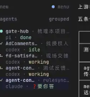
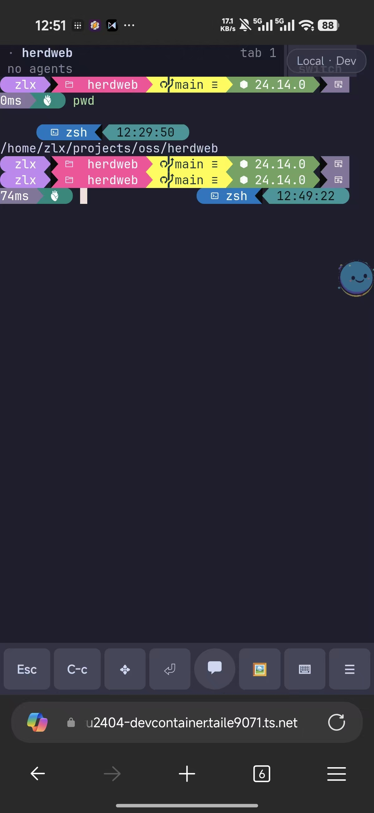

*Translated from the [Chinese original](/posts/260826-agent-era-mobile-dev-evolution/). Last synced 2026-09-26.*

> This post is the phone-upgrade installment of the "The Agent Never Clocks Out" series. For the basic architecture, see [The Agent Never Clocks Out: A Dev Setup for Anytime, Anywhere, Any Device](/en/posts/260628-agent-era-dev-anywhere/); for how multiple Agents are orchestrated, see [Marching Generals Don't Chase Rabbits](/en/posts/260809-multi-agent-scheduling-architecture/). This post is about: after switching the whole system to Herdr, how the phone-side development experience got upgraded along with it.
>
> Same rule as always — **as a human, all you need to understand is the architecture ideas and the reasoning behind each choice. For every concrete install and deployment, just hand it to your Agent.**

## The Backstory: the Emptiness after Losing Connection

Today was a genuinely miserable day. In the afternoon, Codex abruptly banned the account I'd been using for four years — for no discernible reason: no reverse engineering, no proxying, plain normal use. Having barely recovered from that, I got home in the evening and found my remote dev machine disconnected.

Normally, getting home means picking up the phone and continuing to collaborate with my Agents — reviewing the brain's plans, approving a few task cards, checking on the execution layer's progress. Cut off from them, I felt oddly empty; after my workout I had no idea what to do with myself.

So I decided to write this post instead. I'd been meaning to write it for a while but never started — the whole system recently switched from tmux to Herdr, and the phone-side setup got a major upgrade along with it. HerdWeb is actually already built and has been in daily use for some time, so this gap was the right moment to organize my thoughts.

---

## 1. Two Cracks in the 1.0 Setup

In [The Agent Never Clocks Out](/en/posts/260628-agent-era-dev-anywhere/), the phone solution I recommended was **HAPI + tmux**, with networking via Tailscale or Cloudflare Tunnel. After using it for a while, two problems grew more and more obvious.

### Crack One: tmux's Status Blind Spot

In [the multi-Agent scheduling post](/en/posts/260809-multi-agent-scheduling-architecture/) I explained my current orchestration approach: **the "brain" (the orchestrator agent, my term for the top-level agent that plans and delegates) dispatches task cards** — the brain plans and breaks work into tasks, while the execution layer works autonomously in the background.

In that mode, tmux's title mechanism just isn't enough. Two scenarios are especially painful:

- **The brain finished a while ago, but the tmux title hasn't changed.** You don't know it's waiting for you, so the task just sits there, stalled.
- **The tmux title changed, but the execution layer in the background is still running.** You click in and it turns out nothing needs your attention. Attention wasted for nothing.

With five or six brains running at once, both situations keep recurring. Your energy drains into "figuring out who needs me" — instead of the attention itself.

### Crack Two: HAPI's Two Fatal Flaws

HAPI is well made, but two problems eventually made me give it up:

**First, an extra rendering layer.** HAPI re-renders the Agent's terminal interface as a web page. In that process, some native Coding Agent commands and interactions can't be fully supported. Switching from the computer to the phone, you can always feel a distinct "translation layer" sitting in the middle.

**Second, cross-session message hijacking.** HAPI recently shipped a feature — Agent sessions can talk to each other. The feature probably has its use cases, but the problem is **it can't be turned off**. The result: while developing locally, deep in a conversation with one Agent, the conversation would suddenly get "hijacked" by a message from another Agent. A genuinely bad experience.

Add the two cracks together, and it was time to find something better.

---

## 2. The Switch: from tmux to Herdr

### What Is Herdr?

If you've read the previous post, you already know tmux is a "background virtual desktop that never goes offline" — the Agent runs inside tmux, and even if SSH drops, it keeps executing in the background.

**[Herdr](https://herdr.dev/) does the same thing, but it's tmux's next generation.** The name is Herd plus an R — as in "herding your terminal sessions." It's a recently popular open-source project designed specifically for managing multiple CLI clients.

The core differences from tmux, in plain language, are two:

**① Mouse-first.** tmux is all keyboard shortcuts, with a steep learning curve. Herdr lets you click panes directly, drag borders, split screens from a right-click menu — the way you use any normal app. In the Agent era this doesn't matter much (the Agent operates everything through commands anyway), but it's a plus when a human does occasionally drive by hand.

**② The badge API is programmable.** This is the real reason I switched. Herdr's pane badges — the small labels next to each window — **can be freely edited from scripts.**

### What Problem Do Badges Solve?

Remember tmux's status blind spot from above? After switching to Herdr, **that problem simply ceases to exist.**

I wrote a monitoring script that watches the state of every brain and background task in real time, then updates the display through Herdr's badge API. The effect: one glance at the badges tells me which brain is waiting for me, which execution layer is still running, and which task is done.

**My attention finally goes to "making decisions," not to "figuring out who needs me."**



Back in tmux, this problem had no convenient solution. The switch to Herdr is a qualitative leap in experience.

### Herdr Has One More Hidden Advantage

Herdr supports Web UI rendering natively — it doesn't care whether you're at a computer with a mouse and keyboard or accessing it through a web page. For screens of different sizes, Herdr has a matching adaptation.

That characteristic directly paved the way for the phone solution below.

---

## 3. Choosing the Phone Solution: Moshi or Web

With the underlying layer switched from tmux to Herdr, the phone-side solution naturally had to change too.

### Moshi: Beautiful, but Not for Me

The first thing I noticed was a native phone app called **[Moshi](https://getmoshi.app/)**. A friend in a group chat recommended it; I looked into it and it's genuinely polished — designed specifically for remotely driving Agents, supports both tmux and Herdr, gorgeous UI, even an Apple Watch companion and voice input.

But two problems made me pass:

**First, no built-in Tailscale support.** A phone can only run one VPN at a time. Moshi doesn't embed Tailscale, so you have to run the Tailscale VPN separately to reach your home server. The trouble: once Tailscale is on, the phone's other apps that need their own network tooling can't run simultaneously. In daily use, that conflict is a constant irritation.

**Second, the price.** Nearly 500 RMB a year (about $70) for a three-device license — and I own a lot of devices.

### A Natural Connection

Since HAPI is essentially a Web-based solution, and Herdr natively supports web rendering — why not **build the Herdr phone experience directly on the web?**

The upside of a web approach: open it in the phone's browser and you're done — no native app to install, no separate VPN needed (HTTPS through Cloudflare Tunnel is enough).

A search on GitHub turned up someone who had already built the wheel — an open-source project called [remobi](https://github.com/connorads/remobi) that exposes Herdr, tmux, and Zellij sessions through a web page.

Trying it out, I found that **Herdr had already solved the hardest part, the Web UI rendering.** remobi only needs to establish the WebSocket connection and handle front-end interaction — the rendering itself is left to Herdr.

But the original project's phone experience was rough. So I forked it and did a fairly major round of refactoring and upgrades, renaming it **[HerdWeb](https://github.com/zlxlabs/herdweb)**.

---

## 4. HerdWeb: Seven Mobile Optimizations

Every optimization revolves around one core tension: **every square inch of a phone screen is precious real estate.**

You want maximum information while reading the Agent's output, and maximum ease of use while operating. Every design decision starts from that constraint.



### 1. Keyboard Control: Appear When Needed, Vanish When Not

On a phone you're constantly scrolling up and down through the Agent's output. The problem — the Agent's terminal has input focus, so the moment you touch the screen the soft keyboard pops up and instantly covers half of it.

HerdWeb adds a global keyboard toggle. In the disabled state you can scroll and browse freely with zero risk of accidentally triggering the keyboard; when you need to type, one tap enables it.

It sounds trivial, but on a phone this is **the key to a qualitative jump in experience** — the amount of information the screen can fully display literally doubles.

### 2. Voice Input: Typing without Popping Up the Keyboard

Since the soft keyboard eats screen space, the answer is to use it less. HerdWeb has voice input built in, currently powered by Volcengine's (ByteDance's cloud platform) speech recognition service — the same technology behind the Doubao keyboard.

Plenty of people already dictate on their phones with the Doubao keyboard's voice feature, and the experience is genuinely good. The catch — you have to summon the soft keyboard first to tap its voice button. And the moment the keyboard appears, a big chunk of screen is gone again.

HerdWeb's built-in voice input skips that step: **no soft keyboard needed — tap the voice button and start talking.** Recognition accuracy may not quite match the Doubao keyboard, but being able to input text without surrendering screen space is a trade worth making on a phone.

### 3. Key Layout: What Goes in the Top-Level Menu

The action bar at the bottom of the phone has limited space, so you must decide which actions belong in the top-level menu (visible at a glance, reachable in one tap) and which get folded into a second level.

Going by my own actual usage frequency, the top-level menu has eight:

> **ESC · Ctrl+C · Enter · Delete · Keyboard toggle · Image paste · Voice input · More menu**

These cover the overwhelming majority of day-to-day interactions with a Coding Agent: ESC to cancel, Ctrl+C to interrupt, Enter to confirm, Delete to edit, plus the keyboard toggle, image paste, and voice input described above. The less frequent actions live in "More," expanded when needed.

### 4. Image Paste: Completing the Missing Leg

The original remobi project didn't support pasting images.

In the Coding Agent era, sending a screenshot to the Agent for analysis is one of the highest-frequency operations — the front-end page has a bug, one screenshot and the Agent sees exactly what you mean. Without image paste, you're basically limping on one leg. HerdWeb fills that gap.

### 5. Notifications: Never Miss the Agent's Message

HerdWeb is a **PWA** (explained in the previous post: technology that "installs" a web page onto the phone's home screen so it opens like a native app). PWAs can register for system notifications, so when the Agent has something for you, it pushes to the phone's notification shade.

It also supports external hooks — notifications can be forwarded to third-party platforms such as WeCom (the enterprise messaging sibling of WeChat, standard in Chinese workplaces). Even with the HerdWeb page closed, you won't miss an important Agent message.

### 6. Multiple Devices, Multiple Servers

If you have several dev machines running Herdr (say, my Mac Studio and Linux host at the same time), HerdWeb can manage every session on every server from the same page. Switching is as easy as switching tabs — no logging in and out of different addresses.

### 7. Weak-Network Optimization: Lessons from the Mosh Protocol

On high-speed trains, in basements, anywhere with a poor signal, the network drops and recovers constantly. An ordinary WebSocket connection, once broken, needs to reconnect — and meanwhile your input may be lost and the display may fall out of sync with the server.

HerdWeb borrows heavily from the [Mosh protocol](https://mosh.org/) (a remote-terminal protocol designed specifically for unstable networks), mainly solving two problems:

- **Data consistency**: when disconnected, the screen is marked "stale"; on reconnect the latest snapshot is fetched automatically to refresh it — so what you see is always the server's true state, and you never get "I thought the Agent was still running, but it stopped ages ago."
- **Input never lost**: keys you press during a bad-network stretch are buffered and sent automatically after reconnection — no retyping.

Both of these are dramatically noticeable on a high-speed train.

---

## 5. Authentication: What You Don't Build Also Matters

HerdWeb has no built-in authentication layer. That's not laziness — it's a **deliberate design decision**.

It's fundamentally a personally deployed tool; authentication should be left to more professional, more mature infrastructure — just like the [Tailscale](/en/posts/260628-agent-era-dev-anywhere/#tailscale-one-secure-virtual-wi-fi-for-all-your-devices) or [Cloudflare Tunnel + Access](/en/posts/260628-agent-era-dev-anywhere/#cloudflare-tunnel--access-reaching-hapi-from-your-phone) setups introduced in the previous post.

**But do remember this: never expose HerdWeb directly to the public internet.** Whoever can reach this page can drive the terminal on your server — equivalent to handing over command-line access to your dev machine. Always wrap it in a Tailscale private network or Cloudflare Access authentication.

The good news: the configuration is exactly the same as described in the 1.0 post. If your network layer is already set up per the previous post, switching to HerdWeb only means changing the port Cloudflare Tunnel points at.

---

## 6. The 2.0 Architecture at a Glance

Put the 1.0 and 2.0 changes side by side and the differences concentrate entirely in the session-management layer:

```
1.0 setup                              2.0 setup
───────────────────────────────────────
tmux (background session manager)  →   Herdr (programmable badges + web rendering)
HAPI (phone remote)                →   HerdWeb (voice input + weak-network resilience + seven mobile adaptations)
───────────────────────────────────────
Server side (Mac / Linux)              unchanged
Network layer (Tailscale / CF)         unchanged
Client devices                         unchanged
```

Server, network layer, client devices — none of it needs to change. That's the payoff of the layered architecture from the previous post: swap out one layer in the middle, and the layers above and below never feel it.

If you already built the 1.0 setup, the work to reach 2.0 is tiny: install Herdr, deploy HerdWeb, change the Tunnel port. Hand the whole migration to your Agent — roughly fifteen minutes of work.

---

## 7. The Final Result

On HerdWeb, everything described in the original "The Agent Never Clocks Out" — the anytime, anywhere, any-device experience — is fully preserved, and the phone-side experience has jumped a whole tier:

- **Android, iOS** — PWA install to the home screen, open and go
- **Desktop** — one URL in Chrome
- **Weak-network scenarios** — high-speed trains, basements: input never lost, display auto-recovers
- **Voice-driven** — lying in bed talking to your phone is enough to command the Agent

I use it daily as my phone-side remote development setup, and I'm basically satisfied. As long as the remote dev machine is online, you can reach your Agent from bed, from a high-speed train, from overseas.

The code is fully open source. If anything is unclear, pull down the [HerdWeb](https://github.com/zlxlabs/herdweb) repository and have your Agent walk you through it.

---

## Appendix: Reference Material for Agents

> The following is aimed at Coding Agents. Human readers can skip it — send your Agent the link to this post and it will come read this section on its own.

### Core Components

| Component | Docs | Notes |
|------|------|------|
| Herdr | [official docs](https://herdr.dev/docs/) | Terminal multiplexer, tmux replacement. Start with `herdr`; `herdr --session <name>` creates a named session. Supports the badge API and Web UI |
| HerdWeb | [GitHub](https://github.com/zlxlabs/herdweb) | Web remote control for Herdr, forked from [remobi](https://github.com/connorads/remobi). Requires Node.js ≥ 22 |
| Moshi | [official docs](https://getmoshi.app/docs) | Native phone terminal app (paid); supports the Mosh protocol, tmux, and Herdr. Not chosen here, but a viable alternative |

### Key Steps for Migrating from 1.0

| Step | Action | Notes |
|------|------|------|
| 1. Install Herdr | see [official docs](https://herdr.dev/docs/) | Supports both macOS and Linux; confirm version ≥ 0.8 |
| 2. Deploy HerdWeb | `git clone https://github.com/zlxlabs/herdweb && cd herdweb && pnpm install` | Requires Node.js ≥ 22; start with `pnpm exec tsx cli.ts serve`, listens on `127.0.0.1:7681` by default |
| 3. Configure networking | hand the Tailscale API key and/or Cloudflare API key to your Agent and let it configure | Choose one route or configure both; see the comparison below |

### Network Option Comparison

Voice input requires an HTTPS secure context; both network routes satisfy this:

| Option | Advantages | Caveats |
|------|------|----------|
| **Tailscale** | Cross-location mesh networking, secure by design — only your own devices can connect, nothing exposed to the public internet | Requires the Tailscale app on the phone with the VPN kept on, which may conflict with other VPNs |
| **Cloudflare Tunnel + Access** | No extra software on the phone; the browser reaches the domain directly | **You must configure an Access policy** for authentication (email verification, etc.); otherwise it's a terminal exposed to the public internet — extremely dangerous |

Hand the relevant API keys to your Agent, tell it which route you want (or both), and let it handle the whole thing end to end. When it's done, remember to revoke or rotate the API keys.

### HerdWeb Feature Configuration

| Feature | Configuration notes |
|------|----------|
| Voice input | Requires an HTTPS secure context (Cloudflare Tunnel provides it); configure the Volcengine API key |
| PWA notifications | Grant notification permission on first page open; supports Web Push |
| External hooks | Configurable webhook URL to forward notifications to WeCom and other platforms |
| Multiple servers | Add multiple Herdr server addresses in the HerdWeb settings |

### Weak-Network Optimization Mechanism (after the Mosh protocol)

- When the connection drops, the screen state is marked stale to prevent replaying outdated data
- On reconnect, the latest snapshot is fetched to refresh, guaranteeing data consistency
- Input buffering: keystrokes during a bad-network stretch are never lost and are sent automatically on reconnect

### Security Reminders

- HerdWeb has **no built-in authentication** and binds only to `127.0.0.1` by default
- It **must** be exposed through a Tailscale private network or Cloudflare Tunnel + Access
- **Never** open it directly to the public internet — anyone who can reach the page can drive your terminal
- Authentication setup is identical to the network layer in [The Agent Never Clocks Out 1.0](/en/posts/260628-agent-era-dev-anywhere/)

---

> Drafted from voice memos recorded in Feishu (Lark, ByteDance's workplace collaboration suite) and transcribed to text with Doubao; the article's structure and content were organized through conversations with Claude Code + Opus 4.6.