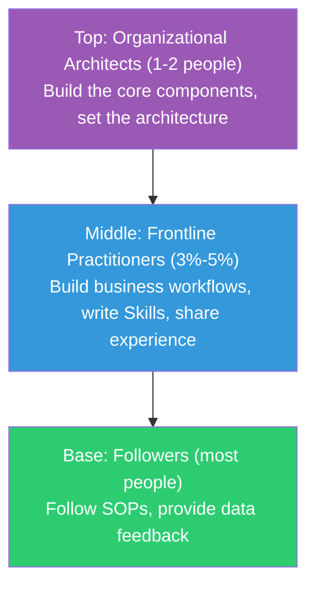
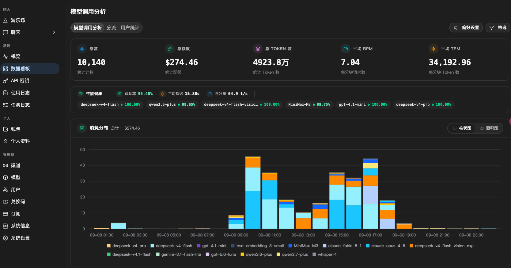
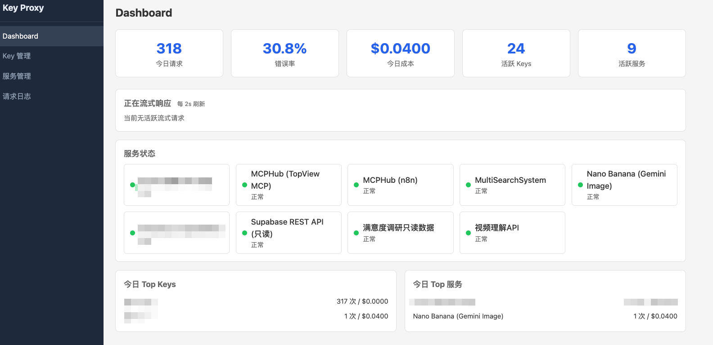
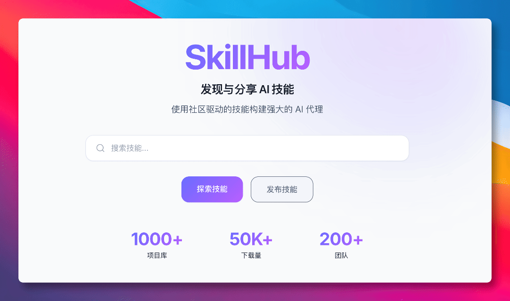
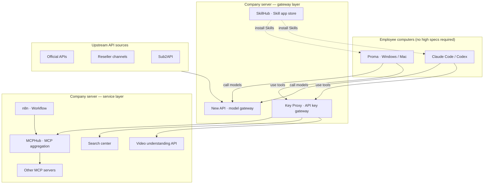
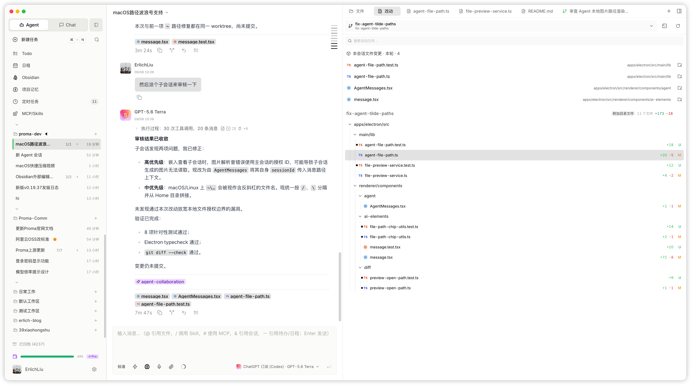

*Translated from the [Chinese original](/posts/260908-smb-agent-framework/). Last synced 2026-09-26.*

> The first draft of this post was a 45-minute voice memo. Continuing the tradition of this series — **as a human, all you need to grasp is the ideas and the framework; leave the execution details to your Agent.** The appendix at the end contains reference material written for your Agent to read.
>
> Recommended reading first: [Context is All You Need](/en/posts/context-is-all-you-need/) (the fundamentals of context engineering), [Risk Control, Design Philosophy, and Model Selection](/en/posts/claude-code-risk-model-philosophy/) (model tiering strategy), and [A General on the March Doesn't Chase Rabbits](/en/posts/260809-multi-agent-scheduling-architecture/) (the multi-agent scheduling system). This post takes a different angle — not "how I use Agents personally," but "how a traditional team can put Agents to work."

## Opening: Why This Topic

Over the past six months I've written quite a few posts about Agents, but all from a personal angle: how I set up my environment, how I schedule work, how I remote-control things from my phone. This post switches the angle — **the organizational perspective**.

I currently work in the business team of a cross-border e-commerce company (China-based sellers shipping to overseas markets), pushing the team to use AI for efficiency and scale. From traffic acquisition to supply chain, this is a very traditional industry, and the team has every role you can imagine — ad buyers, operations people, supply-chain folks, designers. This is not an AI company built from scratch, but an old organization that has been running for many years, looking for new growth in the Agent era.

What follows is basically all first-hand practice.

Why add the qualifier "small and mid-sized teams"? Because for most of them, compliance and legal requirements are relatively light, everything inside the company is efficiency-first, and a lot of what happens is actually pretty rough around the edges. That means while pushing things forward you can **accept some compliance costs in exchange for efficiency** — dealing with a problem after it shows up is an acceptable range. That's something large enterprises can't do.

Before we start, here is a judgment I'm increasingly convinced of:

**A 10x efficiency gain for an individual is easy; a 20% efficiency gain for an organization is hard.**

Why? Because organizational efficiency isn't just a context problem — it involves permission approvals, infrastructure building, and the drawing of power boundaries, and these organizational obstacles are the truly hard bones to chew. Context is actually the easiest part to start on technically, but that doesn't make it unimportant — quite the opposite: the quality of context is decisive for the quality of an Agent's output (I covered this in detail in [Context is All You Need](/en/posts/context-is-all-you-need/)). And collaboration is inherently lossy: when information passes from person to person, it always gets lost, distorted, and delayed.

So in the Agent era, **collaboration is actually a suboptimal solution**. The most efficient setup is: the complete business context lives in one person's head, and that person handles it with the help of Agents. Every time you consider adding one more participant, you should think one step further — **is this person truly indispensable, or could an Agent replace this collaboration step?**

This isn't to say teams are unnecessary; it means the direction of organizational optimization in the Agent era is not "have more people collaborate better," but "have fewer people cover a wider scope with the help of Agents."

With that premise in place, let's talk about how to land Agents in a traditional team.

---

## 1. AI Native Is a Direction, Not a Destination

Start with a definition. From my experience, an AI Native organization should meet three conditions:

1. All information inside the organization is **readable** by Agents
2. Agents **participate** in production and decision-making the same way humans do
3. The whole chain of Agent decisions, execution, and results is a **closed loop that can be verified**

(Section 4 below walks through how to achieve these conditions step by step.)

My view is that an AI Native organization can probably only be built from scratch. A brand-new organization can set up this framework relatively easily, with no legacy baggage. But for an old organization that has been running for many years, honestly, it's very hard — old processes, old systems, old people structures; every layer has its resistance.

**But AI Native is not the end goal; it is a direction.** Organizations of every type can work along this direction and share in the dividends of the Agent era.

The ideal approach is to **carve out one line of business and build it from zero** — no legacy baggage, everything designed around letting Agents enter the organization smoothly. Which line of business? The criteria: a relatively closed data pipeline, a high degree of digitalization, and ROI visible quickly. The next best option is progressive transformation inside the existing organization — hard as it is to reach the ideal AI Native state, you still get real, tangible gains.

One more point is critical: **for businesses deeply tied to the physical world, fill in the digital infrastructure first.** In a truly AI Native organization, all information about the main business is available online and the loop is closed. But on the front line of commerce, many things are tightly coupled to the physical world — inventory sits in warehouses, samples sit on shelves, and supplier quotes arrive as WeChat voice messages (WeChat being China's dominant messaging app). Until these things are digitized, no Agent, however strong, knows where to start.

---

## 2. A Top-Executive Endeavor: Grow the Pie First

When Agents land in an organization, there are two directions of effect: **cutting costs and raising efficiency**, and **growing the pie**.

Cost reduction and efficiency gains are relatively easy to quantify and reach, so that's probably the entry point for the vast majority of bosses. But entering from this point has a natural problem — **it creates a divergence of interests with the people inside the organization**. When you replace some step with an Agent, that step used to be someone's job. This kind of thing isn't well suited to being pushed by an outsider.

The other angle is **growing the pie** — use Agents to expand into new business and raise the ceiling of output, then share out the newly created gains. The resistance is much smaller this way. Of course, some industries genuinely don't have that much incremental headroom and are forced down the cost-cutting road.

Whichever road you take, one thing is certain: **landing Agents is a top-executive endeavor.**

Why? Because every step you save is, in essence, a redrawing of power's territory. Without top-level authorization, and without someone who understands both the business and Agents leading the push, it's basically impossible for the organization to truly enjoy the Agent dividend.

At the same time, **don't measure adoption success by a 100% AI usage rate**. Take cross-border e-commerce: expecting a supply-chain colleague to master both supply chain and AI — such talent is far too scarce. And honestly, this kind of person most likely won't stay in your organization anyway — unless you're willing to pay for it.

So the right way is not a company-wide rollout, but a **tiered rollout**.

---

## 3. The Three-Tier People Structure

The way I understand it, a traditional team transitioning into the Agent era should tier its people like this:

### Top: Organizational Architects (1-2 people)

Someone who understands both Agents and the business deeply builds the team's foundational components: establishing the single source of business data, designing permission governance, building a skill-sharing platform, and constructing the closed loop of feedback and iteration.

### Middle: Frontline Practitioners (3%-5%)

A small number of people in the organization who actively embrace change. They use Agents in real business processes to solve problems, improve efficiency, and produce results. These people build the business-side "branches": concrete workflows, useful Skills, and experience interacting with Agents.

With Agents assisting them, these people also tend to produce fairly good business results. And most people are essentially "believing because they've seen it" — once this small group within the organization genuinely puts Agents to good use and produces results, everyone else will naturally follow.

You need mechanisms to encourage and guide them to share.

### Base: Followers (most people)

Most people are really just following SOPs and Skills — SOPs and Skills that came out of the frontline practitioners' accumulated work. Base-level employees don't need to deeply understand Agents; they just operate according to the workflows already built and provide data feedback along the way — giving the whole Agent system more behavioral data to feed on.

As for the last small group who strongly resist AI, it's essentially an ROI calculation. Some people have genuinely deep expertise in the physical world and remain highly capable without AI; that's just how it is — everyone runs the numbers. Work with whoever comes out ahead; don't force it.

### Token Costs Follow the Tiers

This structure has one more benefit: **costs stay controllable**. Only the top architects and the middle practitioners need high-quality Tokens for thinking (using top models to design solution frameworks and write reusable automation flows); for most people, a cheap execution model is enough.

This is exactly the strategy from my post [Risk Control, Design Philosophy, and Model Selection](/en/posts/claude-code-risk-model-philosophy/): **top models set the direction; Chinese models, backed by solid engineering, bring the cost down.** It applies at the organizational level too.

> On organizational change in the AI era, I strongly recommend this talk by Mango, co-founder of XMind: [Divide the Work, Divide the Circles, Divide the Money, Do AI](https://www.xiaoyuzhoufm.com/episode/6a8c42b42e27ea5b21fabac7) ([AI summary and proofread transcript](https://sum.zlxlabs.com/view/view__jJHBegbh00Puv8ZsVDPdYOQxfxJVEk8HRIpT8eIcPc)), hosted on Xiaoyuzhou, a popular Chinese podcast platform. It's a first-hand account of XMind's move from a department structure to a "circle" structure, and the core conclusion: an AI-native organization aims to minimize person-to-person friction, and any part with friction should be automated wherever possible. How to divide circles, divide work, and divide money — this episode covers it thoroughly.

---

## 4. Context: Most Critical in Value, Easiest to Start on Technically

Everything above was about organizational-level obstacles — power, interests, people structure. Once those are cleared, the next step is getting context right on the technical side.

A judgment I'm increasingly convinced of: **a top model with garbage context underperforms an ordinary model with top-tier context.** I've expanded on this in [Context is All You Need](/en/posts/context-is-all-you-need/), so I won't repeat it here.

At the organizational level, context building has three tiers; each tier up is a step higher in the value an Agent can deliver:

| Tier | Meaning | Example |
|------|------|------|
| **Readable** | Business data in the organization is quick and easy for Agents to access | Sales data lives in a unified data source instead of being scattered across everyone's Excel files |
| **Writable** | Agents can take part in business operations, not just look | Agents can automatically update inventory status and send customer notifications |
| **Closed-loop** | Execution results flow back, forming iteration | An Agent's ad placement decisions can see the actual conversion data and self-correct |

These three tiers are stepped and progressive. Each tier up, the Agent's depth of participation in the business steps up a level, and the value gained steps up accordingly.

But the premise for all of it — **the digital infrastructure has to be in place first.**

### The Single Data Source: Feishu Base

Business data inside an organization must not be scattered across person A's Excel files, person B's WeChat chat history, and person C's head. If even this basic digitalization isn't done, don't fantasize that Agents will bring you any big improvement.

For small and mid-sized teams, my advice is: **use Feishu Base (the multidimensional-table feature of Feishu — ByteDance's workplace collaboration suite, known overseas as Lark) as the single data source for your business.**

Why Feishu Base?

- It works as a **small database** without costing much staffing effort to maintain — which is exactly the constraint for small and mid-sized teams: you're unlikely to be able to maintain a complex database yourself
- Feishu offers comprehensive APIs plus a **Feishu CLI** (essentially a toolbox for Agents to operate Feishu), making it easy for Agents to read and write Base data directly
- Combined with Feishu's built-in workflows, permission management, and multi-device sync, a common business system can be up and running
- Honestly, the table capabilities of DingTalk and WeCom (the workplace suites from Alibaba and Tencent) still lag well behind Feishu's. If your legacy burden isn't heavy, just buy Feishu Base on its own

Of course, Feishu Base has row limits; once you grow past a certain point you'll still need your own database. But in the founding stage, it is completely sufficient.

### Legacy Systems: Find a Way to Plug Them In

In reality there's always legacy-system baggage. Some systems have APIs, some only a web UI, some nothing but Excel import/export.

Either way, you have to find a way to connect them into the whole infrastructure so Agents can reach them. Many options exist — direct integration for those with APIs; for web-UI-only systems, use automation tools to simulate human clicks; for Excel-only ones, build automated data shuttling.

### A Digital Mirror of the Physical World

Cross-border e-commerce has tons of things tied to the physical world: inventory counts, physical products, supplier chat logs, meeting recordings... All of these should, as much as possible, be mapped into digital versions — unique product IDs, inventory counts, transcripts of supplier communications, and so on.

It just costs some disk space. Long term, though, this data is the organization's greatest asset. Even if you can't process it now, as AI capability advances it can all be put to good use later.

The simplest first step: run every meeting through a speech-to-text tool and store the transcript — the cost is nearly zero.

### The Core Mindset

Treat an Agent like a newly hired employee. For it to complete a task, what information is it still missing? Whatever is missing, supply it.

Self-check: in your team's core business processes, what information does the Agent want to work with but currently can't get? That's exactly what you should digitize first.

---

## 5. Don't Chase Token Usage; Chase Point Replacements

With the data source set up and context built, how do you measure adoption results? There's a common misconception here: hand everyone an Agent with a WorkBuddy account, then see who has the highest Token usage — **this metric is meaningless.**

What's actually meaningful: around business processes, have Agents do **point replacements**. A step that used to be done by a human is now done by an Agent — with better results, faster speed, lower cost. Replacing one point at a time is the most practical plan.

The model usage strategy follows the tiers too: top models design solutions, build frameworks, and write Skills; cheap models execute per the Skill, run operations, and collect feedback — so execution results feed back to optimize the next round of decisions, forming a closed loop.

In fact, in most cases what an Agent does is simply **execute a workflow**. Many things can be done with a Workflow alone, and having an Agent write that Workflow is perfectly fine too.

A few people build the business workflows; everyone else has SOPs to follow — work that used to be manual becomes clicking a few buttons, submitting one approval. From the organization's point of view, this is relatively easy to push forward.

---

## 6. MCP: The Standard Protocol for Agents to Call Tools

Before infrastructure, one concept needs explaining: **MCP (Model Context Protocol)**.

You can think of MCP as the "USB standard" of the Agent world. An Agent that wants to query a database, send a message, search the web, or call some internal company service — none of that is innate; it needs MCP to "connect" to those tools.

Each MCP service requires a running Server process, which takes memory and compute. MCP services fall roughly into two categories:

- **External services**: e.g. the official MCP interfaces provided by GitHub, Google Search, and various SaaS platforms
- **Internal services**: deployed on company servers. Two subtypes here — purely self-built systems (e.g. an in-house inventory management interface), and tools deployed on top of open-source projects (e.g. n8n provides an MCP service, through which Agents can trigger and manage workflows)

If every employee's computer runs its own pile of MCP Servers, it not only wastes resources, it's also a management nightmare. Which brings us to the infrastructure design below.

---

## 7. Infrastructure: One Server Carries the Whole Team

What's the biggest difference between team and individual Agent use? **Things inside a team can be reused.** What you've searched, I don't need to search again; the MCP service you got working, I don't need to configure again. So at the infrastructure level, on one hand put **caching and sharing** at the core; on the other, consider **permission separation and log auditing** — who used what, spent how much, and whether anything exceeded its permissions must be traceable in a team setting.

A key architectural idea here: **server-client separation**.

All the heavy work runs on one company server; employees' computers are just lightweight entry points. That way:

- No need to equip everyone with high-spec computers
- No need for everyone to run a pile of local MCP Servers
- All services are managed and updated centrally

The tools recommended below are all **open-source projects** unless noted otherwise; they can all run on a single ordinary server, and the deployment cost is very low.

### ① AI Relay Gateway: New API

> Scenario: the company bought Claude and GPT API access and wants all 10 employees to be able to use it — without handing the raw keys to everyone.

[New API](https://github.com/QuantumNous/new-api) does exactly this. It's a unified relay gateway for AI models. Upstream it can connect to all kinds of official API channels, to reseller channels you've procured, even to Tokens obtained through technical means from other sources — all completely invisible to downstream. Downstream you can control which models each person can use and how much they can spend; it serves both humans and internal software systems. Accounting is easy, and permissions are easy to control. It has a large user base and keeps shipping features.

**Open source, free.**

### ② API Key Gateway: Key Proxy

> Scenario: ops needs GPT for image generation, design needs a third-party watermark-removal API, product sourcing needs some data platform's interface. Each service has its own key — you can't exactly hand raw keys to everyone. But having everyone register their own accounts turns reimbursement and management into a mess.

New API covers the big chunk of model Token relaying, but it can't manage these long-tail API services. And most Skills are designed for a single person, a single Agent, never considering multi-person, multi-Agent usage patterns. What you need is a **universal API key gateway** — taking the company's single purchased key for each service and distributing it into multiple internal keys for the team. Each employee needs just one key to open all the doors.

This needs audit logs, permission control, and spend control. I wrote a set for this myself called Key Proxy — not open source, but the idea is universal.

### ③ Skill Version Management: SkillHub

> Scenario: a colleague writes a particularly handy Skill, say "one-click competitor analysis report," and wants to share it with the whole team. Today's approach is dropping a zip file into the group chat — two days later someone posts a modified version, a week later nobody knows which one is current.

[SkillHub](https://github.com/iflytek/skillhub) is an open-source Agent skill registry from iFlytek (a major Chinese AI company). It solves exactly the versioned management of Skills within a team — upload, review, tiered permissions, one-click install. Think of it as **an internal Skill app store for your team**.

**Open source, free.**

### ④ MCP Service Aggregation: MCPHub

> Scenario: Agents need to call all kinds of MCP services — GitHub connectors, competitor-data searchers, company inventory lookups. If every employee's computer runs its own copy of these Servers, 10 people means 10 copies of memory overhead, and configuration is a nightmare.

[MCPHub](https://github.com/samanhappy/mcphub) is a self-hosted MCP gateway. Deploy all MCP services centrally on the server and aggregate them through MCPHub, which provides a single unified access point downstream. An employee's Agent client only needs to connect to the one MCPHub address to use all the MCP tools.

Add a Key Proxy layer on top and you also get permission control — who can use which MCP services, clear at a glance.

**Open source, free.**

### ⑤ Search and Crawling Center

> Scenario: three ops people simultaneously have their Agents search the same competitor's TikTok data. Without caching, that's 3x the API call cost — and the shared egress IP hammering the platform may trip its risk control.

Search capability varies wildly across Agents, and search itself is a major component of building context. An organization should have a unified search and crawling center:

- **Caching**: cache searched content to avoid the wasted cost of duplicate calls
- **Aggregation**: external search (TikTok, Instagram, e-commerce platforms) and internal search (the company knowledge base) behind one unified interface
- **Async and concurrency**: the system must withstand multiple Agents firing search requests at the same time
- **Risk control**: handle crawl rate limiting and IP management centrally, instead of everyone's Agent running naked on its own

Mine here is also self-built and not open source, but any team with search needs should consider building this.

### The Full Picture: An All-in-One Suite on a Single Server

The key point: **all the heavy lifting happens server-side; clients are just entry points.** Employees don't need high-spec computers and don't need to configure anything server-side themselves. That's very friendly to small and mid-sized teams — the cost of one server gets the whole team's Agent infrastructure running. With one technical person driving it full-time, deploying and getting all the open-source tools above working takes roughly one to two weeks.

A side note: all the self-built systems mentioned above (Key Proxy, the search center), plus the deployment and ops of these open-source services, are handled by me alone. In the Agent era these things really aren't hard — which itself corroborates the earlier point that "the top architect layer only needs 1-2 people."

### One Addition: Network Security

Agents are extremely capable now, but great capability also means great security risk. If conditions allow, isolate the server-side network to some degree — to keep malicious attacks from entering the organization directly through Agents. This topic is too complex to cover in a few sentences, but at minimum, have the awareness.

---

## 8. Clients: Configure as Needed

From actual observation, only about 3%-5% of people in an organization are really heavy Agent users — basically the middle-tier practitioners described earlier — everyone else uses them sparingly. So there's no need to buy the priciest accounts for everyone.

For **non-technical people**, my top recommendation is [Proma](https://github.com/proma-ai/Proma) — the **best free, open-source general-purpose Agent client** I've been able to find:

- **Not locked to one big vendor's ecosystem**: connects to any OpenAI-compatible API; pair it with New API to use your own keys, keeping costs very controllable
- **Updated very frequently**: active community, fast feature iteration
- **Friendly to non-technical people**: clear, intuitive UI, simple to operate, with clients for both Windows and Mac

Connected directly to the New API set up earlier, it's an excellent general-purpose Agent entry point for office scenarios.

**Technical people** use Claude Code or Codex — no explanation needed.

If you'd rather not self-host a backend at all, Tencent's [WorkBuddy](https://workbuddy.cn/) is a similarly positioned product — top up and use, no need to build your own New API. But Proma's advantage is that it can connect to your self-hosted New API backend, keeping cost and permissions under your own control. With even a little technical capability, I'd still recommend building the infrastructure described earlier — the long-term cost advantage and management convenience are on a completely different scale.

---

## 9. From Workflow to Managed Agents: Three Steps Up

Using an Agent client as an individual is easy; getting Agents **running 24 hours a day at the enterprise level** is another matter. There's a clear progression path:

| Level | Form | Characteristics | Representative tools |
|------|------|------|----------|
| Level 1 | Personal Agent clients | Human in the loop, on-demand use | Claude Code, Proma |
| Level 2 | Workflow + LLM automation | Deterministic flows + LLM nodes, running 24h on the company server | n8n |
| Level 3 | Managed Agent runtimes | Autonomous Agents: long-running, scheduled, full permission governance | Claude Managed Agents, TrueForge |

Level 1 is the day-to-day state described earlier. Let's focus on Levels 2 and 3.

### Workflow + LLM: The Main Battleground for Most Enterprises

**The vast majority of in-house enterprise scenarios can be solved with Workflow + LLM calls.** This may currently be the most underrated path.

The recommended tool is **[n8n](https://github.com/n8n-io/n8n)** — an open-source workflow automation engine. Just deploy it on that company server mentioned earlier, sharing the machine with the other services, no extra cost.

Using n8n in the Agent era requires a shift: instead of humans manually dragging and dropping workflows in the UI, **have Agents create and maintain Workflows through MCP and Skills**. At the same time, abstract the team's shared logic nodes into n8n Nodes and iterate on them long-term, making it easy to freely compose and recombine workflows.

Automation with LLMs participating and Agents stepping in — that alone is already an enormous step forward.

### Managed Agent Runtimes: An Advanced Topic

One level up are truly autonomous Agents — long-running (minutes to hours), scheduled (cron), calling all kinds of tools. Anthropic offers [Claude Managed Agents](https://platform.claude.com/docs/en/managed-agents/overview) as a hosted platform for this, and the open-source community has projects with a similar concept, such as [TrueForge](https://github.com/truefoundry/trueforge).

Honestly, though, this level already demands a great deal from an enterprise — mature permission policies, an MCP service system, secure credential management; none of them trivial. Our own experience here is still shallow too. **That's another topic for another day.**

For most small and mid-sized teams: get the n8n layer solid first.

---

## Closing Thoughts

Back to the opening judgment: a 10x gain for an individual is easy; 20% for an organization is hard.

But hard doesn't mean impossible. This post laid out a road a traditional team can walk:

- **No need to chase AI Native** — progress gradually along that direction
- **Fill in the digital infrastructure first** — Feishu Base solves most of the problems
- **Roll out in tiers** — don't chase company-wide usage rates; let results drive "believing because they've seen it"
- **Build infrastructure with open-source tools** — a single server gets it running, at extremely low cost
- **Workflows are the main battleground** — 90% of enterprise scenarios can be solved with Workflow + LLM

The core is two things: **at the organizational level, clear the obstacles around permissions, infrastructure, and incentive distribution; at the technical level, give Agents sufficient context and build the closed loop.**

Only with the loop closed can Agents backtest and analyze against historical data inside the enterprise and keep improving. Only then does your organization see long-term incremental gains from Agents. Otherwise, if any single point in that chain is broken, the Agent stays a one-shot tool — use it once and there is no next time.

No closed loop, no incremental gains; no incremental gains, no reason to keep investing. This idea, I think, matters more than any specific tool choice.

---

## Appendix: Reference Material for Agents

> What follows is aimed at Coding Agents (Claude Code / Codex etc.). If you're a human reader, feel free to skip it — send your Agent the link to this post and it will come read this section by itself.

### Open-Source Tool List

| Tool | Purpose | Link |
|------|------|------|
| New API | Unified relay gateway for AI models | https://github.com/QuantumNous/new-api |
| SkillHub | Agent skill registry: version management + permission control | https://github.com/iflytek/skillhub |
| MCPHub | MCP gateway that centrally manages and exposes MCP services | https://github.com/samanhappy/mcphub |
| Proma | General-purpose Agent client, built on the PI Agent SDK | https://github.com/proma-ai/Proma |
| n8n | Workflow automation engine | https://github.com/n8n-io/n8n |
| TrueForge | Open-source cloud managed Agents platform | https://github.com/truefoundry/trueforge |

All of the tools above support Docker deployment on the same Linux server; Docker Compose is recommended for unified orchestration.

### Related Posts

- [Context is All You Need](/en/posts/context-is-all-you-need/): the fundamentals of context engineering
- [Risk Control, Design Philosophy, and Model Selection](/en/posts/claude-code-risk-model-philosophy/): model tiering strategy
- [A General on the March Doesn't Chase Rabbits](/en/posts/260809-multi-agent-scheduling-architecture/): the multi-agent scheduling system
- [Agents Don't Clock Out](/en/posts/260628-agent-era-dev-anywhere/): setting up a remote development environment
- [Claude Managed Agents](https://platform.claude.com/docs/en/managed-agents/overview): Anthropic's official hosted Agent platform

### Recommended Podcast

- [XMind's Mango: Divide the Work, Divide the Circles, Divide the Money, Do AI](https://www.xiaoyuzhoufm.com/episode/6a8c42b42e27ea5b21fabac7): first-hand experience of organizational change at a veteran software company moving from departments to "circles" ([AI summary and proofread transcript](https://sum.zlxlabs.com/view/view__jJHBegbh00Puv8ZsVDPdYOQxfxJVEk8HRIpT8eIcPc))

---

> This post was drafted from a Feishu voice memo transcribed to text, with its structure and content organized through conversations with Claude Code + Opus 4.6.
