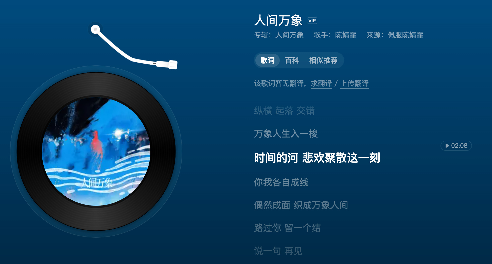
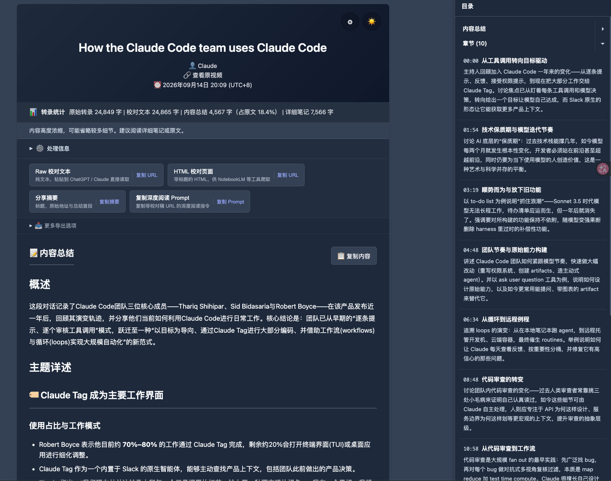
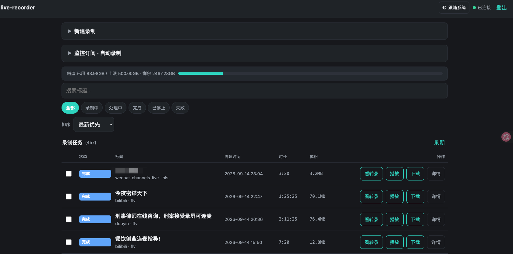

*Translated from the [Chinese original](/posts/260914-observing-the-world/). Last synced 2026-09-26.*

Chen Jingfei released a new song called "The Myriad Faces of the World."

> The world is a net — who is weaving its directions?
> Some have fallen into the night; some wait for the spring wind.

I'm very fond of her. After listening, it struck me that this song title works perfectly as a doorway into something I've wanted to write about for a long time but never found the occasion for — **I have a standing habit of observing the world.**

## Curiosity and That Window

Put grandly, it's "seeing heaven and earth, seeing all beings, seeing yourself." Put modestly, it's just a fairly pure form of curiosity.

My follow list doesn't only hold things I agree with; it also holds things I don't quite endorse but consider samples. Once you've seen enough samples, you truly understand why arguing online is mostly pointless — you have no idea what whole-life background and way of thinking sit behind the screen.

The world has an interesting divide: one group of people uses ASR (speech-to-text) to turn all kinds of content into text and speed up comprehension; another group uses TTS (text-to-speech) to turn text into audio and listen anywhere, anytime. I belong to the former — I watch everyday video at three times speed, and more often than not I simply convert audio and video into text and read it.

**But the barrier to expression in text is, in the end, far higher than for audio and video.**

A person with a demanding job may only have time to record a podcast or film a talking-head video; a frontline worker's daily habit is to shoot a clip and vent a few lines — writing an article feels too formal to them. When you want to see different people's real experiences from a broader set of vantage points, audio and video are far richer than text.

There's another layer: text faces a higher bar of content moderation — that's one side of it. On the other, as connectivity got faster and cheaper and the online population expanded, the space for public expression has been narrowing — when the water is too clear there are no fish, as the saying goes; you can only find topics within the greatest common denominator and discuss very "correct" things. The two combined, the world of text grows ever cleaner, and ever safer. By comparison, audio and video still have a chance of carrying something truer, something less "correct."

For our generation at least, this isn't yet such a big problem — after all, we lived through the frontier era and touched both what floats above the surface and what lies beneath. But for younger generations, if their main source of information is the internet itself, it may take remarkable discernment to read any underwater information out of all that self-censorship. Otherwise, it can only be patched in through family upbringing and the like.

In short, for a broader perception of the whole world, audio and video are a very high-value consumption channel. So I built myself a set of audio-and-video transcription tools that automatically process content from various platforms. The system handles somewhere over a dozen hours of transcription every day.

## Ten Thousand Lives

So in those dozen-plus hours, what am I watching?

My standing subscriptions cover law, relationships, and restaurant entrepreneurship, plus plenty of AI- and agent-related experience sharing, interviews and miscellany, and the occasional entertainment gossip. But more interesting than the category labels is which cross-sections of the world you happen to see through them. A few examples.

**A girl born in 2007 [livestreamed late into the night, the very evening her gaokao — China's national college entrance exam — ended](https://sum.zlxlabs.com/view/view_hHSrkogB3GBL8TJ2yu9Urewrz-P0BMtzSjqIGMGQkMY).**

She studies pure humanities, is a Beijinger, from an "ordinary family" — she repeated those three words over and over. Her state on the stream was classic post-exam mania: extremely fast speech, topics leaping everywhere, real anxiety peeking through the self-deprecation. She yearned for an A-levels-and-Berlin education, but her family's finances meant the domestic state-school track was her only path — "I'll go abroad to look around for grad school."

A member of Gen Z, baring her confusion, her grievances with the education system, her bewilderment about the future to a few hundred strangers in a livestream. The gap between "a heart aimed higher than the sky" and real-world constraints presents itself in her with total directness. You would be hard-pressed to see reality at this intensity in any text medium.

**A doctor, running the numbers with probability theory.**

Dr. Han was criminally sentenced over a missed diagnosis, and the case set the medical circle ablaze. Meanwhile another doctor, already out of clinical practice, used a mathematical concept — the birthday paradox — to explain why he left the clinic early: once the sample size is large enough, any small-probability event becomes a certainty. The number of patients a practicing doctor sees over a career far exceeds that threshold. Disputes over missed diagnoses and accidents used to have an exit — "pay compensation and it's over" — but the trend toward criminal liability has pulled the risk up to an unbearable level.

Once he had run those numbers clearly, he made an irreversible career choice. In his own words: run early, so the falling wall doesn't land on me. This is not an emotional complaint; it is a rational decision derived from probability theory.

**A professional with over a decade in the chengtou (local-government urban-investment financing) world, talking nearly 30,000 characters to the camera.**

"Urban investment companies across the country live on borrowed money; not one of them survives on its own cash flow" — that's his exact phrasing. He describes a way of operating you won't see in books or news: chengtou companies are, in essence, local governments' financing platforms — much of the urban infrastructure you see was funded into existence through platforms of this kind, and the money chains behind them are far more complex and delicate than outsiders imagine. A young colleague wrote him a letter, its lines full of idealistic questioning. His reply, condensed to eight characters: blend into the dust, but stay awake.

**A Bilibili (China's YouTube-like video site) creator doing relationship consulting [took apart the term "emotional value"](https://sum.zlxlabs.com/view/view_Jf164S3xHG2sa6eeoVkRtItjB9J5QnA0PL6EuUdPJYc).**

She ran a simple gender-reversal experiment, and with it exposed how this fashionable concept moved, step by step, from "beautiful emotional interaction" to "a tool for one-sided extraction." You see the same phenomenon again and again across marriage-market samples — a perfectly good word, distorted layer by layer, becomes a weapon for people to hurt each other with.

**Singapore's Prime Minister [interviewed by the Financial Times on the "post-America" order](https://sum.zlxlabs.com/view/view_sC_OgJPPzg58S0Arteejrl9oYOWa1wEPURqhxq1FgWU).**

A small country's leader, describing in remarkably level language a shift that is underway: the world is moving from unipolar to multipolar, the process will be long and messy, and small countries cannot sit waiting for things to become clear. That altitude and candor of perspective — you would struggle to find its equivalent anywhere on the Chinese-language internet.

**And more everyday fragments.**

Frontline delivery riders complaining about the dispatch system. Ride-hailing drivers recording monologues inside their cars. A teacher sighing over how her circumstances have changed. An undergraduate just beginning to study mathematics, lost about where mathematics is headed in the AI era.

Beyond these fragments surfaced by idle scrolling, I also dig for long-form content on purpose — interviews with people from every walk of life, conversations, dialogue-style documentaries; each is itself a cross-section of the whole world. Many amateur podcasts on Xiaoyuzhou (China's main podcast app) may have very low subscriber counts, but sometimes I'll feed them through the system anyway to see what interesting information turns up.

Not one of these pieces constitutes a complete "news story" or "opinion" — but in legal disputes you see the sordidness threaded through business, marriage, and friendship, and many of the dimmer corners of human nature. In relationship counseling you see different people's demands, collisions, and mismatches in the marriage market. Yong Ge Shuo Can Yin ("Brother Yong on Restaurants"), meanwhile, is a field guide to the world's every creative way of losing money — you genuinely start to feel that fools have become so plentiful the scammers might be running short.

**Observing the diversity of the human species and how the world is put together — this is my long-term project. The myriad faces of the world: there is always a little more to see.**

## The Tools: How I See Any of This

Last April, to consume audio and video more efficiently, I started building [VideoTranscriptAPI](https://github.com/zlxlabs/VideoTranscriptAPI). It was extremely crude at first — it could only download and transcribe from Bilibili and a few other platforms; no proofreading, no speaker separation, no push notifications, no web reading. Objectively speaking, this project has also been a complete witness to how my engineering ability grew through the whole agent era.

Beyond observing the world, it also carries a good deal of my **learning-from-content** needs — much of the experience sharing on YouTube and the high-quality conversations on Xiaoyuzhou, I read as text through this system.

A year-plus on, the missing pieces have gradually been filled in. It now supports YouTube, Bilibili, Xiaoyuzhou, Douyin, Xiaohongshu, WeChat Channels, Twitter, and other mainstream platforms; there's a WebUI to operate it, plus a Skill interface for agents. Core capabilities:

- **Local transcription**: dual engines, CapsWriter and FunASR, running entirely locally
- **LLM proofreading and summarization**: works with any OpenAI-compatible API, e.g. DeepSeek
- **Multi-channel push**: automatic notifications via WeCom and Feishu (Chinese workplace IMs)
- **Web reading interface**: a web version for reading the proofread text and summaries, plus detailed notes matched to timestamps. The proofread text's URL can be copied straight into ChatGPT, Claude, and other web chat UIs for follow-up questions

The sources come in two layers. One is **standing subscriptions**: when particular YouTube or Bilibili channels publish a new video, transcription is submitted automatically. The other is **casual submits**: something interesting scrolls by, one click and it goes into the system.

On top of that I built a live-recorder — an automatic recording-and-archiving service for livestreams; finished recordings are handed to VideoTranscriptAPI for transcription automatically.

Livestreams come unedited, and sometimes you can see rawer things — of course there's plenty of rambling and muddled logic too, but anyway, it's AI doing the reading now; none of that is a problem.

The two combined are where the dozen-plus hours of daily transcription come from.

I previously built a project that [turns listened-to podcasts into a recommendation map](/en/posts/260617-podcast-insights/), itself a derivative combination of this toolchain — a concrete case of snapping modular tools together in the agent era.

The transcription runs entirely locally; you need one device that's online 24 hours a day. Proofreading costs very little — a transcript runs a few cents. The system has simple multi-user handling, so sharing it with a few friends is no problem. The only constraint is the platforms' risk control — too much volume can get your IP banned; my YouTube downloads got banned once.

## After Observing

Having watched all this, what does it do to you?

The most direct effect is probably a **gradual shift in overall temperament**.

Because I've seen so much sharing from frontline service workers — delivery riders, ride-hailing drivers, small restaurant owners — I know how the felt temperature of the economy transmits down, layer by layer, onto particular people. So I'm now unfailingly courteous to these service workers, sometimes yielding even when it's my own interest at stake. **I don't want to become the fuse of some incident.**

Legal content has me consciously steering clear of risky partnerships in advance. Relationship content has taught me that different people's needs and positioning around marriage can be far apart — you can't fit other people's lives to your own standards.

Objectively, though, sustained observation requires that you have fairly stable values. **Diversity is the source of happiness** — you need a tolerant frame of mind to take it in, or it can deliver a considerable psychological shock. Because it's hard to imagine why anyone would live that kind of life, or reason from that kind of starting point.

Romain Rolland said there is only one heroism in the world: to see life as it truly is, and to love it still.

Frankly, seeing a bit more of the world doesn't let you truly grasp the truth of it — many things you still have to live through yourself. It's just that knowing a bit more amounts to getting a vaccination in advance; it gives you some psychological preparation.

Of course, the half of that line left unsaid: it's also possible that, in the process of seeing life's truth clearly, a person refuses to admit it and simply flees. If you can go a whole lifetime without having to face certain truths, that is a kind of luck. Only, if you do have to face them, later isn't better than sooner.

---

Let me close with the same Chen Jingfei song, "The Myriad Faces of the World."

> Ten thousand lives, ten thousand swayings, all sharing one lamp of moonlight.
> Crossings and falls interwoven — a world of lives threaded through a single shuttle.

<!-- TODO: 嵌入音乐播放器 -->

That's all.

> This post was drafted from Feishu voice recordings transcribed to text with Doubao; the article's structure and content were organized through conversations with Claude Code + Opus 4.6.
