> 这篇的底稿是两段加起来 80 多分钟的语音分享。依然延续这个系列的传统——**作为人类，你只需要读懂思路和逻辑；具体的执行细节，把文章丢给你的 Agent 就行。**

## 引子：两个关键词

今天聊一个稍微有点抽象的命题：如果 Agent 时代只能记住两个词，应该是哪两个？

第一个毫无疑问是 **Context**，上下文。

从模型训练用的数据，到模型应用时你给它的代码仓库、企业知识、个人习惯，本质上都是上下文。按我自己的经验，输出好不好，大半在开口之前就定了：你给了它什么材料，留了什么规矩。这也是我之前那篇 [Context is All You Need](../context-is-all-you-need/) 想表达的逻辑。

第二个词，我认为是 **Loop**，循环，或者说闭环。

一件事只有迭代成闭环——有日志、有记录可以复盘，改完之后又能验证结果——Agent 才能不断提升自己的决策质量。这其实已经有点模型训练的雏形了，更进一步就是大家常说的自我进化。听上去有点高大上，但它完全可以落到我们自己的工作流里：**有意识地去构造 Context，有意识地去构造 Loop。**

这两个词之间的关系，就是这篇文章的主线：

- **静态的 Context**：预先写好的东西。规则文件、技能包、记忆、工具配置。
- **动态的 Context**：只能从 Loop 里长出来。你做了验证、拿到了结果、复盘了错误，这些新信息再回流成下一次的上下文。

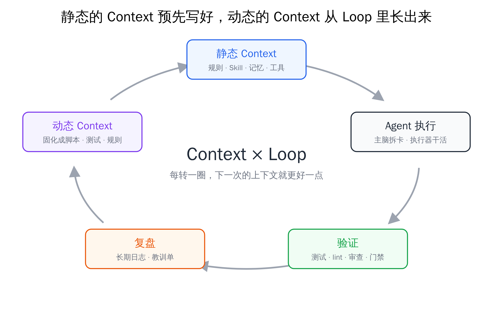
*全文主线：静态的 Context 预先写好，动态的 Context 从 Loop 里长出来。*

先拿个具体的数字感受一下。我有个仓库叫 agent-config，专门放我所有 AI 工具的规则和调度脚本，7 月 23 日建的。两个月过去，它累积了大约 1.6 万次提交（每一次修改记录）、1800 多个 issue（待办和问题单）、将近 2000 个合并的 PR（改动提案）。这些全部是 AI 提交的，这个仓库我自己没有写过一行代码。

我现在每天大概消耗 20 到 30 亿 Token（含缓存读取）。几个月前，我得一直高频盯着、基本人在环内（people in the loop），才能维持每天 40 亿左右的消耗；现在消耗还是这个量级，我每天只花一小部分时间在 Agent 上，不影响干别的事。凭体感说，**投入的精力下降了一个数量级，单个项目明显省心得多。**

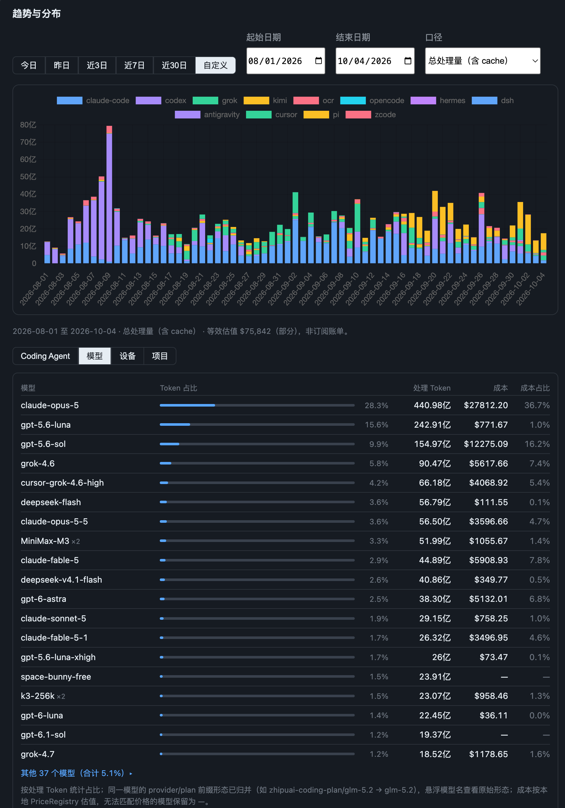
*8 月 1 日至 10 月 4 日每天的 Token 处理量（含缓存），按 Coding Agent 堆叠。8 月初几乎全是 Claude Code 和 Codex，9 月下旬以后 Pi（黄色）明显变多。下半部分是同期按模型的分布：表里列出的 19 个之外还有 37 个，Claude、GPT、Grok、DeepSeek、MiniMax、Kimi 混着用，没有哪一家独占。*

这背后的功臣，就是 Context 和 Loop。

> 后文会反复出现三个角色：**主脑**是负责拆任务、做判断、验收的那个 AI，相当于项目经理；**执行器**是拿着任务卡去改代码的 AI，相当于干活的人；**门禁**是合并前必须全部变绿的自动检查。这套架构我在 [将军赶路不追小兔](../260809-multi-agent-scheduling-architecture/) 里详细讲过，这篇不再重复。

## 一、为什么偏偏是这两个词

还是从 Coding 这个场景说起。为什么 Coding 是 Agent 最早能大规模落地的场景？本质上是三点：

1. **高价值**：写代码贵，省下来的都是钱。
2. **数据高质量且充分**：开源代码、文档、问答，训练数据管够。
3. **验证可闭环**：代码能跑、测试能过、编译器会报错。

第二点对应 Context，第三点对应 Loop。Coding 恰好两个条件都满足，所以跑得最快。

更重要的是，**这两件事和你具体用什么模型没有关系**。这两个东西搭好了，不论你用顶级模型还是便宜模型，都能帮你提高决策质量、减少 Token 浪费。模型变强是供应商的进度，你这边能动手的，是上下文和闭环。

Cloudflare 有篇文章开头说得很直白：

> *"AI has made the step that was previously the slowest and most expensive — implementation — the fastest and cheapest."*（AI 把过去最慢、最贵的那一步——实现——变成了最快、最便宜的。）
> —— [The Agent Development Lifecycle has arrived on Cloudflare, Cloudflare](https://blog.cloudflare.com/agent-development-lifecycle/)

写代码不再是瓶颈了。瓶颈移到了两头：前面是"你给了它什么上下文"，后面是"你怎么验证它做对了"。这正好就是 Context 和 Loop。

## 二、静态 Context：每样东西都要回答"它凭什么在这里"

先聊静态的部分，也就是我们自己能控制的那部分。

### 地基：先把行为轨迹留下来

在聊具体怎么治理之前，有一个低成本、但价值极高的决策，我在 [将军赶路不追小兔](../260809-multi-agent-scheduling-architecture/) 里也提过，这里再强调一次：**把所有 Agent 的行为数据都长期保存下来。**

Claude Code 默认会在 30 天后自动删除你本地的会话记录。而这些行为轨迹，本质上是你所有复盘材料的来源，也是之后验证和回测的背景信息。后面讲的每一次删减、每一次回测、每一次复盘，都建立在"记录还在"这个前提上。改一个配置项就能留住，没有理由不做。

### 上下文由哪几层组成

一个 Coding Agent 的上下文，不论开源闭源，大致是这么几层：

| 层次 | 例子 | 能不能改 |
|---|---|---|
| 预置 prompt | Claude Code、Codex 内置的系统提示 | 闭源基本不能；开源的可以自己组装 |
| 全局规则 | `~/.claude/CLAUDE.md`、`~/.codex/AGENTS.md` | 能 |
| 项目规则 | 仓库根目录的 `CLAUDE.md` / `AGENTS.md` | 能 |
| MCP | 各类外接工具服务 | 能 |
| Skill | 全局和项目的技能包 | 能 |
| Memory | 跨会话的记忆 | 能 |

用大白话说：**规则文件**是每次开场都会塞进对话的规矩；**Skill** 是一份可以按需调用的操作手册，平时只有一段简介占着位置；**MCP** 是让 AI 连接外部服务的插头，每个插头都带着一份不短的说明书。

过去一个月，我对这几层做了非常多的审查和测试，删减增改，目标就两个：提高任务完成质量，降低 Token 消耗。

贯穿始终的原则是：**像珍惜你自己的注意力一样，珍惜 Agent 的上下文窗口。** 所有出现在上下文里的东西，原则上都需要被治理，都需要问一句：它真的有必要在这里吗？没必要，就剔除。

再补一个概念：**Git 这种保存每一次修改差异、随时能回到旧版本的工具，我认为是 Agent 时代最好的软件，也是基石。** 它用很低的成本存下了每个版本的差异。你所有的行为轨迹，都可以追溯到当时用的是哪个版本的 prompt、什么样的上下文、哪个 harness、什么样的代码逻辑。（harness 指 Claude Code、Codex 这类包在模型外面的那层软件，它决定了 AI 能调用哪些工具、开场先读哪些东西。）所以下面说的每一层，都应该进 Git 仓库，甚至同步到 GitHub，长期迭代。

### 预置 prompt：基本不用管

各家 Agent 自带的系统提示，闭源的你改不了，开源的你可以自己组装。但大部分情况下，用默认调好的就行。这一层到执行器那一节还会再提。

### 全局规则：不是一次性的，而且要分层拼接

很多人把全局的 `CLAUDE.md` 或 `AGENTS.md` 当成一次性的行为，写完就不管了。我觉得这不太好。它应该进仓库、长期迭代，**有加法，也要有减法**。

说到减法，最近有个很有代表性的事情。Claude Code 团队的 Thariq 发了一篇文章，讲新一代模型的上下文工程：

> *"We removed over 80% of Claude Code's system prompt for models like Claude Opus 5 and Claude Fable 5 with no measurable loss on our coding evaluations."*（针对 Opus 5 和 Fable 5 这类模型，我们删掉了 Claude Code 八成以上的系统提示，编码评测没有可测量的损失。）
> —— [The new rules of context engineering for Claude 5 generation models, Claude](https://claude.dev/blog/the-new-rules-of-context-engineering-for-claude-5-generation-models/)

各家在新模型发布时都会有类似的建议：针对顶级模型，删掉历史 prompt 里那些补丁，别再反复强调"多想一点、再深一点"。

他们说得对不对？肯定是对的。毕竟是他们自己训练的模型，他们有最多的使用经验。

**但我的建议是：方向照着走，节奏晚半年。**

因为他们现在的最佳实践，建立在一个我们没有的前提上——几乎无限量的高质量 Token。这一点三家都亲口承认过：

- Pragmatic Engineer 写 OpenAI 内部软件工厂的文章，开篇第一句：*"It's rare to work with an unlimited token budget, but at OpenAI, that's what all engineers… do."*（无上限的 Token 预算很少见，但 OpenAI 的工程师们都是这样工作的。）
- Thariq 在 [Latent Space 的访谈](https://www.latent.space/p/thariq) 里也随口说了一句 *"we have lots of tokens"*。
- [Orca 创始人的访谈](https://www.superlinear.academy/c/recording/orca) 里也提到，模型公司内部的人处在 Token 充足的环境里，很少碰到外部用户天天遇到的额度用完、要换供应商接力的摩擦。

我们这些圈外人很难这么奢侈。很容易出现的情况是：你这边按顶级模型把 prompt 删干净了，过两天额度用完，被迫换成一个普通模型——之前针对普通模型打的补丁没了，质量可想而知。

我们只能寄希望于大约六个月之后，高智力 Token 的成本降到一个可以接受的范围，到那时再真正照做。**在那之前，我们就得保留一些比较"古老"的配置**——那些给普通模型打的补丁，暂时还不能删。

那怎么办？Thariq 在那期访谈里聊到一个很有意思的点。他说失败模式是随模型变化的，连 Fable 5 和 Fable 5.1 都不一样；主持人顺口接了一句"那你得有 Fable.md、Opus.md"。Thariq 的回应是：确实，但维护好几份非常痛苦，而且一直累积失败模式的记录，大概率会把模型约束过度。

我的情况更尴尬。我用的东西特别杂：Claude、Codex、Cursor、Kimi、Grok、GLM、MiniMax、Gemini、DeepSeek，还有各种免费模型。不可能每个模型维护一份规则文件。但这个需求又客观存在。

我目前的工程实践是**分层拼接**。把规则文件拆开：

1. **不随模型变的**：你的工程习惯。比如必须先写测试再写代码、你独有的验证手段。这部分长期存在。
2. **随模型能力变的补丁**：给普通模型的"多想一想"之类的强调。顶级模型（GPT-6、Fable 5.1 这一档）基本不需要，拼接时就不带。
3. **随模型个性变的反约束**：比如 GPT 系模型通常极度严谨、容易过度设计，那就给它加一条反过度设计的约束。

三块按"哪个工具、哪个模型、什么角色"动态拼起来，生成它的规则文件。效果上近似"每个模型一份"，但你只维护一套源文件。同时它进版本管理，随着数据回流做回测，做加法的同时做减法。

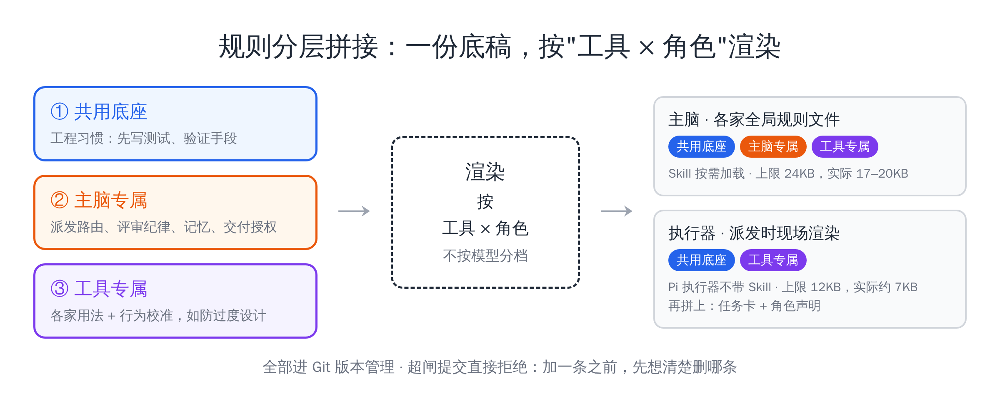
*三块规则按工具、模型、角色动态拼接，只维护一套源文件。*

在这个基础上，我还给注入量上了一道硬闸：主脑这一侧注入的规则，不能超过 24KB（大约一万二千个汉字，这些字每次开会话都会先占掉模型的注意力），超了提交时就直接拒绝。有段时间规则源涨到了 24.5KB，几乎贴线；后来把只有主脑才需要的流程内容迁到按需加载的技能包里，压回到 19.8KB 左右。**有了这道闸，加一条规则之前，就必须先想清楚要删哪条。**

顺带一提，Claude Code 和 `AGENTS.md` 的关系也在变。以前只能在 `CLAUDE.md` 里用一行 `@AGENTS.md` 引用它，变相兼容；最近的做法是，如果仓库目录里没有 `CLAUDE.md`，它会直接读取 `AGENTS.md`。多工具并用的话，维护一份 `AGENTS.md` 就够了。

### 项目规则、Memory 与教训：各有各的去处

项目级的规则文件已经天然在项目的版本管理里，这点还好。要想清楚的是**边界**：什么进 `AGENTS.md`，什么进 Memory，什么都不进。

我现在的划分是三条路：

- **长期不变的约束**，进项目的 `AGENTS.md`。
- **事实和偏好**，比如某台服务器怎么部署、我习惯用什么工具，进 Memory。
- **踩过的坑**，不直接写进规则或记忆，而是先开一张教训单（issue），之后想办法固化成脚本、测试或闸门。这条路后面 Loop 部分会详细讲。

三条路都要有入口，也要有出口——会增加，也要会删除。

这里要单独说一下 Memory。

我现在会用非常多的客户端：Claude Code、Codex、Grok、Cursor、Kimi、OpenCode、Pi。这种情况下，**你就不能依赖某一家自带的记忆系统了**。很可能 Claude 这边改完了，交给其他 Agent 去实现，那边接手之后不会更新到 Claude 的记忆里。Claude 的记忆反倒成了整个系统里和现实最不符的地方。

所以我在开发机上把 Claude Code 自带的记忆关了，自己维护了一套。说起来也没什么难的，本质上和 Claude Code 的记忆逻辑一样：一个索引目录加一组 Markdown 文档，有增加、有更新、有删除。在全局规则里约束一下，所有 Agent 都会一起维护它，记忆就能在不同主脑之间顺畅流转。

我也没有上专门的语义搜索库。我的判断是，问题通常不是"没搜到"，而是"把过期的笔记又塞回了对话"。与其让它找得更准，不如保证它存的都是对的。

反过来说，如果项目比较小，**干脆就不要 Memory**，一切以代码库为准。通过优化代码结构、建立代码图谱、优化命名、限制文件行数这些工程手段，降低 Agent 理解仓库的成本。只有项目确实上了规模，Memory 才是必须的。

### MCP：能用 CLI 就用 CLI

如果我是做 SaaS 平台的，我会非常喜欢 MCP，它比较完美地解决了鉴权这类麻烦事。但站在 Agent 使用者的角度，我挺反感 MCP 的——它对上下文空间的占用还是太大了。

所以我的习惯是：**有 CLI（在命令行里敲的现成工具），就优先给 Agent 用 CLI**。MCP 放到项目级别控制，非必要不开。

### Skill：优先吸收；要装就装到项目里

我在之前的文章里也说过，除了 gstack 这类少数几个，我很少直接安装第三方 Skill。大部分都是尝试着把它**吸收到自己的工程体系里**；就算安装，也是装到项目级别，尽量不全局安装。

原因还是上下文。Skill 的简介虽然占的空间小，但它毕竟占在那里，就有可能对结果产生影响。和这个项目无关的 Skill，原则上就不应该出现在这个项目里。

举个例子，飞书的 CLI 带了很多 Skill。有些项目根本用不到飞书，有些项目只用到零星几个，比如多维表格、妙记，其他的全是噪音。我的做法是：全局只装每天高频用的东西，其他的通过项目级开关单独打开。

这件事上踩过一个挺典型的坑。Coding Agent 的大头是 Claude Code 和 Codex，其他家大多会主动兼容，直接去读它们的规则文件和 Skill。其中最离谱的是 Grok：它会同时读 Claude 的 `CLAUDE.md`、自己的 `AGENTS.md`，再把 `~/.claude/skills` 整个吃进去，很多东西没有去重。有一阵子我的 Grok 主脑常驻了 197 个 Skill。它的上下文窗口是 50 万 Token，相当于整场对话的总容量——还没开始干活，就被这些重复、而且大多和当前项目无关的东西占掉了一块。单独治理之后，Skill 降到了 41 个。

所以排查启动时的上下文，不能只数 Skill，规则文件的重复注入也要一起查。

那多个 Agent 之间怎么实现项目级的 Skill 开关？在这件事上，Claude Code 做得最完善，可以在项目里直接开关某个 Skill；但不是所有 Agent 都有这个能力。我的办法很朴素：**全局只装各个 Agent 都通用、每天高频用的 Skill；某个项目特定需要的 Skill，就装到这个项目自己的目录里。** 这样不管用哪家 Agent 打开这个项目，看到的都是"通用的 + 这个项目需要的"，变相实现了跨平台、多 Agent 通用的项目级开关。如果你只用 Claude Code 一家，直接用它自带的开关就行。

不管怎样，**网上看到别人分享的 Skill，最优解是吸收内化到自己的工作流里，其次是装到具体仓库，最后才是全局。** 而且所有 Skill 都要进版本管理，随着模型能力增长，该删就删，该修就修。

> 这一节只要记住一句：每一样开场就进入上下文的东西，都要能回答"它凭什么在这里"，并且能被删掉。

## 三、执行层：Flash 模型已经够用，外壳比模型更重要

上面聊的是主脑那一层。这一节往下走一层，聊执行器——也就是第二段录音里补充的内容。

### Flash 级模型已经跨过了 Coding 的基准线

先交代背景。我现在每天消耗的 Token 很杂，市面上常见的套餐基本都买了：Claude、Codex、Grok、Kimi、MiniMax、GLM。

整个 Token 的使用呈一个**先分后合**的趋势。最早只有 Claude Code 和 Codex；后来为了节省高智力 Token 的额度，又买了一堆第三方套餐，用的客户端和模型都变杂了。

但最近这一个月，几千张执行器任务卡对比下来，我发现：**至少在"主脑调度、执行器执行"这个场景下，各家执行器完成任务的成功率和质量其实差不太多**。近 90 天的验收记录里，几家主流执行器的通过率都落在 88% 到 93% 之间。当然，每家接到的任务不一样，这个数字只能说明"实际跑下来都能用"，不能严格证明质量相同；明显不行的也会被淘汰——有一家只有 50%，已经下线了。

这呼应了我之前的一个判断：**各家 Flash 级别的模型（各家主打便宜、快速的那一档），已经让 Coding 这件事跨过了那道基准线。** 跨过之后，在执行层拆好子任务的前提下，选模型要考虑的成本、速度、质量三个维度里，质量大家都差不多了，**你只需要考虑成本和速度**。

我觉得模型的"强"有两种：

- **全方位的强**：审美、思考、执行都很强。典型的是 Anthropic 的 Fable 5 和 Opus 5.5。
- **定向的强**：通过后训练让它在 Coding 或普通办公任务上性价比特别高。典型的是 DeepSeek v4.1 Flash，还有各家的 Flash 模型。

如果你不是家里有矿，完全可以通过**分层的任务调度**来省钱：全方位强的模型做高价值的判断，具体执行交给定向强的"牛马模型"。DeepSeek v4.1 Flash 这类模型输出速度很快，体感上每秒能有一两百 Token，并发很容易拉上去，某种程度上能让你体会一下"500 刀会员"的感觉。

### 把 Pi 当成所有主脑的子代理

接下来是我最近的一个调整，可能有点反直觉。

先介绍一下 **Pi**：它不是一个模型，而是一个开源的 Coding Agent 外壳，和 Claude Code、Codex 是同一类东西。区别在于，它的系统提示非常精简，塞进对话的说明书、工具和规矩几乎都可以由你自己决定；模型则可以接任意一家。

我之前一直强调一个观点：**好的模型一定要和它自家的 harness 强耦合**。因为顶级模型训练的时候，就考虑了 harness 里有哪些工具可以调用。这个观点我现在依然不变。

但我现在把 Codex、Grok、Kimi、MiniMax、GLM 这些额度对应的执行任务，**优先统一交给 Pi 来跑**。

原因是我给"强耦合"加了一个限制条件：**它适用于高难度、开放式的任务**。而在主脑已经把子任务拆好、安排好的执行场景下，我做了对比，同一个模型、同样的上下文，用 Pi 和用它原生的客户端，难分伯仲。

今天刚做完一轮对比。同一天、同一批任务卡，同一家模型分别跑在 Pi 和原生客户端上，人工对照一共 12 对：

| 模型 | Pi 胜 | 原生胜 | 结论 |
|---|---|---|---|
| gpt-6-luna（原生：Codex） | 3（其中 1 场暂计） | 1 | Pi 不比原生差 |
| k3-256k（原生：Kimi Code） | 2 | 2 | 打平 |
| grok4.6（原生：Grok CLI） | 1 | 3 | Pi 稍弱 |

合计 6 比 6。输赢主要看执行器有没有守住任务卡的要求，和用 Pi 还是原生关系不大。这不是公开榜单，样本也小，能带走的结论只有一条：**外壳不是决定胜负的那个变量。**

更早一轮是同一个 DeepSeek 模型，跑在 Claude Code 和 Pi 上做对比。一开始 Pi 落后一截；后来发现 Pi 这边的上下文有三类问题——任务提示首轮没注入、整池 83 个 Skill 全塞了进来、规则重复注入。修掉之后，**Pi 的系统提示从 3.87 万字符降到 1.67 万，首轮输入从 1.75 万 Token 降到 8500**，第三批 8 个例子里 Pi 赢了 5 个，质量持平略优，每份成本还低了约 40%。

结论很清楚：**差距主要来自 harness 给模型的上下文，而不是模型本身。**

而 Pi 的好处就在这里：**它可以完全由你自己组织上下文**。其他官方原生的 harness 当执行器时，上下文你没法定制，它可能带着一些不需要的 Skill，带着主脑那边才会用到的规则文件。用 Pi，我可以单独针对执行器这一层迭代它的上下文。既能保质保量完成任务，又能省 Token，执行器的维护成本也很低。

两轮对比放在一起看，我想强调的是：**在充分做好上下文约束的前提下，跨过基准线的各家 Flash 级模型，完成任务的质量其实都差不太多。** 真正拉开差距的，是你给它的上下文；而 Pi 恰好是最方便你掌控上下文的那个外壳。

简而言之：**把 Pi 当成 Claude Code 和 Codex 的子代理。** 在 Claude Code 和 Codex 里，我本质上只用最好的模型，用它们的思考智力；那些杂活，全部交给 Pi 配任意第三方模型来实现。

## 四、Advisor：更强的判断，加一份干净的上下文

说好听点，所有这些上下文优化措施，本质上是为了提升任务执行质量、降低我的精力占用。但客观地说，它们确实也是为了省 Token，特别是省 Opus 5.5 的额度。省到最后，已经开始搞出一些"奇技淫巧"了。

其中我现在最高频使用的一个，是 **Advisor 模式**：请教顾问。

### 牛马模型的局部不自知

牛马模型执行任务还行，但让它做决策，大概率不太行。我观察到，不少模型在上下文窗口用到四五成的时候，就已经开始陷入局部而不自知了——不是等到窗口快满才出问题。

我最初的想法很朴素：**用全方位能力强的模型来做高价值的判断。** 这时候自动去请教 GPT-6、Opus、Fable、Kimi 这些顶尖模型，每个模型每次大概消耗十几万 Token，但得到的建议决策质量非常高，**经常直接推翻底层模型的判断**。

这个思想是从 Claude Code 学来的。它有一个实验性的原生 Advisor 工具，由主模型在关键节点去咨询另一个更强的模型。但它只能在 Claude Code 里用，所以我把它写成了一个独立工具，以类似 Skill 的形式，让所有 Agent 都能用。

### 后来发现：干净的上下文同样关键

做这个工具的过程中，我注意到 Claude Code 原生的 Advisor 有个细节：**它会把整段对话都转给顾问。** 我当时就在想，顾问看了那么多前文，会不会也被带偏？

为了验证，我做了一个回溯盲测。找了两个已知结局的 PR——都是改了好几轮之后最终撤回的。把材料截断在第三轮修复之后、主脑准备收尾之前，不给任何能暗示结局的信息，请顾问判断"接下来怎么办"。一共问了 9 次，**9 次全部否掉了主脑当时的收尾计划**，方向和后来的实际撤回一致。

然后我逐个排除变量：

- 去掉选项菜单，改成开放提问——顾问照样提出停手。
- 把顾问的身份换成"你就是那个已经修了三轮的主脑"——它照样跳出来。
- 换一个弱一点的模型——它能说出"该停手"，但说不出"为什么这个方案本身就不该做"。

最后一条说明，模型的判断力确实重要，这是我最初的直觉；但排除到最后，还剩一个变量同样关键：**顾问没有背着那段会话历史**。主脑修了三轮，有沉没成本，有被前文带偏的惯性；顾问没有。

所以 Advisor 起作用，**靠的是两样东西：更强的判断力，加一份干净的独立上下文。**

### 你自己就能用的最简单版本：回退

干净上下文这件事，其实每个人在日常对话里就能用上。我非常喜欢用的一个功能是**回退**：Claude Code 里的 `/rewind`，Pi 里的 `/tree`。

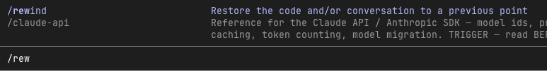
*Claude Code 里的 `/rewind`：把代码和对话恢复到之前的某个节点。*

大语言模型是基于前文推断后文的，**前文的所有信息都会影响后文的输出质量**。如果你判断它已经走错了方向，最好的做法不是在当前对话里让它纠正，而是**回到它还没犯错的那个节点，重新出发**。这样它的"脑海里"根本就没有那些错误的方向。

你还可以在回退点顺手告诉它："XX 方向我们已经验证过了，不用再探索。"它就会直接走另一条路。如果你用的工具没有回退功能，就新开一段对话，只贴已经验证过的事实，不要把走错的那几轮复制过去。

### 我的 Advisor 工具长什么样

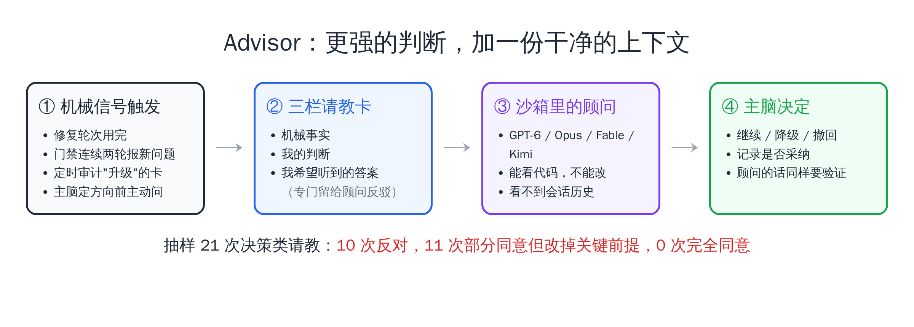
*Advisor 请教流程：机械信号触发，三栏请教卡，沙箱里的顾问看不到会话历史。*

基于上面的结论，我的 Advisor 工具有三个设计：

- 顾问跑在**只读沙箱**里：它能看代码，但不能改任何文件，也看不到主脑和执行器之前聊过的话。
- 主脑请教时要写一张三栏的请教卡：机械事实、我的判断、**我希望听到的答案**。第三栏是专门留给顾问去反驳的。
- 什么时候请教，不靠模型自己判断（模型对自己有几分把握，基本估不准），而是靠机械信号：同一张卡修复轮次用完、门禁连续两轮报出新问题、定时审计里被标为"升级"的任务卡，还有主脑在定方向前的主动请教。

用下来的体感非常好。我抽样看了 21 次决策类的请教：**10 次直接反对，11 次部分同意但改掉了关键前提，完全同意的一次都没有。** 需要说明的是，这些大多是主脑已经觉得不对劲、或者卡住了才送去问的，反对多不代表顾问就该永远唱反调。

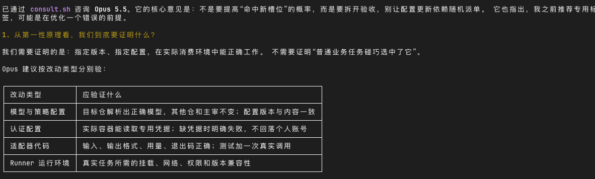
*一次真实的请教：Opus 5.5 指出主脑之前的推荐，可能是在优化一个错误的前提。*

讲三个具体的故事。

**故事一：顾问建议放弃，因为这张卡守的根本不是那条底线。** 一个合并门禁的判定逻辑，执行器已经修了三轮还不收敛，主脑正在两个降级方案之间挑一个，准备进第四轮。顾问的回答是：这张卡守的本来就不是红线，越补只会让红线越弱，两个降级方案都不要，这一版直接放弃。它还指出，三轮的问题都落在同一块，原因是这张卡选了唯一一条必须靠猜的路。最后这个 PR 关了，没合并。

**故事二：安全上拿不准的例外，最后证明一条都不能留。** 一个拦截危险命令的安全钩子，里面有一组"先切换目录再删除"的豁免规则，已经补了好几轮，主脑还想继续收紧。顾问先做了个只读实验，证明"切换目录"这个命令本身就可以被偷偷改写成别的行为，然后给出结论：只看命令文本，不存在能证明安全的豁免规则，唯一安全的做法是一条都不留。主脑采纳，把这组豁免全删了。

**故事三：排在最后的，其实应该排第一。** 给一套付费服务排接下来几个小时的待办清单，主脑把一个"尚未定性"的告警问题排在了最后。顾问说：你的排序有两处错，这个问题应该排第一——它是唯一一类已经实际伤害过真实付费客户的缺陷：用户付了款，卡在某个状态 62 天，没人知道。当晚这个问题就修掉了。

当然，顾问也会错。有一次它关于"原有路径已经会报错"的推断，就被真实的复现推翻了。所以顾问的意见同样要验证——这正是下一部分要讲的。

**全方位能力强的模型，用来做高价值的判断；具体的底层执行，交给牛马模型；判断的时候，给它一份干净的上下文。**

## 五、Loop 的标本：一个跑了两个月的配置仓库

静态的 Context 基本说完了。接下来聊动态的 Context，也就是第二个关键词：Loop。

### 它是怎么长成这样的

agent-config 这个仓库，最初只是为了管理上面说的那些上下文——同步规则文件、管理 Skill。后来慢慢加入了主脑调度执行器的体系，加入了终端角标的状态监测，再后来，它演变成了我所有 AI 学习的基础仓库。

回头看，它的演化可以归成三步：

1. **先把规矩放进版本库**：一份公共规则，各工具一层薄薄的专属段。
2. **再让所有坑汇报回同一个地方**：调度、派卡、验收、记分，问题统一回流。
3. **最后用脚本和闸门阻止旧坑复发**：注入预算、自建记忆、请教顾问，都是这一步长出来的。

每一步都不是预先设计的，而是在使用中长出来的。

它最重要的一点是：**它已经有了一个 Loop 的雏形**。这个仓库相当于我整个 Agent 调度体系的根。我要求所有在用这套体系开发其他仓库的会话，遇到调度层面、脚本层面的问题，都在收工的时候统一汇报到 agent-config 的 issue 里。然后我每天再专门派 Agent 去处理这些 issue。

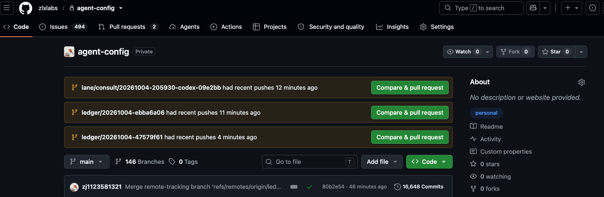
*agent-config 仓库首页：16,648 次提交，494 个待处理 issue，没有一行代码是我手写的。*

开头那组数字里，1800 多个 issue 中有 1100 多张是专门记录教训的单子。而这个仓库本身，也是我过去两个月 Token 消耗最多的仓库——**搭一套省精力的体系，本身就需要大量投入**；第二多的，是后面会讲到的门禁系统。

### 飞机引擎边飞边换

说实话，这个过程非常辛苦。

这个仓库既是整架飞机的引擎，又是我要修理、要更换的东西。前期就是一团乱麻，冲突特别多。经过一段时间之后，它才慢慢收敛、平稳下来。很多问题在过程中得到了解决；新增的问题，要么能和之前的问题关联上，要么新增的频率降下来了。

从数据上看，每周新开的 issue 在 8 月底到 9 月初那一周达到峰值 305 张，到 9 月最后一周回落到 159 张。

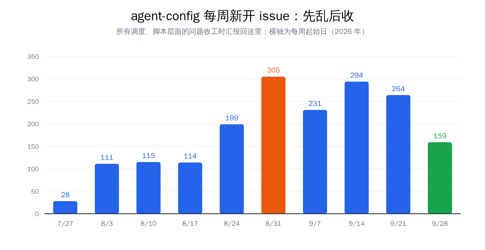
*agent-config 每周新开 issue 数：8 月底到 9 月初达峰，之后逐步回落。*

关一张教训单的标准，我只问一句：**这个坑，现在还踩得到吗？** 踩不到了，才能关。不是"修了"就关，而是"机制上不可能再发生"才关。

### 同一个错，不犯第二次

讲几个具体的坑，感受一下"吃一堑长一智"在工程上是什么样子：

- **测试打到了生产。** 执行器新建一个隔离的工作目录时，只拷了最外面一层的配置文件，深层目录的配置缺失，程序就悄悄用了默认值——连上了真实的生产环境，而且不报任何错。后来，建工作目录这件事被做成了一个脚本，自动把每一层配置都接上，人和 Agent 都不再手工建。
- **推送成功了，又被推了两次。** 为了少看几行输出，Agent 习惯把命令结果裁短。结果裁短的过程把"失败"这个信号弄丢了；另一次反过来，一次成功的推送被显示成了失败，又被重推了两轮。后来定下规则：要确认代码传上去没有，一律去问远端服务器，不看本地的显示。
- **执行器把活又派给了自己。** 一张任务卡上忘了写"你是干活的人，不要再派给别人"，执行器读到了只该给主脑看的派发手册，把任务又派了出去，空转了 90 分钟，零产出。后来任务卡模板强制带上角色声明，执行器拿到的规则里也直接剥掉了主脑那一段。
- **查一个开关，花了几万 Token。** 主脑只是想确认一个服务在不在运行，用了一条会把整张任务卡内容打印出来的命令，几万 Token 就这么灌进了上下文。这是 Context 和 Loop 交汇的例子：上下文的浪费，也要靠复盘才能发现。

所以要非常珍惜开发过程中犯的那些错误。派另一个 Agent 去读工作日志，判断它当时为什么犯这个错；该积累的积累下来，日后统一做第一性原理的处理。客观上，这也是一种闻过则喜。

### 写进提示，不如写进代码

教训沉淀到哪里，也有讲究。Anthropic 的 [AI-native SDLC playbook](https://claude.com/blog/the-ai-native-sdlc-playbook) 里有一条很实用的规则：

> *"When Claude makes a mistake twice, the correction goes into CLAUDE.md."*（Claude 同一个错犯两次，就把纠正写进 CLAUDE.md。）

但同一篇文章紧接着也说了，Skill 只能让违规变少，Hook 才能让违规几乎不可能。（Hook 是每次提交或执行时必定运行的小脚本，违反了就直接失败；写在说明文字里的规矩，AI 状态不好时会当没看见。）

xAI 的 Lauren 在一个分享里把这件事讲得更彻底。她把约束分成几层，从强到弱：**代码结构和架构**（让错误在结构上不可能发生）> 静态分析和 lint（提交时自动跑的错误扫描）> 规则和 Skill > 只能靠人审的风格指南。每纠正 Agent 一次，就按这个强弱顺序，找到最有效的那一层沉淀下来。

上面那几个坑，最后能真正根治的，都是变成了脚本、闸门和测试的那些；只写进规则文件的，过一阵子还会以别的形式冒出来。

### 引入新工具，也要用自己的日志回测

Loop 不只用来对付错误，也用来对付"看起来很美"的新工具。

各种"帮 Agent 省 Token"的工具，别人推荐的时候，最应该做的不是马上装，而是**让 Agent 结合你本地的工作日志分析一下，对你的场景到底有没有必要**。决定试用之后，过一段时间再做一次回测：它到底有没有起到它宣称的作用？还是带来了副作用？

RTK 就是我先装后卸的例子。它是一个压缩命令行输出、帮 AI 省 Token 的工具，宣称部分场景下能省 90%。我回测了本机 1505 次调用，实际省了 44%——听起来也不错，但**其中 87% 的节省来自搜索和读文件这两类操作，而恰恰是这两类最经不起压缩**：搜索结果会悄悄丢行，文件内容被压缩后，Agent 改代码时对不上原文，反而要绕过工具去找原文。后来我就不再用它了。

**任何帮 Agent 省 Token 的工具，你都要判断它是真的在帮 Agent 更好地理解上下文，还是引入了新的复杂度。**

## 六、低成本的验证通道，以及"验证也要被验证"

Loop 能不能转起来，关键在于你有没有**低成本、高效率的验证方式**。这是我现在最关注的领域之一。

### 验证通道的光谱

验证的成本要综合来看：时间是成本，Token 这类额外花费也是成本，人的参与更是成本。按综合成本从低到高，大致可以分成三档：

1. **低成本**：不花 Token、几秒内就能出结果的检查。编程语言的编译检查（下面单独展开）、基础测试、lint（提交时自动跑的代码规范和错误扫描）。后端可以用测试把行为锁死。
2. **中成本**：需要花 Token 的检查。比如阿里出品的 OpenCode Review，能以相对低的 Token 成本审查代码；还有我们自定义的 Agent 审查、让 Agent 录屏再去审前端视频。它们比测试贵，但比人便宜得多。
3. **高成本**：需要人参与的检查。人的时间和注意力最贵，能不用就不用，只留给真正需要判断的地方。

门禁的作用，就是把前两档串起来，全绿才能合并，尽量不把检查推到第三档。原则也很简单：**能用低一档解决的，就不要升到高一档。**

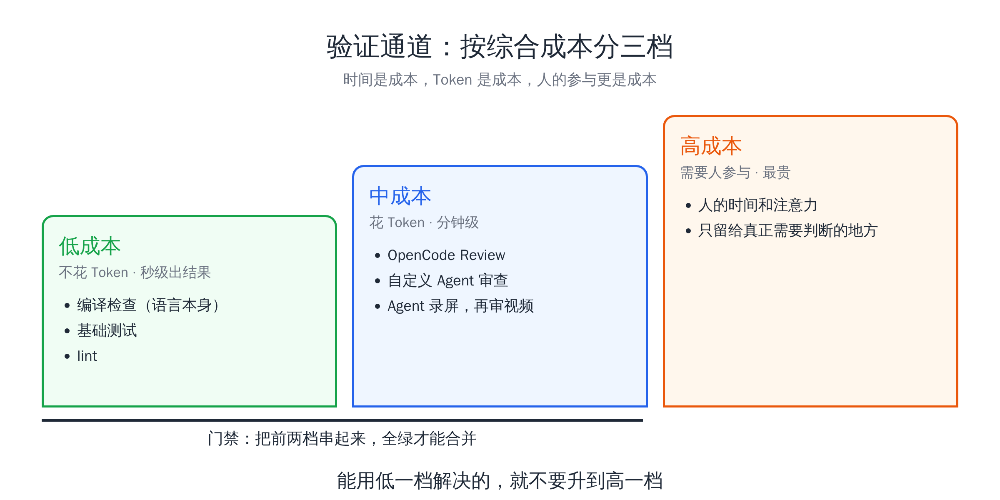
*验证通道按综合成本分三档：时间、Token、人的参与都是成本。*

这些验证通道会把反馈回传给 Agent，它马上就能知道自己写的代码有没有问题、错在哪里。生产环境遇到 bug，修掉之后也要回溯：当时为什么犯？下次怎么规避？这也构成一个 Loop。

### 选语言：一个十字坐标

我最近一个明显的变化是，不太关心底层用什么语言了。我手上同时有 Go、Java、Python 的项目。只要你有一些基本的编程思想，配合 AI，原则上任何语言都没问题。站在今天这个时间点，写出一个功能、一个模块已经不是难事，但软件工程——对复杂度的管理——是长期存在的。

以前选语言，最重要的一根轴是**人写代码的成本**：Python 简单，Rust 复杂，所以大家会挑自己擅长、写起来顺手的。现在这根轴的重要性下降了，因为写代码的不是你。

我现在选底层语言，用的是一个十字坐标：

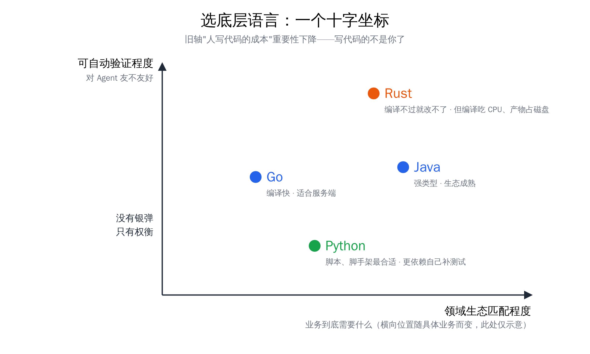
*选底层语言的十字坐标：纵轴是可自动验证程度，横轴是领域生态匹配程度。*

- **纵轴：可自动验证程度**，也就是这门语言对 Agent 友不友好。Rust 最典型，很多错误编译根本过不去，Agent 写错了马上就知道、马上就能修掉；Go、Java 其次；Python 再往后，更依赖你自己补测试。
- **横轴：领域生态匹配程度**，也就是业务到底需要什么。简单的脚本和脚手架，Python 的生态最合适；高性能服务，就得看 Go 和 Rust。

两根轴一起看，再做权衡。纵轴也不是越高越好：Rust 编译时吃 CPU、编译产物占磁盘，并发一上来，这些都会变成新的成本。**各有各的问题，没有银弹，只有权衡。** 但从构建 Loop 的角度看，纵轴代表的低成本反馈通道，对 Agent 来说是非常重要的。

### 代码廉价，测试高价值

在 Agent Coding 的时代，**代码是很廉价的，测试是非常高价值的**。

有没有一个清晰明确、能形成反馈的验收标准，已经成了现代软件工程的核心目标。如果你的目标能拆解成一系列可以验收的条件，那对所有 Coding Agent 而言，剩下的一切都只是时间问题、成本问题，迭代就好了。

像重写数据库、迁移代码仓库这类事，如果已经有一套能证明新旧行为一致的测试、踩过的坑都以测试的形式内化了，剩下的主要就是堆成本：上最好的 Token，上最好的 harness。测试覆盖不到的那部分，难度依然在。

最麻烦的是那种**你不知道怎么拆成可量化反馈**的目标。后端性能就相对简单，延迟、吞吐都是明确的数字，很容易形成"改一版、测一下、再改"的循环；但前端审美就很难量化，也就很难形成 Loop，很难持续迭代优化。

### 判据也会失效

这里有一个很容易被忽略的问题：**你用来验证的东西，本身也需要被验证。**

我的门禁系统是我 Token 消耗第二大的仓库，在它身上，这类坑踩了不少。讲两个最典型的：

- **没考，被记成了及格。** 改动提案在"草稿"状态时，模型审查这一步整个被跳过了；而汇总结果的那一步，把"跳过"当成了"通过"，照样亮绿灯。等提案标成正式之后，连红三轮。
- **从没判过卷的考官考核。** 我设计了一套"合成考卷"：用已知有问题的代码定期去考审查模型，检测它有没有"活着但变笨了"。结果跑了一个多月、111 次，因为登录凭据一直没配好，一次卷都没真正判过。

类似的还有好几次：版本钉住了但行为没钉住，一更新八个仓库同时挂掉；任务在排队、机器明明空着，最长排了 8 个多小时；一份没人读的名单，让 32 个仓库静默停掉了代码审查。

这些坑有一个共同点：**它们都是绿的，都没报错。**

所以我现在有一条硬规矩：**任何判据写完之后，先喂一个已知答案为"否"的输入，确认它会变红。** 一个永远不会变红的检查，等于没写。

## 七、瓶颈转移：从精力到硬件，再回到精力

这套体系搭完之后，我发现一件事：**我的瓶颈突然不再是精力，而是变成了硬件。**

这不是说每个人的瓶颈都会这样切换，而是我自己的阶段性体感。而且它是会来回摆动的：硬件那边再加强，瓶颈又会反过来回到精力上。再往上走，就是一个更高维度的需求了——**无限量的高质量 Token，配上充分的上下文信息和完备的基础设施**，三者齐备，才能产生 Claude Tag、OpenAI Dots 这类最佳的企业级应用场景。那是大公司的战场；对我们个人来说，先把眼前这一轮瓶颈解决掉。

### CI 成了新的堵点

OpenAI 那篇软件工厂的文章里，基础设施负责人 Venkat Venkataramani 说：

> *"We're talking about roughly a 10x increase in load on some systems. At most companies, that kind of growth might happen over two or three years. At OpenAI, we see it in about six months."*（部分系统的负载大约涨了 10 倍。大多数公司要两三年才会涨到这个量，OpenAI 大约半年。）
> —— [Inside OpenAI's agentic software factory, The Pragmatic Engineer](https://newsletter.pragmaticengineer.com/p/openai-software-factory)

文章里也明确说了，版本控制、CI/CD、发布流程处处是瓶颈。（CI 是每次准备合并时，在专用机器上自动跑测试和审查的流水线。）

这一点我深有感触。我现在经常同时调度 20 个主脑，下面三五十个执行器在跑。并发能力上了一个数量级之后，瓶颈就像打地鼠一样，按下一个冒出一个：

- 之前那台 12 核的开发机，经常连续几个小时 CPU 打满，CI 机器也是同样的 99%。所以我升级了开发机。
- 内存不再是瓶颈之后，会发现**磁盘**也是瓶颈。
- 如果不做缓存来降低流量，**GitHub 的下载流量**也是瓶颈，而且是要付费的。
- 不加机器、不做分层的 CI 策略，**CPU** 又会成为瓶颈。门禁这边 CI 能同时开工的工位，就是这样从最早的 6 个，一路扩到了现在的 84 个，分布在四台机器上。

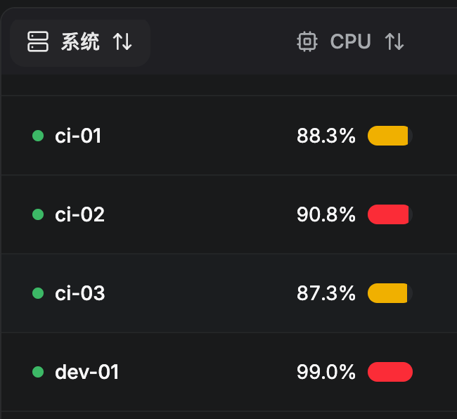
*某个下午的机器监控：三台 CI 机器都在 90% 上下，开发机直接 99%。*

没有什么一劳永逸的方案，只能遇到一个问题解决一个问题。**逢山开路，遇水架桥。** 但这些都是低成本的反馈链路，是必须建的。如果你长期有需要，硬件可以早点升级：内存和硬盘的涨价已经很明显，CPU 大概率也会跟上。

### Linux 还是 Mac

从 Loop 的角度，还能聊一个话题：Agent 最适合什么操作系统。

OpenAI Codex 的负责人 Tibo 说过，2026 年可能是 Linux 的元年。我觉得这话没问题。

Loop 最怕的就是被人卡住。**从 Computer Use（让 AI 操作图形界面）的角度，Mac 毫无疑问是最佳选择**：它上面有大量给人用的图形界面软件，兼容性广；系统又是 Unix，接口比较完善，Agent 可以通过 Computer Use 去操作。

**但如果单纯从 Agent 自己使用的角度，最佳的操作系统一定是 Linux。** 所有东西都可以通过配置文件修改，不需要人类二次授权。Mac 上很多权限必须人在屏幕上点"允许"，AI 点不了，循环就断了；Linux 上同样的事，一行命令就改完了。

所以如果你是纯 Coding 场景，又不依赖单一平台（比如 iOS 开发只能在 Mac 上），Linux 会比 Mac 更适合 Agent。这也是我目前的工程实践。当然，浏览器验证、Computer Use 这些能力就需要额外去补齐。

## 八、从 Coding 到组织，再到学习本身

### 名字不同，干的是同一层的事

最近冒出来很多新名词：Orca 叫 ADE（Agent Development Environment），Cloudflare 叫 ADLC（Agent Development Lifecycle），也有人叫 harness of harness。

这些新名词说的其实是同一件事：**在单个 Agent 外面，再搭一层工作环境，让多个 Agent 能分工、能查证、能留下记录，协作处理复杂的问题。** 至于下层单点的问题——某个模型能不能写好某一个功能、某一个模块——老老实实享受模型能力的提升就可以了。

这篇文章说了这么多，核心其实也就是这件事：为 Agent 打造一个工作环境。Context 是这个环境里的"材料"，Loop 是这个环境的"进化机制"。

我目前最关注的也就三个方向：**一是调度**，让主脑和执行器各司其职；**二是低成本、高质量的验证通道**；**三是怎么让验证过的东西，顺顺当当地进入生产环境。**

### 不止于 Coding

我之所以说这是整个 Agent 时代最重要的两个词，是因为它不局限于 Coding。**Agent 想要进入的任何环境，本质上都要看这两点：有没有充分的 Context，能不能形成 Loop。**

我之前在 [老树开新花](../260908-smb-agent-framework/) 里聊过 AI Native 组织的三个层次：组织对 AI 是否**可读**（资料 AI 拿得到），是否**可写**（AI 被允许改系统里的记录），是否**可闭环**（改完之后能自动判断对错，并把错误记下来）。放到 Coding 里看，一个代码仓库就是一个简易版的小组织。

### 学习本身也是一个 Loop

最后说说学新东西。

以前很多特别先进的工程实践，不太可能马上落地到自己的工作流里，因为大厂的一线实践依赖非常强的基础设施。但现在，借助 Agent，个人的工程能力几乎是无限强的。

所以我现在判断一个新东西值不值得学，思路是：**把文章丢给 Agent，让它结合我本地的开发日志、过程中犯过的错、历史 issue，再结合我一个人负责的场景，判断哪些值得吸收、哪些不用管。** 别人今天分享了一个最佳实践，几个小时之后，它的核心思想可能就已经进了我的生产线。

前面说的 RTK 先装后卸、Advisor 从 Claude Code 学来又改造，都是这么来的。

## 写在最后

我会觉得，在这个时代，**在那些能自动检查对错的工作里，如果你做一个项目越做越累，那说明你调度 Agent 的方式一定是有问题的。** 至于那些还没法自动验证的工作，累是正常的——先去补"怎样算做对了"，再谈调度。

正常来说，至少在工程上，你应该越做越轻松。你的注意力会不断从项目里被解放出来，只需要关心工程之外的东西，比如流量，比如权力分配。

如果要用一句话概括这两个月的变化，就是：**从 people in the loop，走向 people out of the loop。**

- **People in the loop**：人在环内。每一步都要人看、人判断、人拍板。开头说的"高频盯着才能维持每天 40 亿 Token"，就是这个阶段。人是整个循环里最慢的那一环，循环转多快，取决于你一天能醒着盯多久。
- **People out of the loop**：人在环外。人只做两件事：定义"怎样算做对了"，以及在系统真正需要拍板时出场。其余的派活、执行、验证、复盘、沉淀，都在环里自己转。

从环内走到环外，靠的不是更强的模型，而是这篇文章讲的两样东西：**Context 让 Agent 不需要人在旁边解释，Loop 让 Agent 不需要人在旁边纠错。** 少了前者，你得一直补充背景；少了后者，你得一直检查结果——无论缺哪一样，人都出不了环。

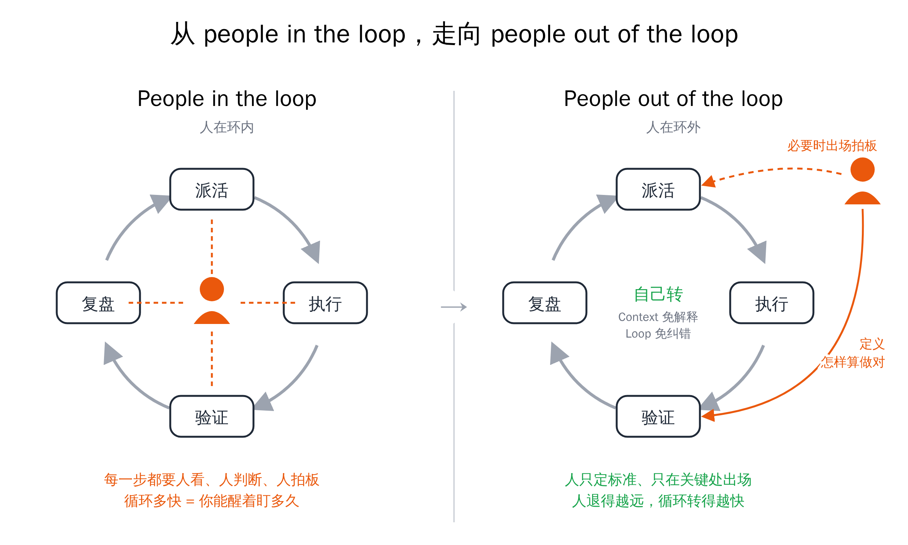
*左：人在环内，每一步都要人拍板；右：人在环外，只定义怎样算做对，必要时出场。*

反过来，人什么时候必须留在环内，判据也很清楚：**凡是还没法自动验证对错的地方。** 前端审美、产品方向、权衡取舍，这些地方人留在环内是正常的；你要做的，是不断把能验证的部分剥离出来，交还给循环。

做到这一点，靠的就是这两个词：

- **Context**：有意识地准备上下文，每样东西都要回答"它凭什么在这里"，有加法也有减法。
- **Loop**：有意识地构建闭环，让每一次犯错都被记下来、被验证、被写进下一次的上下文。

前期可能会磕磕绊绊，但随着 Loop 转起来，你基本上不会让同一个错误犯第二次，只会遇到新的、没想到的问题——没关系，有充分的日志可以排查，再积累就好了。**人退得越远，这条 Loop 转得越快，你调度 Agent 的能力也成长得越快。**

吃一堑，长一智。前提是，这一堑被记下来了。

以上，一家之言，不一定对。希望对各位有所帮助。

---

## 附录：参考资料

> 人类读者可以跳过，把链接丢给你的 Agent 即可。

**文章与访谈**

1. **[The new rules of context engineering for Claude 5 generation models](https://claude.dev/blog/the-new-rules-of-context-engineering-for-claude-5-generation-models/)**（Thariq，Claude）—— 系统提示删减八成、渐进式披露、`CLAUDE.md` 只写坑。
2. **[Latent Space 对 Thariq 的访谈](https://www.latent.space/p/thariq)** —— 失败模式随模型变化、累积失败日志会过度约束。
3. **[The AI-native SDLC playbook](https://claude.com/blog/the-ai-native-sdlc-playbook)**（Anthropic）—— 从线性流程到闭环，犯两次就写进规则，Skill 与 Hook 的分工。
4. **[Inside OpenAI's agentic software factory](https://newsletter.pragmaticengineer.com/p/openai-software-factory)**（The Pragmatic Engineer）—— OpenAI 的软件工厂，部分系统负载半年约涨 10 倍。
5. **[The Agent Development Lifecycle has arrived on Cloudflare](https://blog.cloudflare.com/agent-development-lifecycle/)**（Cloudflare）—— ADLC，为 Agent 设计的平台七项要求。
6. **[Orca CEO：当 AI 同时做二十件事，人该在哪里出手？](https://www.superlinear.academy/c/recording/orca)**（Superlinear Academy）—— ADE，harness 的上一层。
7. **Lauren（xAI）：here's how i shipped 2,500 PRs last month to production**（[AI 总结与校对稿](https://sum.zlxlabs.com/view/view_v8LdbUib-upySmXHKwv8LhiRPZNc1gzl9gqCYXJ8uFY)）—— 信任分层、验证技能、代码库就是最好的记忆。

**本系列前文**

- [Context is All You Need](../context-is-all-you-need/) —— 工作台比喻与上下文管理的基本方法
- [将军赶路不追小兔](../260809-multi-agent-scheduling-architecture/) —— 主脑 + 执行层的多 Agent 调度体系
- [老树开新花](../260908-smb-agent-framework/) —— 可读、可写、可闭环

---

> 本文由飞书录音豆语音转文字构思底稿，通过 Claude Code + Opus 5.5 完成文章架构设计与内容整理；事实核查由 Codex 完成，审稿由 Codex、Kimi、Grok 分工完成。
