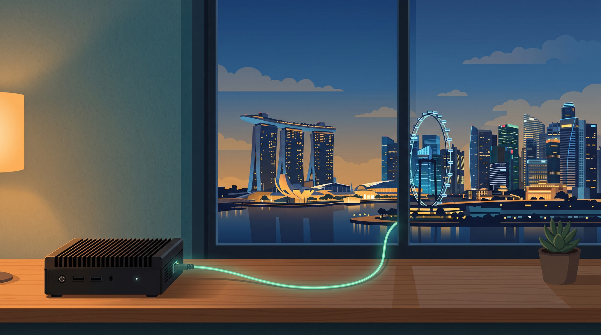
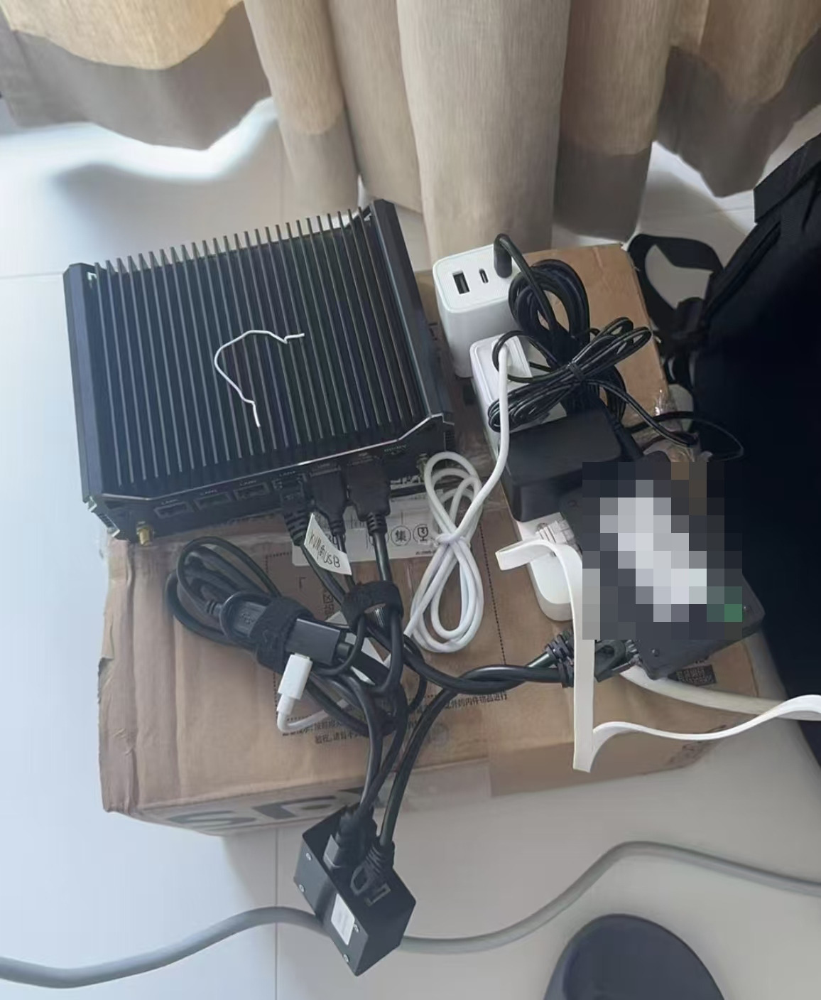
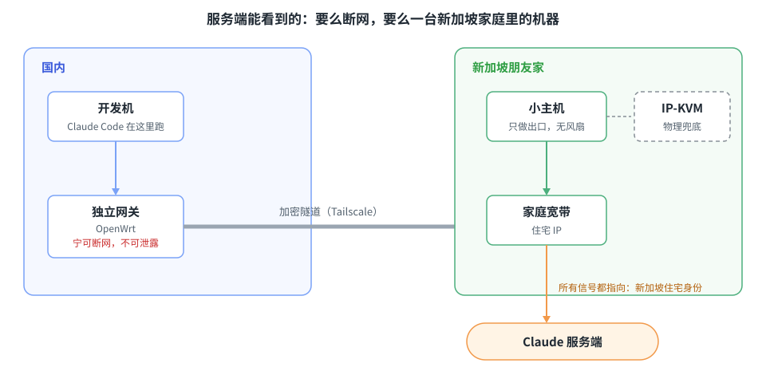
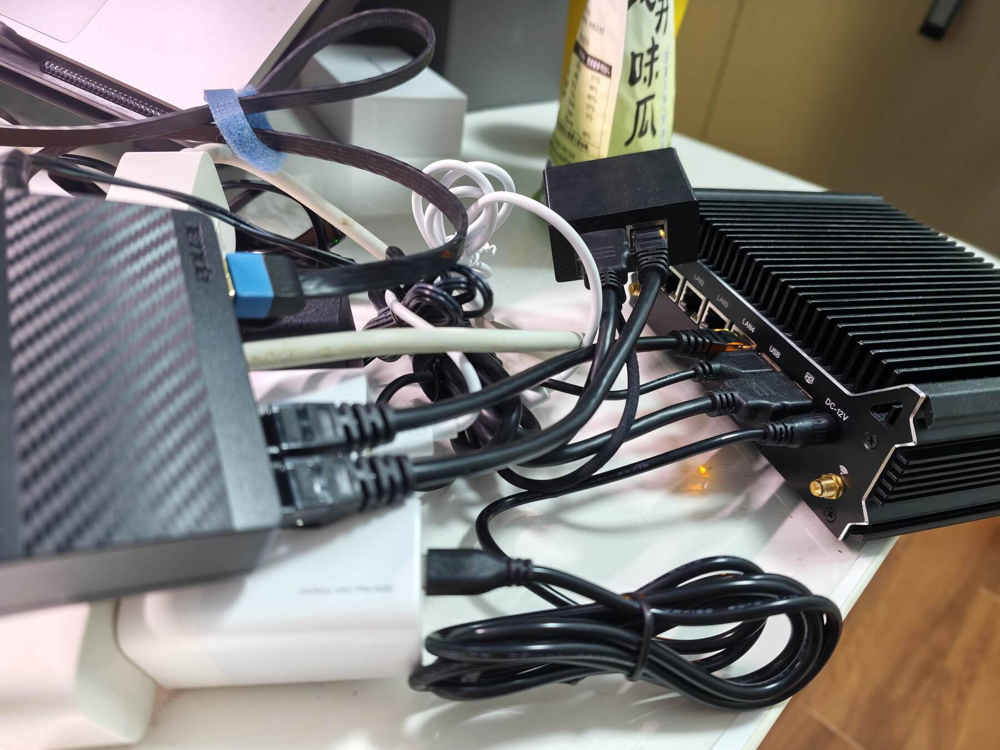
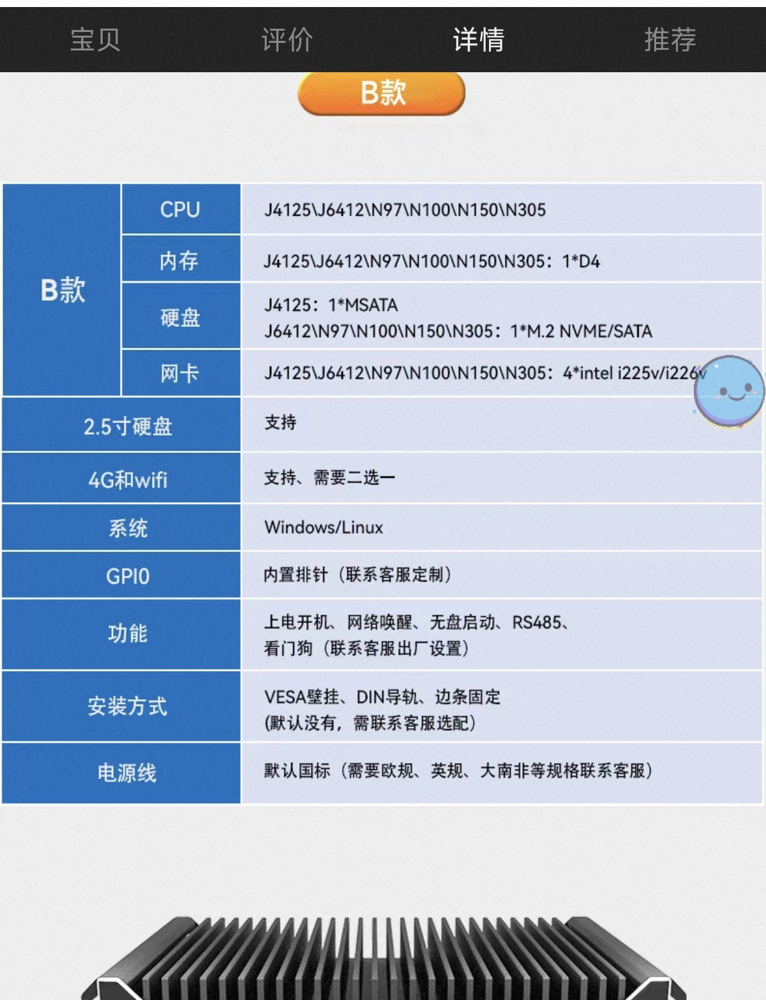
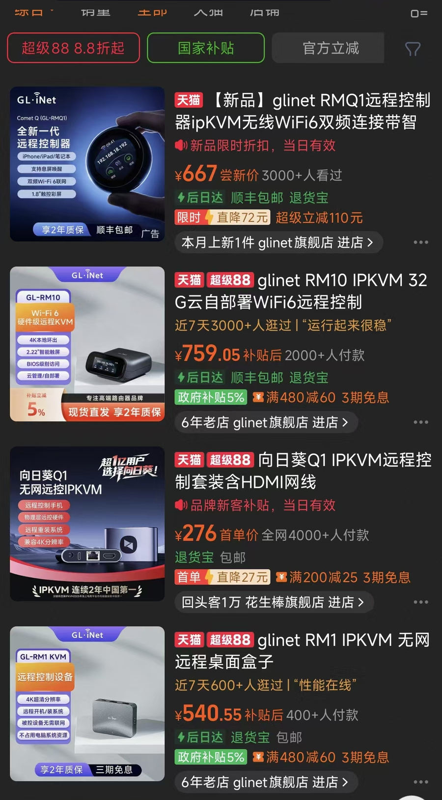

> 最近 Claude Code 又一波封号，社区里不乏一两年老号中招的自述。市面上相关的分享很多，但说实话，有些分享的底层逻辑是有问题的。这篇把这件事一次讲完：服务方在防什么、我们在模拟什么，以及我自己落地的方案框架。**希望这是我最后一次聊这个话题。**

---

我之前写过两篇相关文章：[《Claude Code：防封号、模型选择与设计哲学》](/posts/claude-code-risk-model-philosophy/)讲了"模拟海外华人"的总思路和一个少有人提的盲区，[《别关遥测》](/posts/260331-claude-code-telemetry-dont-disable/)讲了为什么"隐藏自己"是南辕北辙。

这篇是收官之作，所以会写得**自包含**：只读这一篇，你也能完整理解服务方的风控逻辑和我们的应对逻辑；前两篇出现过的内容，这里只讲框架，细节请回前文。

老规矩：**作为人类，你只需要读懂思路和逻辑。** 方案涉及的全部技术细节，我脱敏后放在了同目录的技术留存文档里（[GitHub 链接](https://github.com/zj1123581321/zj1123581321.github.io/blob/main/content/posts/261008-claude-code-high-cost-maintenance/sg-residential-egress-share.md)），有需要直接把链接丢给你的 Agent。

## 一、先搞清楚：服务方在防什么

谈应对之前，先理解对面。Claude Code 的风控，本质上在防三类行为：

1. **反不合规地区使用**。Anthropic 按其支持地区政策，不向中国大陆、朝鲜等地区提供服务。这件事本质上是意识形态问题——他们自己的报告里讲了很多，但信息比较敏感，这里就不赘述了。
2. **反蒸馏、反网络攻击**。这些是官方明确禁止的行为。
3. **反自动化滥用**。比如把包月套餐逆向出来，以 API 的形式对外提供服务——Max 套餐 200 美元一个月，逆向后当 API 卖，能跑出远超订阅价的调用量。

以前大家调侃美国公司"嘴上是主义，心里是生意"，交点钱总能糊弄过去。但这次不一样：Dario 本人的对华立场非常鲜明，公开主张过加强对华芯片出口管制；在限制中国用户这件事上，Anthropic 是真的心口如一——哪怕中国用户千方百计给它送钱，依旧照封不误，甚至有点"宁可错杀一千，不能放过一个"的意思。

我们的应对方案，说到底就一句话：**把自己模拟成一个海外的华人。** 你可以继续跟 Claude 说中文，但你的"肉体"不在大陆。

## 二、风控是概率题，不是是非题

这是整个讨论的地基，两点共识必须先立住。

**第一，风控是黑盒。** 除了 Anthropic 内部的风控团队，没有人知道确切的规则和权重。你能看到的所有风控分析——包括我自己这篇——都是根据现象反推逻辑的推测。

**第二，风控是概率，不是因果。** 它给每个用户打一个动态的风险分，多信号交叉判断。由此有几个推论：

- **谈风控需要分母。** 不要相信身边统计学。"因为我做了什么操作，所以被封了"——这种归因或许有道理；但"因为我没做什么操作，所以我没被封"，这个推理肯定不成立。说到底，我们模拟得再像，也不是真实的新加坡华人——所以长期看，被封可能只是时间问题；我们能做的，是在可接受的成本范围内把概率压低。
- **没有充要条件。** 哪怕措施做得再完备，概率也不为零——连真实的当地用户都会被误伤，更何况我们这种模拟出来的用户。
- **没有银弹。** 任何告诉你"只要做到这几点就不会被封"的说法，底层逻辑就是错的。
- **状态是动态的，不是静态的。** 风险分随时间演变——一个今天还良好的信号环境，明天可能就被降级成高危。这不是玄学，第四节讲批量化成本时会看到具体的机制。

记住这几条，后面所有讨论的边界就清楚了：我们追求的是**降概率**，不是**求豁免**。

## 三、总思路：像水一样融入大海

所有风控应对的逻辑都是同一件事：**让自己像水一样融入大海，尽量不要出现与多数人不一样的身份特征。**

围绕"海外华人"这个身份，要处理的不外乎这么几个维度。每一项我只讲"是什么信号、为什么重要"，展开的细节都在前两篇里：

- **手机号**：注册时的国家码是硬信号；虚拟接码号段被大量拉黑，官方明确拒绝 VoIP 类号码。
- **支付**：发卡行 BIN（卡号前几位，可识别发卡国）、账单地址、IP 地理位置的一致性，都会被用于风险判断。
- **KYC 与账号信息**：KYC 是平台要求的实名身份认证。所有注册信息指向同一个国家，多国混杂比不伪装更可疑。
- **网络**：住宅 IP 而非机房 IP——住宅 IP 是家庭宽带分配的地址，机房 IP 来自数据中心；在风控眼里，真人用户用前者，批量注册的账号多用后者。这一项是本文的重点，后面展开。
- **用户行为**：正常交互式使用，不要 24 小时无间断调用，不要碰逆向和自动化倒卖。
- **不要装手机 App**（[详见前文](/posts/claude-code-risk-model-philosophy/)）：手机操作系统给了 App 获取 GPS、SIM 卡 MCC、基站定位这些硬件级地理信号的能力。官方目前声明不收集精确位置——但能力在、动机在，声明不是承诺。不装，是成本最低、效果最好的防护。
- **被封过的设备要彻底清理**：客户端在本地留有设备级的状态追踪（大概率含硬件标识），换号不清环境，等于带着前科注册。

一句话：**仅靠改 IP 远远不够，你的整个环境需要自洽。** 要做就做全套，任何单点级别的方案都没有意义。

## 四、批量化成本：之前没细说的一块拼图

上面这些维度算是老生常谈，今天补一个之前没有展开过的点：**批量化的成本**。

先讲一个生态位的关系。在你还没想买账号的时候，中转站（第三方搭的转发服务：你付小钱给它，它用自己批量持有的官方账号替你调用）是你最好的朋友，帮你低成本体验顶级模型。但**当你决定要自己买账号的那一刻，你和中转站就站进了同一个生态位**——而中转站的账号行为，恰恰是最容易引发官方风控的那一类。

问题在于，风控打击的不是孤立的个体，而是**信号的聚类**。你和谁共享信号源，就和谁共担风险分：

- 你和中转站用了同一个虚拟卡的卡段（同一卡段的卡，往往来自同一家服务商），这个卡段一开始小众，后来量大了，**整个卡段的账号一起被封**；
- 你买的住宅 IP 服务本来口碑不错，被推荐、被薅，直到做号的批量涌入——**你的账号风险评估值，会随着这个池子的污染程度动态变化。**

注意这个"动态"：风控状态是会演变的——一个原本良好的信号池，可能因为做号的批量涌入，从良好降级成高危，你的账号风险分跟着水涨船高。今天没被封，既不能证明这个池子还干净，也不能证明你的方案是对的。

由此得到一个推论：**凡是门槛低、可以批量化复制的方案，即使短期有效，长期看大概率都会被风控系统识别出来。** 因为做号的人一定会涌入，而风控一定会跟上。

所以站在长期维护账号的角度，你要找的方案是那种**有高门槛、没办法被批量化复制的**。而所谓成本，其实就是门槛——

- **金钱的门槛**：硬件、宽带、流量，批量复制，成本就要乘以一个做号者无法承受的倍数；
- **信任的门槛**：一个愿意让你长期挂设备的海外朋友，这个根本买不到；
- **时间的门槛**：一个按月付费、干净升温的账号历史，会抬高做号者的资金占用和封号沉没成本。

**成本就是门槛，本质上都落在"不可批量复制"上。** 这也是我为什么敢公开分享自己的方案：它的门槛足够高，知道怎么做的人里，绝大多数也复制不了。

我把这个逻辑浓缩成一个可以带走的判断框架。以后评估任何一个防封方案，问两个问题：

1. **它的信号源，我和多少陌生人在共享？**
2. **把这个方案复制一万份，成本是多少？**

两个答案都不好看的方案，长期必死。注意这两个问题要连着看：复制的危害，发生在复制品和你共享信号源的时候——所以第二个问题，实际上是通过第一个起作用的。

## 五、我的方案：在服务端眼里，这台机器是什么

带着这个框架，来看我现在的方案。它的设计目标可以用一句话说清：

**从服务端能观测到的维度看，这台机器要么断网，要么所有信号都指向新加坡家庭里一个华人在用的机器——没有第三种状态。**

### 身份层：全套新加坡

新加坡的手机号、新加坡的支付手段、新加坡的网络——支付走朋友的卡，一个账号一张。新加坡有大量华人，说中文完全不突兀。包括账号的网页端操作（升级套餐、改设置），也都在走同一出口的桌面环境里完成。

这里最大的门槛不是钱，是**你得有一个可信任的新加坡朋友**，而且这个信任的分量比想象中重。在取得运营商记录等条件下，IP 是可以关联到宽带登记人的——他得相信你不会拿他家的 IP 干坏事；他还得愿意陪你折腾：收货、插电、偶尔帮你拔电重启——尽管我们会做大量工作，把他的操作和维护成本压到最低。资质上，办理手机号和家庭宽带都需要符合条件的本地身份证明，工作签证是最常见的一种；而工签毕竟有有效期，所以如果有长期永居身份的朋友，其实更好。

这个门槛会卡死很多人，也让方案变得不可复制。对风控而言，这恰恰是它最大的优点。

### 网络层：一台只做出口的小主机

整体架构一张图：

设计上有三条红线，每条红线防的都是一类可能被观测到的信号：

1. **地理一致**：连接 IP、DNS 解析结果、系统时区、浏览器的 WebRTC 出口，全部指向新加坡，并做一致性验证。做不到一致的通道直接封掉，宁可断网。
2. **可断网，不可泄露**：网关任何组件重启、崩溃的空窗期，流量只能失败，不能回落到国内出口。这一点做过压测——每 3 秒探测一次出口 IP，同时轮番重启防火墙和代理组件，全程采样中未观察到一次非预期出口。
3. **远程可救**：机器在海外朋友家，绝大多数故障都要能在国内远程修好，尽量不麻烦朋友。所以配了 IP-KVM——硬件级的远程，模拟显示器、鼠标、键盘，软件远程全挂了、多数系统级故障都能从 BIOS 层面救回来；真遇到断电、硬件损坏，才需要朋友现场帮忙（技术文档里记录了我们自己踩过的坑）。

实际运行数据：上线首日 22 小时的监测里，每分钟一次的探测全部在线（1297/1297），公网 IP 未变；落地为当地家庭宽带，本地带宽 500+ Mbps。对服务端来说，这就是一个**稳定、单一的新加坡住宅身份**。

网络侧的长期养护也在做：出口 IP、DNS 解析的地理位置都有持续监测——住宅 IP 本身会漂移，变了会告警。出差或移动场景，随身设备加入同一个加密隧道网络，走同一个新加坡出口。细节都在技术文档里。

具体怎么搭——硬件选型、系统配置、防泄露的每一层、踩过的坑、完整的复刻清单——全部在[技术留存文档](https://github.com/zj1123581321/zj1123581321.github.io/blob/main/content/posts/261008-claude-code-high-cost-maintenance/sg-residential-egress-share.md)里，这里不展开。想复刻的话，细节都在里面。

### 养护层：时间是最贵的门槛

账号不是注册完就完事了。我的节奏是：用新加坡手机号注册新加坡家庭宽带，从免费用户开始，用一段时间升到 20 刀，再用一段时间升 100 刀，最后升 200 刀——**慢慢养**。这套节奏有没有用，没人能证实，它只是我个人的选择。

这个节奏本身就是门槛的一种：它抬高的是做号者的资金占用和封号沉没成本——批量养号的生意，等不起也摊不薄这种时间。而对正常用户来说，一个按月付费、逐级升级、历史干净的账号，恰恰是最普通的用户画像。

也要说实话：万一被封了怎么办。申诉通道倒是能走——朋友的身份是真实的，居住证明拿得出来；但现在封号封得太多，解封的时间非常不确定。而且客观上，一个人能注册的账号是有限的：手机号、宽带、银行卡都绑在朋友的真实身份上，没办法无限重来。所以这个方案的全部赌注，依然压在前置预防上；真到了那一天，沉没的是数月的养号，外加一次未必等得来的申诉。

到这里，从服务端能看到的一切——注册信息、支付、IP、DNS、时区、使用行为、升级轨迹——几乎没有任何一个点能让它判断"这是我要封禁的用户"。

### 三个关键取舍

**为什么不买现成的海外主机租赁？** 最近 X 上兴起了租 Mac mini 主机的生意。看懂前面的框架就知道它不靠谱：你不知道那台机器的 IP 同时卖给了多少人，这些人里有没有在干官方禁止的事——这是典型的共享信号源。而且身份是全方位的，它帮你解决网络，能帮你解决支付、手机号、KYC 吗？单点方案，不如不做。

**Mac mini 还是 Linux 工控机？** 先说一句公道话：**Mac mini 依旧是门槛最低的方案**——它本身就是一台完整的电脑，放在朋友家、远程连上就能用，不需要我们做额外的网络配置。走这条路只有一个建议：**一次就把配件拉满**，内存、CPU 都配够，不然之后升级起来会比较麻烦。

但有一点要心里有数：跨境远程对线路的要求是分场景的——**远程桌面传画面，带宽需求大，对跨境线路的质量要求就高；SSH 就宽松得多**。所以就算走 Mac mini 方案，我也更推荐用 SSH 远程连接来用，UU 远程这类桌面画面只留给偶尔的网页操作。

如果你愿意折腾，可以采用我下面这种方案。注意一个区别：我那台 Linux 小主机**本质上只是一个网关**，只负责中转流量，代码并不跑在它上面——写代码的仍然是国内那台开发机，只是它的所有流量都从新加坡出去。**两种方案本质上没有什么优劣之分，更多是取舍**：Mac mini 省心但贵，拿来 24 小时常开大材小用；Linux 工控机便宜、轻量、专为长期稳定运行设计，但每一条网络细节都要自己搭。无论选哪种，我都建议加一台 IP-KVM 做物理兜底——纯软件远程一旦遇到系统升级卡死、或者远程软件自己掉线，你就完全无法接管，几百块钱的硬件级远程，救一次就回本。

**为什么我选 Linux 工控机？** 它只跑网络转发和隧道，负载极轻（实测内存占用 644MB、磁盘 1.9GB），被动散热无风扇，配看门狗，禁止系统自动更新、更新失败自动回滚——所有设计都指向"少坏"和"坏了能远程救"。要诚实承认的一点：**Linux 桌面用户在新加坡也是少数派，我猜这会带来一点额外的画像偏差**，Mac 会更常见。但 Linux 是我日常写代码的环境，这个偏差在我个人可接受的成本范围内——回到第二节，我们追求的是降概率，不是消灭所有异常。

### 为什么偏偏是新加坡

三个原因。**华人多**，中文使用习惯完全不突兀。**时区是 UTC+8，和中国零时差**——你不需要伪装成一个昼伏夜出的"美国程序员"，作息信号天然吻合，这恰好补掉了长期统计里最难伪装的一类信号。最后，**身份要素的可得性**：手机号、家庭宽带、支付手段，有朋友在就能办齐。

这套东西也不局限于新加坡。原则上任何国家，只要你能同时搞定手机号、支付和网络，同一套框架都成立。

## 六、算一笔成本账

- **硬件**：主机（工控机 + 内存 + 硬盘）2000 以内能拿下（人民币，下同）。我高配花了 1500 左右，但如果只跑网络转发，4G 内存 + 64G 盘完全够用，整机 1000 上下即可。IP-KVM 400–1000。合计两三千，一次性投入。如果走 Mac mini 方案，把主机预算换成一台拉满配置的 Mac mini 即可，其余账目不变。
- **流量**：跨境线路按月计费，每月大几百，丰俭由人。
- **信任**：一个可信任的新加坡朋友——他担着你用他家 IP 的风险，还愿意陪你折腾。买不到的门槛。
- **时间**：数月养号。等不起的人自动出局。

听起来很贵。但换个角度，这其实是**长期低成本**：一次搭好，不用在"封号 → 找新渠道 → 再被封"的循环里反复消耗。值不值，取决于你自己的账怎么算。我个人的逻辑很简单——**永远让自己拥有接近世界顶级模型的能力**，在这个目标下，这个成本我认为可以接受。

这套方案也有明确的适用边界：没有可信任的海外朋友，方案直接不成立；用量不高的话，纯烧官方 API、或者"顶级模型定思路、国产模型搞工程"的分层打法（见[前文](/posts/claude-code-risk-model-philosophy/)）更划算；对封号沉没成本敏感、受不了推倒重来的人，也不该上桌。门槛卡死的人本来就该出局——这正是"成本即门槛"的另一面。

## 写在最后

再回到地基那两条共识：风控是黑盒，风控是概率。

上面这套方案，我不敢说一定不会封——**没有任何方案敢这么说**。它只是在我可接受的成本范围内，把概率压到了我能做到的最低。而且这套东西对不对，最终要靠时间去检验。

再强调一次"黑盒"这两个字：除了 Anthropic 自己的工程师，没有人知道风控的真实逻辑——这篇文章、我前两篇文章、以及你能看到的所有相关分享，本质上都是推测。所以我无意与谁争论：如果你觉得你的想法更有道理，那就是你对。

如果整篇文章你只带走一句话，我希望是这个：**任何单点级别的方案都没有意义，要做就做全套，不然不如不做。**

如果你打算动手，技术留存文档里有完整的复刻清单和踩坑记录。

一家之言，仅供参考，希望对你有所帮助。

---

## 相关阅读

- [Claude Code：防封号、模型选择与设计哲学](/posts/claude-code-risk-model-philosophy/)——模拟海外华人的总思路、手机 App 的风控盲区、硬件指纹清理
- [别关遥测：Claude Code 源码泄露后，你可能正在做最危险的操作](/posts/260331-claude-code-telemetry-dont-disable/)——为什么"隐藏自己"反而更危险
- [技术留存：新加坡住宅 IP 出口方案，从硬件到软件](https://github.com/zj1123581321/zj1123581321.github.io/blob/main/content/posts/261008-claude-code-high-cost-maintenance/sg-residential-egress-share.md)——完整的实施细节、踩坑记录与复刻清单（已脱敏）

---

> 本文由飞书录音豆语音转文字整理成底稿，通过 Kimi Code 完成文章架构设计与内容整理，事实核查由 Codex 完成。
