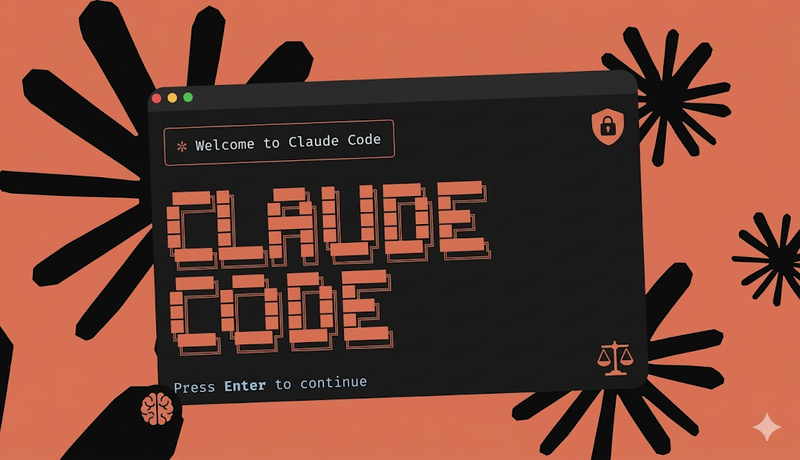
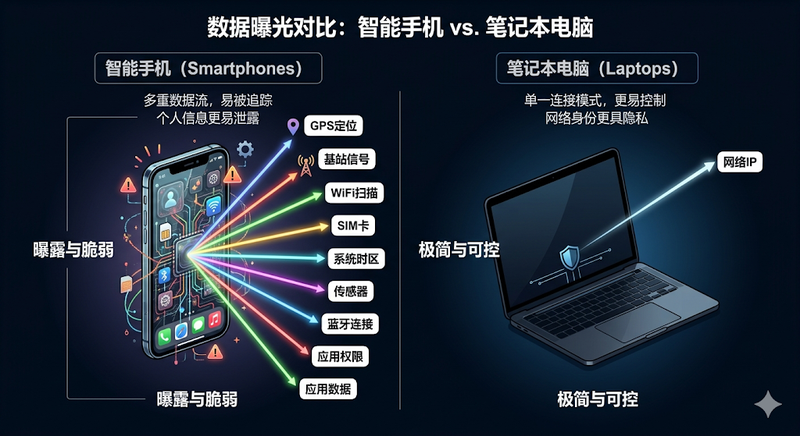
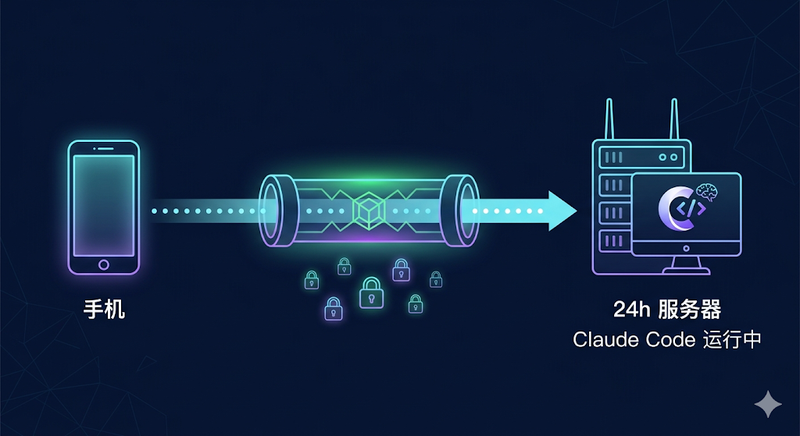
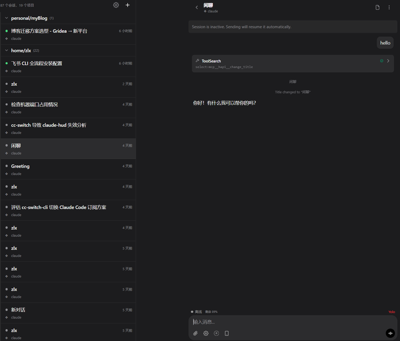
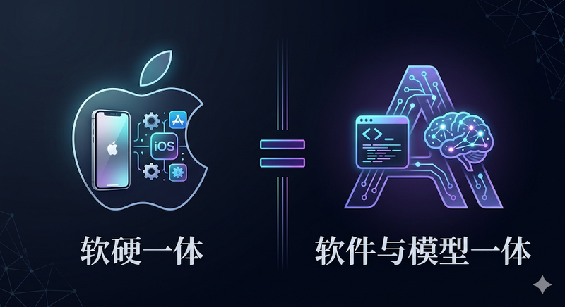
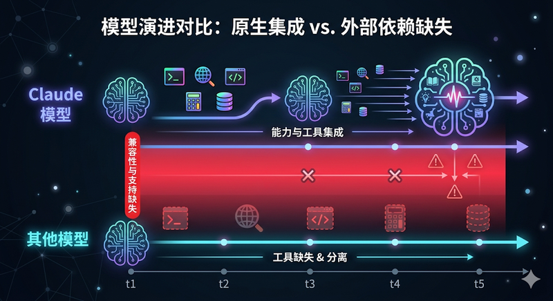
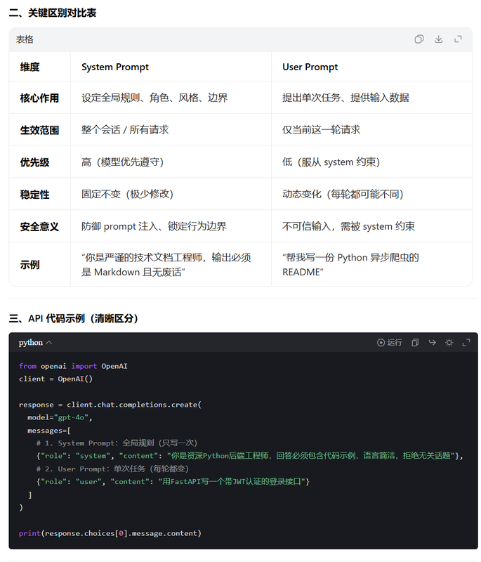

Claude Code 配合 Opus 4.6，Codex 配合 GPT 5.4——这是目前 coding agent 领域断档领先的两款产品。我自己的配置是 Claude Code Max 套餐加 Codex 20 刀的基础套餐，大部分时候用 Claude Code 写项目，Codex 用来做一些艰难的 debug。

随着越来越多人开始接触 AI 编程，不可避免会被引导到这两款原生 coding agent 上来。而 Claude Code 作为生态更成熟的一方，使用门槛却也更高——不只是技术门槛，还有准入门槛。

本文是我在使用过程中的一些零散思考，涵盖风控生存、模型选择和设计哲学三个话题。不是标准答案，仅供参考。

**如果你只记住一件事：不要在手机上安装 Claude 客户端。** 这可能是目前中文互联网上从未有人提到过的风控盲区，后文会详细展开。

---

## 一、风控与生存

### 1.1 IP、手机号与支付

这三项是网上讨论最多的基础门槛，这里只做简要罗列。

| 检测维度 | 要点 | 风险 |
|---------|------|------|
| IP 类型（ASN） | 区分家庭宽带与数据中心 IP，后者极高危 | 🔴 |
| DNS 一致性 | DNS 泄漏会暴露真实网络拓扑 | 🔴 |
| WebRTC 穿透 | 未阻断则直接暴露真实 IP | 🔴 |
| Impossible Travel | 短时间内跨国 IP 跳跃触发警报 | 🟡 |
| 时区 / Locale 比对 | IP 显示美国但系统时区 UTC+8 = 特征悖论 | 🟡 |
| 手机号 | 虚拟接码号段被大量拉黑，初始信任分极低 | 🔴 |
| 支付 | 发卡行 BIN + 账单地址 + IP 地理位置需一致 | 🔴 |

一句话总结：**仅靠改 IP 远远不够，你的整个网络环境需要自洽。**

客观来说，一张海外手机卡、一张海外银行卡、一个干净的网络环境，已经是 AI 时代的基础设施了。这些东西迟早要解决，这里只提几个关键词供检索：手机卡方面，美国低成本维持方案可以关注 **Redpocket** 和 **Ultra Mobile**；银行卡方面，核心路径是维护 **ITIN**（个人纳税识别号）→ 申请美国信用卡 → 用 **[Wise](https://wise.com)** 进行还款。具体操作有很多玩服务器、玩海外卡的社区在讨论，请自行检索。

### 1.2 核心思路：把自己模拟成海外华人

在聊具体操作之前，先明确一个前提：**风控是黑盒。** 除了 Anthropic 内部的风控算法工程师，没有人能给出确定性的结论。我能分享的也只是结合风控领域的基本常识和自己的体感做出的判断。

你可以类比微信的风控逻辑——很多事情有的人做了没事，有的人做了就出问题。它本身跟你的账号信誉、历史行为、环境因素都有关系，是一个概率博弈。所以如果你发现自己违反了下面某些条目但没被封号，也很正常，这不代表这些因素不存在。

Anthropic 的 CEO Dario Amodei 在意识形态上的立场，导致了这家公司对中国用户有着相当明确的风控策略。这个去看他 YouTube 上的采访和播客就很清楚了，不赘述。结果就是：如果被判定为中国大陆用户，大概率会喜提封号。但无奈这家公司的工程能力确实强，所以身边大把的人就在不断封号、不断找新方式送钱的循环里——挺魔幻的。

**核心思路其实就一个：把自己模拟成一个不在中国大陆的华人。** 比如新加坡华人、美籍华人——你可以跟 Claude 说着中文，但你的"肉体"不在大陆。围绕这个目标，所有的操作都是在让你的环境更贴合这个身份：

- IP 质量过关（这个大家基本都知道）
- 系统时区改成目标地区
- 地区设置改成对应国家
- 浏览器语言默认英语
- 系统语言可以保持中文（海外华人本来就用中文）

当然这些更多是锦上添花。我自己的很多设备也是全中文环境、地区设为中国，目前也一切正常。Claude 账号用了大概两三年，Claude Code 也有一年多了。所以核心还是那句话——想办法让服务端认为你是某一类合法用户，然后尽量贴合这类用户的行为特征。

### 1.3 从未有人提到的风控盲区：不要在手机上装 Claude

这是我认为整篇文章最重要的一个观点，但目前中文互联网上几乎没有人提到过。

**核心原因：手机的传感器太多了。**

相比 PC，手机上的 App 可以获取的信息维度，远超你通过网络层面能伪装的范围。这一点 iOS 和 Android 都一样。

以 iOS 为例，App 可以触达的地理检测能力包括：

- **CoreLocation 框架**：通过 GPS 定位获取经纬度，再通过反向地理编码直接得到用户的物理位置所属国家。**这个过程和 IP 地址完全无关**，你怎么改网络都没用。
- **CoreTelephony 框架**：可以读取 SIM 卡的移动国家代码（MCC），甚至获取当前连接基站的 MCC。哪怕你插着一张美国 SIM 卡，只要接入了中国运营商的基站（MCC=460），就能判定你实际在中国。
- **countryd 服务**（iOS 16.2 起内置）：苹果的内部服务，综合 GPS 定位、基站 MCC、周边 WiFi 的国家信息、系统时区等多个维度，判定用户实际所在国家。这套机制原本用于苹果自身的合规管控（欧盟应用侧载、各国年龄验证法规等），但开发者也可以通过开放 API 获取上述各维度信息。
- **NSLocale**：系统设置的地区、时区、语言等辅助信息。

Android 同理，也有等价的定位服务、基站信息读取、WiFi 扫描等能力。

**已验证的案例：Meta 智能眼镜。** Meta Ray-Ban 智能眼镜的 Meta AI 功能限定美国地区使用。早期你通过改 IP 就能绕过，但 App 更新后这条路完全失效了——它正是通过上述多维度检测，实现了不依赖 IP 的地区判定。在非越狱、非 root 的设备上，想要完整绕过这套多维度检测，需要同时篡改定位、基站信息、时区、系统设置等所有维度，难度极高。

我的论证逻辑很简单，明确交代给大家：**不需要证明 Claude App 具体调用了哪些 API。** 只需要知道两件事——第一，手机操作系统给了 App 这些能力；第二，Claude 对中国用户有明确的风控策略，有充分的动机去使用这些能力。两者结合，不装就是最低成本的风险规避。

怎么说呢，染上 Claude Code 加 Opus 4.6 这种体验就跟上瘾一样，你很难再降回到其他模型。所以账号比钱重要得多。而不在手机上装 Claude 客户端，可能是你能做的成本最低、效果最好的一个防护措施。

### 1.4 硬件指纹与被封后的处理

如果你已经经历过封号，在注册新账号之前，有一件事需要注意：**Claude Code 在本地留有深度的状态追踪。**

`~/.claude.json` 这个全局配置文件不仅存储了会话历史、OAuth 令牌、MCP 服务器配置，还留存了与历史账户绑定的环境遥测数据和硬件识别信息。这个文件的体积经常可以膨胀到 17MB 以上。

更关键的是，Claude Code 会采集操作系统级别的硬件指纹。在 Windows 上，它会读取注册表中的 `MachineGuid`；在 macOS 上，则是提取主板固化的 `IOPlatformUUID`。这些硬件级的数字签名会随着你的每一次交互同步至云端。一旦云端检测到多个不同账户绑定了同一个硬件指纹，就会触发关联封禁。

所以被封后若要重新开始，必须彻底清理本地环境。具体的清理方式此处不展开，请自行检索。只是提个醒——很多人反复封号的原因，可能就在这里。

### 1.5 手机上怎么跟 Claude 聊？

既然不建议装客户端，那日常想在手机上和 Claude 沟通怎么办？

核心思路是：**你有一台 24 小时在线的机器跑着 Claude Code，然后手机端远程接入。** 这样所有的交互都发生在你的服务器上，手机只是一个显示终端，不会向 Claude 暴露任何手机端的传感器信息。

具体有两种方案：

**方案一：[CC Connect](https://github.com/chenhg5/cc-connect)**。它可以把 Claude Code 桥接到飞书、企业微信、钉钉、Telegram 等十几个平台上，你在 IM 里就能随时和 Claude Code 对话。缺点是它本质上是一个机器人形态，多 session 的切换不太方便，不够直观。

**方案二：[HAPI](https://hapi.run)**（[GitHub](https://github.com/tiann/hapi)）。这是我更推荐的方式。HAPI 天然支持多 session、多文件目录，支持项目级 skill 安装，也有原生的记忆功能。你完全可以把它当成一个 chatbot 来用——建一个文件夹，起一个 Claude Code 实例，连接上去，不同的对话天然隔离。它还支持 Claude Code、Codex、Gemini、OpenCode 等多种 agent。

安全部署方面，有几种选择：

- **局域网方案**：用 [Tailscale](https://tailscale.com) 组网，手机和服务器在同一个虚拟局域网内。但手机在外面的时候可能和其他网络软件冲突，需要权衡。
- **公网方案**：用 [Cloudflare Tunnel](https://developers.cloudflare.com/cloudflare-one/connections/connect-networks/) 把内网服务暴露到公网，再用 [Cloudflare Access](https://developers.cloudflare.com/cloudflare-one/policies/access/) 做鉴权——比如只允许你自己的 Google 或 GitHub 账号才能访问。Cloudflare 是网络底层服务商，安全性极高，而且整个流程全免费，唯一的成本是一个域名大概十几块钱一年。
- 无论哪种方案，都可以用 PWA 把网页发送到手机桌面，体验接近原生 App。

前提当然是你得有一台 24 小时在线的机器。不过现在这么多人都在养虾跑 agent，这个对于真正想用好 AI 的人应该不算什么门槛。

---

## 二、设计哲学：理解 Claude Code 为什么这样设计

在聊模型选择之前，先理解 Claude Code 的设计哲学。因为很多人遇到的问题——比如国产模型接入 Claude Code 效果不好——根源其实在这里。

以下引用来自 Claude Code 的创建者 Boris Cherny 在两期播客中的原话：
- [Inside Claude Code With Its Creator](https://www.youtube.com/watch?v=PQU9o_5rHC4)（Y Combinator Lightcone）
- [Head of Claude Code: What happens after coding is solved](https://www.youtube.com/watch?v=We7BZVKbCVw)（Lenny's Podcast）

### 2.1 核心理念

> "We build for the model six months from now, not for the model of today."
> — Boris Cherny, Head of Claude Code

**永远为 6 个月后的模型设计产品，而不是为今天的模型。** 这句话解释了 Claude Code 为什么一直在做减法——很多你曾经用到的工具和功能，随着模型能力的迭代，调用频率越来越低，最终直接从工具链里剔除。因为模型把那些能力内化了。

> "We have a framed copy of the bitter lesson on the wall... the more general model will always beat the more specific model."

他们把 Rich Sutton 的 [The Bitter Lesson](http://www.incompleteideas.net/IncIdeas/BitterLesson.html) 这篇文章裱在了办公室墙上。核心观点是：**更通用的模型永远会胜过更专用的模型。** 这是 Claude Code 所有设计决策的底层原则。

> "Scaffolding can improve performance maybe 10-20%, but often these gains get wiped out with the next model."

围绕模型搭建的工程脚手架（scaffolding），最多能提升 10-20% 的效果。但下一个模型版本出来，这些增益往往就被全部抹平了。所以要么你不断重建脚手架，要么你就等下一个模型——后者通常是更好的选择。

> "All of Claude Code has just been rewritten over and over. There is no part of Claude Code that was around six months ago."

Claude Code 的代码在持续重写。没有任何一部分代码存活超过六个月。这不是因为代码质量差，而是因为模型能力在不断变化，产品必须跟着调整。

### 2.2 软件与模型一体

理解了上面这些，你就能明白 Claude Code 的本质：**它不是一个通用的 AI 编程框架，而是一个和 Anthropic 模型深度绑定的产品。** 有点类似苹果的软硬一体——Claude Code 做的是软件与模型一体。

这种一体化体现在两个方向上：

**模型吞噬产品功能。** Boris 预测 plan mode 可能一个月后就不再是刚需——因为模型会自己判断什么时候该规划、什么时候该执行，不再需要用户手动切换模式。原来需要在产品层面解决的问题，现在模型自己就能处理了。当模型能力增长到某个阈值，对应的产品功能就失去了存在的必要。

**产品跟着模型持续重写。** 前面引用过的那句话——"没有任何一部分代码存活超过六个月"——不是夸张。Claude Code 的工具链会随着每个新模型的发布进行裁剪和重构。模型内化了某项能力，对应的外部工具就被移除。这是一个持续进行的过程，不是一次性的重构。

这意味着 Claude Code 的功能边界会随着模型能力不断变化。你今天觉得必不可少的某个工具或模式，半年后可能就被移除了。

### 2.3 对使用者意味着什么

**理解 Claude Code 的能力边界和设计意图，比背诵具体的使用技巧重要得多。**

但同时，也不必神化官方的用法。Boris 自己也说过：

> "There's no one right way to use Claude Code."

他的个人用法基于他的场景——在 Anthropic 内部、用最新的内部模型、做 Claude Code 自身的开发。你的场景大概率和他不同。所以他的访谈和博客，更大的价值在于帮你理解这个工具为什么是这样设计的，而不是告诉你应该怎么用。具体怎么用，还是要结合你自己的需求来定。

---

## 三、模型选择：顶级模型定思路，国产模型搞好工程降成本

有了上一节的哲学理解，再来看模型选择，逻辑就清晰了。

### 3.1 为什么国产模型接入 Claude Code 效果打折扣

现在国产大模型的价格确实很便宜，有些年费订阅就相当于 Claude Code 一个月的费用。很多模型跑分也很漂亮。但你把它们放到 Claude Code 里用，可能会发现效果没有预期那么好。

原因在于 Claude Code 的工具链是跟着 Anthropic 自家模型的能力走的。当 Anthropic 的模型把某些工具能力内化了之后，Claude Code 就会把对应的外部工具丢掉。但如果你替换上去的国产模型还没有内化这些能力，就会出现一个尴尬的局面：工具被 Claude Code 移除了，模型自身又做不到——该调用工具的时候不调用，方向跑偏。

**这不是协议适配的问题。** 大家在语法上都可以兼容 Anthropic 的协议，但这是一个能力适配的问题。Claude Code 是为自家模型量身定制的，第三方模型接入天然就有适配差距。

### 3.2 分层策略

如果你不想全程用最贵的模型，一个实用的策略是分层：

**顶级模型玩命思考定思路，国产模型搞好工程降成本。**

我在实践中有三个具体的应用场景：

**第一，[OpenCode](https://github.com/opencode-ai/opencode) + [Oh My OpenAgent](https://github.com/code-yeongyu/oh-my-openagent) 插件。** 这个组合本质上就是上述思路的产品化——顶级模型负责复杂推理和架构决策，便宜模型处理粒度小的分析任务。它在工程上做了很多事情来控制任务复杂度和出错处理，所以对模型能力的要求反而没那么高。如果你发现国产模型直接接 Claude Code 效果不理想，不妨试试这个方向。

**第二，多 Agent 协作中的角色分配。** 我在做 OpenClaw 多 Agent 协作时，调度层的"CEO agent"用顶级模型来分配任务，类似于总指挥的角色——因为调度决策错了，后面全错。但底下干执行的 agent，则按任务类型选配国产模型。关键在于：执行层的流程必须设计得足够清晰明确，减少歧义空间，不让便宜模型做复杂决策。这个思路在我之前的文章 [《Context is All You Need：为什么你的 AI 时灵时不灵？》](https://mp.weixin.qq.com/s/az3gUGA24mXs1ptYdayFjQ) 里有更系统的展开——核心就是让主 Agent 用最强模型做判断和决策，Sub-agent 用便宜模型跑体力活，同时通过上下文隔离保持主 Agent 的决策空间干净。

**第三，Skill 的开发与迁移。** 先用顶级模型验证一个 skill 能跑通——因为顶级模型自己会解决过程中遇到的问题，也会比较积极地调用工具，快速验证思路。确认可行之后，再切换到普通模型去跑，观察触发成功率。你会发现便宜模型在一些地方容易出错，该调用工具的时候不调，此时就需要在 skill 里补充明确的指引。最终的 skill 会比用顶级模型时更"膨胀"——内容更多、流程更细，但代价换来的是成本降一个量级。

底层的思路就是：**模型能力不够，用工程手段来补。** 而且这个优化过程本身也可以让 AI 来做，不必全靠人工。

### 3.3 非官方渠道的风险提醒

如果你不用官方订阅，而是通过其他渠道获取 Opus 4.6 的能力，有几个风险需要了解：

**套壳风险。** 你不知道中转服务商到底有没有用真正的官方 API，还是用国产模型给你套了个壳。这里面的价差利润非常惊人，此前已有新闻报道过。

**数据风险。** 这里要分两种情况。如果你用的是国内大厂（比如阿里、字节、minimax、智谱等）的官方订阅套餐，大厂做事多少还有点底线，数据处理相对规范。但如果你用的是那些第三方个人搭建的中转 API，性质就完全不同了——很多是个人运营，没什么底线可言。你的数据可能不是被卖给了一家，而是卖给了很多家，基本上等于裸奔。所以你自己要权衡，有没有敏感内容不太适合经过这些渠道。

**System prompt 污染。** 有些方案是通过逆向集成 IDE 提取的 API，比如 [Google Antigravity](https://www.datacamp.com/blog/claude-code-vs-antigravity)（原 Windsurf 团队被 Google 收购后推出的 IDE）和 [Amazon Kiro](https://kiro.dev)。这类逆向 API 有一个固有的问题：你只能修改 user prompt，而底层的 system prompt 是不可更改的。Antigravity 的 system prompt 是 Google 内置的，Kiro 的是 Amazon 为 kiro u设计的——这些预置的 system prompt 会影响后续的输出行为和质量。如果你遇到了一些质量上的微妙差异，这也许是原因之一。

### 3.4 模型选择优先级

总结一下，从最优到最次：

1. **官方订阅套餐**——有钱有条件的首选，200 刀 Max 套餐满额使用等效数千美金 API 额度
2. **纯烧官方 API**——灵活但贵，适合某些老板确实烧得起的场景
3. **国产模型 + 工程化手段**——OpenCode、多 Agent 分层等方式，需要投入工程化的优化成本
4. **反代 / 中转**——风险自担，如果没遇到问题那当然好，遇到问题可以回来多想想上面这些

---

## 写在最后

以 200 美金的 Max 套餐来看，如果用满的话，单从 API 额度来算你可能花到等效几千美金。但对方也拿到了你的数据，而且他们的实际成本肯定没有这么高。

不过按目前的趋势来看，随着越来越多人涌入，物理世界加机器的速度赶不上需求迸发的速度。Anthropic 已经在降配额了，之后可能还会有进一步的缩减。便宜模型的 token 一直在变便宜，但这种顶尖模型的 token 未见得会变便宜。包月套餐的这种羊毛能薅到什么程度，真的很难讲。

且行且珍惜吧。

---

> 本文由飞书录音豆语音转文字构思底稿，通过 Claude Code + opus 4.6 对话完成文章架构设计与内容整理，配图由 Nano Banana AI 生成。
