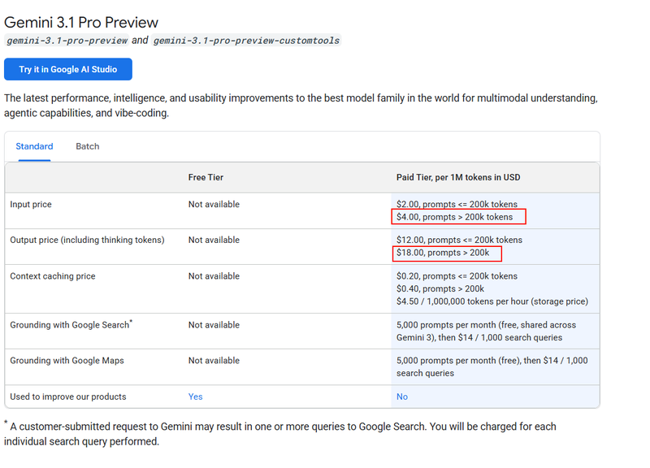
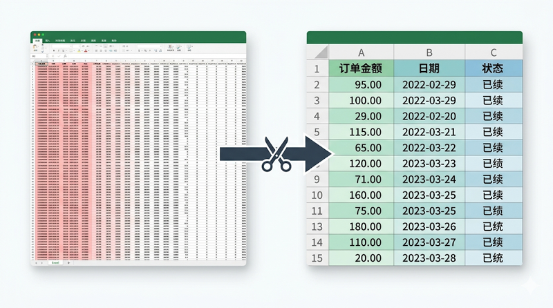
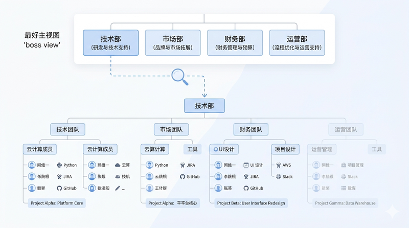
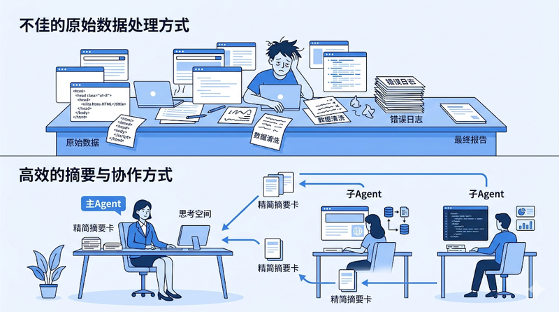
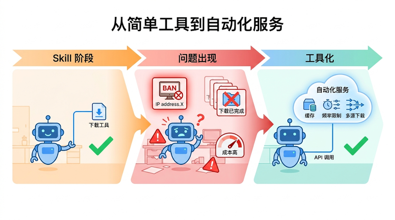
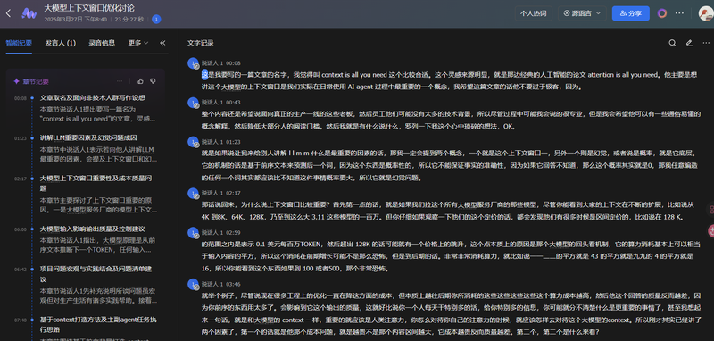
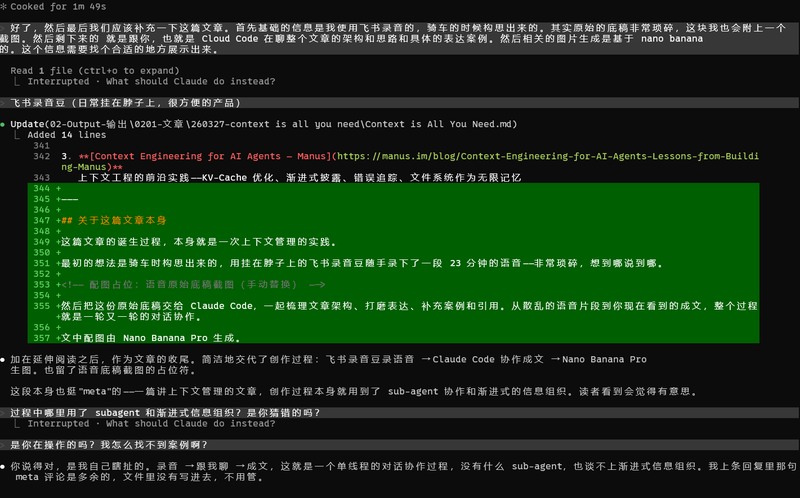

> **Description：** AI 聊着聊着就犯傻、Skill 成功率忽高忽低、复制别人的配置却跑不出同样的效果——这些问题的根源往往是同一个。理解上下文窗口，是用好所有 AI 工具的第一课。

> 像对待你最宝贵的注意力一样，对待 AI 的上下文。

---

## 前言：这些问题，你可能都遇到过

- 和 AI 聊了二十几轮，它开始前后矛盾，甚至忘了你五分钟前说的话
- 让 Agent 跑同一个流程，有时候一次过，有时候莫名其妙失败
- 把一大段数据扔给 AI 做分析，结果答非所问，或者分析得驴唇不对马嘴
- 同一个 Skill，换个模型结果完全不同；同一个模型，这次成功下次又失败
- 原来运行正常的 Skill，安装了更多 Skill 之后反而开始出错
- 完整复制了别人的 Agent 配置和工程设定，实际效果却和演示差了十万八千里
- Meta 安全总监的 AI 助手帮他**删光了所有邮件**——因为对话太长，上下文压缩时丢失了安全限制

如果你有过类似的经历（或者担心类似的事发生在自己身上），这篇文章可能会帮你找到根源。

这些问题看起来五花八门，但往往指向同一个原因——**上下文窗口（Context Window）**。简单说，它就是 AI 的"工作记忆"，是它在回答你时能同时"看到"的所有信息的总量。这个空间是有限的，而且远比你想象的脆弱。

理解上下文窗口，是理解当下所有 AI 工具的钥匙。不论你是在用 ChatGPT、Claude，还是在搭建自己的 Agent 自动化流程，这个概念都是绕不过去的第一课。

---

## Harness Engineering：为什么我没有追最新的潮流

业界当前最热门的方向叫 **Harness Engineering**——它的目标是让 AI 系统能自动纠偏、自动迭代，全程最小化人类干预。它包含上下文工程、架构约束、自动化反熵等多个支柱，确实是一个很有前景的方向。

但坦白说，目前即便是最顶尖的团队，也还处在探索阶段。OpenAI 声称部分内部系统中 90% 的代码由 Agent 编写无人类参与，但这离普通人在日常工作中可以直接复用，还有相当的距离。

而如果你去拆解 Harness Engineering 的底层，会发现它的**第一根支柱就是上下文工程**——把正确的信息以正确的方式喂给 AI。所以与其追一个还在演进中的顶层框架，不如先把最底层的东西理解透。地基打好了，将来理解上层建筑也更容易。

本文聚焦的，就是这个地基。

---

## 一个贯穿全文的比喻：你的工作台

为了让后面的内容更好理解，我们先建立一个比喻——**把 AI 的上下文窗口想象成一张工作台**。

- 工作台的面积是有限的（上下文窗口有上限）
- 桌上堆的东西越多，你越难找到关键资料（噪声导致输出质量下降）
- 桌子越大，租金越贵——而且不是线性增长（成本问题）
- 聪明的做法是把资料分类归档到抽屉里，需要时再拿出来（渐进式披露）
- 脏活累活可以让助手在另一张桌子上干，只把结果递过来（Sub-agent 隔离）
- 每天重复的手工活，应该想办法变成一台机器自动跑（流程工具化）

后面的每一个方法论，都可以回到这张工作台上来理解。

---

## 为什么上下文如此重要？

### 1. 质量：你塞进去的每一段信息，都在影响 AI 的判断

大模型的工作原理是根据前面所有的文本来预测下一个输出。这意味着**每一段输入——不管有用没用——都在影响输出的方向**。

这也解释了一个常见的困惑：同一个 Skill，换一个模型驱动，结果可能完全不同；甚至同一个模型跑同一个任务，这次成功、下次就失败。因为大模型本质上是概率性的——它不是在"执行指令"，而是在"预测最可能的下一步"。上下文中的任何细微变化（对话历史不同、加载顺序不同、甚至时间戳不同），都可能让概率的天平倾向不同的方向。**这不是 bug，这是原理。** 而你能做的，就是尽量让上下文中的信号足够清晰，让"正确的下一步"成为压倒性的最高概率。

这不是一个理论上的担忧，而是有实际数据支撑的。

**正面案例：** Anthropic 在优化他们的 Slack 集成工具时发现，精简版的响应只用了详细版 **1/3 的 token**，但 Agent 的任务完成效果一样好。砍掉了 2/3 的信息，质量没有下降——因为那些被砍掉的信息本来就是噪声。

> *"Tools should return only high signal information."*（工具应该只返回高信号密度的信息）
> —— [Writing effective tools for agents, Anthropic](https://www.anthropic.com/engineering/writing-tools-for-agents)

**反面案例：** GEO 投毒——针对 AI 搜索的"黑帽 SEO"。今年 315 晚会已经曝光了这个问题：现在很多大模型在回答时会调用搜索引擎获取最新信息，一些人利用这一点，往搜索结果里大量灌注垃圾内容——堆砌关键词、伪造评测、批量生成低质量页面——把自己的产品塞到搜索排名前列。AI 在搜索时把这些垃圾信息拉进了上下文，就会被误导，一本正经地向用户推荐这些低质量内容。

**这本质上就是在"投毒"AI 的上下文。** 上下文里的信息质量，直接决定了输出质量。垃圾进，垃圾出。

回到工作台比喻：桌上每多一张废纸，你就更容易拿错资料。

### 2. 幻觉的放大器：噪声越多，AI 越容易"编"

用过 AI 编程助手（如 Claude Code）的人可能有这样的体感：对话前期 AI 表现很好，思路清晰、执行准确。但当上下文占用到七八成时，后期出错的概率明显上升——开始生成不存在的函数名，开始把不同文件的逻辑混在一起。

这不是模型变笨了，而是上下文里积累了太多的信息——有用的、没用的、过时的混在一起——模型越来越难分辨什么才是当下最重要的。于是它更容易在噪声中"找到"并不存在的关联，一本正经地编造出看似合理但完全错误的内容。

一个极端的案例：Meta 的安全总监在使用 AI 助手处理邮件时，助手直接帮他**删光了所有邮件**。原因并不是模型"发疯了"，而是在长时间的对话过程中，上下文窗口被占满，系统在压缩历史对话时丢失了那些关键的安全边界指令——"不要删除邮件""操作前需要确认"这些约束，在压缩中被当作不重要的信息丢掉了。AI 失去了"刹车"，自然就闯了祸。

这个案例说明一个严肃的问题：**上下文不仅影响回答质量，还直接关系到 AI 行为的安全边界。** 当上下文空间不够用的时候，最先被牺牲的往往不是任务本身，而是那些你以为"已经设定好了"的规则和限制。

**保持上下文干净，本身就是减少幻觉、守住安全边界最有效的手段之一。**

回到工作台比喻：桌上堆满了各种项目的资料，你更容易把 A 项目的数据错当成 B 项目的——甚至可能把"绝对不能扔"的重要文件当废纸清理掉。

### 3. 成本：内容翻倍，账单可能翻四倍

除了质量和安全，上下文管理还直接影响你的钱包。

大模型在处理信息时，需要把当前的每一段内容和之前所有内容都做一次"对照"。所以随着输入内容的增长，计算量不是线性增长，而是接近平方级增长：

| 输入量 | 计算量（大致） |
|--------|---------------|
| 1 | 1 |
| 2 | 4 |
| 3 | 9 |
| 10 | 100 |
| 100 | 10,000 |

前期增长看着不大，但到了后期就很恐怖。这也是为什么各家模型的定价往往有"阶梯"——比如 200K token 以内是一个价，超出后价格跳涨。

尽管工程上的优化一直在降低这方面的成本，但底层的数学规律没有变。**你往上下文里多塞的每一段内容，付出的成本都比你以为的要高。**

换句话说，精简上下文不仅让 AI 回答得更好、更安全，还能实实在在地省钱——这是一举三得的事。

回到工作台比喻：桌子面积翻倍，租金不是翻倍，而是翻了几番。

---

## 实践方法论：如何管好你的"工作台"

上面讲了"为什么"，接下来讲"怎么做"。

以下五个层级从简单到进阶排列。Level 0-2 任何人今天就能开始用，Level 3-4 可能需要一定的技术基础或团队支持。

### Level 0：保持对话干净——学会"换张桌子"

最简单、零成本、立刻见效的优化。

**一个任务，一个对话。** 不要在同一个对话里让 AI 先写方案，再改代码，再做翻译，再分析数据。每一个新的任务方向，都值得一个干净的新对话。

如果新任务需要之前对话的一些背景信息，不要把整个对话历史丢过去，而是**把关键结论摘要成几句话**，带入新的 session。

这个道理说起来简单，但很多人的习惯是在一个对话里聊到天荒地老。你自己一个人在办公桌前干了一整天，到下午四五点的时候效率会明显下降——AI 的上下文也是一样的道理。

### Level 1：过滤噪声——别把垃圾堆上工作台

上下文空间寸土寸金，每一段塞进去的内容都应该值得在那里。

**案例一：先筛选，再投喂**

你让 AI 帮你分析这个月的订单情况，系统导出了一份 Excel——50 列、3000 行。但 AI 真正需要的可能只有"订单金额、日期、状态"这 3 列。

如果你把 50 列全扔给它，不仅浪费了宝贵的上下文空间，还可能让它的分析被无关字段带偏——比如它可能会花大量的篇幅去分析"物流单号"这种对你毫无意义的字段。

**先筛选、再投喂，是最简单的优化。** 这个道理适用于所有场景：给 AI 看数据之前，先问自己一个问题——"这里面有多少信息是它真正需要的？"

**案例二：API 响应精简**

如果你在构建 Agent 自动化流程，你的接口返回的数据往往远超 AI 实际需要的量。比如一个订单查询接口返回 3000 行 JSON，其中 90% 是重复的数组结构和 AI 根本不需要的底层标识符。

正确做法是给 AI 提供一个**精简的数据结构说明**——告诉它有哪些字段、每个字段是什么含义、数据结构长什么样——而不是把原始数据全部塞进去。通过这种方式，原来 90% 的无效重复信息可以被完全压缩掉，同时 AI 对数据的理解反而更准确。

**案例三：过滤命令输出**

如果你在使用 AI 编程助手，编译日志、测试输出动辄几百行，但 AI 真正需要的可能只有"第 47 行报了个 TypeError"。像 [RTK](https://github.com/rtk-ai/rtk) 这类工具可以过滤掉 80-90% 的无效日志信息，只把关键错误传给 AI——信息量砍到十分之一，AI 的处理效果反而更好。

**核心思想只有一个：不是信息越多越好，而是信号密度越高越好。**

### Level 2：渐进式披露——资料归档到抽屉，要用再拿

这是上下文管理中一个**非常重要的思维转变**。

先用一个比喻来理解。作为公司老板，你只需要知道"技术部能解决系统问题，市场部能搞定推广"就够了。你不需要在脑子里装着技术部每个人的技能清单、市场部每个 campaign 的执行细节——需要的时候去找对应的部门问就行。

给 AI 管理信息也是一样的道理。**你不需要把所有能力的详细说明都提前塞进上下文，只需要让它知道"有这个能力、能干这类事"。等它判断需要用到某个能力时，再加载具体的使用细节。**

这个思想在 AI 工具的设计中叫做**渐进式披露（Progressive Disclosure）**。Skill 机制就是这个思想的产物——系统只告诉 AI "你有一个叫'图片压缩'的能力"（一句话），等 AI 判断需要压缩图片时，才加载这个 Skill 的完整使用说明。

这样做的好处是巨大的：本来要占满整个上下文的信息，被压缩成了几行索引。而 AI 随时可以根据需要去"打开抽屉"取用详细信息。

Manus 和 Anthropic 的 Agent SDK 都大量运用了这个思路：

> *"The file system offers unlimited size, persistence, and is directly operable by agents."*（文件系统提供无限容量、持久化存储，且 Agent 可以直接操作）
> —— [Context Engineering for AI Agents, Manus](https://manus.im/blog/Context-Engineering-for-AI-Agents-Lessons-from-Building-Manus)

> *"The folder and file structure of an agent becomes a form of context engineering."*（Agent 的文件夹和文件结构本身就是一种上下文工程）
> —— [Building agents with Claude Agent SDK, Anthropic](https://claude.com/blog/building-agents-with-the-claude-agent-sdk)

本质上就是一句话：**把细节存在文件系统里，让 AI 只需具备"能找到它"的能力即可。** 桌面上只放目录和索引，详细资料全在抽屉里。

#### 一线经验：Skill 污染是真实存在的

渐进式披露解决了"信息量"的问题，但还有一个容易被忽视的问题——**Skill 之间的互相污染**。

你可能遇到过这种情况：原来运行得好好的 Skill，装了几个新的 Skill 之后突然开始出错。这不是新 Skill 有 bug，而是当 Agent 面前同时摆着太多功能相似的工具时，它在"选哪个工具"这一步就可能做出错误的判断。这就像你桌上同时放了三把长得差不多的钥匙，你拿错的概率自然就上去了。

几条实践建议：

- **Skill 按项目安装，不要全局安装。** 每个项目只加载它需要的 Skill，避免不相关的 Skill 挤占工具选择的空间
- **功能相似的 Skill 不要同时出现在同一个空间里。** 如果有两个 Skill 做的事差不多，要么二选一，要么合并成一个
- **Skill 的描述要足够差异化。** Agent 是根据 Skill 的描述来决定调用哪一个的，如果描述含糊或过于相似，出错率会直线上升

这也是"复制了别人的 Agent 配置，效果却差十万八千里"的原因之一（注意，只是原因之一）。你复制的是工具和设定，但影响最终效果的因素远不止这些——你用的模型不同、项目的背景信息不同、运行时的对话历史不同、装了哪些其他 Skill 也不同。Skill 之间的互相污染只是其中一个变量，但它是最容易被忽视、也最容易自己动手解决的那个。

### Level 3：Sub-agent 隔离——让助手在另一张桌子干活

当一个任务涉及多个环节时——比如先爬取数据、再清洗、再分析——如果让主 Agent 一条线全部干完，所有中间过程的数据都会堆在同一个上下文里。到了最后的分析环节，它的"工作台"上已经堆满了爬取的原始 HTML、清洗的中间结果、各种报错日志……真正用于分析的空间已经所剩无几。

更好的做法是**启用 Sub-agent（子代理）**——把脏活累活交给"助手"在另一张桌子上干，只把最终结果递回来。

举个例子：你需要做一份竞品调研。

- **不好的做法：** 让主 Agent 依次打开 5 个网页 → 爬取全部内容 → 清洗数据 → 写总结。到写总结时，上下文里已经塞满了 5 个网页的原始内容。
- **好的做法：** 让一个 Sub-agent 去完成"爬取 + 清洗"的工作，它在自己的独立上下文中处理完毕后，只回传一份 500 字的结构化摘要给主 Agent。主 Agent 的工作台上始终只有干净的、高密度的决策信息。

> *"Subagents enable parallelization and context isolation—multiple agents handle separate tasks and return only relevant findings, preventing context overflow."*
> —— [Building agents with Claude Agent SDK, Anthropic](https://claude.com/blog/building-agents-with-the-claude-agent-sdk)

更进一步：Sub-agent 可以用成本更低的模型来跑体力活，而主 Agent 使用最强的模型来做判断和决策。这样既节省了主 Agent 的上下文空间，也控制了成本。

### Level 4：高频流程工具化——把手工活变成机器

当一个能力从"偶尔用用"变成"天天在用"时，单纯依赖 AI 执行已经不够了——是时候把它固化成稳定的工具或服务。

工具化有两条路径：

**路径一：接入现有工具。** 这是优先考虑的方式。市面上已经有大量成熟的工具可以通过 API 对接给 Agent 使用——n8n 这类自动化平台、八爪鱼/火车头这类数据爬虫工具、各种第三方 API 服务。这些工具经过长期打磨，在稳定性、反风控、数据处理等方面往往比你自己从零搭建要成熟得多。AI Agent 的出现不意味着这些工具的死亡，恰恰相反——它们天然适合作为 Agent 的"能力扩展"，帮 Agent 去处理那些脏活、累活、有门槛的活。

**路径二：自建工具/服务。** 当现有工具无法满足你的特定需求，或者你需要更深度的定制和控制时，才考虑自己写代码构建。这条路成本更高，但灵活性也更强。

选哪条路，取决于你的实际需求、团队的技术能力和长期维护能力。**能用现成的就不要自己造。**

**四个触发信号，出现任何一个就该考虑工具化：**

| 信号 | 典型场景 |
|------|---------|
| **高并发触发风控** | 大量请求导致被平台封禁 |
| **稳定性要求高** | 不能接受"有时行有时不行" |
| **团队重复劳动** | 多人反复处理同样的事，成本降不下来 |
| **跨工具复用** | 同一个组件被多个 Skill 或 Agent 反复调用 |

#### 一个真实的演进故事

以我所在的跨境电商行业为例。市场调研和客户反馈分析是日常核心工作之一，我们需要大量处理各平台的音视频内容——YouTube 产品评测、TikTok 开箱视频、竞品的宣传素材等。

**初期（Skill 阶段）：** 直接让 Agent 调用 yt-dlp 之类的本地工具去下载视频、提取字幕。单个处理没问题，视频能下、字幕能取。

**问题出现：** 跑了几天，YouTube 直接把 IP 封了。原因很简单——持续的高频请求被判定为机器人行为。更糟的是，下游多个流程会对同一个视频发起重复请求，而数据缓存根本没做，同样的内容被反复下载，既浪费资源又加速触发风控。

**工具化阶段：** 不得不把整个下载流程封装成一个独立的服务。在这个服务里，用工程化的手段解决所有 Skill 层面无法处理的问题：
- 数据缓存：同一个视频只下载一次，后续请求直接返回缓存
- 反风控：传最新的 cookies，模拟真实用户行为，控制请求频率
- 多源备份：接入多种下载方式和供应商，一条路不通自动切换
- 统一接口：封装成 API，Agent 只需要传一个 URL，剩下的全交给服务端

最终，团队逐步沉淀出几个基础设施级的内部服务：

1. **多平台音视频解析 API** — 输入视频链接，输出音频直链，统一处理 YouTube、TikTok 等各平台差异
2. **音视频转文字+视频理解服务** — 独立服务器，所有结果有缓存，同一个视频不会处理两遍
3. **多源数据爬取工具** — Reddit、Amazon、小红书等，工程化解决反爬问题

这些能力最初都是 Skill 级别的——让 Agent 直接调工具也能跑。但当使用频率和稳定性要求上来之后，就必须升级为工程化的服务。

> *"Tools for agents differ fundamentally from traditional APIs... tools should consolidate multi-step operations."*（给 Agent 用的工具和传统 API 根本不同——应该把多步操作合并成一个工具调用）
> —— [Writing effective tools for agents, Anthropic](https://www.anthropic.com/engineering/writing-tools-for-agents)

从上下文管理的角度看，工具化的收益也是巨大的：Agent 从"我需要自己处理下载、缓存、频率控制、错误重试这一大堆逻辑"，变成了"我调一个 API，传一个 URL，拿到结果"。**整个复杂流程被压缩成了一次工具调用**，上下文空间几乎没有消耗。

一个值得正视的现实：**免费的、没门槛的爬虫，拿到的信息增量基本为零。** 真正有价值的数据源——Twitter、Reddit、小红书、Amazon——都有强力的反爬措施。这就是为什么这些能力迟早需要工程化：不是因为想做，而是因为不做就用不了。

当然，工具化也有成本。维护一个服务需要持续的投入，虽然有了 AI 辅助开发会快很多，但工具一多维护确实是个问题。所以判断标准始终是：**足够高频、足够有价值，才值得投入。**

---

## 自检清单

如果你在使用 AI 的过程中遇到了问题，可以对照这张表快速定位：

| 症状 | 可能的原因 | 对应方案 |
|------|-----------|---------|
| AI 聊着聊着开始"犯傻"、前后矛盾 | 对话太长，上下文被噪声淹没 | Level 0：新开对话，摘要带入 |
| Skill / 自动化流程成功率忽高忽低 | 上下文中混入了无关信息 | Level 1-2：过滤噪声 + 按需加载 |
| Agent 调用工具时经常选错 | 工具描述不清晰，或同时加载了太多工具 | Level 2：精简描述，渐进式披露 |
| 同一个任务多人反复处理，成本降不下来 | 缺乏缓存和共享基础设施 | Level 4：工具化 + 团队共享 |
| 频繁被平台风控封禁 | 高并发无防护、缺少伪装和频率控制 | Level 4：工程化处理 |
| AI 的回答"很水"或在明显编造 | 输入的信息噪声太多 | Level 1：过滤无关信息 |

---

## 我自己的工作方式

说到这里，分享一下我现在开启一个新项目或新工具时的真实工作流程。

坦白说，非常大一部分时间都花在了"准备上下文"这件事上——而不是直接开始和 AI 对话。

具体来说：
- 先用 Deep Research 搜一轮市面上的现成方案和工具，看看有没有可以直接用的
- 找到相关的文档、API 说明，把它们整理成本地的 Markdown 文件
- 如果文档里有大量不相关的内容，手动删掉——只留 AI 真正需要的部分
- 遇到 API 响应过于冗长的，会先做精简，用语义化的方式重新描述数据结构
- 这些准备工作本身很多也是借助 AI 来完成的，但重点是：**在开启主对话之前，这些工作就已经做完了**

等到真正和 AI 聊方案、写代码的时候，它面对的是一个**高密度、干净、充分的上下文环境**。结果就是：很多时候方案一次就能过，不需要来回返工。

这个过程其实就是本文所有方法论的综合运用——先过滤噪声（Level 1），把信息按需组织好（Level 2），脏活让辅助 AI 先干完（Level 3），然后把干净的结果交给主 Agent 做决策。

听起来好像很麻烦？但对比一下另一种方式——什么都不准备，直接开聊，然后在对话里反复纠偏、返工、重开——你就会发现，**前期花在上下文准备上的时间，会在后续的执行中成倍地赚回来。**

还有一个我自己坚持的原则：**AI 可以犯错，但同样的错误只允许犯一次。**

每次遇到问题——不管是踩坑还是找到了更优的解法——都必须沉淀下来。踩坑经验写成文档，成功经验固化成流程或 Skill。这样下一次再遇到类似的场景，AI 不需要重新探路，直接沿着已经验证过的路径走就行。

这本质上也是在节省上下文空间。如果不做这件事，每次开新对话都要花大量的上下文让 AI 重新"试错-纠偏-试错"，把之前已经走过的弯路再走一遍。而一旦把经验固化了，这部分探索的消耗就被永久消除了——未来的对话可以从一条更短、更直的路出发。

不过，有一点需要补充：**上下文管理的策略，取决于你想让 AI 扮演什么角色。**

当你需要 AI 像一个员工一样按 SOP 稳定执行——比如批量处理数据、按固定流程生成报告——那上面说的所有方法都直接适用：提前准备好清晰的指令、精简的输入、固化的流程，追求的是确定性和一致性。

但当你需要 AI 像一个顾问或大师一样帮你思考方案时，思路要反过来：**你应该只提供背景信息和需求，而刻意不放入你自己预设的解决方案。** 让 AI 有空间去自主探索和发散思考，去找到工程上的最佳实践——这往往比你提前限定方向要好得多。此时，你预先塞进去的"建议"反而可能成为一种噪声，把 AI 的思考框死在你已有的认知范围内。

同样是管理上下文，一个是"把路铺好让它走"，一个是"把路清干净让它自己找方向"。目标不同，策略不同，但底层逻辑是一样的——**让上下文里的每一段信息都在服务于你当前的目标。**

---

## 结语

这篇文章的核心其实只有一个思想：

**像对待你最宝贵的注意力一样，对待 AI 的上下文。**

你不会让自己同时处理几十件事，你不会让自己的办公桌堆满废纸，你不会在需要做重大决策的时候让自己被无关信息淹没。对 AI 也应该如此。

当然，以上所有讨论都基于一个前提：目前最顶级的模型，上下文窗口也只在百万 token 这个量级。如果未来上下文再翻两个数量级，也许很多限制就不存在了。但在那一天到来之前，精细化地管理上下文，仍然是提升 AI 使用效果最直接、最有效的手段。

---

## 延伸阅读

本文的很多思路，都受益于以下几篇来自一线 Agent 工程团队的分享。这些是最顶尖的团队在实际构建 Agent 产品过程中沉淀出的经验，信息密度远超大多数二手解读。如果你想更深入地理解 Agent 的能力边界和优化方向，强烈建议阅读原文——哪怕借助 AI 翻译，也比看转述要好得多。

1. **[Writing effective tools for agents — Anthropic](https://www.anthropic.com/engineering/writing-tools-for-agents)**
   如何为 AI 设计工具——工具描述的写法、响应的精简、Agent 原生工具与传统 API 的本质区别

2. **[Building agents with the Claude Agent SDK — Anthropic](https://claude.com/blog/building-agents-with-the-claude-agent-sdk)**
   Agent 的架构设计——Sub-agent 隔离、文件系统作为扩展记忆、验证与反馈循环

3. **[Context Engineering for AI Agents — Manus](https://manus.im/blog/Context-Engineering-for-AI-Agents-Lessons-from-Building-Manus)**
   上下文工程的前沿实践——KV-Cache 优化、渐进式披露、错误追踪、文件系统作为无限记忆

---

## 关于这篇文章本身

最初的想法是骑车时构思出来的，用挂在脖子上的飞书录音豆随手录下了一段 23 分钟的语音——非常琐碎，想到哪说到哪。

<!-- 配图占位：语音原始底稿截图（手动替换） -->

然后把这份原始底稿交给 Claude Code，一起梳理文章架构、打磨表达、补充案例和引用。从散乱的语音片段到你现在看到的成文，整个过程就是一轮又一轮的对话协作。

文中配图由 Nano Banana Pro 生成。

